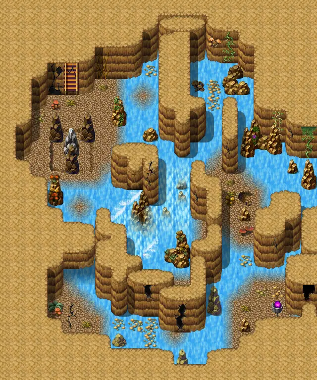

# Shortcut lodar4

| | |
|---|---|
| **Map ID** | `shortcut_lodar4` |
| **Type** | Indoors / underground |
| **Size** | 20×24 tiles |
| **Introduced** | [v0.7.2](../versions/0.7.2.md) |
| **Enemy types** | 5 |
| **Quests** | 2 |

**Shortcut lodar4** is an indoor map. It has no NPCs and 5 kinds of enemy. Exits lead to Lodar1cave0, Shortcut lodar3.

## Map

<label class="lg"><input type="checkbox" data-t="spawn" checked><b>Red</b>&nbsp;Monsters / NPCs</label><label class="lg"><input type="checkbox" data-t="mapchange" checked><b>Blue</b>&nbsp;Exit to another map</label><label class="lg"><input type="checkbox" data-t="container" checked><b>Yellow</b>&nbsp;Container (click to see contents)</label><label class="lg"><input type="checkbox" data-t="sign" checked><b>Purple</b>&nbsp;Sign</label><label class="lg"><input type="checkbox" data-t="rest" checked><b>Green</b>&nbsp;Resting place</label><label class="lg"><input type="checkbox" data-t="key" checked><b>Orange dashed</b>&nbsp;Blocked until a quest step / item</label><label class="lg"><input type="checkbox" data-t="script"><b>Grey dotted</b>&nbsp;Scripted event</label><label class="lg"><input type="checkbox" data-t="replace"><b>White dotted</b>&nbsp;Changes during a quest</label><label class="lg"><input type="checkbox" data-t="pin" checked><b>Numbers</b>&nbsp;Numbered key points (see the key below the map)</label>

<a class="pin pin-exit" href="#key-1" style="left:22.500%;top:22.917%" title="Exit (stairs / passage): to [Lodar1cave0](lodar1cave0.md)">1</a><a class="pin pin-exit" href="#key-2" style="left:87.500%;top:81.250%" title="Exit (stairs / passage): to [Shortcut lodar3](shortcut_lodar3.md)">2</a><a class="pin pin-sign" href="#key-3" style="left:57.500%;top:89.583%" title="Sign: A sign">3</a><a class="pin pin-sign" href="#key-3" style="left:67.500%;top:27.083%" title="Sign: A sign">3</a><a class="pin pin-script" href="#key-4" style="left:85.000%;top:79.167%" title="Quest trigger: Scripted event: advances the quest: The way out is through to stage 40 (“I poured the vial over the purple fire and then it turned green. When approaching it I was teleported into another room of the cave with more purple torches. I was able to activate them as well. Finally, I have got my shortcut and can travel to Lodar a lot faster!”)">4</a><a class="pin pin-key" href="#key-5" style="left:22.500%;top:39.583%" title="Blocked passage: Unlocked during the quest: Searching for madness (stage 50: “I have presented the heart of the Hira&#x27;zinn to Lodar.”)">5</a><a class="pin pin-key" href="#key-6" style="left:80.000%;top:77.083%" title="Blocked passage: Unlocked during the quest: The way out is through (stage 30: “Upon telling Lodar about the purple fire he gave me a green vial, and told me to pour it over the torch to see what happens.”)">6</a>

??? abstract "Key to the numbers on the map"

    | # | What | Details |
    |---|---|---|
    | 1 | Exit (stairs / passage) | to [Lodar1cave0](lodar1cave0.md) |
    | 2 | Exit (stairs / passage) | to [Shortcut lodar3](shortcut_lodar3.md) |
    | 3 | Sign | A sign |
    | 4 | Quest trigger | Scripted event: advances the quest: The way out is through to stage 40 (“I poured the vial over the purple fire and then it turned green. When approaching it I was teleported into another room of the cave with more purple torches. I was able to activate them as well. Finally, I have got my shortcut and can travel to Lodar a lot faster!”) |
    | 5 | Blocked passage | Unlocked during the quest: Searching for madness (stage 50: “I have presented the heart of the Hira'zinn to Lodar.”) |
    | 6 | Blocked passage | Unlocked during the quest: The way out is through (stage 30: “Upon telling Lodar about the purple fire he gave me a green vial, and told me to pour it over the torch to see what happens.”) |

Verified against v0.8.18 map data.

## Connections

| Direction | Leads to | Region there | Map # |
|---|---|---|---|
| Stairs / passage | [Lodar1cave0](lodar1cave0.md) | – | 1 |
| Stairs / passage | [Shortcut lodar3](shortcut_lodar3.md) | – | 2 |

## Enemies

| Enemy | HP | Damage | Up to | Notes |
|---|---|---|---|---|
| [Gray cave bat](../monsters/cavebat1.md) | 28 | 3–5 | 3 | shares spawn with Black cave bat, Brown cave bat |
| [Black cave bat](../monsters/cavebat2.md) | 32 | 2–6 | 3 | shares spawn with Brown cave bat, Gray cave bat |
| [Brown cave bat](../monsters/cavebat3.md) | 36 | 1–7 | 3 | shares spawn with Black cave bat, Gray cave bat |
| [Mudfiend](../monsters/mudfiend1.md) | 37 | 4–6 | 5 | shares spawn with Tough mudfiend |
| [Tough mudfiend](../monsters/mudfiend2.md) | 41 | 5–6 | 5 | shares spawn with Mudfiend |

<small>“Up to” is the most that can be alive at once from the spawn areas on this map.</small>

## Quests

- [Searching for madness](../quests/lodar2.md): blocked passage opens at stage 50
- [The way out is through](../quests/shortcut_lodar.md): blocked passage opens at stage 30; something on this map advances it; stepping on a trigger here sets stage 40

## Points of interest

- **Sign** (#3): A sign
- **Quest trigger** (#4): Scripted event: advances the quest: The way out is through to stage 40 (“I poured the vial over the purple fire and then it turned green. When approaching it I was teleported into another room of the cave with more purple torches. I was able to activate them as well. Finally, I have got my shortcut and can travel to Lodar a lot faster!”)
- **Blocked passage** (#5): Unlocked during the quest: Searching for madness (stage 50: “I have presented the heart of the Hira'zinn to Lodar.”)
- **Blocked passage** (#6): Unlocked during the quest: The way out is through (stage 30: “Upon telling Lodar about the purple fire he gave me a green vial, and told me to pour it over the torch to see what happens.”)

## Version history

| Version | Change |
|---|---|
| [v0.7.2](../versions/0.7.2.md) | Added |
| [v0.8.2](../versions/0.8.2.md) | Map layout or objects changed |
| [v0.8.15](../versions/0.8.15.md) | Map layout or objects changed |

Verified against v0.8.18 and every earlier release back to v0.7.0 (game data compared release by release).

## Community notes

<small>Written by players, not generated from game data. **Observations**: what players notice in-game · **Lore**: the in-world story · **Trivia**: real-world facts, references, development history · **Theory / speculation**: unconfirmed ideas; may just be unfinished content</small>

### Observations

*No notes yet. Contributions are welcome: [add a note](https://github.com/asdfghjkl628/Andor-s-Trail-Wikiiii/new/main/notes/maps?filename=shortcut_lodar4.md&value=%23%23%20Observations%0A%0A%3C%21--%20what%20players%20notice%20in-game%20--%3E%0A%0A%23%23%20Lore%0A%0A%3C%21--%20the%20in-world%20story%20--%3E%0A%0A%23%23%20Trivia%0A%0A%3C%21--%20real-world%20facts%2C%20references%2C%20development%20history%20--%3E%0A%0A%23%23%20Theory%20/%20speculation%0A%0A%3C%21--%20unconfirmed%20ideas%3B%20may%20just%20be%20unfinished%20content%20--%3E%0A).*

### Lore

*No notes yet. Contributions are welcome: [add a note](https://github.com/asdfghjkl628/Andor-s-Trail-Wikiiii/new/main/notes/maps?filename=shortcut_lodar4.md&value=%23%23%20Observations%0A%0A%3C%21--%20what%20players%20notice%20in-game%20--%3E%0A%0A%23%23%20Lore%0A%0A%3C%21--%20the%20in-world%20story%20--%3E%0A%0A%23%23%20Trivia%0A%0A%3C%21--%20real-world%20facts%2C%20references%2C%20development%20history%20--%3E%0A%0A%23%23%20Theory%20/%20speculation%0A%0A%3C%21--%20unconfirmed%20ideas%3B%20may%20just%20be%20unfinished%20content%20--%3E%0A).*

### Trivia

*No notes yet. Contributions are welcome: [add a note](https://github.com/asdfghjkl628/Andor-s-Trail-Wikiiii/new/main/notes/maps?filename=shortcut_lodar4.md&value=%23%23%20Observations%0A%0A%3C%21--%20what%20players%20notice%20in-game%20--%3E%0A%0A%23%23%20Lore%0A%0A%3C%21--%20the%20in-world%20story%20--%3E%0A%0A%23%23%20Trivia%0A%0A%3C%21--%20real-world%20facts%2C%20references%2C%20development%20history%20--%3E%0A%0A%23%23%20Theory%20/%20speculation%0A%0A%3C%21--%20unconfirmed%20ideas%3B%20may%20just%20be%20unfinished%20content%20--%3E%0A).*

### Theory / speculation

*No notes yet. Contributions are welcome: [add a note](https://github.com/asdfghjkl628/Andor-s-Trail-Wikiiii/new/main/notes/maps?filename=shortcut_lodar4.md&value=%23%23%20Observations%0A%0A%3C%21--%20what%20players%20notice%20in-game%20--%3E%0A%0A%23%23%20Lore%0A%0A%3C%21--%20the%20in-world%20story%20--%3E%0A%0A%23%23%20Trivia%0A%0A%3C%21--%20real-world%20facts%2C%20references%2C%20development%20history%20--%3E%0A%0A%23%23%20Theory%20/%20speculation%0A%0A%3C%21--%20unconfirmed%20ideas%3B%20may%20just%20be%20unfinished%20content%20--%3E%0A).*

??? info "Technical information"

    | | |
    |---|---|
    | Map ID | `shortcut_lodar4` |
    | File | `res/xml/shortcut_lodar4.tmx` |
    | Size | 20×24 tiles (640×768 px) |
    | outdoors property | – |
    | Layers drawn | ground, objects, above |
    | Tilesets | map_bed_1, map_border_1, map_bridge_1, map_bridge_2, map_broken_1, map_cavewall_1, map_cavewall_2, map_cavewall_3, map_cavewall_4, map_chair_table_1, map_chair_table_2, map_crate_1, map_cupboard_1, map_curtain_1, map_entrance_1, map_entrance_2, map_fence_1, map_fence_2, map_fence_3, map_fence_4, map_ground_1, map_ground_2, map_ground_3, map_ground_4, map_ground_5, map_ground_6, map_ground_7, map_ground_8, map_house_1, map_house_2, map_indoor_1, map_indoor_2, map_kitchen_1, map_outdoor_1, map_pillar_1, map_pillar_2, map_plant_1, map_plant_2, map_rock_1, map_rock_2, map_roof_1, map_roof_2, map_roof_3, map_shop_1, map_sign_ladder_1, map_table_1, map_trail_1, map_transition_1, map_transition_2, map_transition_3, map_transition_4, map_transition_5, map_tree_1, map_tree_2, map_wall_1, map_wall_2, map_wall_3, map_wall_4, map_window_1, map_window_2 |
    | Map objects | spawn: 5, replace: 4, mapchange: 2, sign: 2, key: 2, script: 1 |
    | World map position | – |

<small>Data from v0.8.18</small>
