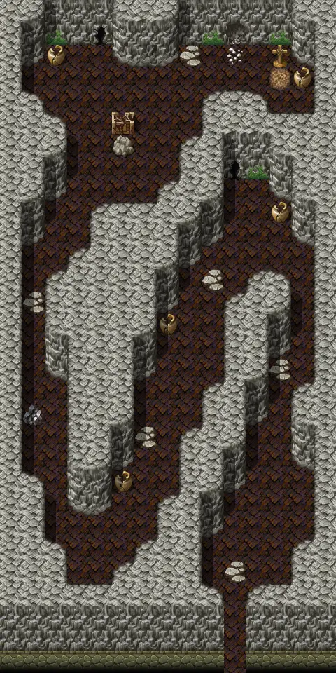

# Snakecave3

| | |
|---|---|
| **Map ID** | `snakecave3` |
| **Type** | Indoors / underground |
| **Size** | 15×30 tiles |
| **World map** | [Snakecave](index.md) |
| **Introduced** | v0.7.0 or earlier |
| **NPCs** | 2 |
| **Enemy types** | 4 |
| **Quests** | 1 |

**Snakecave3** is an indoor map. It has 2 NPCs and 4 kinds of enemy. Exits lead to Snakecave2.

## Map

<label class="lg"><input type="checkbox" data-t="spawn" checked><b>Red</b>&nbsp;Monsters / NPCs</label><label class="lg"><input type="checkbox" data-t="mapchange" checked><b>Blue</b>&nbsp;Exit to another map</label><label class="lg"><input type="checkbox" data-t="container" checked><b>Yellow</b>&nbsp;Container (click to see contents)</label><label class="lg"><input type="checkbox" data-t="sign" checked><b>Purple</b>&nbsp;Sign</label><label class="lg"><input type="checkbox" data-t="rest" checked><b>Green</b>&nbsp;Resting place</label><label class="lg"><input type="checkbox" data-t="key" checked><b>Orange dashed</b>&nbsp;Blocked until a quest step / item</label><label class="lg"><input type="checkbox" data-t="script"><b>Grey dotted</b>&nbsp;Scripted event</label><label class="lg"><input type="checkbox" data-t="replace"><b>White dotted</b>&nbsp;Changes during a quest</label><label class="lg"><input type="checkbox" data-t="pin" checked><b>Numbers</b>&nbsp;Numbered key points (see the key below the map)</label>

<a class="pin pin-exit" href="#key-1" style="left:70.000%;top:98.333%" title="Exit (south): to [Snakecave2](snakecave2.md)">1</a><a id="pin-npc-ewmondold_snake_master" class="pin pin-npc" href="#key-2" style="left:43.333%;top:15.000%" title="[Ewmondold](../../monsters/ewmondold_snake_master.md): NPC">2</a><a id="pin-npc-snake_master" class="pin pin-npc" href="#key-3" style="left:56.667%;top:18.333%" title="[Snake master](../../monsters/snake_master.md): NPC">3</a><a class="pin pin-sign" href="#key-4" style="left:83.333%;top:11.667%" title="Sign: “The ground around the grave is full of small holes, probably by something that has slithered its way to its nest down there. The cross has some writing on it, but you cannot understand what it says.”">4</a><a class="pin pin-script" href="#key-5" style="left:40.000%;top:16.667%" title="Quest trigger: Scripted event: advances the quest: Perception is not reality to stage 30 (“I&#x27;ve destroyed Ewmondold and eliminated his threat to Crossglen and the surrounding area.”)">5</a>

??? abstract "Key to the numbers on the map"

    | # | What | Details |
    |---|---|---|
    | 1 | Exit (south) | to [Snakecave2](snakecave2.md) |
    | 2 | [Ewmondold](../monsters/ewmondold_snake_master.md) | NPC |
    | 3 | [Snake master](../monsters/snake_master.md) | NPC |
    | 4 | Sign | “The ground around the grave is full of small holes, probably by something that has slithered its way to its nest down there. The cross has some writing on it, but you cannot understand what it says.” |
    | 5 | Quest trigger | Scripted event: advances the quest: Perception is not reality to stage 30 (“I've destroyed Ewmondold and eliminated his threat to Crossglen and the surrounding area.”) |

Verified against v0.8.18 map data.

## Connections

| Direction | Leads to | Region there | Map # |
|---|---|---|---|
| South | [Snakecave2](snakecave2.md) | Blackwater Mountain | 1 |

## NPCs

- [Ewmondold](../monsters/ewmondold_snake_master.md) — can be fought (#2)
- [Snake master](../monsters/snake_master.md) — can be fought (#3)

## Enemies

| Enemy | HP | Damage | Up to | Notes |
|---|---|---|---|---|
| [Venomous cave snake](../monsters/venomous_cave_snake.md) | 15 | 2–2 | 2 | shares spawn with Tough cave snake |
| [Tough cave snake](../monsters/tough_cave_snake.md) | 21 | 2–2 | 2 | shares spawn with Venomous cave snake |
| [Snake servant](../monsters/snake_servant.md) | 35 | 2–3 | 9 | – |
| [Basilisk](../monsters/basilisk.md) | 40 | 3–9 | 1 | – |

<small>“Up to” is the most that can be alive at once from the spawn areas on this map.</small>

## Quests

- [Perception is not reality](../quests/new_snake_master.md): something on this map advances it; stepping on a trigger here sets stage 30

## Points of interest

- **Sign** (#4): “The ground around the grave is full of small holes, probably by something that has slithered its way to its nest down there. The cross has some writing on it, but you cannot understand what it says.”
- **Quest trigger** (#5): Scripted event: advances the quest: Perception is not reality to stage 30 (“I've destroyed Ewmondold and eliminated his threat to Crossglen and the surrounding area.”)

## Version history

| Version | Change |
|---|---|
| [v0.7.0](../versions/0.7.0.md) | Present in v0.7.0 (earliest release tracked) |
| [v0.7.1](../versions/0.7.1.md) | Map layout or objects changed |
| [v0.7.2](../versions/0.7.2.md) | Map layout or objects changed |
| [v0.7.12](../versions/0.7.12.md) | Map layout or objects changed |
| [v0.8.2](../versions/0.8.2.md) | Map layout or objects changed |

Verified against v0.8.18 and every earlier release back to v0.7.0 (game data compared release by release).

## Community notes

<small>Written by players, not generated from game data. **Observations**: what players notice in-game · **Lore**: the in-world story · **Trivia**: real-world facts, references, development history · **Theory / speculation**: unconfirmed ideas; may just be unfinished content</small>

### Observations

*No notes yet. Contributions are welcome: [add a note](https://github.com/asdfghjkl628/Andor-s-Trail-Wikiiii/new/main/notes/maps?filename=snakecave3.md&value=%23%23%20Observations%0A%0A%3C%21--%20what%20players%20notice%20in-game%20--%3E%0A%0A%23%23%20Lore%0A%0A%3C%21--%20the%20in-world%20story%20--%3E%0A%0A%23%23%20Trivia%0A%0A%3C%21--%20real-world%20facts%2C%20references%2C%20development%20history%20--%3E%0A%0A%23%23%20Theory%20/%20speculation%0A%0A%3C%21--%20unconfirmed%20ideas%3B%20may%20just%20be%20unfinished%20content%20--%3E%0A).*

### Lore

*No notes yet. Contributions are welcome: [add a note](https://github.com/asdfghjkl628/Andor-s-Trail-Wikiiii/new/main/notes/maps?filename=snakecave3.md&value=%23%23%20Observations%0A%0A%3C%21--%20what%20players%20notice%20in-game%20--%3E%0A%0A%23%23%20Lore%0A%0A%3C%21--%20the%20in-world%20story%20--%3E%0A%0A%23%23%20Trivia%0A%0A%3C%21--%20real-world%20facts%2C%20references%2C%20development%20history%20--%3E%0A%0A%23%23%20Theory%20/%20speculation%0A%0A%3C%21--%20unconfirmed%20ideas%3B%20may%20just%20be%20unfinished%20content%20--%3E%0A).*

### Trivia

*No notes yet. Contributions are welcome: [add a note](https://github.com/asdfghjkl628/Andor-s-Trail-Wikiiii/new/main/notes/maps?filename=snakecave3.md&value=%23%23%20Observations%0A%0A%3C%21--%20what%20players%20notice%20in-game%20--%3E%0A%0A%23%23%20Lore%0A%0A%3C%21--%20the%20in-world%20story%20--%3E%0A%0A%23%23%20Trivia%0A%0A%3C%21--%20real-world%20facts%2C%20references%2C%20development%20history%20--%3E%0A%0A%23%23%20Theory%20/%20speculation%0A%0A%3C%21--%20unconfirmed%20ideas%3B%20may%20just%20be%20unfinished%20content%20--%3E%0A).*

### Theory / speculation

*No notes yet. Contributions are welcome: [add a note](https://github.com/asdfghjkl628/Andor-s-Trail-Wikiiii/new/main/notes/maps?filename=snakecave3.md&value=%23%23%20Observations%0A%0A%3C%21--%20what%20players%20notice%20in-game%20--%3E%0A%0A%23%23%20Lore%0A%0A%3C%21--%20the%20in-world%20story%20--%3E%0A%0A%23%23%20Trivia%0A%0A%3C%21--%20real-world%20facts%2C%20references%2C%20development%20history%20--%3E%0A%0A%23%23%20Theory%20/%20speculation%0A%0A%3C%21--%20unconfirmed%20ideas%3B%20may%20just%20be%20unfinished%20content%20--%3E%0A).*

??? info "Technical information"

    | | |
    |---|---|
    | Map ID | `snakecave3` |
    | File | `res/xml/snakecave3.tmx` |
    | Size | 15×30 tiles (480×960 px) |
    | outdoors property | – |
    | Layers drawn | ground, objects, above |
    | Tilesets | map_bed_1, map_border_1, map_bridge_1, map_bridge_2, map_broken_1, map_cavewall_1, map_cavewall_2, map_cavewall_3, map_cavewall_4, map_chair_table_1, map_chair_table_2, map_crate_1, map_cupboard_1, map_curtain_1, map_entrance_1, map_entrance_2, map_fence_1, map_fence_2, map_fence_3, map_fence_4, map_ground_1, map_ground_2, map_ground_3, map_ground_4, map_ground_5, map_ground_6, map_ground_7, map_ground_8, map_house_1, map_house_2, map_indoor_1, map_indoor_2, map_kitchen_1, map_outdoor_1, map_pillar_1, map_pillar_2, map_plant_1, map_plant_2, map_rock_1, map_rock_2, map_roof_1, map_roof_2, map_roof_3, map_shop_1, map_sign_ladder_1, map_table_1, map_trail_1, map_transition_1, map_transition_2, map_transition_3, map_transition_4, map_transition_5, map_tree_1, map_tree_2, map_wall_1, map_wall_2, map_wall_3, map_wall_4, map_window_1, map_window_2 |
    | Map objects | spawn: 8, mapchange: 1, sign: 1, script: 1 |
    | World map position | segment `snakecave`, x 115, y 345 |

<small>Data from v0.8.18</small>
