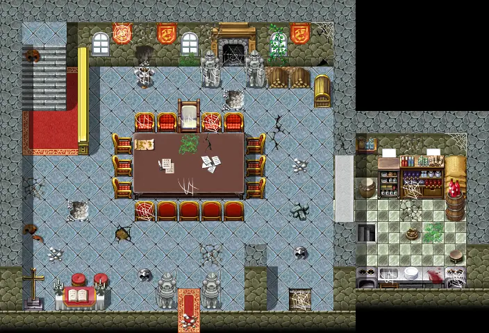

# Stoutford castle0

| | |
|---|---|
| **Map ID** | `stoutford_castle0` |
| **Region** | In Flagstone Prison (other) |
| **Type** | Indoors / underground |
| **Size** | 22×15 tiles |
| **Introduced** | [v0.7.2](../versions/0.7.2.md) |
| **NPCs** | 7 |
| **Enemy types** | 1 |
| **Quests** | 1 |

**Stoutford castle0** is an indoor map, in Flagstone Prison (other). It has 7 NPCs and 1 kind of enemy. Exits lead to Stoutford castle1, Waytogalmore1, Stoutford castle2.

## Map

<label class="lg"><input type="checkbox" data-t="spawn" checked><b>Red</b>&nbsp;Monsters / NPCs</label><label class="lg"><input type="checkbox" data-t="mapchange" checked><b>Blue</b>&nbsp;Exit to another map</label><label class="lg"><input type="checkbox" data-t="container" checked><b>Yellow</b>&nbsp;Container (click to see contents)</label><label class="lg"><input type="checkbox" data-t="sign" checked><b>Purple</b>&nbsp;Sign</label><label class="lg"><input type="checkbox" data-t="rest" checked><b>Green</b>&nbsp;Resting place</label><label class="lg"><input type="checkbox" data-t="key" checked><b>Orange dashed</b>&nbsp;Blocked until a quest step / item</label><label class="lg"><input type="checkbox" data-t="script"><b>Grey dotted</b>&nbsp;Scripted event</label><label class="lg"><input type="checkbox" data-t="replace"><b>White dotted</b>&nbsp;Changes during a quest</label><label class="lg"><input type="checkbox" data-t="pin" checked><b>Numbers</b>&nbsp;Numbered key points (see the key below the map)</label>

<a class="pin pin-exit" href="#key-1" style="left:61.364%;top:90.000%" title="Exit (south): to [Stoutford castle1](../stoutford_castle1.md)">1</a><a class="pin pin-exit" href="#key-2" style="left:38.636%;top:96.667%" title="Exit (south): to [Waytogalmore1](../waytogalmore1.md)">2</a><a class="pin pin-exit" href="#key-3" style="left:9.091%;top:16.667%" title="Exit (west): to [Stoutford castle2](../stoutford_castle2.md)">3</a><a class="pin pin-exit" href="#key-4" style="left:75.000%;top:70.000%" title="Exit (stairs / passage): to [Stoutford castle1](../stoutford_castle1.md)">4</a><a class="pin pin-npc" href="#key-5" style="left:20.455%;top:63.333%" title="[Erwyn&#x27;s knight](../../monsters/erwyn_knight.md): NPC">5</a><a class="pin pin-npc" href="#key-6" style="left:4.629%;top:19.608%" title="[Gyra](../../monsters/stn_gyra3.md): NPC">6</a><a class="pin pin-npc" href="#key-7" style="left:75.000%;top:63.333%" title="[Gyra](../../monsters/stn_gyra1.md): NPC">7</a><a class="pin pin-npc" href="#key-8" style="left:38.636%;top:90.000%" title="[Gyra](../../monsters/stn_gyra4.md): NPC">8</a><a class="pin pin-npc" href="#key-9" style="left:61.663%;top:85.001%" title="[Gyra](../../monsters/stn_gyra2.md): NPC">9</a><a class="pin pin-npc" href="#key-10" style="left:11.364%;top:56.667%" title="[Lord Erwyn](../../monsters/erwyn.md): NPC">10</a><a class="pin pin-npc" href="#key-11" style="left:11.364%;top:63.333%" title="[Lord Erwyn](../../monsters/erwyn2.md): NPC">11</a><a class="pin pin-script" href="#key-12" style="left:38.636%;top:83.333%" title="Quest trigger: Scripted event: advances the quest: hidden story flag “stn_nondisplay” to stage 12 (“12=Gyra in castle0”)">12</a><a class="pin pin-script" href="#key-12" style="left:9.091%;top:23.333%" title="Quest trigger: Scripted event: advances the quest: hidden story flag “stn_nondisplay” to stage 12 (“12=Gyra in castle0”)">12</a><a class="pin pin-script" href="#key-12" style="left:61.663%;top:78.334%" title="Quest trigger: Scripted event: advances the quest: hidden story flag “stn_nondisplay” to stage 12 (“12=Gyra in castle0”)">12</a><a class="pin pin-script" href="#key-12" style="left:75.299%;top:58.334%" title="Quest trigger: Scripted event: advances the quest: hidden story flag “stn_nondisplay” to stage 12 (“12=Gyra in castle0”)">12</a><a class="pin pin-script" href="#key-13" style="left:22.727%;top:56.667%" title="Quest trigger: Scripted event: advances the quest: hidden story flag “stn_nondisplay” to stage 49 (“49=Erwyn2 active”) (+1 more quest(s))">13</a>

??? abstract "Key to the numbers on the map"

    | # | What | Details |
    |---|---|---|
    | 1 | Exit (south) | to [Stoutford castle1](../stoutford_castle1.md) |
    | 2 | Exit (south) | to [Waytogalmore1](../waytogalmore1.md) |
    | 3 | Exit (west) | to [Stoutford castle2](../stoutford_castle2.md) |
    | 4 | Exit (stairs / passage) | to [Stoutford castle1](../stoutford_castle1.md) |
    | 5 | [Erwyn's knight](../monsters/erwyn_knight.md) | NPC |
    | 6 | [Gyra](../monsters/stn_gyra3.md) | NPC |
    | 7 | [Gyra](../monsters/stn_gyra1.md) | NPC |
    | 8 | [Gyra](../monsters/stn_gyra4.md) | NPC |
    | 9 | [Gyra](../monsters/stn_gyra2.md) | NPC |
    | 10 | [Lord Erwyn](../monsters/erwyn.md) | NPC |
    | 11 | [Lord Erwyn](../monsters/erwyn2.md) | NPC |
    | 12 | Quest trigger | Scripted event: advances the quest: hidden story flag “stn_nondisplay” to stage 12 (“12=Gyra in castle0”) |
    | 13 | Quest trigger | Scripted event: advances the quest: hidden story flag “stn_nondisplay” to stage 49 (“49=Erwyn2 active”) (+1 more quest(s)) |

Verified against v0.8.18 map data.

## Connections

| Direction | Leads to | Region there | Map # |
|---|---|---|---|
| South | [Stoutford castle1](stoutford_castle1.md) | – | 1 |
| South | [Waytogalmore1](waytogalmore1.md) | Flagstone Prison | 2 |
| West | [Stoutford castle2](stoutford_castle2.md) | – | 3 |
| Stairs / passage | [Stoutford castle1](stoutford_castle1.md) | – | 4 |

## NPCs

- [Erwyn's knight](../monsters/erwyn_knight.md) (#5)
- [Gyra](../monsters/stn_gyra3.md) (#6)
- [Gyra](../monsters/stn_gyra1.md) (#7)
- [Gyra](../monsters/stn_gyra4.md) (#8)
- [Gyra](../monsters/stn_gyra2.md) (#9)
- [Lord Erwyn](../monsters/erwyn.md) (#10)
- [Lord Erwyn](../monsters/erwyn2.md) (#11)

## Enemies

| Enemy | HP | Damage | Up to | Notes |
|---|---|---|---|---|
| [Cook](../monsters/erwyn_cook.md) | 35 | 2–3 | 1 | – |

<small>“Up to” is the most that can be alive at once from the spawn areas on this map.</small>

## Quests

- [Stoutford's old castle](../quests/stoutford_castle.md): something on this map advances it; stepping on a trigger here sets stage 16; stepping on a trigger here sets stage 5
- [stn_nondisplay (hidden flag)](../quests/stn_nondisplay.md): [Gyra](../monsters/stn_gyra1.md) is involved; [Gyra](../monsters/stn_gyra2.md) is involved; [Gyra](../monsters/stn_gyra3.md) is involved; [Gyra](../monsters/stn_gyra4.md) is involved; [Lord Erwyn](../monsters/erwyn.md) is involved; [Lord Erwyn](../monsters/erwyn2.md) is involved; something on this map advances it; stepping on a trigger here sets stage 12; stepping on a trigger here sets stage 49

## Points of interest

- **Quest trigger** (#12): Scripted event: advances the quest: hidden story flag “stn_nondisplay” to stage 12 (“12=Gyra in castle0”)
- **Quest trigger** (#13): Scripted event: advances the quest: hidden story flag “stn_nondisplay” to stage 49 (“49=Erwyn2 active”) (+1 more quest(s))

## Version history

| Version | Change |
|---|---|
| [v0.7.2](../versions/0.7.2.md) | Added |
| [v0.8.8](../versions/0.8.8.md) | map layout or objects changed |

Verified against v0.8.18 and every earlier release back to v0.7.0 (game data compared release by release).

## Community notes

<small>Written by players, not generated from game data. **Observations**: what players notice in-game · **Lore**: the in-world story · **Trivia**: real-world facts, references, development history · **Theory / speculation**: unconfirmed ideas; may just be unfinished content</small>

### Observations

*Nothing here yet. Know something? [Add it](https://github.com/asdfghjkl628/Andor-s-Trail-Wikiiii/new/main/notes/maps?filename=stoutford_castle0.md&value=%23%23%20Observations%0A%0A%3C%21--%20what%20players%20notice%20in-game%20--%3E%0A%0A%23%23%20Lore%0A%0A%3C%21--%20the%20in-world%20story%20--%3E%0A%0A%23%23%20Trivia%0A%0A%3C%21--%20real-world%20facts%2C%20references%2C%20development%20history%20--%3E%0A%0A%23%23%20Theory%20/%20speculation%0A%0A%3C%21--%20unconfirmed%20ideas%3B%20may%20just%20be%20unfinished%20content%20--%3E%0A).*

### Lore

*Nothing here yet. Know something? [Add it](https://github.com/asdfghjkl628/Andor-s-Trail-Wikiiii/new/main/notes/maps?filename=stoutford_castle0.md&value=%23%23%20Observations%0A%0A%3C%21--%20what%20players%20notice%20in-game%20--%3E%0A%0A%23%23%20Lore%0A%0A%3C%21--%20the%20in-world%20story%20--%3E%0A%0A%23%23%20Trivia%0A%0A%3C%21--%20real-world%20facts%2C%20references%2C%20development%20history%20--%3E%0A%0A%23%23%20Theory%20/%20speculation%0A%0A%3C%21--%20unconfirmed%20ideas%3B%20may%20just%20be%20unfinished%20content%20--%3E%0A).*

### Trivia

*Nothing here yet. Know something? [Add it](https://github.com/asdfghjkl628/Andor-s-Trail-Wikiiii/new/main/notes/maps?filename=stoutford_castle0.md&value=%23%23%20Observations%0A%0A%3C%21--%20what%20players%20notice%20in-game%20--%3E%0A%0A%23%23%20Lore%0A%0A%3C%21--%20the%20in-world%20story%20--%3E%0A%0A%23%23%20Trivia%0A%0A%3C%21--%20real-world%20facts%2C%20references%2C%20development%20history%20--%3E%0A%0A%23%23%20Theory%20/%20speculation%0A%0A%3C%21--%20unconfirmed%20ideas%3B%20may%20just%20be%20unfinished%20content%20--%3E%0A).*

### Theory / speculation

*Nothing here yet. Know something? [Add it](https://github.com/asdfghjkl628/Andor-s-Trail-Wikiiii/new/main/notes/maps?filename=stoutford_castle0.md&value=%23%23%20Observations%0A%0A%3C%21--%20what%20players%20notice%20in-game%20--%3E%0A%0A%23%23%20Lore%0A%0A%3C%21--%20the%20in-world%20story%20--%3E%0A%0A%23%23%20Trivia%0A%0A%3C%21--%20real-world%20facts%2C%20references%2C%20development%20history%20--%3E%0A%0A%23%23%20Theory%20/%20speculation%0A%0A%3C%21--%20unconfirmed%20ideas%3B%20may%20just%20be%20unfinished%20content%20--%3E%0A).*

??? info "Technical information"

    | | |
    |---|---|
    | Map ID | `stoutford_castle0` |
    | File | `res/xml/stoutford_castle0.tmx` |
    | Size | 22×15 tiles (704×480 px) |
    | outdoors property | – |
    | Layers drawn | ground, objects, above |
    | Tilesets | map_bed_1, map_border_1, map_bridge_1, map_bridge_2, map_broken_1, map_cavewall_1, map_cavewall_2, map_cavewall_3, map_cavewall_4, map_chair_table_1, map_chair_table_2, map_crate_1, map_cupboard_1, map_curtain_1, map_entrance_1, map_entrance_2, map_fence_1, map_fence_2, map_fence_3, map_fence_4, map_ground_1, map_ground_2, map_ground_3, map_ground_4, map_ground_5, map_ground_6, map_ground_7, map_ground_8, map_house_1, map_house_2, map_indoor_1, map_indoor_2, map_kitchen_1, map_outdoor_1, map_pillar_1, map_pillar_2, map_plant_1, map_plant_2, map_rock_1, map_rock_2, map_roof_1, map_roof_2, map_roof_3, map_shop_1, map_sign_ladder_1, map_table_1, map_trail_1, map_transition_1, map_transition_2, map_transition_3, map_transition_4, map_transition_5, map_tree_1, map_tree_2, map_wall_1, map_wall_2, map_wall_3, map_wall_4, map_window_1, map_window_2 |
    | Map objects | spawn: 8, script: 5, mapchange: 4 |
    | World map position | – |

<small>Data from v0.8.18</small>
