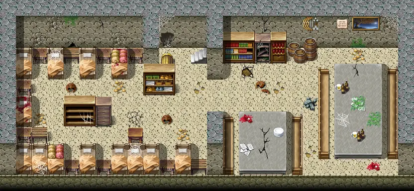

# Stoutford castle barrack2

| | |
|---|---|
| **Map ID** | `stoutford_castle_barrack2` |
| **Region** | In Prim (settlement) |
| **Type** | Indoors / underground |
| **Size** | 26×12 tiles |
| **Introduced** | [v0.7.2](../versions/0.7.2.md) |
| **NPCs** | 2 |
| **Quests** | 1 |

**Stoutford castle barrack2** is an indoor map, in Prim (settlement). It has 2 NPCs, and no enemies. Exits lead to Blackwater mountain29, Blackwater mountain45, Fallhaven tavern, Foaming flask and 6 more.

## Map

<label class="lg"><input type="checkbox" data-t="spawn" checked><b>Red</b>&nbsp;Monsters / NPCs</label><label class="lg"><input type="checkbox" data-t="mapchange" checked><b>Blue</b>&nbsp;Exit to another map</label><label class="lg"><input type="checkbox" data-t="container" checked><b>Yellow</b>&nbsp;Container (click to see contents)</label><label class="lg"><input type="checkbox" data-t="sign" checked><b>Purple</b>&nbsp;Sign</label><label class="lg"><input type="checkbox" data-t="rest" checked><b>Green</b>&nbsp;Resting place</label><label class="lg"><input type="checkbox" data-t="key" checked><b>Orange dashed</b>&nbsp;Blocked until a quest step / item</label><label class="lg"><input type="checkbox" data-t="script"><b>Grey dotted</b>&nbsp;Scripted event</label><label class="lg"><input type="checkbox" data-t="replace"><b>White dotted</b>&nbsp;Changes during a quest</label><label class="lg"><input type="checkbox" data-t="pin" checked><b>Numbers</b>&nbsp;Numbered key points (see the key below the map)</label>

<a class="pin pin-exit" href="#key-1" style="left:13.462%;top:87.500%" title="Exit (south): to [Blackwater mountain29](../blackwater_mountain29.md)">1</a><a class="pin pin-exit" href="#key-2" style="left:21.154%;top:87.500%" title="Exit (south): to [Blackwater mountain45](../blackwater_mountain45.md)">2</a><a class="pin pin-exit" href="#key-3" style="left:28.846%;top:87.500%" title="Exit (south): to [Fallhaven tavern](../fallhaven_tavern.md)">3</a><a class="pin pin-exit" href="#key-4" style="left:36.538%;top:87.500%" title="Exit (south): to [Foaming flask](../foaming_flask.md)">4</a><a class="pin pin-exit" href="#key-5" style="left:44.231%;top:87.500%" title="Exit (south): to [Lodarhouse1](../lodarhouse1.md)">5</a><a class="pin pin-exit" href="#key-6" style="left:5.769%;top:29.167%" title="Exit (west): to [Guynmart farmhouse](../guynmart_farmhouse.md)">6</a><a class="pin pin-exit" href="#key-7" style="left:21.154%;top:29.167%" title="Exit (stairs / passage): to [Loneford10](../loneford10.md)">7</a><a class="pin pin-exit" href="#key-8" style="left:13.462%;top:29.167%" title="Exit (stairs / passage): to [Remgard tavern1](../remgard_tavern1.md)">8</a><a class="pin pin-exit" href="#key-9" style="left:48.077%;top:29.167%" title="Exit (stairs / passage): to [Stoutford castle barrack0](../stoutford_castle_barrack0.md)">9</a><a class="pin pin-exit" href="#key-10" style="left:28.846%;top:29.167%" title="Exit (stairs / passage): to [Tradehouse0](../tradehouse0.md)">10</a><a class="pin pin-npc" href="#key-11" style="left:59.615%;top:54.167%" title="[Erwyn&#x27;s soldier](../../monsters/erwyn_soldier.md): NPC">11</a><a class="pin pin-npc" href="#key-12" style="left:48.330%;top:22.917%" title="[Gyra](../../monsters/stn_gyra1.md): NPC">12</a><a class="pin pin-script" href="#key-13" style="left:46.154%;top:37.500%" title="Quest trigger: Scripted event: advances the quest: hidden story flag “stn_nondisplay” to stage 22 (“22=Gyra in barrack2”)">13</a><a class="pin pin-script" href="#key-14" style="left:28.846%;top:58.333%" title="Quest trigger: Scripted event: advances the quest: base_nondisplay to stage 1 (“1=Developers Debug Version active”)">14</a><a class="pin pin-key" href="#key-15" style="left:17.308%;top:29.167%" title="Blocked passage: Unlocked during the quest: base_nondisplay (stage 1: “1=Developers Debug Version active”)">15</a><a class="pin pin-key" href="#key-15" style="left:29.099%;top:81.251%" title="Blocked passage: Unlocked during the quest: base_nondisplay (stage 1: “1=Developers Debug Version active”)">15</a>

??? abstract "Key to the numbers on the map"

    | # | What | Details |
    |---|---|---|
    | 1 | Exit (south) | to [Blackwater mountain29](../blackwater_mountain29.md) |
    | 2 | Exit (south) | to [Blackwater mountain45](../blackwater_mountain45.md) |
    | 3 | Exit (south) | to [Fallhaven tavern](../fallhaven_tavern.md) |
    | 4 | Exit (south) | to [Foaming flask](../foaming_flask.md) |
    | 5 | Exit (south) | to [Lodarhouse1](../lodarhouse1.md) |
    | 6 | Exit (west) | to [Guynmart farmhouse](../guynmart_farmhouse.md) |
    | 7 | Exit (stairs / passage) | to [Loneford10](../loneford10.md) |
    | 8 | Exit (stairs / passage) | to [Remgard tavern1](../remgard_tavern1.md) |
    | 9 | Exit (stairs / passage) | to [Stoutford castle barrack0](../stoutford_castle_barrack0.md) |
    | 10 | Exit (stairs / passage) | to [Tradehouse0](../tradehouse0.md) |
    | 11 | [Erwyn's soldier](../monsters/erwyn_soldier.md) | NPC |
    | 12 | [Gyra](../monsters/stn_gyra1.md) | NPC |
    | 13 | Quest trigger | Scripted event: advances the quest: hidden story flag “stn_nondisplay” to stage 22 (“22=Gyra in barrack2”) |
    | 14 | Quest trigger | Scripted event: advances the quest: base_nondisplay to stage 1 (“1=Developers Debug Version active”) |
    | 15 | Blocked passage | Unlocked during the quest: base_nondisplay (stage 1: “1=Developers Debug Version active”) |

Verified against v0.8.18 map data.

## Connections

| Direction | Leads to | Region there | Map # |
|---|---|---|---|
| South | [Blackwater mountain29](blackwater_mountain29.md) | Prim | 1 |
| South | [Blackwater mountain45](blackwater_mountain45.md) | Prim | 2 |
| South | [Fallhaven tavern](fallhaven_tavern.md) | Fallhaven | 3 |
| South | [Foaming flask](foaming_flask.md) | Foaming Flask Tavern | 4 |
| South | [Lodarhouse1](lodarhouse1.md) | Prim | 5 |
| West | [Guynmart farmhouse](guynmart_farmhouse.md) | Guynmart Castle | 6 |
| Stairs / passage | [Loneford10](loneford10.md) | Loneford | 7 |
| Stairs / passage | [Remgard tavern1](remgard_tavern1.md) | Remgard | 8 |
| Stairs / passage | [Stoutford castle barrack0](stoutford_castle_barrack0.md) | Stoutford | 9 |
| Stairs / passage | [Tradehouse0](tradehouse0.md) | Prim | 10 |

## NPCs

- [Erwyn's soldier](../monsters/erwyn_soldier.md) (#11)
- [Gyra](../monsters/stn_gyra1.md) (#12)

## Quests

- [base_nondisplay](../quests/base_nondisplay.md): blocked passage opens at stage 1; something on this map advances it; stepping on a trigger here sets stage 1
- [stn_nondisplay (hidden flag)](../quests/stn_nondisplay.md): [Gyra](../monsters/stn_gyra1.md) is involved; something on this map advances it; stepping on a trigger here sets stage 22

## Points of interest

- **Quest trigger** (#13): Scripted event: advances the quest: hidden story flag “stn_nondisplay” to stage 22 (“22=Gyra in barrack2”)
- **Quest trigger** (#14): Scripted event: advances the quest: base_nondisplay to stage 1 (“1=Developers Debug Version active”)
- **Blocked passage** (#15): Unlocked during the quest: base_nondisplay (stage 1: “1=Developers Debug Version active”)

## Version history

| Version | Change |
|---|---|
| [v0.7.2](../versions/0.7.2.md) | Added |

Verified against v0.8.18 and every earlier release back to v0.7.0 (game data compared release by release).

## Community notes

<small>Written by players, not generated from game data. **Observations**: what players notice in-game · **Lore**: the in-world story · **Trivia**: real-world facts, references, development history · **Theory / speculation**: unconfirmed ideas; may just be unfinished content</small>

### Observations

*Nothing here yet. Know something? [Add it](https://github.com/asdfghjkl628/Andor-s-Trail-Wikiiii/new/main/notes/maps?filename=stoutford_castle_barrack2.md&value=%23%23%20Observations%0A%0A%3C%21--%20what%20players%20notice%20in-game%20--%3E%0A%0A%23%23%20Lore%0A%0A%3C%21--%20the%20in-world%20story%20--%3E%0A%0A%23%23%20Trivia%0A%0A%3C%21--%20real-world%20facts%2C%20references%2C%20development%20history%20--%3E%0A%0A%23%23%20Theory%20/%20speculation%0A%0A%3C%21--%20unconfirmed%20ideas%3B%20may%20just%20be%20unfinished%20content%20--%3E%0A).*

### Lore

*Nothing here yet. Know something? [Add it](https://github.com/asdfghjkl628/Andor-s-Trail-Wikiiii/new/main/notes/maps?filename=stoutford_castle_barrack2.md&value=%23%23%20Observations%0A%0A%3C%21--%20what%20players%20notice%20in-game%20--%3E%0A%0A%23%23%20Lore%0A%0A%3C%21--%20the%20in-world%20story%20--%3E%0A%0A%23%23%20Trivia%0A%0A%3C%21--%20real-world%20facts%2C%20references%2C%20development%20history%20--%3E%0A%0A%23%23%20Theory%20/%20speculation%0A%0A%3C%21--%20unconfirmed%20ideas%3B%20may%20just%20be%20unfinished%20content%20--%3E%0A).*

### Trivia

*Nothing here yet. Know something? [Add it](https://github.com/asdfghjkl628/Andor-s-Trail-Wikiiii/new/main/notes/maps?filename=stoutford_castle_barrack2.md&value=%23%23%20Observations%0A%0A%3C%21--%20what%20players%20notice%20in-game%20--%3E%0A%0A%23%23%20Lore%0A%0A%3C%21--%20the%20in-world%20story%20--%3E%0A%0A%23%23%20Trivia%0A%0A%3C%21--%20real-world%20facts%2C%20references%2C%20development%20history%20--%3E%0A%0A%23%23%20Theory%20/%20speculation%0A%0A%3C%21--%20unconfirmed%20ideas%3B%20may%20just%20be%20unfinished%20content%20--%3E%0A).*

### Theory / speculation

*Nothing here yet. Know something? [Add it](https://github.com/asdfghjkl628/Andor-s-Trail-Wikiiii/new/main/notes/maps?filename=stoutford_castle_barrack2.md&value=%23%23%20Observations%0A%0A%3C%21--%20what%20players%20notice%20in-game%20--%3E%0A%0A%23%23%20Lore%0A%0A%3C%21--%20the%20in-world%20story%20--%3E%0A%0A%23%23%20Trivia%0A%0A%3C%21--%20real-world%20facts%2C%20references%2C%20development%20history%20--%3E%0A%0A%23%23%20Theory%20/%20speculation%0A%0A%3C%21--%20unconfirmed%20ideas%3B%20may%20just%20be%20unfinished%20content%20--%3E%0A).*

??? info "Technical information"

    | | |
    |---|---|
    | Map ID | `stoutford_castle_barrack2` |
    | File | `res/xml/stoutford_castle_barrack2.tmx` |
    | Size | 26×12 tiles (832×384 px) |
    | outdoors property | – |
    | Layers drawn | ground, objects, above |
    | Tilesets | map_bed_1, map_border_1, map_bridge_1, map_bridge_2, map_broken_1, map_cavewall_1, map_cavewall_2, map_cavewall_3, map_cavewall_4, map_chair_table_1, map_chair_table_2, map_crate_1, map_cupboard_1, map_curtain_1, map_entrance_1, map_entrance_2, map_fence_1, map_fence_2, map_fence_3, map_fence_4, map_ground_1, map_ground_2, map_ground_3, map_ground_4, map_ground_5, map_ground_6, map_ground_7, map_ground_8, map_house_1, map_house_2, map_indoor_1, map_indoor_2, map_kitchen_1, map_outdoor_1, map_pillar_1, map_pillar_2, map_plant_1, map_plant_2, map_rock_1, map_rock_2, map_roof_1, map_roof_2, map_roof_3, map_shop_1, map_sign_ladder_1, map_table_1, map_trail_1, map_transition_1, map_transition_2, map_transition_3, map_transition_4, map_transition_5, map_tree_1, map_tree_2, map_wall_1, map_wall_2, map_wall_3, map_wall_4, map_window_1, map_window_2 |
    | Map objects | mapchange: 10, script: 2, spawn: 2, key: 2 |
    | World map position | – |

<small>Data from v0.8.18</small>
