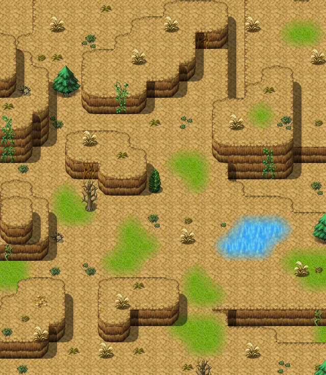

# Stoutford filler 4

| | |
|---|---|
| **Map ID** | `stoutford_filler_4` |
| **Type** | Outdoors |
| **Size** | 20×23 tiles |
| **World map** | [World1](index.md) |
| **Introduced** | [v0.8.14](../versions/0.8.14.md) |
| **Enemy types** | 3 |
| **Quests** | 1 |

**Stoutford filler 4** is an outdoor map. It has no NPCs and 3 kinds of enemy. Exits lead to Galmore 9, Galmore 11, Stoutford filler 3.

## Map

<label class="lg"><input type="checkbox" data-t="spawn" checked><b>Red</b>&nbsp;Monsters / NPCs</label><label class="lg"><input type="checkbox" data-t="mapchange" checked><b>Blue</b>&nbsp;Exit to another map</label><label class="lg"><input type="checkbox" data-t="container" checked><b>Yellow</b>&nbsp;Container (click to see contents)</label><label class="lg"><input type="checkbox" data-t="sign" checked><b>Purple</b>&nbsp;Sign</label><label class="lg"><input type="checkbox" data-t="rest" checked><b>Green</b>&nbsp;Resting place</label><label class="lg"><input type="checkbox" data-t="key" checked><b>Orange dashed</b>&nbsp;Blocked until a quest step / item</label><label class="lg"><input type="checkbox" data-t="script"><b>Grey dotted</b>&nbsp;Scripted event</label><label class="lg"><input type="checkbox" data-t="replace"><b>White dotted</b>&nbsp;Changes during a quest</label><label class="lg"><input type="checkbox" data-t="pin" checked><b>Numbers</b>&nbsp;Numbered key points (see the key below the map)</label>

<a class="pin pin-exit" href="#key-1" style="left:97.500%;top:73.913%" title="Exit (east): to [Galmore 9](../galmore_9.md)">1</a><a class="pin pin-exit" href="#key-2" style="left:97.500%;top:93.478%" title="Exit (southeast): to [Galmore 9](../galmore_9.md)">2</a><a class="pin pin-exit" href="#key-3" style="left:50.000%;top:97.826%" title="Exit (south): to [Galmore 11](../galmore_11.md)">3</a><a class="pin pin-exit" href="#key-4" style="left:2.500%;top:54.348%" title="Exit (west): to [Stoutford filler 3](../stoutford_filler_3.md)">4</a><a class="pin pin-script" href="#key-5" style="left:57.500%;top:54.348%" title="Quest trigger: Scripted event: advances the quest: hidden story flag “galmore_nondisplayed” to stage 57 (“Rubycrest Strider has been killed.”)">5</a><a class="pin pin-script" href="#key-6" style="left:12.500%;top:56.522%" title="Quest trigger: Scripted event: advances the quest: hidden story flag “galmore_nondisplayed” to stage 55 (“rubycrest strider spawned on stoutford_filler_3 spawn 2”)">6</a><a class="pin pin-key" href="#key-7" style="left:87.500%;top:84.783%" title="Blocked passage: Unlocked during the quest: base_nondisplay (stage 2: “2=This stage is never set”)">7</a>

??? abstract "Key to the numbers on the map"

    | # | What | Details |
    |---|---|---|
    | 1 | Exit (east) | to [Galmore 9](../galmore_9.md) |
    | 2 | Exit (southeast) | to [Galmore 9](../galmore_9.md) |
    | 3 | Exit (south) | to [Galmore 11](../galmore_11.md) |
    | 4 | Exit (west) | to [Stoutford filler 3](../stoutford_filler_3.md) |
    | 5 | Quest trigger | Scripted event: advances the quest: hidden story flag “galmore_nondisplayed” to stage 57 (“Rubycrest Strider has been killed.”) |
    | 6 | Quest trigger | Scripted event: advances the quest: hidden story flag “galmore_nondisplayed” to stage 55 (“rubycrest strider spawned on stoutford_filler_3 spawn 2”) |
    | 7 | Blocked passage | Unlocked during the quest: base_nondisplay (stage 2: “2=This stage is never set”) |

Verified against v0.8.18 map data.

## Connections

| Direction | Leads to | Region there | Map # |
|---|---|---|---|
| East | [Galmore 9](galmore_9.md) | Flagstone Prison | 1 |
| Southeast | [Galmore 9](galmore_9.md) | Flagstone Prison | 2 |
| South | [Galmore 11](galmore_11.md) | – | 3 |
| West | [Stoutford filler 3](stoutford_filler_3.md) | Stoutford | 4 |

## Enemies

| Enemy | HP | Damage | Up to | Notes |
|---|---|---|---|---|
| [Dirt spider](../monsters/dirt_spider.md) | 82 | 5–7 | 10 | – |
| [Hillside vine](../monsters/hill_vine_bottom.md) | 108 | 4–4 | 1 | – |
| [Rubycrest strider](../monsters/rubycrest_strider.md) | 293 | 6–18 | 1 | appears later, during a quest |

<small>“Up to” is the most that can be alive at once from the spawn areas on this map.</small>

## Quests

- [base_nondisplay](../quests/base_nondisplay.md): blocked passage opens at stage 2
- [galmore_nondisplayed (hidden flag)](../quests/galmore_nondisplayed.md): a scripted event can trigger here from stage 56; something on this map advances it; stepping on a trigger here sets stage 52; stepping on a trigger here sets stage 53; stepping on a trigger here sets stage 54; stepping on a trigger here sets stage 55; stepping on a trigger here sets stage 57

## Points of interest

- **Quest trigger** (#5): Scripted event: advances the quest: hidden story flag “galmore_nondisplayed” to stage 57 (“Rubycrest Strider has been killed.”)
- **Quest trigger** (#6): Scripted event: advances the quest: hidden story flag “galmore_nondisplayed” to stage 55 (“rubycrest strider spawned on stoutford_filler_3 spawn 2”)
- **Blocked passage** (#7): Unlocked during the quest: base_nondisplay (stage 2: “2=This stage is never set”)

## Version history

| Version | Change |
|---|---|
| [v0.8.14](../versions/0.8.14.md) | Added |

Verified against v0.8.18 and every earlier release back to v0.7.0 (game data compared release by release).

## Community notes

<small>Written by players, not generated from game data. **Observations**: what players notice in-game · **Lore**: the in-world story · **Trivia**: real-world facts, references, development history · **Theory / speculation**: unconfirmed ideas; may just be unfinished content</small>

### Observations

*Nothing here yet. Know something? [Add it](https://github.com/asdfghjkl628/Andor-s-Trail-Wikiiii/new/main/notes/maps?filename=stoutford_filler_4.md&value=%23%23%20Observations%0A%0A%3C%21--%20what%20players%20notice%20in-game%20--%3E%0A%0A%23%23%20Lore%0A%0A%3C%21--%20the%20in-world%20story%20--%3E%0A%0A%23%23%20Trivia%0A%0A%3C%21--%20real-world%20facts%2C%20references%2C%20development%20history%20--%3E%0A%0A%23%23%20Theory%20/%20speculation%0A%0A%3C%21--%20unconfirmed%20ideas%3B%20may%20just%20be%20unfinished%20content%20--%3E%0A).*

### Lore

*Nothing here yet. Know something? [Add it](https://github.com/asdfghjkl628/Andor-s-Trail-Wikiiii/new/main/notes/maps?filename=stoutford_filler_4.md&value=%23%23%20Observations%0A%0A%3C%21--%20what%20players%20notice%20in-game%20--%3E%0A%0A%23%23%20Lore%0A%0A%3C%21--%20the%20in-world%20story%20--%3E%0A%0A%23%23%20Trivia%0A%0A%3C%21--%20real-world%20facts%2C%20references%2C%20development%20history%20--%3E%0A%0A%23%23%20Theory%20/%20speculation%0A%0A%3C%21--%20unconfirmed%20ideas%3B%20may%20just%20be%20unfinished%20content%20--%3E%0A).*

### Trivia

*Nothing here yet. Know something? [Add it](https://github.com/asdfghjkl628/Andor-s-Trail-Wikiiii/new/main/notes/maps?filename=stoutford_filler_4.md&value=%23%23%20Observations%0A%0A%3C%21--%20what%20players%20notice%20in-game%20--%3E%0A%0A%23%23%20Lore%0A%0A%3C%21--%20the%20in-world%20story%20--%3E%0A%0A%23%23%20Trivia%0A%0A%3C%21--%20real-world%20facts%2C%20references%2C%20development%20history%20--%3E%0A%0A%23%23%20Theory%20/%20speculation%0A%0A%3C%21--%20unconfirmed%20ideas%3B%20may%20just%20be%20unfinished%20content%20--%3E%0A).*

### Theory / speculation

*Nothing here yet. Know something? [Add it](https://github.com/asdfghjkl628/Andor-s-Trail-Wikiiii/new/main/notes/maps?filename=stoutford_filler_4.md&value=%23%23%20Observations%0A%0A%3C%21--%20what%20players%20notice%20in-game%20--%3E%0A%0A%23%23%20Lore%0A%0A%3C%21--%20the%20in-world%20story%20--%3E%0A%0A%23%23%20Trivia%0A%0A%3C%21--%20real-world%20facts%2C%20references%2C%20development%20history%20--%3E%0A%0A%23%23%20Theory%20/%20speculation%0A%0A%3C%21--%20unconfirmed%20ideas%3B%20may%20just%20be%20unfinished%20content%20--%3E%0A).*

??? info "Technical information"

    | | |
    |---|---|
    | Map ID | `stoutford_filler_4` |
    | File | `res/xml/stoutford_filler_4.tmx` |
    | Size | 20×23 tiles (640×736 px) |
    | outdoors property | 1 |
    | Layers drawn | base, ground, objects, above, top |
    | Tilesets | map_bed_1, map_border_1, map_bridge_1, map_bridge_2, map_broken_1, map_cavewall_1, map_cavewall_2, map_cavewall_3, map_cavewall_4, map_chair_table_1, map_chair_table_2, map_crate_1, map_cupboard_1, map_curtain_1, map_entrance_1, map_entrance_2, map_fence_1, map_fence_2, map_fence_3, map_fence_4, map_ground_1, map_ground_2, map_ground_3, map_ground_4, map_ground_5, map_ground_6, map_ground_7, map_ground_8, map_house_1, map_house_2, map_indoor_1, map_indoor_2, map_kitchen_1, map_outdoor_1, map_pillar_1, map_pillar_2, map_plant_1, map_plant_2, map_rock_1, map_rock_2, map_roof_1, map_roof_2, map_roof_3, map_shop_1, map_sign_ladder_1, map_table_1, map_trail_1, map_transition_1, map_transition_2, map_transition_3, map_transition_4, map_transition_5, map_tree_1, map_tree_2, map_wall_1, map_wall_2, map_wall_3, map_wall_4, map_window_1, map_window_2 |
    | Map objects | spawn: 8, mapchange: 4, script: 3, key: 1 |
    | World map position | segment `world1`, x 74, y 562 |

<small>Data from v0.8.18</small>
