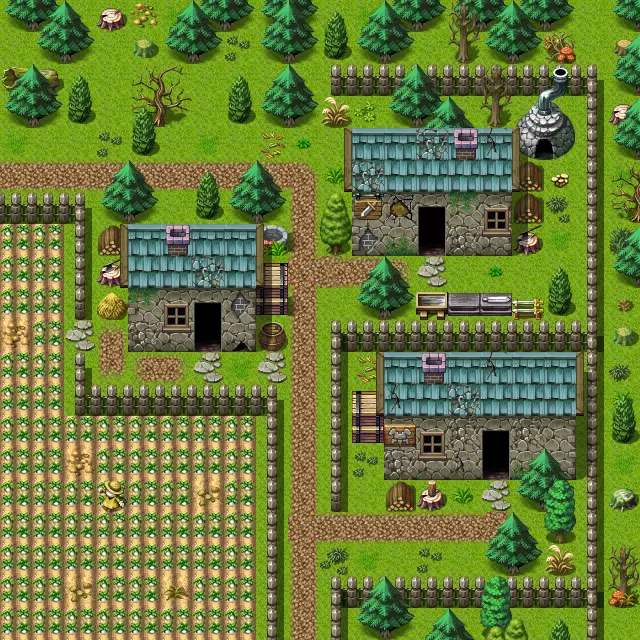

# Stoutford ne

20×20 tiles · outdoors · part of [World1](index.md)

<label class="lg lg-spawn"><input type="checkbox" data-t="spawn" checked> Monsters / NPCs</label><label class="lg lg-mapchange"><input type="checkbox" data-t="mapchange" checked> Exit to another map</label><label class="lg lg-container"><input type="checkbox" data-t="container" checked> Container</label><label class="lg lg-sign"><input type="checkbox" data-t="sign" checked> Sign</label><label class="lg lg-rest"><input type="checkbox" data-t="rest" checked> Resting place</label><label class="lg lg-key"><input type="checkbox" data-t="key" checked> Blocked / needs key or quest</label><label class="lg lg-script"><input type="checkbox" data-t="script"> Scripted event</label><label class="lg lg-replace"><input type="checkbox" data-t="replace"> Changes after a quest</label>

## Exits

- [Stoutford armorer](stoutford_armorer.md)
- [Stoutford farmhouse1](stoutford_farmhouse1.md)
- [Stoutford gate](stoutford_gate.md)
- [Stoutford se](stoutford_se.md)
- [Stoutford smith](stoutford_smith.md)
- [Wild19](wild19.md)

## Monsters & NPCs here

| Name | HP |
|---|---|
| [Boralla](../monsters/stn_boralla.md) | 0 |
| [Boralla](../monsters/stn_boralla1.md) | 0 |
| [Boralla](../monsters/stn_boralla4.md) | 0 |
| [Boralla](../monsters/stn_boralla5.md) | 0 |
| [Jen](../monsters/stoutford_farmer_jen.md) | 0 |
| [Boralla](../monsters/stn_boralla7.md) | 0 |
| [Boralla](../monsters/stn_boralla6.md) | 0 |
| [Boralla](../monsters/stn_boralla3.md) | 0 |
| [Boralla](../monsters/stn_boralla2.md) | 0 |
| [Commoner](../monsters/stoutford_commoner2.md) | 0 |

<small>Map ID: `stoutford_ne` · Data from v0.8.18</small>
