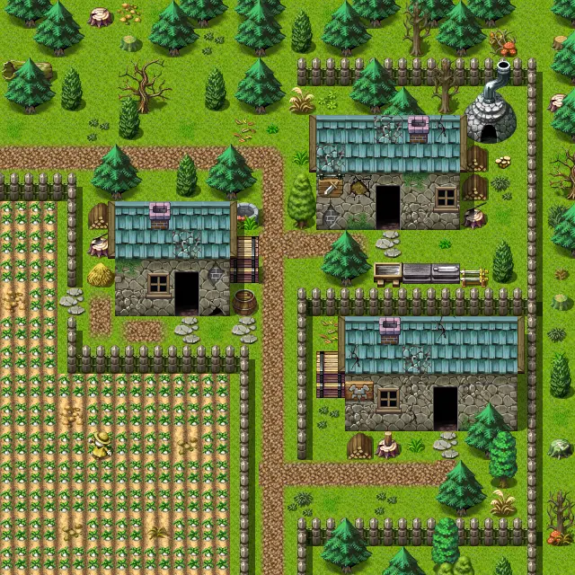

# Stoutford north-east

| | |
|---|---|
| **Map ID** | `stoutford_ne` |
| **Region** | In Stoutford (settlement) |
| **Type** | Outdoors |
| **Size** | 20×20 tiles |
| **World map** | [World 1](index.md) |
| **Introduced** | [v0.7.2](../versions/0.7.2.md) |
| **NPCs** | 10 |
| **Quests** | 0 |

**Stoutford north-east** is an outdoor map, in Stoutford (settlement). It has 10 NPCs, and no enemies. Exits lead to Wild 19, Stoutford south-east, Stoutford gate, Stoutford armorer and 2 more.

## Map

<label class="lg"><input type="checkbox" data-t="spawn" checked><b>Red</b>&nbsp;Monsters / NPCs</label><label class="lg"><input type="checkbox" data-t="mapchange" checked><b>Blue</b>&nbsp;Exit to another map</label><label class="lg"><input type="checkbox" data-t="container" checked><b>Yellow</b>&nbsp;Container (click to see contents)</label><label class="lg"><input type="checkbox" data-t="sign" checked><b>Purple</b>&nbsp;Sign</label><label class="lg"><input type="checkbox" data-t="rest" checked><b>Green</b>&nbsp;Resting place</label><label class="lg"><input type="checkbox" data-t="key" checked><b>Orange dashed</b>&nbsp;Blocked until a quest step / item</label><label class="lg"><input type="checkbox" data-t="script"><b>Grey dotted</b>&nbsp;Scripted event</label><label class="lg"><input type="checkbox" data-t="replace"><b>White dotted</b>&nbsp;Changes during a quest</label><label class="lg"><input type="checkbox" data-t="pin" checked><b>Numbers</b>&nbsp;Numbered key points (see the key below the map)</label>

<a class="pin pin-exit" href="#key-1" style="left:20.000%;top:2.500%" title="Exit (north): to [Wild 19](wild19.md)">1</a><a class="pin pin-exit" href="#key-2" style="left:47.500%;top:97.500%" title="Exit (south): to [Stoutford south-east](stoutford_se.md)">2</a><a class="pin pin-exit" href="#key-2" style="left:20.000%;top:97.500%" title="Exit (south): to [Stoutford south-east](stoutford_se.md)">2</a><a class="pin pin-exit" href="#key-3" style="left:2.500%;top:25.000%" title="Exit (west): to [Stoutford gate](stoutford_gate.md)">3</a><a class="pin pin-exit" href="#key-3" style="left:2.500%;top:65.000%" title="Exit (west): to [Stoutford gate](stoutford_gate.md)">3</a><a class="pin pin-exit" href="#key-4" style="left:77.500%;top:72.500%" title="Exit (door): to [Stoutford armorer](stoutford_armorer.md)">4</a><a class="pin pin-exit" href="#key-5" style="left:32.500%;top:52.500%" title="Exit (door): to [Stoutford farmhouse 1](stoutford_farmhouse1.md)">5</a><a class="pin pin-exit" href="#key-6" style="left:67.500%;top:37.500%" title="Exit (door): to [Stoutford smith](stoutford_smith.md)">6</a><a id="pin-npc-stn_boralla6" class="pin pin-npc" href="#key-7" style="left:17.500%;top:32.500%" title="[Boralla](../../monsters/stn_boralla.md#v-stn_boralla6): NPC">7</a><a id="pin-npc-stn_boralla7" class="pin pin-npc" href="#key-8" style="left:17.500%;top:47.500%" title="[Boralla](../../monsters/stn_boralla.md#v-stn_boralla7): NPC">8</a><a id="pin-npc-stn_boralla2" class="pin pin-npc" href="#key-9" style="left:42.500%;top:42.500%" title="[Boralla](../../monsters/stn_boralla.md#v-stn_boralla2): NPC">9</a><a id="pin-npc-stn_boralla" class="pin pin-npc" href="#key-10" style="left:47.500%;top:57.500%" title="[Boralla](../../monsters/stn_boralla.md): NPC">10</a><a id="pin-npc-stn_boralla4" class="pin pin-npc" href="#key-11" style="left:22.500%;top:17.500%" title="[Boralla](../../monsters/stn_boralla.md#v-stn_boralla4): NPC">11</a><a id="pin-npc-stn_boralla3" class="pin pin-npc" href="#key-12" style="left:87.500%;top:82.500%" title="[Boralla](../../monsters/stn_boralla.md#v-stn_boralla3): NPC">12</a><a id="pin-npc-stn_boralla1" class="pin pin-npc" href="#key-13" style="left:42.500%;top:12.500%" title="[Boralla](../../monsters/stn_boralla.md#v-stn_boralla1): NPC">13</a><a id="pin-npc-stn_boralla5" class="pin pin-npc" href="#key-14" style="left:52.500%;top:32.500%" title="[Boralla](../../monsters/stn_boralla.md#v-stn_boralla5): NPC">14</a><a id="pin-npc-stoutford_commoner2" class="pin pin-npc" href="#key-15" style="left:47.500%;top:22.500%" title="[Commoner](../../monsters/rg_villager1.md#v-stoutford_commoner2): NPC">15</a><a id="pin-npc-stoutford_farmer_jen" class="pin pin-npc" href="#key-16" style="left:22.500%;top:67.500%" title="[Jen](../../monsters/stoutford_farmer_jen.md): NPC">16</a>

??? abstract "Key to the numbers on the map"

    | # | What | Details |
    |---|---|---|
    | 1 | Exit (north) | to [Wild 19](wild19.md) |
    | 2 | Exit (south) | to [Stoutford south-east](stoutford_se.md) |
    | 3 | Exit (west) | to [Stoutford gate](stoutford_gate.md) |
    | 4 | Exit (door) | to [Stoutford armorer](stoutford_armorer.md) |
    | 5 | Exit (door) | to [Stoutford farmhouse 1](stoutford_farmhouse1.md) |
    | 6 | Exit (door) | to [Stoutford smith](stoutford_smith.md) |
    | 7 | [Boralla](../monsters/stn_boralla.md#v-stn_boralla6) | NPC |
    | 8 | [Boralla](../monsters/stn_boralla.md#v-stn_boralla7) | NPC |
    | 9 | [Boralla](../monsters/stn_boralla.md#v-stn_boralla2) | NPC |
    | 10 | [Boralla](../monsters/stn_boralla.md) | NPC |
    | 11 | [Boralla](../monsters/stn_boralla.md#v-stn_boralla4) | NPC |
    | 12 | [Boralla](../monsters/stn_boralla.md#v-stn_boralla3) | NPC |
    | 13 | [Boralla](../monsters/stn_boralla.md#v-stn_boralla1) | NPC |
    | 14 | [Boralla](../monsters/stn_boralla.md#v-stn_boralla5) | NPC |
    | 15 | [Commoner](../monsters/rg_villager1.md#v-stoutford_commoner2) | NPC |
    | 16 | [Jen](../monsters/stoutford_farmer_jen.md) | NPC |

Verified against v0.8.18 map data.

## Connections

| Direction | Leads to | Region there | Map # |
|---|---|---|---|
| North | [Wild 19](wild19.md) | Stoutford | 1 |
| South | [Stoutford south-east](stoutford_se.md) | Stoutford | 2 |
| West | [Stoutford gate](stoutford_gate.md) | Stoutford | 3 |
| Door | [Stoutford armorer](stoutford_armorer.md) | Stoutford | 4 |
| Door | [Stoutford farmhouse 1](stoutford_farmhouse1.md) | Stoutford | 5 |
| Door | [Stoutford smith](stoutford_smith.md) | Stoutford | 6 |

## NPCs

- [Boralla](../monsters/stn_boralla.md#v-stn_boralla6) (#7)
- [Boralla](../monsters/stn_boralla.md#v-stn_boralla7) (#8)
- [Boralla](../monsters/stn_boralla.md#v-stn_boralla2) (#9)
- [Boralla](../monsters/stn_boralla.md) (#10)
- [Boralla](../monsters/stn_boralla.md#v-stn_boralla4) (#11)
- [Boralla](../monsters/stn_boralla.md#v-stn_boralla3) (#12)
- [Boralla](../monsters/stn_boralla.md#v-stn_boralla1) (#13)
- [Boralla](../monsters/stn_boralla.md#v-stn_boralla5) (#14)
- [Commoner](../monsters/rg_villager1.md#v-stoutford_commoner2) (#15)
- [Jen](../monsters/stoutford_farmer_jen.md) (#16)

## Version history

| Version | Change |
|---|---|
| [v0.7.2](../versions/0.7.2.md) | Added |
| [v0.7.4](../versions/0.7.4.md) | Map layout or objects changed |
| [v0.8.12.1](../versions/0.8.12.1.md) | Map layout or objects changed |
| [v0.8.18](../versions/0.8.18.md) | Map layout or objects changed |

Verified against v0.8.18 and every earlier release back to v0.7.0 (game data compared release by release).

## Community notes

<small>Written by players, not generated from game data. **Observations**: what players notice in-game · **Lore**: the in-world story · **Trivia**: real-world facts, references, development history · **Theory / speculation**: unconfirmed ideas; may just be unfinished content</small>

### Observations

*No notes yet. Contributions are welcome: [add a note](https://github.com/asdfghjkl628/Andor-s-Trail-Wikiiii/new/main/notes/maps?filename=stoutford_ne.md&value=%23%23%20Observations%0A%0A%3C%21--%20what%20players%20notice%20in-game%20--%3E%0A%0A%23%23%20Lore%0A%0A%3C%21--%20the%20in-world%20story%20--%3E%0A%0A%23%23%20Trivia%0A%0A%3C%21--%20real-world%20facts%2C%20references%2C%20development%20history%20--%3E%0A%0A%23%23%20Theory%20/%20speculation%0A%0A%3C%21--%20unconfirmed%20ideas%3B%20may%20just%20be%20unfinished%20content%20--%3E%0A).*

### Lore

*No notes yet. Contributions are welcome: [add a note](https://github.com/asdfghjkl628/Andor-s-Trail-Wikiiii/new/main/notes/maps?filename=stoutford_ne.md&value=%23%23%20Observations%0A%0A%3C%21--%20what%20players%20notice%20in-game%20--%3E%0A%0A%23%23%20Lore%0A%0A%3C%21--%20the%20in-world%20story%20--%3E%0A%0A%23%23%20Trivia%0A%0A%3C%21--%20real-world%20facts%2C%20references%2C%20development%20history%20--%3E%0A%0A%23%23%20Theory%20/%20speculation%0A%0A%3C%21--%20unconfirmed%20ideas%3B%20may%20just%20be%20unfinished%20content%20--%3E%0A).*

### Trivia

*No notes yet. Contributions are welcome: [add a note](https://github.com/asdfghjkl628/Andor-s-Trail-Wikiiii/new/main/notes/maps?filename=stoutford_ne.md&value=%23%23%20Observations%0A%0A%3C%21--%20what%20players%20notice%20in-game%20--%3E%0A%0A%23%23%20Lore%0A%0A%3C%21--%20the%20in-world%20story%20--%3E%0A%0A%23%23%20Trivia%0A%0A%3C%21--%20real-world%20facts%2C%20references%2C%20development%20history%20--%3E%0A%0A%23%23%20Theory%20/%20speculation%0A%0A%3C%21--%20unconfirmed%20ideas%3B%20may%20just%20be%20unfinished%20content%20--%3E%0A).*

### Theory / speculation

*No notes yet. Contributions are welcome: [add a note](https://github.com/asdfghjkl628/Andor-s-Trail-Wikiiii/new/main/notes/maps?filename=stoutford_ne.md&value=%23%23%20Observations%0A%0A%3C%21--%20what%20players%20notice%20in-game%20--%3E%0A%0A%23%23%20Lore%0A%0A%3C%21--%20the%20in-world%20story%20--%3E%0A%0A%23%23%20Trivia%0A%0A%3C%21--%20real-world%20facts%2C%20references%2C%20development%20history%20--%3E%0A%0A%23%23%20Theory%20/%20speculation%0A%0A%3C%21--%20unconfirmed%20ideas%3B%20may%20just%20be%20unfinished%20content%20--%3E%0A).*

??? info "Technical information"

    | | |
    |---|---|
    | Map ID | `stoutford_ne` |
    | File | `res/xml/stoutford_ne.tmx` |
    | Size | 20×20 tiles (640×640 px) |
    | outdoors property | 1 |
    | Layers drawn | ground, objects, above, top |
    | Tilesets | map_bed_1, map_border_1, map_bridge_1, map_bridge_2, map_broken_1, map_cavewall_1, map_cavewall_2, map_cavewall_3, map_cavewall_4, map_chair_table_1, map_chair_table_2, map_crate_1, map_cupboard_1, map_curtain_1, map_entrance_1, map_entrance_2, map_fence_1, map_fence_2, map_fence_3, map_fence_4, map_ground_1, map_ground_2, map_ground_3, map_ground_4, map_ground_5, map_ground_6, map_ground_7, map_ground_8, map_house_1, map_house_2, map_indoor_1, map_indoor_2, map_kitchen_1, map_outdoor_1, map_pillar_1, map_pillar_2, map_plant_1, map_plant_2, map_rock_1, map_rock_2, map_roof_1, map_roof_2, map_roof_3, map_shop_1, map_sign_ladder_1, map_table_1, map_trail_1, map_transition_1, map_transition_2, map_transition_3, map_transition_4, map_transition_5, map_tree_1, map_tree_2, map_wall_1, map_wall_2, map_wall_3, map_wall_4, map_window_1, map_window_2 |
    | Map objects | spawn: 10, mapchange: 8 |
    | World map position | segment `world1`, x 53, y 521 |

<small>Data from v0.8.18</small>
