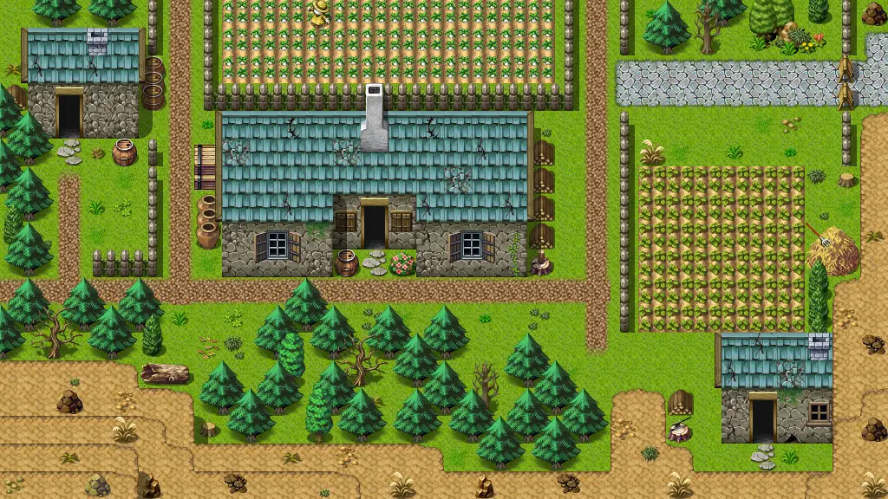

# Stoutford south-east

| | |
|---|---|
| **Map ID** | `stoutford_se` |
| **Region** | In Stoutford (settlement) |
| **Type** | Outdoors |
| **Size** | 32×18 tiles |
| **World map** | [World 1](index.md) |
| **Introduced** | [v0.7.2](../versions/0.7.2.md) |
| **NPCs** | 7 |
| **Quests** | 0 |

**Stoutford south-east** is an outdoor map, in Stoutford (settlement). It has 7 NPCs, and no enemies. Exits lead to Stoutford gate, Stoutford north-east, Wild 22, Stoutford south-west and 3 more.

## Map

<label class="lg"><input type="checkbox" data-t="spawn" checked><b>Red</b>&nbsp;Monsters / NPCs</label><label class="lg"><input type="checkbox" data-t="mapchange" checked><b>Blue</b>&nbsp;Exit to another map</label><label class="lg"><input type="checkbox" data-t="container" checked><b>Yellow</b>&nbsp;Container (click to see contents)</label><label class="lg"><input type="checkbox" data-t="sign" checked><b>Purple</b>&nbsp;Sign</label><label class="lg"><input type="checkbox" data-t="rest" checked><b>Green</b>&nbsp;Resting place</label><label class="lg"><input type="checkbox" data-t="key" checked><b>Orange dashed</b>&nbsp;Blocked until a quest step / item</label><label class="lg"><input type="checkbox" data-t="script"><b>Grey dotted</b>&nbsp;Scripted event</label><label class="lg"><input type="checkbox" data-t="replace"><b>White dotted</b>&nbsp;Changes during a quest</label><label class="lg"><input type="checkbox" data-t="pin" checked><b>Numbers</b>&nbsp;Numbered key points (see the key below the map)</label>

<a class="pin pin-exit" href="#key-1" style="left:20.312%;top:2.778%" title="Exit (north): to [Stoutford gate](stoutford_gate.md)">1</a><a class="pin pin-exit" href="#key-1" style="left:29.688%;top:2.778%" title="Exit (north): to [Stoutford gate](stoutford_gate.md)">1</a><a class="pin pin-exit" href="#key-2" style="left:67.188%;top:2.778%" title="Exit (north): to [Stoutford north-east](stoutford_ne.md)">2</a><a class="pin pin-exit" href="#key-2" style="left:50.000%;top:2.778%" title="Exit (north): to [Stoutford north-east](stoutford_ne.md)">2</a><a class="pin pin-exit" href="#key-3" style="left:98.438%;top:8.333%" title="Exit (northeast): to [Wild 22](wild22.md)">3</a><a class="pin pin-exit" href="#key-4" style="left:98.438%;top:16.667%" title="Exit (east): to [Wild 22](wild22.md)">4</a><a class="pin pin-exit" href="#key-5" style="left:1.562%;top:58.333%" title="Exit (west): to [Stoutford south-west](stoutford_sw.md)">5</a><a class="pin pin-exit" href="#key-6" style="left:7.812%;top:25.000%" title="Exit (door): to [Stoutford cottage 1](stoutford_cottage1.md)">6</a><a class="pin pin-exit" href="#key-7" style="left:85.938%;top:86.111%" title="Exit (door): to [Stoutford farmhouse 2](stoutford_farmhouse2.md)">7</a><a class="pin pin-exit" href="#key-8" style="left:42.188%;top:47.222%" title="Exit (door): to [Stoutford tavern](stoutford_tavern.md)">8</a><a id="pin-npc-stoutford_farmer3" class="pin pin-npc" href="#key-9" style="left:76.562%;top:30.556%" title="[Old farmer](../../monsters/old_farmer.md#v-stoutford_farmer3): NPC">9</a><a id="pin-npc-stoutford_commoner4" class="pin pin-npc" href="#key-10" style="left:42.188%;top:58.333%" title="[Old woman](../../monsters/stoutford_commoner4.md): NPC">10</a><a id="pin-npc-stoutford_guard3" class="pin pin-npc" href="#key-11" style="left:92.188%;top:8.333%" title="[Stoutford guard](../../monsters/stoutford_guard1.md#v-stoutford_guard3): NPC">11</a><a id="pin-npc-stoutford_guard1_c" class="pin pin-npc" href="#key-12" style="left:92.393%;top:4.167%" title="[Stoutford guard](../../monsters/stoutford_guard1.md#v-stoutford_guard1_c): NPC">12</a><a id="pin-npc-stoutford_guard2" class="pin pin-npc" href="#key-13" style="left:93.764%;top:11.989%" title="[Stoutford guard](../../monsters/stoutford_guard1.md#v-stoutford_guard2): NPC">13</a><a id="pin-npc-stoutford_guard1" class="pin pin-npc" href="#key-14" style="left:89.437%;top:7.469%" title="[Stoutford guard](../../monsters/stoutford_guard1.md): NPC">14</a><a id="pin-npc-stoutford_guard1_b" class="pin pin-npc" href="#key-15" style="left:92.188%;top:25.000%" title="[Stoutford guard](../../monsters/stoutford_guard1.md#v-stoutford_guard1_b): NPC">15</a><a class="pin pin-script" href="#key-16" style="left:42.188%;top:52.778%" title="Quest trigger: Scripted event: advances the quest: hidden story flag “quest_burhczyd_nd” to stage 55 (“55=show oven in Stoutford”)">16</a>

??? abstract "Key to the numbers on the map"

    | # | What | Details |
    |---|---|---|
    | 1 | Exit (north) | to [Stoutford gate](stoutford_gate.md) |
    | 2 | Exit (north) | to [Stoutford north-east](stoutford_ne.md) |
    | 3 | Exit (northeast) | to [Wild 22](wild22.md) |
    | 4 | Exit (east) | to [Wild 22](wild22.md) |
    | 5 | Exit (west) | to [Stoutford south-west](stoutford_sw.md) |
    | 6 | Exit (door) | to [Stoutford cottage 1](stoutford_cottage1.md) |
    | 7 | Exit (door) | to [Stoutford farmhouse 2](stoutford_farmhouse2.md) |
    | 8 | Exit (door) | to [Stoutford tavern](stoutford_tavern.md) |
    | 9 | [Old farmer](../monsters/old_farmer.md#v-stoutford_farmer3) | NPC |
    | 10 | [Old woman](../monsters/stoutford_commoner4.md) | NPC |
    | 11 | [Stoutford guard](../monsters/stoutford_guard1.md#v-stoutford_guard3) | NPC |
    | 12 | [Stoutford guard](../monsters/stoutford_guard1.md#v-stoutford_guard1_c) | NPC |
    | 13 | [Stoutford guard](../monsters/stoutford_guard1.md#v-stoutford_guard2) | NPC |
    | 14 | [Stoutford guard](../monsters/stoutford_guard1.md) | NPC |
    | 15 | [Stoutford guard](../monsters/stoutford_guard1.md#v-stoutford_guard1_b) | NPC |
    | 16 | Quest trigger | Scripted event: advances the quest: hidden story flag “quest_burhczyd_nd” to stage 55 (“55=show oven in Stoutford”) |

Verified against v0.8.18 map data.

## Connections

| Direction | Leads to | Region there | Map # |
|---|---|---|---|
| North | [Stoutford gate](stoutford_gate.md) | Stoutford | 1 |
| North | [Stoutford north-east](stoutford_ne.md) | Stoutford | 2 |
| Northeast | [Wild 22](wild22.md) | Stoutford | 3 |
| East | [Wild 22](wild22.md) | Stoutford | 4 |
| West | [Stoutford south-west](stoutford_sw.md) | Stoutford | 5 |
| Door | [Stoutford cottage 1](stoutford_cottage1.md) | Stoutford | 6 |
| Door | [Stoutford farmhouse 2](stoutford_farmhouse2.md) | Stoutford | 7 |
| Door | [Stoutford tavern](stoutford_tavern.md) | Stoutford | 8 |

## NPCs

- [Old farmer](../monsters/old_farmer.md#v-stoutford_farmer3) (#9)
- [Old woman](../monsters/stoutford_commoner4.md) (#10)
- [Stoutford guard](../monsters/stoutford_guard1.md#v-stoutford_guard3) (#11)
- [Stoutford guard](../monsters/stoutford_guard1.md#v-stoutford_guard1_c) (#12)
- [Stoutford guard](../monsters/stoutford_guard1.md#v-stoutford_guard2) (#13)
- [Stoutford guard](../monsters/stoutford_guard1.md) (#14)
- [Stoutford guard](../monsters/stoutford_guard1.md#v-stoutford_guard1_b) (#15)

## Quests

- [Young merchant story flags (hidden flag)](../quests/quest_burhczyd_nd.md): something on this map advances it; stepping on a trigger here sets stage 55

## Points of interest

- **Quest trigger** (#16): Scripted event: advances the quest: hidden story flag “quest_burhczyd_nd” to stage 55 (“55=show oven in Stoutford”)

## Version history

| Version | Change |
|---|---|
| [v0.7.2](../versions/0.7.2.md) | Added |
| [v0.7.10](../versions/0.7.10.md) | Map layout or objects changed |
| [v0.7.11](../versions/0.7.11.md) | Map layout or objects changed |
| [v0.7.13](../versions/0.7.13.md) | Map layout or objects changed |
| [v0.8.8](../versions/0.8.8.md) | Map layout or objects changed |
| [v0.8.13](../versions/0.8.13.md) | Map layout or objects changed |
| [v0.8.14](../versions/0.8.14.md) | Map layout or objects changed |
| [v0.8.16.1](../versions/0.8.16.1.md) | Map layout or objects changed |

Verified against v0.8.18 and every earlier release back to v0.7.0 (game data compared release by release).

## Community notes

<small>Written by players, not generated from game data. **Observations**: what players notice in-game · **Lore**: the in-world story · **Trivia**: real-world facts, references, development history · **Theory / speculation**: unconfirmed ideas; may just be unfinished content</small>

### Observations

*No notes yet. Contributions are welcome: [add a note](https://github.com/asdfghjkl628/Andor-s-Trail-Wikiiii/new/main/notes/maps?filename=stoutford_se.md&value=%23%23%20Observations%0A%0A%3C%21--%20what%20players%20notice%20in-game%20--%3E%0A%0A%23%23%20Lore%0A%0A%3C%21--%20the%20in-world%20story%20--%3E%0A%0A%23%23%20Trivia%0A%0A%3C%21--%20real-world%20facts%2C%20references%2C%20development%20history%20--%3E%0A%0A%23%23%20Theory%20/%20speculation%0A%0A%3C%21--%20unconfirmed%20ideas%3B%20may%20just%20be%20unfinished%20content%20--%3E%0A).*

### Lore

*No notes yet. Contributions are welcome: [add a note](https://github.com/asdfghjkl628/Andor-s-Trail-Wikiiii/new/main/notes/maps?filename=stoutford_se.md&value=%23%23%20Observations%0A%0A%3C%21--%20what%20players%20notice%20in-game%20--%3E%0A%0A%23%23%20Lore%0A%0A%3C%21--%20the%20in-world%20story%20--%3E%0A%0A%23%23%20Trivia%0A%0A%3C%21--%20real-world%20facts%2C%20references%2C%20development%20history%20--%3E%0A%0A%23%23%20Theory%20/%20speculation%0A%0A%3C%21--%20unconfirmed%20ideas%3B%20may%20just%20be%20unfinished%20content%20--%3E%0A).*

### Trivia

*No notes yet. Contributions are welcome: [add a note](https://github.com/asdfghjkl628/Andor-s-Trail-Wikiiii/new/main/notes/maps?filename=stoutford_se.md&value=%23%23%20Observations%0A%0A%3C%21--%20what%20players%20notice%20in-game%20--%3E%0A%0A%23%23%20Lore%0A%0A%3C%21--%20the%20in-world%20story%20--%3E%0A%0A%23%23%20Trivia%0A%0A%3C%21--%20real-world%20facts%2C%20references%2C%20development%20history%20--%3E%0A%0A%23%23%20Theory%20/%20speculation%0A%0A%3C%21--%20unconfirmed%20ideas%3B%20may%20just%20be%20unfinished%20content%20--%3E%0A).*

### Theory / speculation

*No notes yet. Contributions are welcome: [add a note](https://github.com/asdfghjkl628/Andor-s-Trail-Wikiiii/new/main/notes/maps?filename=stoutford_se.md&value=%23%23%20Observations%0A%0A%3C%21--%20what%20players%20notice%20in-game%20--%3E%0A%0A%23%23%20Lore%0A%0A%3C%21--%20the%20in-world%20story%20--%3E%0A%0A%23%23%20Trivia%0A%0A%3C%21--%20real-world%20facts%2C%20references%2C%20development%20history%20--%3E%0A%0A%23%23%20Theory%20/%20speculation%0A%0A%3C%21--%20unconfirmed%20ideas%3B%20may%20just%20be%20unfinished%20content%20--%3E%0A).*

??? info "Technical information"

    | | |
    |---|---|
    | Map ID | `stoutford_se` |
    | File | `res/xml/stoutford_se.tmx` |
    | Size | 32×18 tiles (1024×576 px) |
    | outdoors property | 1 |
    | Layers drawn | ground, objects, above |
    | Tilesets | map_bed_1, map_border_1, map_bridge_1, map_bridge_2, map_broken_1, map_cavewall_1, map_cavewall_2, map_cavewall_3, map_cavewall_4, map_chair_table_1, map_chair_table_2, map_crate_1, map_cupboard_1, map_curtain_1, map_entrance_1, map_entrance_2, map_fence_1, map_fence_2, map_fence_3, map_fence_4, map_ground_1, map_ground_2, map_ground_3, map_ground_4, map_ground_5, map_ground_6, map_ground_7, map_ground_8, map_house_1, map_house_2, map_indoor_1, map_indoor_2, map_kitchen_1, map_outdoor_1, map_pillar_1, map_pillar_2, map_plant_1, map_plant_2, map_rock_1, map_rock_2, map_roof_1, map_roof_2, map_roof_3, map_shop_1, map_sign_ladder_1, map_table_1, map_trail_1, map_transition_1, map_transition_2, map_transition_3, map_transition_4, map_transition_5, map_tree_1, map_tree_2, map_wall_1, map_wall_2, map_wall_3, map_wall_4, map_window_1, map_window_2 |
    | Map objects | mapchange: 10, spawn: 4, script: 1 |
    | World map position | segment `world1`, x 41, y 542 |

<small>Data from v0.8.18</small>
