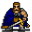
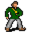

# Stoutford tavern

19×15 tiles

<label class="lg"><input type="checkbox" data-t="spawn" checked><b>Red</b>&nbsp;Monsters / NPCs</label><label class="lg"><input type="checkbox" data-t="mapchange" checked><b>Blue</b>&nbsp;Exit to another map</label><label class="lg"><input type="checkbox" data-t="container" checked><b>Yellow</b>&nbsp;Container (click to see contents)</label><label class="lg"><input type="checkbox" data-t="sign" checked><b>Purple</b>&nbsp;Sign</label><label class="lg"><input type="checkbox" data-t="rest" checked><b>Green</b>&nbsp;Resting place</label><label class="lg"><input type="checkbox" data-t="key" checked><b>Orange dashed</b>&nbsp;Blocked until a quest step / item</label><label class="lg"><input type="checkbox" data-t="script"><b>Grey dotted</b>&nbsp;Scripted event</label><label class="lg"><input type="checkbox" data-t="replace"><b>White dotted</b>&nbsp;Changes during a quest</label>

## Exits

- [Stoutford cellar2](stoutford_cellar2.md)
- [Stoutford se](stoutford_se.md)

## Monsters & NPCs here

| Name | HP |
|---|---|
| [Quiet thief](../monsters/stoutford_thief.md) | 0 |
| [Lord Berbane](../monsters/berbane.md) | 0 |
| [Burhczyd](../monsters/burhczyd5.md) | 0 |
| [Knight of Elythom](../monsters/burhczyd5e.md) | 0 |
| [Cadoren](../monsters/stoutford_cook.md) | 0 |
| [Customer](../monsters/stoutford_drinker_2.md) | 0 |
| [Customer](../monsters/stoutford_drinker_1.md) | 0 |
| [Glasforn](../monsters/stoutford_innkeeper.md) | 0 |
| [Croaklear](../monsters/stoutford_old_woman.md) | 0 |

<small>Map ID: `stoutford_tavern` · Data from v0.8.18</small>
