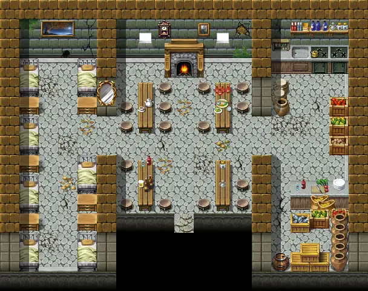

# Stoutford tavern

19×15 tiles

<label class="lg lg-spawn"><input type="checkbox" data-t="spawn" checked> Monsters / NPCs</label><label class="lg lg-mapchange"><input type="checkbox" data-t="mapchange" checked> Exit to another map</label><label class="lg lg-container"><input type="checkbox" data-t="container" checked> Container</label><label class="lg lg-sign"><input type="checkbox" data-t="sign" checked> Sign</label><label class="lg lg-rest"><input type="checkbox" data-t="rest" checked> Resting place</label><label class="lg lg-key"><input type="checkbox" data-t="key" checked> Blocked / needs key or quest</label><label class="lg lg-script"><input type="checkbox" data-t="script"> Scripted event</label><label class="lg lg-replace"><input type="checkbox" data-t="replace"> Changes after a quest</label>

## Exits

- [Stoutford cellar2](stoutford_cellar2.md)
- [Stoutford se](stoutford_se.md)

## Monsters & NPCs here

| Name | HP |
|---|---|
| [Knight of Elythom](../monsters/burhczyd5e.md) | 0 |
| [Lord Berbane](../monsters/berbane.md) | 0 |
| [Customer](../monsters/stoutford_drinker_2.md) | 0 |
| [Customer](../monsters/stoutford_drinker_1.md) | 0 |
| [Quiet thief](../monsters/stoutford_thief.md) | 0 |
| [Croaklear](../monsters/stoutford_old_woman.md) | 0 |
| [Glasforn](../monsters/stoutford_innkeeper.md) | 0 |
| [Cadoren](../monsters/stoutford_cook.md) | 0 |
| [Burhczyd](../monsters/burhczyd5.md) | 0 |

<small>Map ID: `stoutford_tavern` · Data from v0.8.18</small>
