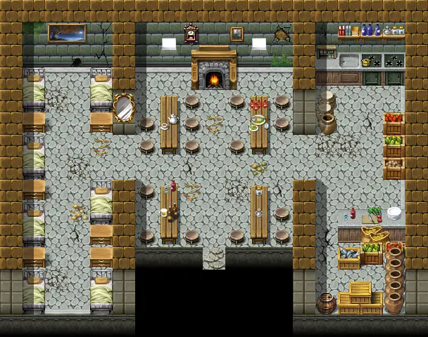
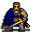
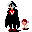
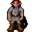
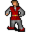
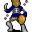

# Stoutford tavern

| | |
|---|---|
| **Map ID** | `stoutford_tavern` |
| **Region** | In Stoutford (settlement) |
| **Type** | Indoors / underground |
| **Size** | 19×15 tiles |
| **Introduced** | [v0.7.2](../versions/0.7.2.md) |
| **NPCs** | 9 |
| **Quests** | 4 |

**Stoutford tavern** is an indoor map, in Stoutford (settlement). It has 9 NPCs, and no enemies. Exits lead to Stoutford cellar2, Stoutford south-east.

## Map

<label class="lg"><input type="checkbox" data-t="spawn" checked><b>Red</b>&nbsp;Monsters / NPCs</label><label class="lg"><input type="checkbox" data-t="mapchange" checked><b>Blue</b>&nbsp;Exit to another map</label><label class="lg"><input type="checkbox" data-t="container" checked><b>Yellow</b>&nbsp;Container (click to see contents)</label><label class="lg"><input type="checkbox" data-t="sign" checked><b>Purple</b>&nbsp;Sign</label><label class="lg"><input type="checkbox" data-t="rest" checked><b>Green</b>&nbsp;Resting place</label><label class="lg"><input type="checkbox" data-t="key" checked><b>Orange dashed</b>&nbsp;Blocked until a quest step / item</label><label class="lg"><input type="checkbox" data-t="script"><b>Grey dotted</b>&nbsp;Scripted event</label><label class="lg"><input type="checkbox" data-t="replace"><b>White dotted</b>&nbsp;Changes during a quest</label><label class="lg"><input type="checkbox" data-t="pin" checked><b>Numbers</b>&nbsp;Numbered key points (see the key below the map)</label>

<a class="pin pin-exit" href="#key-1" style="left:7.895%;top:30.000%" title="Exit (west): to [Stoutford cellar2](../stoutford_cellar2.md)">1</a><a class="pin pin-exit" href="#key-2" style="left:50.000%;top:76.667%" title="Exit (exit outside): to [Stoutford south-east](../stoutford_se.md)">2</a><a class="pin pin-npc" href="#key-3" style="left:65.789%;top:70.000%" title="[Burhczyd](../../monsters/burhczyd5.md): 1 quest">3</a><a class="pin pin-npc" href="#key-4" style="left:86.842%;top:43.333%" title="[Cadoren](../../monsters/stoutford_cook.md): shopkeeper">4</a><a class="pin pin-npc" href="#key-5" style="left:44.737%;top:30.000%" title="[Croaklear](../../monsters/stoutford_old_woman.md): NPC">5</a><a class="pin pin-npc" href="#key-6" style="left:60.526%;top:50.000%" title="[Customer](../../monsters/stoutford_drinker_2.md): NPC">6</a><a class="pin pin-npc" href="#key-7" style="left:50.000%;top:46.667%" title="[Customer](../../monsters/stoutford_drinker_1.md): NPC">7</a><a class="pin pin-npc" href="#key-8" style="left:28.947%;top:50.000%" title="[Glasforn](../../monsters/stoutford_innkeeper.md): 2 quests">8</a><a class="pin pin-npc" href="#key-9" style="left:66.136%;top:65.001%" title="[Knight of Elythom](../../monsters/burhczyd5e.md): 1 quest">9</a><a class="pin pin-npc" href="#key-10" style="left:55.263%;top:30.000%" title="[Lord Berbane](../../monsters/berbane.md): 1 quest">10</a><a class="pin pin-npc" href="#key-11" style="left:34.211%;top:23.333%" title="[Quiet thief](../../monsters/stoutford_thief.md): shopkeeper, 1 quest">11</a><a class="pin pin-key" href="#key-12" style="left:5.263%;top:26.667%" title="Blocked passage: Unlocked during the quest: Rumblings (stage 30: “Glasforn, the owner of the tavern of Stoutford, admits to knowing Andor, but evades all my questions by boasting about his beds&#x27; quality.”)">12</a><a class="pin pin-rest" href="#key-13" style="left:10.550%;top:34.387%" title="Resting place: Rest here to heal and set your respawn point">13</a>

??? abstract "Key to the numbers on the map"

    | # | What | Details |
    |---|---|---|
    | 1 | Exit (west) | to [Stoutford cellar2](../stoutford_cellar2.md) |
    | 2 | Exit (exit outside) | to [Stoutford south-east](../stoutford_se.md) |
    | 3 | [Burhczyd](../monsters/burhczyd5.md) | 1 quest |
    | 4 | [Cadoren](../monsters/stoutford_cook.md) | shopkeeper |
    | 5 | [Croaklear](../monsters/stoutford_old_woman.md) | NPC |
    | 6 | [Customer](../monsters/stoutford_drinker_2.md) | NPC |
    | 7 | [Customer](../monsters/stoutford_drinker_1.md) | NPC |
    | 8 | [Glasforn](../monsters/stoutford_innkeeper.md) | 2 quests |
    | 9 | [Knight of Elythom](../monsters/burhczyd5e.md) | 1 quest |
    | 10 | [Lord Berbane](../monsters/berbane.md) | 1 quest |
    | 11 | [Quiet thief](../monsters/stoutford_thief.md) | shopkeeper, 1 quest |
    | 12 | Blocked passage | Unlocked during the quest: Rumblings (stage 30: “Glasforn, the owner of the tavern of Stoutford, admits to knowing Andor, but evades all my questions by boasting about his beds' quality.”) |
    | 13 | Resting place | Rest here to heal and set your respawn point |

Verified against v0.8.18 map data.

## Connections

| Direction | Leads to | Region there | Map # |
|---|---|---|---|
| West | [Stoutford cellar2](stoutford_cellar2.md) | Stoutford | 1 |
| Exit outside | [Stoutford south-east](stoutford_se.md) | Stoutford | 2 |

## NPCs

- [Burhczyd](../monsters/burhczyd5.md) — quests: [Young merchant](../quests/quest_burhczyd.md) (#3)
- [Cadoren](../monsters/stoutford_cook.md) — shopkeeper (#4)
- [Croaklear](../monsters/stoutford_old_woman.md) (#5)
- [Customer](../monsters/stoutford_drinker_2.md) (#6)
- [Customer](../monsters/stoutford_drinker_1.md) (#7)
- [Glasforn](../monsters/stoutford_innkeeper.md) — quests: [Rumblings](../quests/rumblings.md), [Search for Andor](../quests/andor.md) (#8)
- [Knight of Elythom](../monsters/burhczyd5e.md) — quests: [Young merchant](../quests/quest_burhczyd.md) (#9)
- [Lord Berbane](../monsters/berbane.md) — quests: [Lost girl looking for lost things](../quests/stn_quest_gyra.md) (#10)
- [Quiet thief](../monsters/stoutford_thief.md) — shopkeeper — quests: [Rumblings](../quests/rumblings.md) (#11)

## Items & containers

**Shops:** [Cadoren](../monsters/stoutford_cook.md), [Quiet thief](../monsters/stoutford_thief.md)

## Quests

- [Lost girl looking for lost things](../quests/stn_quest_gyra.md): [Lord Berbane](../monsters/berbane.md) is involved
- [Rumblings](../quests/rumblings.md): [Glasforn](../monsters/stoutford_innkeeper.md) is involved; [Quiet thief](../monsters/stoutford_thief.md) is involved; blocked passage opens at stage 30
- [Search for Andor](../quests/andor.md): [Glasforn](../monsters/stoutford_innkeeper.md) is involved
- [Young merchant](../quests/quest_burhczyd.md): [Burhczyd](../monsters/burhczyd5.md) is involved; [Knight of Elythom](../monsters/burhczyd5e.md) is involved
- [Placeholder for hidden quest stages (not displayed) (hidden flag)](../quests/nondisplay.md): [Lord Berbane](../monsters/berbane.md) is involved
- [stn_nondisplay (hidden flag)](../quests/stn_nondisplay.md): [Lord Berbane](../monsters/berbane.md) is involved
- [Young merchant Non-displayed (hidden flag)](../quests/quest_burhczyd_nd.md): [Burhczyd](../monsters/burhczyd5.md) is involved; [Knight of Elythom](../monsters/burhczyd5e.md) is involved

## Points of interest

- **Blocked passage** (#12): Unlocked during the quest: Rumblings (stage 30: “Glasforn, the owner of the tavern of Stoutford, admits to knowing Andor, but evades all my questions by boasting about his beds' quality.”)
- **Resting place** (#13): Rest here to heal and set your respawn point

## Version history

| Version | Change |
|---|---|
| [v0.7.2](../versions/0.7.2.md) | Added |
| [v0.7.8](../versions/0.7.8.md) | map layout or objects changed |
| [v0.7.11](../versions/0.7.11.md) | map layout or objects changed |

Verified against v0.8.18 and every earlier release back to v0.7.0 (game data compared release by release).

## Community notes

<small>Written by players, not generated from game data. **Observations**: what players notice in-game · **Lore**: the in-world story · **Trivia**: real-world facts, references, development history · **Theory / speculation**: unconfirmed ideas; may just be unfinished content</small>

### Observations

*Nothing here yet. Know something? [Add it](https://github.com/asdfghjkl628/Andor-s-Trail-Wikiiii/new/main/notes/maps?filename=stoutford_tavern.md&value=%23%23%20Observations%0A%0A%3C%21--%20what%20players%20notice%20in-game%20--%3E%0A%0A%23%23%20Lore%0A%0A%3C%21--%20the%20in-world%20story%20--%3E%0A%0A%23%23%20Trivia%0A%0A%3C%21--%20real-world%20facts%2C%20references%2C%20development%20history%20--%3E%0A%0A%23%23%20Theory%20/%20speculation%0A%0A%3C%21--%20unconfirmed%20ideas%3B%20may%20just%20be%20unfinished%20content%20--%3E%0A).*

### Lore

*Nothing here yet. Know something? [Add it](https://github.com/asdfghjkl628/Andor-s-Trail-Wikiiii/new/main/notes/maps?filename=stoutford_tavern.md&value=%23%23%20Observations%0A%0A%3C%21--%20what%20players%20notice%20in-game%20--%3E%0A%0A%23%23%20Lore%0A%0A%3C%21--%20the%20in-world%20story%20--%3E%0A%0A%23%23%20Trivia%0A%0A%3C%21--%20real-world%20facts%2C%20references%2C%20development%20history%20--%3E%0A%0A%23%23%20Theory%20/%20speculation%0A%0A%3C%21--%20unconfirmed%20ideas%3B%20may%20just%20be%20unfinished%20content%20--%3E%0A).*

### Trivia

*Nothing here yet. Know something? [Add it](https://github.com/asdfghjkl628/Andor-s-Trail-Wikiiii/new/main/notes/maps?filename=stoutford_tavern.md&value=%23%23%20Observations%0A%0A%3C%21--%20what%20players%20notice%20in-game%20--%3E%0A%0A%23%23%20Lore%0A%0A%3C%21--%20the%20in-world%20story%20--%3E%0A%0A%23%23%20Trivia%0A%0A%3C%21--%20real-world%20facts%2C%20references%2C%20development%20history%20--%3E%0A%0A%23%23%20Theory%20/%20speculation%0A%0A%3C%21--%20unconfirmed%20ideas%3B%20may%20just%20be%20unfinished%20content%20--%3E%0A).*

### Theory / speculation

*Nothing here yet. Know something? [Add it](https://github.com/asdfghjkl628/Andor-s-Trail-Wikiiii/new/main/notes/maps?filename=stoutford_tavern.md&value=%23%23%20Observations%0A%0A%3C%21--%20what%20players%20notice%20in-game%20--%3E%0A%0A%23%23%20Lore%0A%0A%3C%21--%20the%20in-world%20story%20--%3E%0A%0A%23%23%20Trivia%0A%0A%3C%21--%20real-world%20facts%2C%20references%2C%20development%20history%20--%3E%0A%0A%23%23%20Theory%20/%20speculation%0A%0A%3C%21--%20unconfirmed%20ideas%3B%20may%20just%20be%20unfinished%20content%20--%3E%0A).*

??? info "Technical information"

    | | |
    |---|---|
    | Map ID | `stoutford_tavern` |
    | File | `res/xml/stoutford_tavern.tmx` |
    | Size | 19×15 tiles (608×480 px) |
    | outdoors property | – |
    | Layers drawn | ground, objects, above |
    | Tilesets | map_bed_1, map_border_1, map_bridge_1, map_bridge_2, map_broken_1, map_cavewall_1, map_cavewall_2, map_cavewall_3, map_cavewall_4, map_chair_table_1, map_chair_table_2, map_crate_1, map_cupboard_1, map_curtain_1, map_entrance_1, map_entrance_2, map_fence_1, map_fence_2, map_fence_3, map_fence_4, map_ground_1, map_ground_2, map_ground_3, map_ground_4, map_ground_5, map_ground_6, map_ground_7, map_ground_8, map_house_1, map_house_2, map_indoor_1, map_indoor_2, map_kitchen_1, map_outdoor_1, map_pillar_1, map_pillar_2, map_plant_1, map_plant_2, map_rock_1, map_rock_2, map_roof_1, map_roof_2, map_roof_3, map_shop_1, map_sign_ladder_1, map_table_1, map_trail_1, map_transition_1, map_transition_2, map_transition_3, map_transition_4, map_transition_5, map_tree_1, map_tree_2, map_wall_1, map_wall_2, map_wall_3, map_wall_4, map_window_1, map_window_2 |
    | Map objects | spawn: 8, mapchange: 2, key: 1, rest: 1 |
    | World map position | – |

<small>Data from v0.8.18</small>
