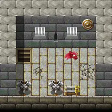

# Stoutford tower4

7×7 tiles

<label class="lg"><input type="checkbox" data-t="spawn" checked><b>Red</b>&nbsp;Monsters / NPCs</label><label class="lg"><input type="checkbox" data-t="mapchange" checked><b>Blue</b>&nbsp;Exit to another map</label><label class="lg"><input type="checkbox" data-t="container" checked><b>Yellow</b>&nbsp;Container (click to see contents)</label><label class="lg"><input type="checkbox" data-t="sign" checked><b>Purple</b>&nbsp;Sign</label><label class="lg"><input type="checkbox" data-t="rest" checked><b>Green</b>&nbsp;Resting place</label><label class="lg"><input type="checkbox" data-t="key" checked><b>Orange dashed</b>&nbsp;Blocked until a quest step / item</label><label class="lg"><input type="checkbox" data-t="script"><b>Grey dotted</b>&nbsp;Scripted event</label><label class="lg"><input type="checkbox" data-t="replace"><b>White dotted</b>&nbsp;Changes during a quest</label>

## Exits

- [Stoutford tower3](stoutford_tower3.md)

## Monsters & NPCs here

| Name | HP |
|---|---|
| [Stoutford guard](../monsters/stoutford_guard4.md) | 0 |
| [Gyra](../monsters/stn_gyra1.md) | 0 |
| [Erwyn's soldier](../monsters/erwyn_soldier.md) | 65 |

<small>Map ID: `stoutford_tower4` · Data from v0.8.18</small>
