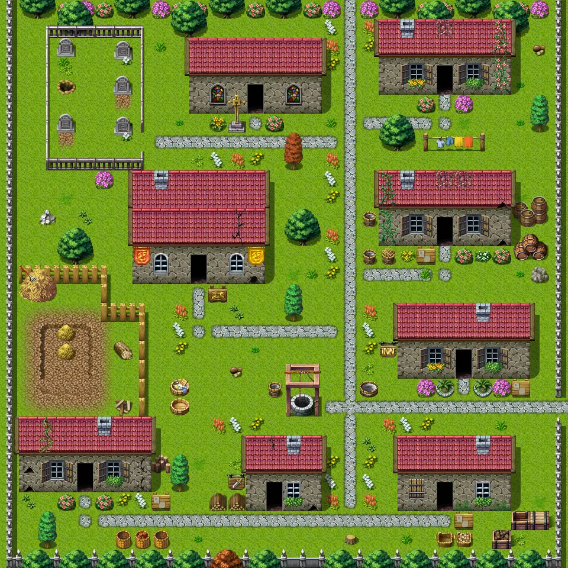

# Sullengard1

30×30 tiles · outdoors · part of [World1](index.md)

<label class="lg lg-spawn"><input type="checkbox" data-t="spawn" checked> Monsters / NPCs</label><label class="lg lg-mapchange"><input type="checkbox" data-t="mapchange" checked> Exit to another map</label><label class="lg lg-container"><input type="checkbox" data-t="container" checked> Container</label><label class="lg lg-sign"><input type="checkbox" data-t="sign" checked> Sign</label><label class="lg lg-rest"><input type="checkbox" data-t="rest" checked> Resting place</label><label class="lg lg-key"><input type="checkbox" data-t="key" checked> Blocked / needs key or quest</label><label class="lg lg-script"><input type="checkbox" data-t="script"> Scripted event</label><label class="lg lg-replace"><input type="checkbox" data-t="replace"> Changes after a quest</label>

## Exits

- [Sullengard1 aunts house](sullengard1_aunts_house.md)
- [Sullengard1 northeast house](sullengard1_northeast_house.md)
- [Sullengard1 southeast house](sullengard1_southeast_house.md)
- [Sullengard1 southwest house](sullengard1_southwest_house.md)
- [Sullengard1 townhall](sullengard1_townhall.md)
- [Sullengard2](sullengard2.md)
- [Sullengard5](sullengard5.md)
- [Sullengard church](sullengard_church.md)
- [Sullengard inn](sullengard_inn.md)
- [Sullengard weapon shop](sullengard_weapon_shop.md)

## Monsters & NPCs here

| Name | HP |
|---|---|
| [Lindauer](../monsters/sullengard_cat_seeker.md) | 0 |
| [Frosty](../monsters/sullengard_cat.md) | 0 |
| [Local citizen](../monsters/sullengard_citizen.md) | 0 |
| [Pig](../monsters/pig.md) | 0 |

<small>Map ID: `sullengard1` · Data from v0.8.18</small>
