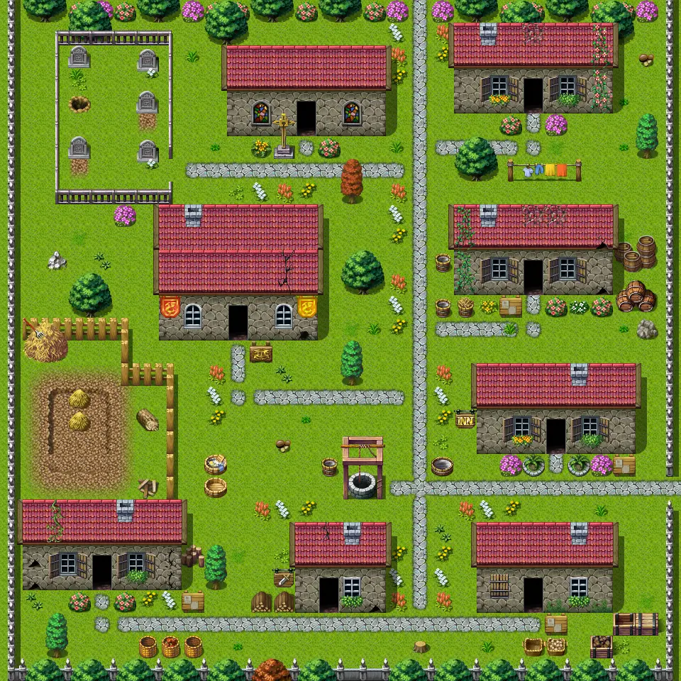
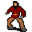

# Sullengard1

| | |
|---|---|
| **Map ID** | `sullengard1` |
| **Region** | Near Sullengard (settlement) |
| **Type** | Outdoors |
| **Size** | 30×30 tiles |
| **World map** | [World1](index.md) |
| **Introduced** | [v0.8.2](../versions/0.8.2.md) |
| **NPCs** | 4 |
| **Quests** | 0 |

**Sullengard1** is an outdoor map, near Sullengard (settlement). It has 4 NPCs, and no enemies. Exits lead to Sullengard2, Sullengard5, Sullengard1 aunts house, Sullengard1 northeast house and 6 more.

## Map

<label class="lg"><input type="checkbox" data-t="spawn" checked><b>Red</b>&nbsp;Monsters / NPCs</label><label class="lg"><input type="checkbox" data-t="mapchange" checked><b>Blue</b>&nbsp;Exit to another map</label><label class="lg"><input type="checkbox" data-t="container" checked><b>Yellow</b>&nbsp;Container (click to see contents)</label><label class="lg"><input type="checkbox" data-t="sign" checked><b>Purple</b>&nbsp;Sign</label><label class="lg"><input type="checkbox" data-t="rest" checked><b>Green</b>&nbsp;Resting place</label><label class="lg"><input type="checkbox" data-t="key" checked><b>Orange dashed</b>&nbsp;Blocked until a quest step / item</label><label class="lg"><input type="checkbox" data-t="script"><b>Grey dotted</b>&nbsp;Scripted event</label><label class="lg"><input type="checkbox" data-t="replace"><b>White dotted</b>&nbsp;Changes during a quest</label><label class="lg"><input type="checkbox" data-t="pin" checked><b>Numbers</b>&nbsp;Numbered key points (see the key below the map)</label>

<a class="pin pin-exit" href="#key-1" style="left:61.667%;top:1.667%" title="Exit (north): to [Sullengard2](sullengard2.md)">1</a><a class="pin pin-exit" href="#key-2" style="left:98.333%;top:71.667%" title="Exit (east): to [Sullengard5](sullengard5.md)">2</a><a class="pin pin-exit" href="#key-3" style="left:78.333%;top:15.000%" title="Exit (door): to [Sullengard1 aunts house](sullengard1_aunts_house.md)">3</a><a class="pin pin-exit" href="#key-4" style="left:78.333%;top:41.667%" title="Exit (door): to [Sullengard1 northeast house](sullengard1_northeast_house.md)">4</a><a class="pin pin-exit" href="#key-5" style="left:78.333%;top:88.333%" title="Exit (door): to [Sullengard1 southeast house](sullengard1_southeast_house.md)">5</a><a class="pin pin-exit" href="#key-6" style="left:15.000%;top:85.000%" title="Exit (door): to [Sullengard1 southwest house](sullengard1_southwest_house.md)">6</a><a class="pin pin-exit" href="#key-7" style="left:35.000%;top:48.333%" title="Exit (door): to [Sullengard1 townhall](sullengard1_townhall.md)">7</a><a class="pin pin-exit" href="#key-8" style="left:45.000%;top:18.333%" title="Exit (door): to [Sullengard church](sullengard_church.md)">8</a><a class="pin pin-exit" href="#key-9" style="left:81.667%;top:65.000%" title="Exit (door): to [Sullengard inn](sullengard_inn.md)">9</a><a class="pin pin-exit" href="#key-10" style="left:48.333%;top:88.333%" title="Exit (door): to [Sullengard weapon shop](sullengard_weapon_shop.md)">10</a><a id="pin-npc-sullengard_cat" class="pin pin-npc" href="#key-11" style="left:95.000%;top:95.000%" title="[Frosty](../../monsters/sullengard_cat.md): NPC">11</a><a id="pin-npc-sullengard_cat_seeker" class="pin pin-npc" href="#key-12" style="left:38.333%;top:81.667%" title="[Lindauer](../../monsters/sullengard_cat_seeker.md): NPC">12</a><a id="pin-npc-sullengard_citizen" class="pin pin-npc" href="#key-13" style="left:58.333%;top:71.667%" title="[Local citizen](../../monsters/sullengard_citizen.md): NPC">13</a><a id="pin-npc-pig" class="pin pin-npc" href="#key-14" style="left:8.333%;top:61.667%" title="[Pig](../../monsters/pig.md): NPC">14</a><a class="pin pin-sign" href="#key-15" style="left:28.333%;top:88.333%" title="Sign: “Welcome to the Bruyere family home, five-time winners of the &#x27;Best beer in festival&#x27; competition.”">15</a><a class="pin pin-sign" href="#key-16" style="left:81.667%;top:91.667%" title="Sign: “Welcome to the Briwerra family home, three-time winners of the &#x27;Best beer in festival&#x27; competition.”">16</a><a class="pin pin-sign" href="#key-17" style="left:75.000%;top:45.000%" title="Sign: “Welcome to the Brueria family home, four-time winners of the &#x27;Best beer in festival&#x27; competition.”">17</a><a class="pin pin-sign" href="#key-18" style="left:11.667%;top:11.667%" title="Sign: “Diramisk was right, the drink didn&#x27;t kill him...it was the fall.”">18</a><a class="pin pin-sign" href="#key-19" style="left:21.667%;top:11.667%" title="Sign: “[This gravestone has been heavily scratched. It appears someone really wanted to obscure the inscription.]”">19</a><a class="pin pin-sign" href="#key-20" style="left:21.667%;top:18.333%" title="Sign: “Erlumvu: A beloved wife and loyal drinking companion.”">20</a><a class="pin pin-sign" href="#key-21" style="left:11.667%;top:25.000%" title="Sign: “Bosworth&#x27;s last words: &quot;The last one is on me boys!&quot;”">21</a><a class="pin pin-sign" href="#key-22" style="left:21.667%;top:25.000%" title="Sign: “Here lies Stout. Faster than the wind, dumber than a stump.”">22</a><a class="pin pin-sign" href="#key-23" style="left:91.667%;top:68.333%" title="Sign: “Welcome to Sullengard, the home of the best beer in Dhayavar. Please enjoy our upcoming 20th anniversary beer festival.”">23</a><a class="pin pin-sign" href="#key-24" style="left:38.333%;top:51.667%" title="Sign: “Welcome to the Sullengard townhall. Please come on in.”">24</a>

??? abstract "Key to the numbers on the map"

    | # | What | Details |
    |---|---|---|
    | 1 | Exit (north) | to [Sullengard2](sullengard2.md) |
    | 2 | Exit (east) | to [Sullengard5](sullengard5.md) |
    | 3 | Exit (door) | to [Sullengard1 aunts house](sullengard1_aunts_house.md) |
    | 4 | Exit (door) | to [Sullengard1 northeast house](sullengard1_northeast_house.md) |
    | 5 | Exit (door) | to [Sullengard1 southeast house](sullengard1_southeast_house.md) |
    | 6 | Exit (door) | to [Sullengard1 southwest house](sullengard1_southwest_house.md) |
    | 7 | Exit (door) | to [Sullengard1 townhall](sullengard1_townhall.md) |
    | 8 | Exit (door) | to [Sullengard church](sullengard_church.md) |
    | 9 | Exit (door) | to [Sullengard inn](sullengard_inn.md) |
    | 10 | Exit (door) | to [Sullengard weapon shop](sullengard_weapon_shop.md) |
    | 11 | [Frosty](../monsters/sullengard_cat.md) | NPC |
    | 12 | [Lindauer](../monsters/sullengard_cat_seeker.md) | NPC |
    | 13 | [Local citizen](../monsters/sullengard_citizen.md) | NPC |
    | 14 | [Pig](../monsters/pig.md) | NPC |
    | 15 | Sign | “Welcome to the Bruyere family home, five-time winners of the 'Best beer in festival' competition.” |
    | 16 | Sign | “Welcome to the Briwerra family home, three-time winners of the 'Best beer in festival' competition.” |
    | 17 | Sign | “Welcome to the Brueria family home, four-time winners of the 'Best beer in festival' competition.” |
    | 18 | Sign | “Diramisk was right, the drink didn't kill him...it was the fall.” |
    | 19 | Sign | “[This gravestone has been heavily scratched. It appears someone really wanted to obscure the inscription.]” |
    | 20 | Sign | “Erlumvu: A beloved wife and loyal drinking companion.” |
    | 21 | Sign | “Bosworth's last words: "The last one is on me boys!"” |
    | 22 | Sign | “Here lies Stout. Faster than the wind, dumber than a stump.” |
    | 23 | Sign | “Welcome to Sullengard, the home of the best beer in Dhayavar. Please enjoy our upcoming 20th anniversary beer festival.” |
    | 24 | Sign | “Welcome to the Sullengard townhall. Please come on in.” |

Verified against v0.8.18 map data.

## Connections

| Direction | Leads to | Region there | Map # |
|---|---|---|---|
| North | [Sullengard2](sullengard2.md) | Sullengard | 1 |
| East | [Sullengard5](sullengard5.md) | Sullengard | 2 |
| Door | [Sullengard1 aunts house](sullengard1_aunts_house.md) | Sullengard | 3 |
| Door | [Sullengard1 northeast house](sullengard1_northeast_house.md) | Sullengard | 4 |
| Door | [Sullengard1 southeast house](sullengard1_southeast_house.md) | Sullengard | 5 |
| Door | [Sullengard1 southwest house](sullengard1_southwest_house.md) | Sullengard | 6 |
| Door | [Sullengard1 townhall](sullengard1_townhall.md) | Sullengard | 7 |
| Door | [Sullengard church](sullengard_church.md) | Sullengard | 8 |
| Door | [Sullengard inn](sullengard_inn.md) | Sullengard | 9 |
| Door | [Sullengard weapon shop](sullengard_weapon_shop.md) | Sullengard | 10 |

## NPCs

- [Frosty](../monsters/sullengard_cat.md) (#11)
- [Lindauer](../monsters/sullengard_cat_seeker.md) (#12)
- [Local citizen](../monsters/sullengard_citizen.md) (#13)
- [Pig](../monsters/pig.md) (#14)

## Quests

- [sullengard_nondisplay (hidden flag)](../quests/sullengard_hidden.md): [Frosty](../monsters/sullengard_cat.md) is involved

## Points of interest

- **Sign** (#15): “Welcome to the Bruyere family home, five-time winners of the 'Best beer in festival' competition.”
- **Sign** (#16): “Welcome to the Briwerra family home, three-time winners of the 'Best beer in festival' competition.”
- **Sign** (#17): “Welcome to the Brueria family home, four-time winners of the 'Best beer in festival' competition.”
- **Sign** (#18): “Diramisk was right, the drink didn't kill him...it was the fall.”
- **Sign** (#19): “[This gravestone has been heavily scratched. It appears someone really wanted to obscure the inscription.]”
- **Sign** (#20): “Erlumvu: A beloved wife and loyal drinking companion.”
- **Sign** (#21): “Bosworth's last words: "The last one is on me boys!"”
- **Sign** (#22): “Here lies Stout. Faster than the wind, dumber than a stump.”
- **Sign** (#23): “Welcome to Sullengard, the home of the best beer in Dhayavar. Please enjoy our upcoming 20th anniversary beer festival.”
- **Sign** (#24): “Welcome to the Sullengard townhall. Please come on in.”

## Version history

| Version | Change |
|---|---|
| [v0.8.2](../versions/0.8.2.md) | Added |

Verified against v0.8.18 and every earlier release back to v0.7.0 (game data compared release by release).

## Community notes

<small>Written by players, not generated from game data. **Observations**: what players notice in-game · **Lore**: the in-world story · **Trivia**: real-world facts, references, development history · **Theory / speculation**: unconfirmed ideas; may just be unfinished content</small>

### Observations

*No notes yet. Contributions are welcome: [add a note](https://github.com/asdfghjkl628/Andor-s-Trail-Wikiiii/new/main/notes/maps?filename=sullengard1.md&value=%23%23%20Observations%0A%0A%3C%21--%20what%20players%20notice%20in-game%20--%3E%0A%0A%23%23%20Lore%0A%0A%3C%21--%20the%20in-world%20story%20--%3E%0A%0A%23%23%20Trivia%0A%0A%3C%21--%20real-world%20facts%2C%20references%2C%20development%20history%20--%3E%0A%0A%23%23%20Theory%20/%20speculation%0A%0A%3C%21--%20unconfirmed%20ideas%3B%20may%20just%20be%20unfinished%20content%20--%3E%0A).*

### Lore

*No notes yet. Contributions are welcome: [add a note](https://github.com/asdfghjkl628/Andor-s-Trail-Wikiiii/new/main/notes/maps?filename=sullengard1.md&value=%23%23%20Observations%0A%0A%3C%21--%20what%20players%20notice%20in-game%20--%3E%0A%0A%23%23%20Lore%0A%0A%3C%21--%20the%20in-world%20story%20--%3E%0A%0A%23%23%20Trivia%0A%0A%3C%21--%20real-world%20facts%2C%20references%2C%20development%20history%20--%3E%0A%0A%23%23%20Theory%20/%20speculation%0A%0A%3C%21--%20unconfirmed%20ideas%3B%20may%20just%20be%20unfinished%20content%20--%3E%0A).*

### Trivia

*No notes yet. Contributions are welcome: [add a note](https://github.com/asdfghjkl628/Andor-s-Trail-Wikiiii/new/main/notes/maps?filename=sullengard1.md&value=%23%23%20Observations%0A%0A%3C%21--%20what%20players%20notice%20in-game%20--%3E%0A%0A%23%23%20Lore%0A%0A%3C%21--%20the%20in-world%20story%20--%3E%0A%0A%23%23%20Trivia%0A%0A%3C%21--%20real-world%20facts%2C%20references%2C%20development%20history%20--%3E%0A%0A%23%23%20Theory%20/%20speculation%0A%0A%3C%21--%20unconfirmed%20ideas%3B%20may%20just%20be%20unfinished%20content%20--%3E%0A).*

### Theory / speculation

*No notes yet. Contributions are welcome: [add a note](https://github.com/asdfghjkl628/Andor-s-Trail-Wikiiii/new/main/notes/maps?filename=sullengard1.md&value=%23%23%20Observations%0A%0A%3C%21--%20what%20players%20notice%20in-game%20--%3E%0A%0A%23%23%20Lore%0A%0A%3C%21--%20the%20in-world%20story%20--%3E%0A%0A%23%23%20Trivia%0A%0A%3C%21--%20real-world%20facts%2C%20references%2C%20development%20history%20--%3E%0A%0A%23%23%20Theory%20/%20speculation%0A%0A%3C%21--%20unconfirmed%20ideas%3B%20may%20just%20be%20unfinished%20content%20--%3E%0A).*

??? info "Technical information"

    | | |
    |---|---|
    | Map ID | `sullengard1` |
    | File | `res/xml/sullengard1.tmx` |
    | Size | 30×30 tiles (960×960 px) |
    | outdoors property | 1 |
    | Layers drawn | base, ground, objects, above, top |
    | Tilesets | map_bed_1, map_border_1, map_bridge_1, map_bridge_2, map_broken_1, map_cavewall_1, map_cavewall_2, map_cavewall_3, map_cavewall_4, map_chair_table_1, map_chair_table_2, map_crate_1, map_cupboard_1, map_curtain_1, map_entrance_1, map_entrance_2, map_fence_1, map_fence_2, map_fence_3, map_fence_4, map_ground_1, map_ground_2, map_ground_3, map_ground_4, map_ground_5, map_ground_6, map_ground_7, map_ground_8, map_house_1, map_house_2, map_indoor_1, map_indoor_2, map_kitchen_1, map_outdoor_1, map_pillar_1, map_pillar_2, map_plant_1, map_plant_2, map_rock_1, map_rock_2, map_roof_1, map_roof_2, map_roof_3, map_shop_1, map_sign_ladder_1, map_table_1, map_trail_1, map_transition_1, map_transition_2, map_transition_3, map_transition_4, map_transition_5, map_tree_1, map_tree_2, map_wall_1, map_wall_2, map_wall_3, map_wall_4, map_window_1, map_window_2 |
    | Map objects | mapchange: 10, sign: 10, spawn: 4 |
    | World map position | segment `world1`, x 322, y 655 |

<small>Data from v0.8.18</small>
