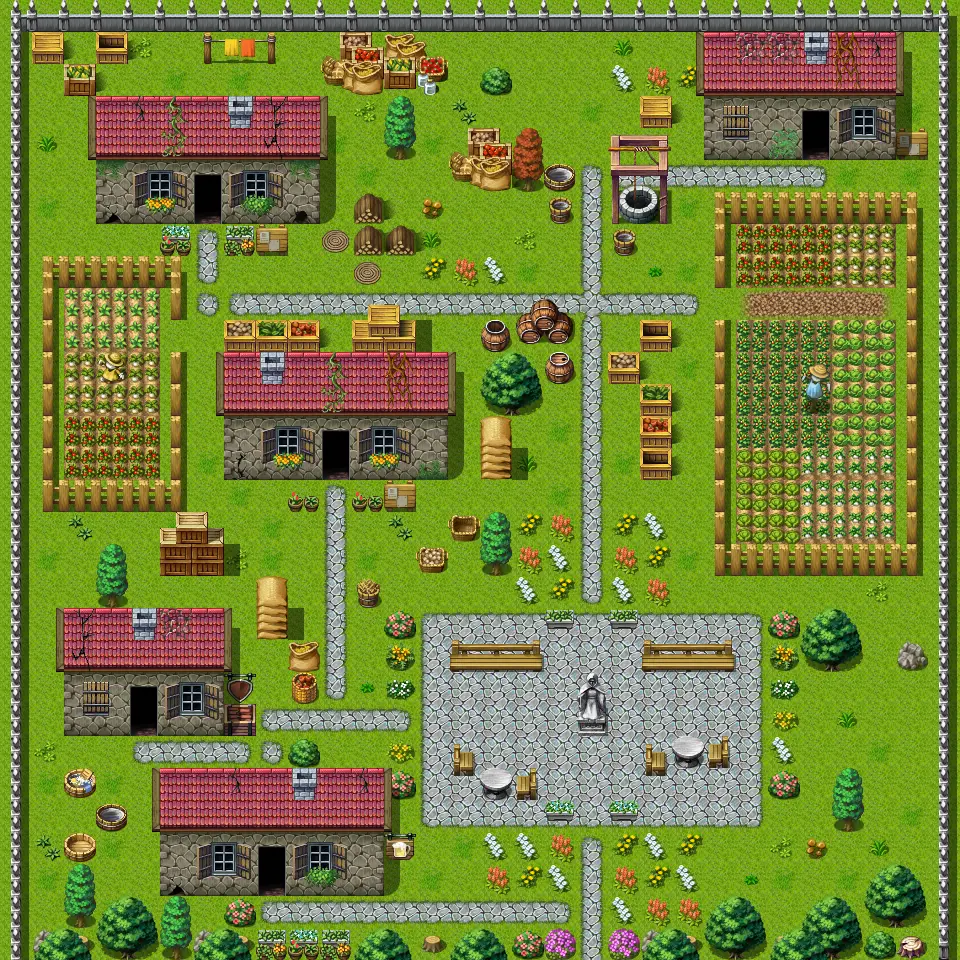
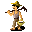
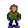

# Sullengard2

30×30 tiles · outdoors · part of [World1](index.md)

<label class="lg"><input type="checkbox" data-t="spawn" checked><b>Red</b>&nbsp;Monsters / NPCs</label><label class="lg"><input type="checkbox" data-t="mapchange" checked><b>Blue</b>&nbsp;Exit to another map</label><label class="lg"><input type="checkbox" data-t="container" checked><b>Yellow</b>&nbsp;Container (click to see contents)</label><label class="lg"><input type="checkbox" data-t="sign" checked><b>Purple</b>&nbsp;Sign</label><label class="lg"><input type="checkbox" data-t="rest" checked><b>Green</b>&nbsp;Resting place</label><label class="lg"><input type="checkbox" data-t="key" checked><b>Orange dashed</b>&nbsp;Blocked until a quest step / item</label><label class="lg"><input type="checkbox" data-t="script"><b>Grey dotted</b>&nbsp;Scripted event</label><label class="lg"><input type="checkbox" data-t="replace"><b>White dotted</b>&nbsp;Changes during a quest</label>

## Exits

- [Sullengard1](sullengard1.md)
- [Sullengard2 armory](sullengard2_armory.md)
- [Sullengard2 garden house](sullengard2_garden_house.md)
- [Sullengard2 northeast house](sullengard2_northeast_house.md)
- [Sullengard2 northwest house](sullengard2_northwest_house.md)
- [Sullengard tavern](sullengard_tavern.md)

## Monsters & NPCs here

| Name | HP |
|---|---|
| [Hamerick](../monsters/sullengard_hamerick.md) | 0 |
| [Gwinnett](../monsters/sullengard_courtyard_girl.md) | 0 |
| [Curwen](../monsters/sullengard_courtyard_boy.md) | 0 |

<small>Map ID: `sullengard2` · Data from v0.8.18</small>
