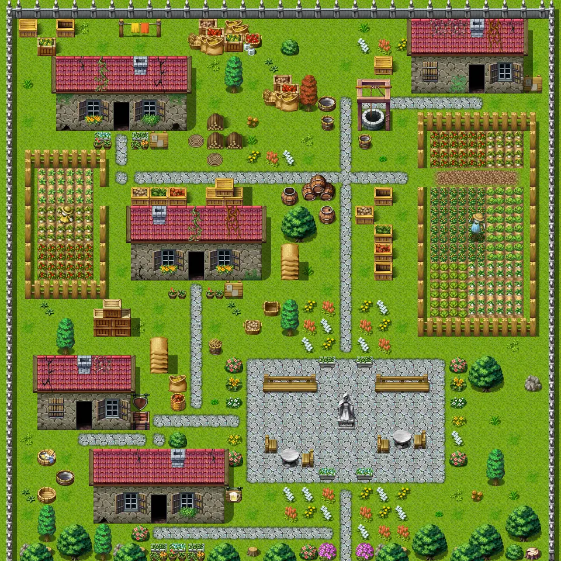

# Sullengard2

| | |
|---|---|
| **Map ID** | `sullengard2` |
| **Region** | In Sullengard (settlement) |
| **Type** | Outdoors |
| **Size** | 30×30 tiles |
| **World map** | [World1](index.md) |
| **Introduced** | [v0.8.2](../versions/0.8.2.md) |
| **NPCs** | 3 |
| **Quests** | 2 |

**Sullengard2** is an outdoor map, in Sullengard (settlement). It has 3 NPCs, and no enemies. Exits lead to Sullengard1, Sullengard2 armory, Sullengard2 garden house, Sullengard2 northeast house and 2 more.

## Map

<label class="lg"><input type="checkbox" data-t="spawn" checked><b>Red</b>&nbsp;Monsters / NPCs</label><label class="lg"><input type="checkbox" data-t="mapchange" checked><b>Blue</b>&nbsp;Exit to another map</label><label class="lg"><input type="checkbox" data-t="container" checked><b>Yellow</b>&nbsp;Container (click to see contents)</label><label class="lg"><input type="checkbox" data-t="sign" checked><b>Purple</b>&nbsp;Sign</label><label class="lg"><input type="checkbox" data-t="rest" checked><b>Green</b>&nbsp;Resting place</label><label class="lg"><input type="checkbox" data-t="key" checked><b>Orange dashed</b>&nbsp;Blocked until a quest step / item</label><label class="lg"><input type="checkbox" data-t="script"><b>Grey dotted</b>&nbsp;Scripted event</label><label class="lg"><input type="checkbox" data-t="replace"><b>White dotted</b>&nbsp;Changes during a quest</label><label class="lg"><input type="checkbox" data-t="pin" checked><b>Numbers</b>&nbsp;Numbered key points (see the key below the map)</label>

<a class="pin pin-exit" href="#key-1" style="left:61.667%;top:98.333%" title="Exit (south): to [Sullengard1](../sullengard1.md)">1</a><a class="pin pin-exit" href="#key-2" style="left:15.000%;top:75.000%" title="Exit (door): to [Sullengard2 armory](../sullengard2_armory.md)">2</a><a class="pin pin-exit" href="#key-3" style="left:35.000%;top:48.333%" title="Exit (door): to [Sullengard2 garden house](../sullengard2_garden_house.md)">3</a><a class="pin pin-exit" href="#key-4" style="left:85.000%;top:15.000%" title="Exit (door): to [Sullengard2 northeast house](../sullengard2_northeast_house.md)">4</a><a class="pin pin-exit" href="#key-5" style="left:21.667%;top:21.667%" title="Exit (door): to [Sullengard2 northwest house](../sullengard2_northwest_house.md)">5</a><a class="pin pin-exit" href="#key-6" style="left:28.333%;top:91.667%" title="Exit (door): to [Sullengard tavern](../sullengard_tavern.md)">6</a><a class="pin pin-npc" href="#key-7" style="left:48.333%;top:65.000%" title="[Curwen](../../monsters/sullengard_courtyard_boy.md): NPC">7</a><a class="pin pin-npc" href="#key-8" style="left:75.000%;top:71.667%" title="[Gwinnett](../../monsters/sullengard_courtyard_girl.md): NPC">8</a><a class="pin pin-npc" href="#key-9" style="left:75.000%;top:31.667%" title="[Hamerick](../../monsters/sullengard_hamerick.md): NPC">9</a><a class="pin pin-sign" href="#key-10" style="left:41.667%;top:51.667%" title="Sign: “Welcome to the Brewere family home, five-time winners of the &#x27;Best beer in festival&#x27; competition.”">10</a><a class="pin pin-sign" href="#key-11" style="left:28.333%;top:25.000%" title="Sign: “Welcome to the Biermann family home, two-time winners of the &#x27;Best beer in festival&#x27; competition.”">11</a><a class="pin pin-sign" href="#key-12" style="left:95.000%;top:15.000%" title="Sign: “Welcome to the Bierington family home.”">12</a><a class="pin pin-script" href="#key-13" style="left:28.333%;top:95.000%" title="Quest trigger: Scripted event: advances the quest: hidden story flag “quest_burhczyd_nd” to stage 511 (“511=show oven in Sullengard”)">13</a><a class="pin pin-key" href="#key-14" style="left:61.667%;top:75.000%" title="Blocked passage: Closed off once you reach this point in the quest: Search for Andor (stage 1: “My father Mikhail says that Andor has not been home since yesterday. I should go look for him in the village.”)">14</a>

??? abstract "Key to the numbers on the map"

    | # | What | Details |
    |---|---|---|
    | 1 | Exit (south) | to [Sullengard1](../sullengard1.md) |
    | 2 | Exit (door) | to [Sullengard2 armory](../sullengard2_armory.md) |
    | 3 | Exit (door) | to [Sullengard2 garden house](../sullengard2_garden_house.md) |
    | 4 | Exit (door) | to [Sullengard2 northeast house](../sullengard2_northeast_house.md) |
    | 5 | Exit (door) | to [Sullengard2 northwest house](../sullengard2_northwest_house.md) |
    | 6 | Exit (door) | to [Sullengard tavern](../sullengard_tavern.md) |
    | 7 | [Curwen](../monsters/sullengard_courtyard_boy.md) | NPC |
    | 8 | [Gwinnett](../monsters/sullengard_courtyard_girl.md) | NPC |
    | 9 | [Hamerick](../monsters/sullengard_hamerick.md) | NPC |
    | 10 | Sign | “Welcome to the Brewere family home, five-time winners of the 'Best beer in festival' competition.” |
    | 11 | Sign | “Welcome to the Biermann family home, two-time winners of the 'Best beer in festival' competition.” |
    | 12 | Sign | “Welcome to the Bierington family home.” |
    | 13 | Quest trigger | Scripted event: advances the quest: hidden story flag “quest_burhczyd_nd” to stage 511 (“511=show oven in Sullengard”) |
    | 14 | Blocked passage | Closed off once you reach this point in the quest: Search for Andor (stage 1: “My father Mikhail says that Andor has not been home since yesterday. I should go look for him in the village.”) |

Verified against v0.8.18 map data.

## Connections

| Direction | Leads to | Region there | Map # |
|---|---|---|---|
| South | [Sullengard1](sullengard1.md) | Sullengard | 1 |
| Door | [Sullengard2 armory](sullengard2_armory.md) | Sullengard | 2 |
| Door | [Sullengard2 garden house](sullengard2_garden_house.md) | Sullengard | 3 |
| Door | [Sullengard2 northeast house](sullengard2_northeast_house.md) | Sullengard | 4 |
| Door | [Sullengard2 northwest house](sullengard2_northwest_house.md) | Sullengard | 5 |
| Door | [Sullengard tavern](sullengard_tavern.md) | Sullengard | 6 |

## NPCs

- [Curwen](../monsters/sullengard_courtyard_boy.md) (#7)
- [Gwinnett](../monsters/sullengard_courtyard_girl.md) (#8)
- [Hamerick](../monsters/sullengard_hamerick.md) (#9)

## Quests

- [Devotion](../quests/devotion.md): something on this map advances it
- [Search for Andor](../quests/andor.md): blocked passage closes at stage 1
- [Young merchant Non-displayed (hidden flag)](../quests/quest_burhczyd_nd.md): something on this map advances it; stepping on a trigger here sets stage 511

## Points of interest

- **Sign** (#10): “Welcome to the Brewere family home, five-time winners of the 'Best beer in festival' competition.”
- **Sign** (#11): “Welcome to the Biermann family home, two-time winners of the 'Best beer in festival' competition.”
- **Sign** (#12): “Welcome to the Bierington family home.”
- **Quest trigger** (#13): Scripted event: advances the quest: hidden story flag “quest_burhczyd_nd” to stage 511 (“511=show oven in Sullengard”)
- **Blocked passage** (#14): Closed off once you reach this point in the quest: Search for Andor (stage 1: “My father Mikhail says that Andor has not been home since yesterday. I should go look for him in the village.”)

## Version history

| Version | Change |
|---|---|
| [v0.8.2](../versions/0.8.2.md) | Added |
| [v0.8.18](../versions/0.8.18.md) | map layout or objects changed |

Verified against v0.8.18 and every earlier release back to v0.7.0 (game data compared release by release).

## Community notes

<small>Written by players, not generated from game data. **Observations**: what players notice in-game · **Lore**: the in-world story · **Trivia**: real-world facts, references, development history · **Theory / speculation**: unconfirmed ideas; may just be unfinished content</small>

### Observations

*Nothing here yet. Know something? [Add it](https://github.com/asdfghjkl628/Andor-s-Trail-Wikiiii/new/main/notes/maps?filename=sullengard2.md&value=%23%23%20Observations%0A%0A%3C%21--%20what%20players%20notice%20in-game%20--%3E%0A%0A%23%23%20Lore%0A%0A%3C%21--%20the%20in-world%20story%20--%3E%0A%0A%23%23%20Trivia%0A%0A%3C%21--%20real-world%20facts%2C%20references%2C%20development%20history%20--%3E%0A%0A%23%23%20Theory%20/%20speculation%0A%0A%3C%21--%20unconfirmed%20ideas%3B%20may%20just%20be%20unfinished%20content%20--%3E%0A).*

### Lore

*Nothing here yet. Know something? [Add it](https://github.com/asdfghjkl628/Andor-s-Trail-Wikiiii/new/main/notes/maps?filename=sullengard2.md&value=%23%23%20Observations%0A%0A%3C%21--%20what%20players%20notice%20in-game%20--%3E%0A%0A%23%23%20Lore%0A%0A%3C%21--%20the%20in-world%20story%20--%3E%0A%0A%23%23%20Trivia%0A%0A%3C%21--%20real-world%20facts%2C%20references%2C%20development%20history%20--%3E%0A%0A%23%23%20Theory%20/%20speculation%0A%0A%3C%21--%20unconfirmed%20ideas%3B%20may%20just%20be%20unfinished%20content%20--%3E%0A).*

### Trivia

*Nothing here yet. Know something? [Add it](https://github.com/asdfghjkl628/Andor-s-Trail-Wikiiii/new/main/notes/maps?filename=sullengard2.md&value=%23%23%20Observations%0A%0A%3C%21--%20what%20players%20notice%20in-game%20--%3E%0A%0A%23%23%20Lore%0A%0A%3C%21--%20the%20in-world%20story%20--%3E%0A%0A%23%23%20Trivia%0A%0A%3C%21--%20real-world%20facts%2C%20references%2C%20development%20history%20--%3E%0A%0A%23%23%20Theory%20/%20speculation%0A%0A%3C%21--%20unconfirmed%20ideas%3B%20may%20just%20be%20unfinished%20content%20--%3E%0A).*

### Theory / speculation

*Nothing here yet. Know something? [Add it](https://github.com/asdfghjkl628/Andor-s-Trail-Wikiiii/new/main/notes/maps?filename=sullengard2.md&value=%23%23%20Observations%0A%0A%3C%21--%20what%20players%20notice%20in-game%20--%3E%0A%0A%23%23%20Lore%0A%0A%3C%21--%20the%20in-world%20story%20--%3E%0A%0A%23%23%20Trivia%0A%0A%3C%21--%20real-world%20facts%2C%20references%2C%20development%20history%20--%3E%0A%0A%23%23%20Theory%20/%20speculation%0A%0A%3C%21--%20unconfirmed%20ideas%3B%20may%20just%20be%20unfinished%20content%20--%3E%0A).*

??? info "Technical information"

    | | |
    |---|---|
    | Map ID | `sullengard2` |
    | File | `res/xml/sullengard2.tmx` |
    | Size | 30×30 tiles (960×960 px) |
    | outdoors property | 1 |
    | Layers drawn | ground, objects, above, top |
    | Tilesets | map_bed_1, map_border_1, map_bridge_1, map_bridge_2, map_broken_1, map_cavewall_1, map_cavewall_2, map_cavewall_3, map_cavewall_4, map_chair_table_1, map_chair_table_2, map_crate_1, map_cupboard_1, map_curtain_1, map_entrance_1, map_entrance_2, map_fence_1, map_fence_2, map_fence_3, map_fence_4, map_ground_1, map_ground_2, map_ground_3, map_ground_4, map_ground_5, map_ground_6, map_ground_7, map_ground_8, map_house_1, map_house_2, map_indoor_1, map_indoor_2, map_kitchen_1, map_outdoor_1, map_pillar_1, map_pillar_2, map_plant_1, map_plant_2, map_rock_1, map_rock_2, map_roof_1, map_roof_2, map_roof_3, map_shop_1, map_sign_ladder_1, map_table_1, map_trail_1, map_transition_1, map_transition_2, map_transition_3, map_transition_4, map_transition_5, map_tree_1, map_tree_2, map_wall_1, map_wall_2, map_wall_3, map_wall_4, map_window_1, map_window_2 |
    | Map objects | mapchange: 6, sign: 3, spawn: 3, script: 2, key: 1 |
    | World map position | segment `world1`, x 322, y 624 |

<small>Data from v0.8.18</small>
