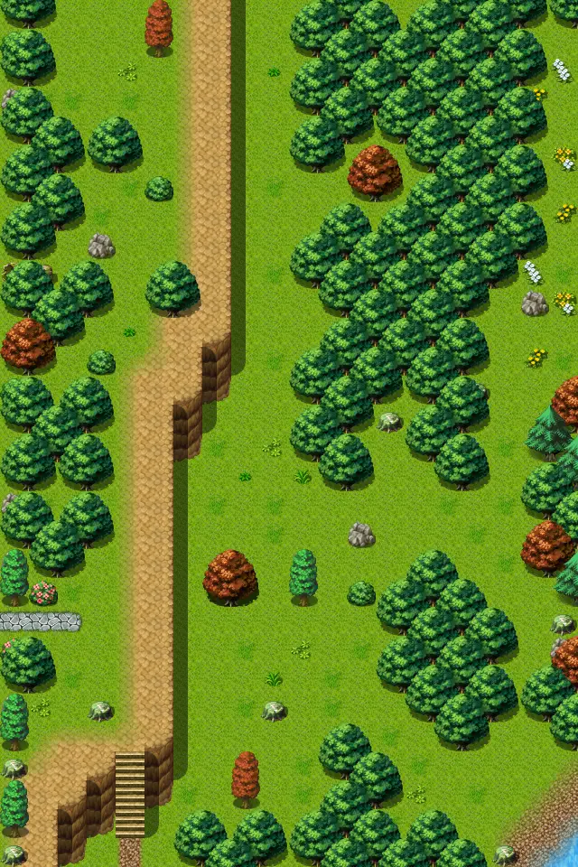

# Sullengard5

| | |
|---|---|
| **Map ID** | `sullengard5` |
| **Region** | Near Sullengard (settlement) |
| **Type** | Outdoors |
| **Size** | 20×30 tiles |
| **World map** | [World1](index.md) |
| **Introduced** | [v0.8.2](../versions/0.8.2.md) |
| **NPCs** | 1 |
| **Enemy types** | 2 |
| **Quests** | 0 |

**Sullengard5** is an outdoor map, near Sullengard (settlement). It has 1 NPC and 2 kinds of enemy. Exits lead to Sullengard6, Sullengard pond, Sullengard7, Sullengard1.

## Map

<label class="lg"><input type="checkbox" data-t="spawn" checked><b>Red</b>&nbsp;Monsters / NPCs</label><label class="lg"><input type="checkbox" data-t="mapchange" checked><b>Blue</b>&nbsp;Exit to another map</label><label class="lg"><input type="checkbox" data-t="container" checked><b>Yellow</b>&nbsp;Container (click to see contents)</label><label class="lg"><input type="checkbox" data-t="sign" checked><b>Purple</b>&nbsp;Sign</label><label class="lg"><input type="checkbox" data-t="rest" checked><b>Green</b>&nbsp;Resting place</label><label class="lg"><input type="checkbox" data-t="key" checked><b>Orange dashed</b>&nbsp;Blocked until a quest step / item</label><label class="lg"><input type="checkbox" data-t="script"><b>Grey dotted</b>&nbsp;Scripted event</label><label class="lg"><input type="checkbox" data-t="replace"><b>White dotted</b>&nbsp;Changes during a quest</label><label class="lg"><input type="checkbox" data-t="pin" checked><b>Numbers</b>&nbsp;Numbered key points (see the key below the map)</label>

<a class="pin pin-exit" href="#key-1" style="left:25.000%;top:1.667%" title="Exit (north): to [Sullengard6](../sullengard6.md)">1</a><a class="pin pin-exit" href="#key-1" style="left:47.500%;top:1.667%" title="Exit (north): to [Sullengard6](../sullengard6.md)">1</a><a class="pin pin-exit" href="#key-2" style="left:97.500%;top:25.000%" title="Exit (east): to [Sullengard pond](../sullengard_pond.md)">2</a><a class="pin pin-exit" href="#key-3" style="left:22.500%;top:98.333%" title="Exit (south): to [Sullengard7](../sullengard7.md)">3</a><a class="pin pin-exit" href="#key-4" style="left:7.500%;top:98.333%" title="Exit (southwest): to [Sullengard7](../sullengard7.md)">4</a><a class="pin pin-exit" href="#key-5" style="left:2.500%;top:71.667%" title="Exit (west): to [Sullengard1](../sullengard1.md)">5</a><a class="pin pin-npc" href="#key-6" style="left:92.500%;top:91.667%" title="[Sullengard snapper](../../monsters/sullengard_snapper.md): NPC">6</a><a class="pin pin-script" href="#key-7" style="left:45.000%;top:5.000%" title="Quest trigger: Scripted event: advances the quest: hidden story flag “sullengard_hidden” to stage 6 (“sullengard6_replace_below”)">7</a><a class="pin pin-script" href="#key-8" style="left:17.500%;top:78.333%" title="Quest trigger: Scripted event: advances the quest: hidden story flag “sullengard_hidden” to stage 9 (“sullengard5_replace_above”)">8</a><a class="pin pin-script" href="#key-9" style="left:25.000%;top:5.000%" title="Quest trigger: Scripted event: advances the quest: hidden story flag “sullengard_hidden” to stage 7 (“6=sullengard6_replace_above”)">9</a><a class="pin pin-script" href="#key-10" style="left:90.000%;top:48.333%" title="Quest trigger: Scripted event: advances the quest: hidden story flag “sullengard_hidden” to stage 8 (“sullengard5_replace_below”)">10</a><a class="pin pin-script" href="#key-10" style="left:30.000%;top:95.000%" title="Quest trigger: Scripted event: advances the quest: hidden story flag “sullengard_hidden” to stage 8 (“sullengard5_replace_below”)">10</a><a class="pin pin-script" href="#key-11" style="left:7.500%;top:95.000%" title="Quest trigger: Scripted event: advances the quest: hidden story flag “sullengard_hidden” to stage 11 (“sullengard7_replace_above”)">11</a><a class="pin pin-replace" href="#key-12" style="left:35.000%;top:45.000%" title="Changes during a quest: This area changes during the quest: hidden story flag “sullengard_hidden” (stage 8: “sullengard5_replace_below”)">12</a><a class="pin pin-replace" href="#key-13" style="left:35.329%;top:42.500%" title="Changes during a quest: This area changes during the quest: hidden story flag “sullengard_hidden” (stage 9: “sullengard5_replace_above”)">13</a>

??? abstract "Key to the numbers on the map"

    | # | What | Details |
    |---|---|---|
    | 1 | Exit (north) | to [Sullengard6](../sullengard6.md) |
    | 2 | Exit (east) | to [Sullengard pond](../sullengard_pond.md) |
    | 3 | Exit (south) | to [Sullengard7](../sullengard7.md) |
    | 4 | Exit (southwest) | to [Sullengard7](../sullengard7.md) |
    | 5 | Exit (west) | to [Sullengard1](../sullengard1.md) |
    | 6 | [Sullengard snapper](../monsters/sullengard_snapper.md) | NPC |
    | 7 | Quest trigger | Scripted event: advances the quest: hidden story flag “sullengard_hidden” to stage 6 (“sullengard6_replace_below”) |
    | 8 | Quest trigger | Scripted event: advances the quest: hidden story flag “sullengard_hidden” to stage 9 (“sullengard5_replace_above”) |
    | 9 | Quest trigger | Scripted event: advances the quest: hidden story flag “sullengard_hidden” to stage 7 (“6=sullengard6_replace_above”) |
    | 10 | Quest trigger | Scripted event: advances the quest: hidden story flag “sullengard_hidden” to stage 8 (“sullengard5_replace_below”) |
    | 11 | Quest trigger | Scripted event: advances the quest: hidden story flag “sullengard_hidden” to stage 11 (“sullengard7_replace_above”) |
    | 12 | Changes during a quest | This area changes during the quest: hidden story flag “sullengard_hidden” (stage 8: “sullengard5_replace_below”) |
    | 13 | Changes during a quest | This area changes during the quest: hidden story flag “sullengard_hidden” (stage 9: “sullengard5_replace_above”) |

Verified against v0.8.18 map data.

## Connections

| Direction | Leads to | Region there | Map # |
|---|---|---|---|
| North | [Sullengard6](sullengard6.md) | Sullengard | 1 |
| East | [Sullengard pond](sullengard_pond.md) | Sullengard | 2 |
| South | [Sullengard7](sullengard7.md) | Sullengard | 3 |
| Southwest | [Sullengard7](sullengard7.md) | Sullengard | 4 |
| West | [Sullengard1](sullengard1.md) | Sullengard | 5 |

## NPCs

- [Sullengard snapper](../monsters/sullengard_snapper.md) (#6)

## Enemies

| Enemy | HP | Damage | Up to | Notes |
|---|---|---|---|---|
| [Sullengard forest snake](../monsters/sullengard_venom_snake.md) | 148 | 15–22 | 1 | – |
| [Death cob](../monsters/deathcob.md) | 179 | 9–23 | 3 | – |

<small>“Up to” is the most that can be alive at once from the spawn areas on this map.</small>

## Quests

- [sullengard_nondisplay (hidden flag)](../quests/sullengard_hidden.md): part of the map changes at stage 8; part of the map changes at stage 9; something on this map advances it; stepping on a trigger here sets stage 11; stepping on a trigger here sets stage 6; stepping on a trigger here sets stage 7; stepping on a trigger here sets stage 8; stepping on a trigger here sets stage 9

## Points of interest

- **Quest trigger** (#7): Scripted event: advances the quest: hidden story flag “sullengard_hidden” to stage 6 (“sullengard6_replace_below”)
- **Quest trigger** (#8): Scripted event: advances the quest: hidden story flag “sullengard_hidden” to stage 9 (“sullengard5_replace_above”)
- **Quest trigger** (#9): Scripted event: advances the quest: hidden story flag “sullengard_hidden” to stage 7 (“6=sullengard6_replace_above”)
- **Quest trigger** (#10): Scripted event: advances the quest: hidden story flag “sullengard_hidden” to stage 8 (“sullengard5_replace_below”)
- **Quest trigger** (#11): Scripted event: advances the quest: hidden story flag “sullengard_hidden” to stage 11 (“sullengard7_replace_above”)
- **Changes during a quest** (#12): This area changes during the quest: hidden story flag “sullengard_hidden” (stage 8: “sullengard5_replace_below”)
- **Changes during a quest** (#13): This area changes during the quest: hidden story flag “sullengard_hidden” (stage 9: “sullengard5_replace_above”)

## Version history

| Version | Change |
|---|---|
| [v0.8.2](../versions/0.8.2.md) | Added |
| [v0.8.10](../versions/0.8.10.md) | map layout or objects changed |

Verified against v0.8.18 and every earlier release back to v0.7.0 (game data compared release by release).

## Community notes

<small>Written by players, not generated from game data. **Observations**: what players notice in-game · **Lore**: the in-world story · **Trivia**: real-world facts, references, development history · **Theory / speculation**: unconfirmed ideas; may just be unfinished content</small>

### Observations

*Nothing here yet. Know something? [Add it](https://github.com/asdfghjkl628/Andor-s-Trail-Wikiiii/new/main/notes/maps?filename=sullengard5.md&value=%23%23%20Observations%0A%0A%3C%21--%20what%20players%20notice%20in-game%20--%3E%0A%0A%23%23%20Lore%0A%0A%3C%21--%20the%20in-world%20story%20--%3E%0A%0A%23%23%20Trivia%0A%0A%3C%21--%20real-world%20facts%2C%20references%2C%20development%20history%20--%3E%0A%0A%23%23%20Theory%20/%20speculation%0A%0A%3C%21--%20unconfirmed%20ideas%3B%20may%20just%20be%20unfinished%20content%20--%3E%0A).*

### Lore

*Nothing here yet. Know something? [Add it](https://github.com/asdfghjkl628/Andor-s-Trail-Wikiiii/new/main/notes/maps?filename=sullengard5.md&value=%23%23%20Observations%0A%0A%3C%21--%20what%20players%20notice%20in-game%20--%3E%0A%0A%23%23%20Lore%0A%0A%3C%21--%20the%20in-world%20story%20--%3E%0A%0A%23%23%20Trivia%0A%0A%3C%21--%20real-world%20facts%2C%20references%2C%20development%20history%20--%3E%0A%0A%23%23%20Theory%20/%20speculation%0A%0A%3C%21--%20unconfirmed%20ideas%3B%20may%20just%20be%20unfinished%20content%20--%3E%0A).*

### Trivia

*Nothing here yet. Know something? [Add it](https://github.com/asdfghjkl628/Andor-s-Trail-Wikiiii/new/main/notes/maps?filename=sullengard5.md&value=%23%23%20Observations%0A%0A%3C%21--%20what%20players%20notice%20in-game%20--%3E%0A%0A%23%23%20Lore%0A%0A%3C%21--%20the%20in-world%20story%20--%3E%0A%0A%23%23%20Trivia%0A%0A%3C%21--%20real-world%20facts%2C%20references%2C%20development%20history%20--%3E%0A%0A%23%23%20Theory%20/%20speculation%0A%0A%3C%21--%20unconfirmed%20ideas%3B%20may%20just%20be%20unfinished%20content%20--%3E%0A).*

### Theory / speculation

*Nothing here yet. Know something? [Add it](https://github.com/asdfghjkl628/Andor-s-Trail-Wikiiii/new/main/notes/maps?filename=sullengard5.md&value=%23%23%20Observations%0A%0A%3C%21--%20what%20players%20notice%20in-game%20--%3E%0A%0A%23%23%20Lore%0A%0A%3C%21--%20the%20in-world%20story%20--%3E%0A%0A%23%23%20Trivia%0A%0A%3C%21--%20real-world%20facts%2C%20references%2C%20development%20history%20--%3E%0A%0A%23%23%20Theory%20/%20speculation%0A%0A%3C%21--%20unconfirmed%20ideas%3B%20may%20just%20be%20unfinished%20content%20--%3E%0A).*

??? info "Technical information"

    | | |
    |---|---|
    | Map ID | `sullengard5` |
    | File | `res/xml/sullengard5.tmx` |
    | Size | 20×30 tiles (640×960 px) |
    | outdoors property | 1 |
    | Layers drawn | base, ground, objects, above, top |
    | Tilesets | map_bed_1, map_border_1, map_bridge_1, map_bridge_2, map_broken_1, map_cavewall_1, map_cavewall_2, map_cavewall_3, map_cavewall_4, map_chair_table_1, map_chair_table_2, map_crate_1, map_cupboard_1, map_curtain_1, map_entrance_1, map_entrance_2, map_fence_1, map_fence_2, map_fence_3, map_fence_4, map_ground_1, map_ground_2, map_ground_3, map_ground_4, map_ground_5, map_ground_6, map_ground_7, map_ground_8, map_house_1, map_house_2, map_indoor_1, map_indoor_2, map_kitchen_1, map_outdoor_1, map_pillar_1, map_pillar_2, map_plant_1, map_plant_2, map_rock_1, map_rock_2, map_roof_1, map_roof_2, map_roof_3, map_shop_1, map_sign_ladder_1, map_table_1, map_trail_1, map_transition_1, map_transition_2, map_transition_3, map_transition_4, map_transition_5, map_tree_1, map_tree_2, map_wall_1, map_wall_2, map_wall_3, map_wall_4, map_window_1, map_window_2 |
    | Map objects | mapchange: 6, script: 6, spawn: 5, replace: 2 |
    | World map position | segment `world1`, x 353, y 655 |

<small>Data from v0.8.18</small>
