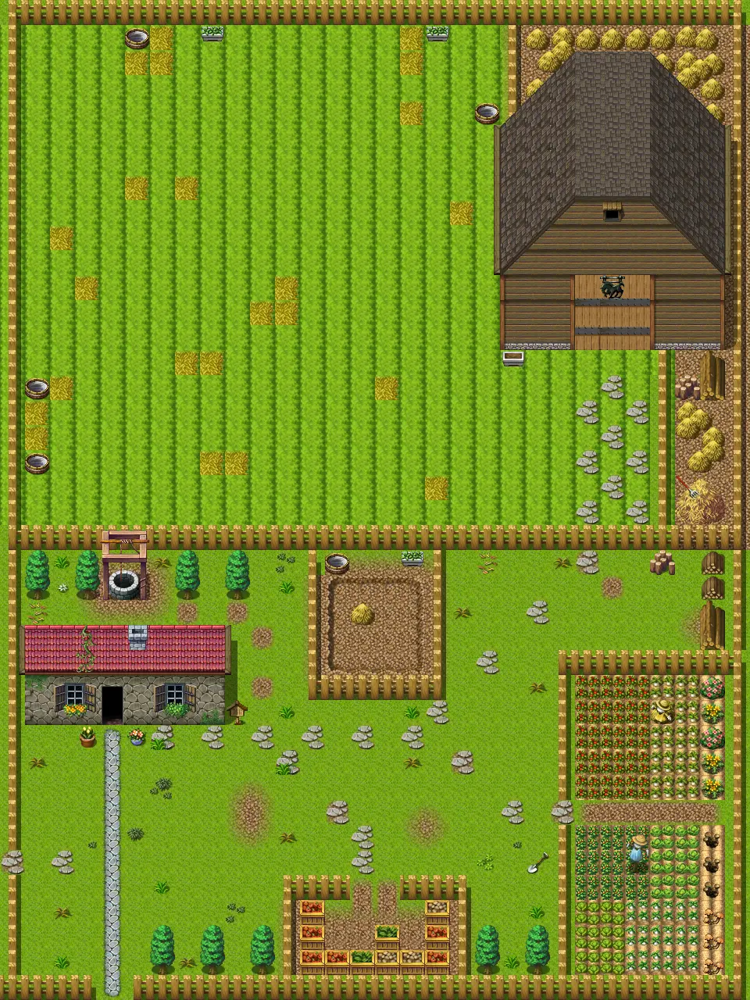

# Sullengard apple farm east

30×40 tiles · outdoors · part of [World1](index.md)

<label class="lg lg-spawn"><input type="checkbox" data-t="spawn" checked> Monsters / NPCs</label><label class="lg lg-mapchange"><input type="checkbox" data-t="mapchange" checked> Exit to another map</label><label class="lg lg-container"><input type="checkbox" data-t="container" checked> Container</label><label class="lg lg-sign"><input type="checkbox" data-t="sign" checked> Sign</label><label class="lg lg-rest"><input type="checkbox" data-t="rest" checked> Resting place</label><label class="lg lg-key"><input type="checkbox" data-t="key" checked> Blocked / needs key or quest</label><label class="lg lg-script"><input type="checkbox" data-t="script"> Scripted event</label><label class="lg lg-replace"><input type="checkbox" data-t="replace"> Changes after a quest</label>

## Exits

- [Deebo orchard house](deebo_orchard_house.md)
- [Sullengard apple farm south](sullengard_apple_farm_south.md)
- [Sullengard apple farm west](sullengard_apple_farm_west.md)

## Monsters & NPCs here

| Name | HP |
|---|---|
| [Farm horse](../monsters/farm_horse.md) | 0 |
| [Pig](../monsters/pig.md) | 0 |
| [Farm horse](../monsters/farm_horse_right.md) | 0 |
| [Deebo](../monsters/deebo_orchard_deebo.md) | 0 |
| [Grazing horse](../monsters/graze_horse_left.md) | 0 |
| [Grazing horse](../monsters/grazing_horse_right.md) | 0 |

<small>Map ID: `sullengard_apple_farm_east` · Data from v0.8.18</small>
