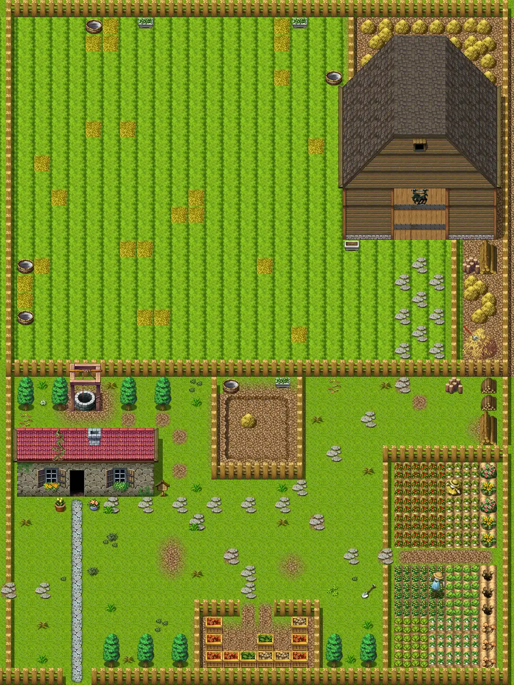
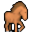
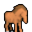

# Sullengard apple farm east

| | |
|---|---|
| **Map ID** | `sullengard_apple_farm_east` |
| **Region** | In Deebo's Orchard (other) |
| **Type** | Outdoors |
| **Size** | 30×40 tiles |
| **World map** | [World1](index.md) |
| **Introduced** | [v0.8.2](../versions/0.8.2.md) |
| **NPCs** | 2 |
| **Enemy types** | 4 |
| **Quests** | 2 |

**Sullengard apple farm east** is an outdoor map, in Deebo's Orchard (other). It has 2 NPCs and 4 kinds of enemy. Exits lead to Sullengard apple farm south, Sullengard apple farm west, Deebo orchard house.

## Map

<label class="lg"><input type="checkbox" data-t="spawn" checked><b>Red</b>&nbsp;Monsters / NPCs</label><label class="lg"><input type="checkbox" data-t="mapchange" checked><b>Blue</b>&nbsp;Exit to another map</label><label class="lg"><input type="checkbox" data-t="container" checked><b>Yellow</b>&nbsp;Container (click to see contents)</label><label class="lg"><input type="checkbox" data-t="sign" checked><b>Purple</b>&nbsp;Sign</label><label class="lg"><input type="checkbox" data-t="rest" checked><b>Green</b>&nbsp;Resting place</label><label class="lg"><input type="checkbox" data-t="key" checked><b>Orange dashed</b>&nbsp;Blocked until a quest step / item</label><label class="lg"><input type="checkbox" data-t="script"><b>Grey dotted</b>&nbsp;Scripted event</label><label class="lg"><input type="checkbox" data-t="replace"><b>White dotted</b>&nbsp;Changes during a quest</label><label class="lg"><input type="checkbox" data-t="pin" checked><b>Numbers</b>&nbsp;Numbered key points (see the key below the map)</label>

<a class="pin pin-exit" href="#key-1" style="left:15.000%;top:98.750%" title="Exit (south): to [Sullengard apple farm south](../sullengard_apple_farm_south.md)">1</a><a class="pin pin-exit" href="#key-2" style="left:1.667%;top:86.250%" title="Exit (west): to [Sullengard apple farm west](../sullengard_apple_farm_west.md)">2</a><a class="pin pin-exit" href="#key-3" style="left:15.000%;top:71.250%" title="Exit (door): to [Deebo orchard house](../deebo_orchard_house.md)">3</a><a class="pin pin-npc" href="#key-4" style="left:85.000%;top:81.250%" title="[Deebo](../../monsters/deebo_orchard_deebo.md): shopkeeper, 2 quests">4</a><a class="pin pin-npc" href="#key-5" style="left:45.000%;top:58.750%" title="[Pig](../../monsters/pig.md): NPC">5</a>

??? abstract "Key to the numbers on the map"

    | # | What | Details |
    |---|---|---|
    | 1 | Exit (south) | to [Sullengard apple farm south](../sullengard_apple_farm_south.md) |
    | 2 | Exit (west) | to [Sullengard apple farm west](../sullengard_apple_farm_west.md) |
    | 3 | Exit (door) | to [Deebo orchard house](../deebo_orchard_house.md) |
    | 4 | [Deebo](../monsters/deebo_orchard_deebo.md) | shopkeeper, 2 quests |
    | 5 | [Pig](../monsters/pig.md) | NPC |

Verified against v0.8.18 map data.

## Connections

| Direction | Leads to | Region there | Map # |
|---|---|---|---|
| South | [Sullengard apple farm south](sullengard_apple_farm_south.md) | Deebo's Orchard | 1 |
| West | [Sullengard apple farm west](sullengard_apple_farm_west.md) | Deebo's Orchard | 2 |
| Door | [Deebo orchard house](deebo_orchard_house.md) | Deebo's Orchard | 3 |

## NPCs

- [Deebo](../monsters/deebo_orchard_deebo.md) — shopkeeper — quests: [Bread and circus](../quests/brightport_bakery.md), [Hunting the hunter](../quests/deebo_orchard_hth.md) (#4)
- [Pig](../monsters/pig.md) (#5)

## Enemies

| Enemy | HP | Damage | Up to | Notes |
|---|---|---|---|---|
| [Grazing horse](../monsters/graze_horse_left.md) | 0 | 0–0 | 1 | – |
| [Farm horse](../monsters/farm_horse_right.md) | 0 | 0–0 | 1 | – |
| [Farm horse](../monsters/farm_horse.md) | 0 | 0–0 | 1 | – |
| [Grazing horse](../monsters/grazing_horse_right.md) | 0 | 0–0 | 1 | – |

<small>“Up to” is the most that can be alive at once from the spawn areas on this map.</small>

## Items & containers

**Shops:** [Deebo](../monsters/deebo_orchard_deebo.md)

## Quests

- [Bread and circus](../quests/brightport_bakery.md): [Deebo](../monsters/deebo_orchard_deebo.md) is involved
- [Hunting the hunter](../quests/deebo_orchard_hth.md): [Deebo](../monsters/deebo_orchard_deebo.md) is involved
- [brightport_nondisplay (hidden flag)](../quests/brightport_nondisplay.md): [Deebo](../monsters/deebo_orchard_deebo.md) is involved
- [sullengard_nondisplay (hidden flag)](../quests/sullengard_hidden.md): [Deebo](../monsters/deebo_orchard_deebo.md) is involved

## Version history

| Version | Change |
|---|---|
| [v0.8.2](../versions/0.8.2.md) | Added |
| [v0.8.4](../versions/0.8.4.md) | map layout or objects changed |

Verified against v0.8.18 and every earlier release back to v0.7.0 (game data compared release by release).

## Community notes

<small>Written by players, not generated from game data. **Observations**: what players notice in-game · **Lore**: the in-world story · **Trivia**: real-world facts, references, development history · **Theory / speculation**: unconfirmed ideas; may just be unfinished content</small>

### Observations

*Nothing here yet. Know something? [Add it](https://github.com/asdfghjkl628/Andor-s-Trail-Wikiiii/new/main/notes/maps?filename=sullengard_apple_farm_east.md&value=%23%23%20Observations%0A%0A%3C%21--%20what%20players%20notice%20in-game%20--%3E%0A%0A%23%23%20Lore%0A%0A%3C%21--%20the%20in-world%20story%20--%3E%0A%0A%23%23%20Trivia%0A%0A%3C%21--%20real-world%20facts%2C%20references%2C%20development%20history%20--%3E%0A%0A%23%23%20Theory%20/%20speculation%0A%0A%3C%21--%20unconfirmed%20ideas%3B%20may%20just%20be%20unfinished%20content%20--%3E%0A).*

### Lore

*Nothing here yet. Know something? [Add it](https://github.com/asdfghjkl628/Andor-s-Trail-Wikiiii/new/main/notes/maps?filename=sullengard_apple_farm_east.md&value=%23%23%20Observations%0A%0A%3C%21--%20what%20players%20notice%20in-game%20--%3E%0A%0A%23%23%20Lore%0A%0A%3C%21--%20the%20in-world%20story%20--%3E%0A%0A%23%23%20Trivia%0A%0A%3C%21--%20real-world%20facts%2C%20references%2C%20development%20history%20--%3E%0A%0A%23%23%20Theory%20/%20speculation%0A%0A%3C%21--%20unconfirmed%20ideas%3B%20may%20just%20be%20unfinished%20content%20--%3E%0A).*

### Trivia

*Nothing here yet. Know something? [Add it](https://github.com/asdfghjkl628/Andor-s-Trail-Wikiiii/new/main/notes/maps?filename=sullengard_apple_farm_east.md&value=%23%23%20Observations%0A%0A%3C%21--%20what%20players%20notice%20in-game%20--%3E%0A%0A%23%23%20Lore%0A%0A%3C%21--%20the%20in-world%20story%20--%3E%0A%0A%23%23%20Trivia%0A%0A%3C%21--%20real-world%20facts%2C%20references%2C%20development%20history%20--%3E%0A%0A%23%23%20Theory%20/%20speculation%0A%0A%3C%21--%20unconfirmed%20ideas%3B%20may%20just%20be%20unfinished%20content%20--%3E%0A).*

### Theory / speculation

*Nothing here yet. Know something? [Add it](https://github.com/asdfghjkl628/Andor-s-Trail-Wikiiii/new/main/notes/maps?filename=sullengard_apple_farm_east.md&value=%23%23%20Observations%0A%0A%3C%21--%20what%20players%20notice%20in-game%20--%3E%0A%0A%23%23%20Lore%0A%0A%3C%21--%20the%20in-world%20story%20--%3E%0A%0A%23%23%20Trivia%0A%0A%3C%21--%20real-world%20facts%2C%20references%2C%20development%20history%20--%3E%0A%0A%23%23%20Theory%20/%20speculation%0A%0A%3C%21--%20unconfirmed%20ideas%3B%20may%20just%20be%20unfinished%20content%20--%3E%0A).*

??? info "Technical information"

    | | |
    |---|---|
    | Map ID | `sullengard_apple_farm_east` |
    | File | `res/xml/sullengard_apple_farm_east.tmx` |
    | Size | 30×40 tiles (960×1280 px) |
    | outdoors property | 1 |
    | Layers drawn | base, ground, objects, above, top |
    | Tilesets | map_bed_1, map_border_1, map_bridge_1, map_bridge_2, map_broken_1, map_cavewall_1, map_cavewall_2, map_cavewall_3, map_cavewall_4, map_chair_table_1, map_chair_table_2, map_crate_1, map_cupboard_1, map_curtain_1, map_entrance_1, map_entrance_2, map_fence_1, map_fence_2, map_fence_3, map_fence_4, map_ground_1, map_ground_2, map_ground_3, map_ground_4, map_ground_5, map_ground_6, map_ground_7, map_ground_8, map_house_1, map_house_2, map_indoor_1, map_indoor_2, map_kitchen_1, map_outdoor_1, map_pillar_1, map_pillar_2, map_plant_1, map_plant_2, map_rock_1, map_rock_2, map_roof_1, map_roof_2, map_roof_3, map_shop_1, map_sign_ladder_1, map_table_1, map_trail_1, map_transition_1, map_transition_2, map_transition_3, map_transition_4, map_transition_5, map_tree_1, map_tree_2, map_wall_1, map_wall_2, map_wall_3, map_wall_4, map_window_1, map_window_2 |
    | Map objects | spawn: 6, mapchange: 3 |
    | World map position | segment `world1`, x 461, y 572 |

<small>Data from v0.8.18</small>
