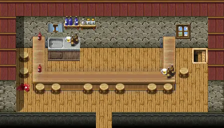
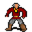
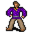
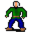

# Sullengard tavern

| | |
|---|---|
| **Map ID** | `sullengard_tavern` |
| **Region** | In Sullengard (settlement) |
| **Type** | Indoors / underground |
| **Size** | 14×8 tiles |
| **Introduced** | [v0.8.2](../versions/0.8.2.md) |
| **NPCs** | 6 |
| **Quests** | 2 |

**Sullengard tavern** is an indoor map, in Sullengard (settlement). It has 6 NPCs, and no enemies. Exits lead to Sullengard tavern basement, Sullengard2.

## Map

<label class="lg"><input type="checkbox" data-t="spawn" checked><b>Red</b>&nbsp;Monsters / NPCs</label><label class="lg"><input type="checkbox" data-t="mapchange" checked><b>Blue</b>&nbsp;Exit to another map</label><label class="lg"><input type="checkbox" data-t="container" checked><b>Yellow</b>&nbsp;Container (click to see contents)</label><label class="lg"><input type="checkbox" data-t="sign" checked><b>Purple</b>&nbsp;Sign</label><label class="lg"><input type="checkbox" data-t="rest" checked><b>Green</b>&nbsp;Resting place</label><label class="lg"><input type="checkbox" data-t="key" checked><b>Orange dashed</b>&nbsp;Blocked until a quest step / item</label><label class="lg"><input type="checkbox" data-t="script"><b>Grey dotted</b>&nbsp;Scripted event</label><label class="lg"><input type="checkbox" data-t="replace"><b>White dotted</b>&nbsp;Changes during a quest</label><label class="lg"><input type="checkbox" data-t="pin" checked><b>Numbers</b>&nbsp;Numbered key points (see the key below the map)</label>

<a class="pin pin-exit" href="#key-1" style="left:89.286%;top:43.750%" title="Exit (east): to [Sullengard tavern basement](sullengard_tavern_basement.md)">1</a><a class="pin pin-exit" href="#key-2" style="left:46.429%;top:93.750%" title="Exit (south): to [Sullengard2](sullengard2.md)">2</a><a id="pin-npc-burhczyd11" class="pin pin-npc" href="#key-3" style="left:10.714%;top:43.750%" title="[Burhczyd](../../monsters/burhczyd1.md#v-burhczyd11): 1 quest">3</a><a id="pin-npc-sullengard_drinking_brother" class="pin pin-npc" href="#key-4" style="left:39.286%;top:68.750%" title="[Drinking brother](../../monsters/sullengard_drinking_brother.md): NPC">4</a><a id="pin-npc-sullengard_drinking_brother3" class="pin pin-npc" href="#key-5" style="left:53.571%;top:68.750%" title="[Drinking brother](../../monsters/sullengard_drinking_brother.md#v-sullengard_drinking_brother3): NPC">5</a><a id="pin-npc-sullengard_drinking_brother2" class="pin pin-npc" href="#key-6" style="left:46.429%;top:68.750%" title="[Drinking brother](../../monsters/sullengard_drinking_brother.md#v-sullengard_drinking_brother2): NPC">6</a><a id="pin-npc-burhczyd11e" class="pin pin-npc" href="#key-7" style="left:11.184%;top:34.376%" title="[Knight of Elythom](../../monsters/burhczyd1e.md#v-burhczyd11e): 1 quest">7</a><a id="pin-npc-sullengard_bartender" class="pin pin-npc" href="#key-8" style="left:60.714%;top:43.750%" title="[Oakleigh](../../monsters/sullengard_bartender.md): NPC">8</a><a class="pin pin-script" href="#key-9" style="left:82.143%;top:43.750%" title="Quest trigger: Scripted event: advances the quest: hidden story flag “sullengard_hidden” to stage 120 (“120 bar achievement”) (+1 more quest(s))">9</a><a class="pin pin-key" href="#key-10" style="left:82.613%;top:34.376%" title="Blocked passage: Closed off once you reach this point in the quest: hidden story flag “sullengard_hidden” (stage 3: “I need to leave the Sullengard tavern.”)">10</a>

??? abstract "Key to the numbers on the map"

    | # | What | Details |
    |---|---|---|
    | 1 | Exit (east) | to [Sullengard tavern basement](sullengard_tavern_basement.md) |
    | 2 | Exit (south) | to [Sullengard2](sullengard2.md) |
    | 3 | [Burhczyd](../monsters/burhczyd1.md#v-burhczyd11) | 1 quest |
    | 4 | [Drinking brother](../monsters/sullengard_drinking_brother.md) | NPC |
    | 5 | [Drinking brother](../monsters/sullengard_drinking_brother.md#v-sullengard_drinking_brother3) | NPC |
    | 6 | [Drinking brother](../monsters/sullengard_drinking_brother.md#v-sullengard_drinking_brother2) | NPC |
    | 7 | [Knight of Elythom](../monsters/burhczyd1e.md#v-burhczyd11e) | 1 quest |
    | 8 | [Oakleigh](../monsters/sullengard_bartender.md) | NPC |
    | 9 | Quest trigger | Scripted event: advances the quest: hidden story flag “sullengard_hidden” to stage 120 (“120 bar achievement”) (+1 more quest(s)) |
    | 10 | Blocked passage | Closed off once you reach this point in the quest: hidden story flag “sullengard_hidden” (stage 3: “I need to leave the Sullengard tavern.”) |

Verified against v0.8.18 map data.

## Connections

| Direction | Leads to | Region there | Map # |
|---|---|---|---|
| East | [Sullengard tavern basement](sullengard_tavern_basement.md) | Sullengard | 1 |
| South | [Sullengard2](sullengard2.md) | Sullengard | 2 |

## NPCs

- [Burhczyd](../monsters/burhczyd1.md#v-burhczyd11) — quests: [Young merchant](../quests/quest_burhczyd.md) (#3)
- [Drinking brother](../monsters/sullengard_drinking_brother.md) (#4)
- [Drinking brother](../monsters/sullengard_drinking_brother.md#v-sullengard_drinking_brother3) (#5)
- [Drinking brother](../monsters/sullengard_drinking_brother.md#v-sullengard_drinking_brother2) (#6)
- [Knight of Elythom](../monsters/burhczyd1e.md#v-burhczyd11e) — quests: [Young merchant](../quests/quest_burhczyd.md) (#7)
- [Oakleigh](../monsters/sullengard_bartender.md) (#8)

## Quests

- [Unusual experiences and achievements](../quests/achievements.md): something on this map advances it; stepping on a trigger here sets stage 120
- [Young merchant](../quests/quest_burhczyd.md): [Burhczyd](../monsters/burhczyd1.md#v-burhczyd11) is involved; [Knight of Elythom](../monsters/burhczyd1e.md#v-burhczyd11e) is involved
- [sullengard_nondisplay (hidden flag)](../quests/sullengard_hidden.md): [Drinking brother](../monsters/sullengard_drinking_brother.md) is involved; [Drinking brother](../monsters/sullengard_drinking_brother.md#v-sullengard_drinking_brother2) is involved; [Drinking brother](../monsters/sullengard_drinking_brother.md#v-sullengard_drinking_brother3) is involved; blocked passage closes at stage 3; something on this map advances it; stepping on a trigger here sets stage 120; stepping on a trigger here sets stage 2; stepping on a trigger here sets stage 3
- [Young merchant Non-displayed (hidden flag)](../quests/quest_burhczyd_nd.md): [Burhczyd](../monsters/burhczyd1.md#v-burhczyd11) is involved; [Knight of Elythom](../monsters/burhczyd1e.md#v-burhczyd11e) is involved

## Points of interest

- **Quest trigger** (#9): Scripted event: advances the quest: hidden story flag “sullengard_hidden” to stage 120 (“120 bar achievement”) (+1 more quest(s))
- **Blocked passage** (#10): Closed off once you reach this point in the quest: hidden story flag “sullengard_hidden” (stage 3: “I need to leave the Sullengard tavern.”)

## Version history

| Version | Change |
|---|---|
| [v0.8.2](../versions/0.8.2.md) | Added |

Verified against v0.8.18 and every earlier release back to v0.7.0 (game data compared release by release).

## Community notes

<small>Written by players, not generated from game data. **Observations**: what players notice in-game · **Lore**: the in-world story · **Trivia**: real-world facts, references, development history · **Theory / speculation**: unconfirmed ideas; may just be unfinished content</small>

### Observations

*No notes yet. Contributions are welcome: [add a note](https://github.com/asdfghjkl628/Andor-s-Trail-Wikiiii/new/main/notes/maps?filename=sullengard_tavern.md&value=%23%23%20Observations%0A%0A%3C%21--%20what%20players%20notice%20in-game%20--%3E%0A%0A%23%23%20Lore%0A%0A%3C%21--%20the%20in-world%20story%20--%3E%0A%0A%23%23%20Trivia%0A%0A%3C%21--%20real-world%20facts%2C%20references%2C%20development%20history%20--%3E%0A%0A%23%23%20Theory%20/%20speculation%0A%0A%3C%21--%20unconfirmed%20ideas%3B%20may%20just%20be%20unfinished%20content%20--%3E%0A).*

### Lore

*No notes yet. Contributions are welcome: [add a note](https://github.com/asdfghjkl628/Andor-s-Trail-Wikiiii/new/main/notes/maps?filename=sullengard_tavern.md&value=%23%23%20Observations%0A%0A%3C%21--%20what%20players%20notice%20in-game%20--%3E%0A%0A%23%23%20Lore%0A%0A%3C%21--%20the%20in-world%20story%20--%3E%0A%0A%23%23%20Trivia%0A%0A%3C%21--%20real-world%20facts%2C%20references%2C%20development%20history%20--%3E%0A%0A%23%23%20Theory%20/%20speculation%0A%0A%3C%21--%20unconfirmed%20ideas%3B%20may%20just%20be%20unfinished%20content%20--%3E%0A).*

### Trivia

*No notes yet. Contributions are welcome: [add a note](https://github.com/asdfghjkl628/Andor-s-Trail-Wikiiii/new/main/notes/maps?filename=sullengard_tavern.md&value=%23%23%20Observations%0A%0A%3C%21--%20what%20players%20notice%20in-game%20--%3E%0A%0A%23%23%20Lore%0A%0A%3C%21--%20the%20in-world%20story%20--%3E%0A%0A%23%23%20Trivia%0A%0A%3C%21--%20real-world%20facts%2C%20references%2C%20development%20history%20--%3E%0A%0A%23%23%20Theory%20/%20speculation%0A%0A%3C%21--%20unconfirmed%20ideas%3B%20may%20just%20be%20unfinished%20content%20--%3E%0A).*

### Theory / speculation

*No notes yet. Contributions are welcome: [add a note](https://github.com/asdfghjkl628/Andor-s-Trail-Wikiiii/new/main/notes/maps?filename=sullengard_tavern.md&value=%23%23%20Observations%0A%0A%3C%21--%20what%20players%20notice%20in-game%20--%3E%0A%0A%23%23%20Lore%0A%0A%3C%21--%20the%20in-world%20story%20--%3E%0A%0A%23%23%20Trivia%0A%0A%3C%21--%20real-world%20facts%2C%20references%2C%20development%20history%20--%3E%0A%0A%23%23%20Theory%20/%20speculation%0A%0A%3C%21--%20unconfirmed%20ideas%3B%20may%20just%20be%20unfinished%20content%20--%3E%0A).*

??? info "Technical information"

    | | |
    |---|---|
    | Map ID | `sullengard_tavern` |
    | File | `res/xml/sullengard_tavern.tmx` |
    | Size | 14×8 tiles (448×256 px) |
    | outdoors property | – |
    | Layers drawn | base, ground, objects, above, top |
    | Tilesets | map_bed_1, map_border_1, map_bridge_1, map_bridge_2, map_broken_1, map_cavewall_1, map_cavewall_2, map_cavewall_3, map_cavewall_4, map_chair_table_1, map_chair_table_2, map_crate_1, map_cupboard_1, map_curtain_1, map_entrance_1, map_entrance_2, map_fence_1, map_fence_2, map_fence_3, map_fence_4, map_ground_1, map_ground_2, map_ground_3, map_ground_4, map_ground_5, map_ground_6, map_ground_7, map_ground_8, map_house_1, map_house_2, map_indoor_1, map_indoor_2, map_kitchen_1, map_outdoor_1, map_pillar_1, map_pillar_2, map_plant_1, map_plant_2, map_rock_1, map_rock_2, map_roof_1, map_roof_2, map_roof_3, map_shop_1, map_sign_ladder_1, map_table_1, map_trail_1, map_transition_1, map_transition_2, map_transition_3, map_transition_4, map_transition_5, map_tree_1, map_tree_2, map_wall_1, map_wall_2, map_wall_3, map_wall_4, map_window_1, map_window_2 |
    | Map objects | spawn: 6, mapchange: 2, script: 1, key: 1 |
    | World map position | – |

<small>Data from v0.8.18</small>
