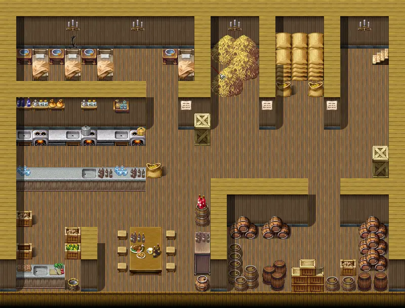

# Sullengard tavern basement

| | |
|---|---|
| **Map ID** | `sullengard_tavern_basement` |
| **Region** | In Sullengard (settlement) |
| **Type** | Indoors / underground |
| **Size** | 25×19 tiles |
| **Introduced** | [v0.8.2](../versions/0.8.2.md) |
| **NPCs** | 7 |
| **Quests** | 2 |

**Sullengard tavern basement** is an indoor map, in Sullengard (settlement). It has 7 NPCs, and no enemies. Exits lead to Sullengard tavern.

## Map

<label class="lg"><input type="checkbox" data-t="spawn" checked><b>Red</b>&nbsp;Monsters / NPCs</label><label class="lg"><input type="checkbox" data-t="mapchange" checked><b>Blue</b>&nbsp;Exit to another map</label><label class="lg"><input type="checkbox" data-t="container" checked><b>Yellow</b>&nbsp;Container (click to see contents)</label><label class="lg"><input type="checkbox" data-t="sign" checked><b>Purple</b>&nbsp;Sign</label><label class="lg"><input type="checkbox" data-t="rest" checked><b>Green</b>&nbsp;Resting place</label><label class="lg"><input type="checkbox" data-t="key" checked><b>Orange dashed</b>&nbsp;Blocked until a quest step / item</label><label class="lg"><input type="checkbox" data-t="script"><b>Grey dotted</b>&nbsp;Scripted event</label><label class="lg"><input type="checkbox" data-t="replace"><b>White dotted</b>&nbsp;Changes during a quest</label><label class="lg"><input type="checkbox" data-t="pin" checked><b>Numbers</b>&nbsp;Numbered key points (see the key below the map)</label>

<a class="pin pin-exit" href="#key-1" style="left:94.000%;top:18.421%" title="Exit (east): to [Sullengard tavern](../sullengard_tavern.md)">1</a><a class="pin pin-npc" href="#key-2" style="left:86.000%;top:81.579%" title="[Dantran](../../monsters/sullengard_dantran.md): NPC">2</a><a class="pin pin-npc" href="#key-3" style="left:30.000%;top:81.579%" title="[Defy](../../monsters/g04_defy.md): 1 quest">3</a><a class="pin pin-npc" href="#key-4" style="left:14.000%;top:50.000%" title="[Gaelian](../../monsters/sullengard_gaelian.md): 1 quest">4</a><a class="pin pin-npc" href="#key-5" style="left:42.000%;top:86.842%" title="[Grabby comrade](../../monsters/guild04_rebcomrade_2.md): NPC">5</a><a class="pin pin-npc" href="#key-6" style="left:42.000%;top:76.316%" title="[Greedy comrade](../../monsters/guild04_rebcomrade_1.md): NPC">6</a><a class="pin pin-npc" href="#key-7" style="left:38.000%;top:18.421%" title="[Prowling Arantxa](../../monsters/sullengard_arantxa.md): shopkeeper, 1 quest">7</a><a class="pin pin-npc" href="#key-8" style="left:42.000%;top:81.579%" title="[Zachlanny](../../monsters/guild04_rebcomrade_3.md): NPC">8</a><a class="pin pin-script" href="#key-9" style="left:54.000%;top:50.000%" title="Quest trigger: Scripted event: advances the quest: Another ruthless Crackshot to stage 35 (“Defy and his friends have vanished! Back to Umar ...”)">9</a>

??? abstract "Key to the numbers on the map"

    | # | What | Details |
    |---|---|---|
    | 1 | Exit (east) | to [Sullengard tavern](../sullengard_tavern.md) |
    | 2 | [Dantran](../monsters/sullengard_dantran.md) | NPC |
    | 3 | [Defy](../monsters/g04_defy.md) | 1 quest |
    | 4 | [Gaelian](../monsters/sullengard_gaelian.md) | 1 quest |
    | 5 | [Grabby comrade](../monsters/guild04_rebcomrade_2.md) | NPC |
    | 6 | [Greedy comrade](../monsters/guild04_rebcomrade_1.md) | NPC |
    | 7 | [Prowling Arantxa](../monsters/sullengard_arantxa.md) | shopkeeper, 1 quest |
    | 8 | [Zachlanny](../monsters/guild04_rebcomrade_3.md) | NPC |
    | 9 | Quest trigger | Scripted event: advances the quest: Another ruthless Crackshot to stage 35 (“Defy and his friends have vanished! Back to Umar ...”) |

Verified against v0.8.18 map data.

## Connections

| Direction | Leads to | Region there | Map # |
|---|---|---|---|
| East | [Sullengard tavern](sullengard_tavern.md) | Sullengard | 1 |

## NPCs

- [Dantran](../monsters/sullengard_dantran.md) (#2)
- [Defy](../monsters/g04_defy.md) — quests: [Another ruthless Crackshot](../quests/Thieves04.md) (#3)
- [Gaelian](../monsters/sullengard_gaelian.md) — quests: [Recovering stolen property](../quests/sullengard_recover_items.md) (#4)
- [Grabby comrade](../monsters/guild04_rebcomrade_2.md) (#5)
- [Greedy comrade](../monsters/guild04_rebcomrade_1.md) (#6)
- [Prowling Arantxa](../monsters/sullengard_arantxa.md) — shopkeeper — quests: [Recovering stolen property](../quests/sullengard_recover_items.md) (#7)
- [Zachlanny](../monsters/guild04_rebcomrade_3.md) (#8)

## Items & containers

**Shops:** [Prowling Arantxa](../monsters/sullengard_arantxa.md)

## Quests

- [Another ruthless Crackshot](../quests/Thieves04.md): [Defy](../monsters/g04_defy.md) is involved; something on this map advances it; stepping on a trigger here sets stage 35
- [Recovering stolen property](../quests/sullengard_recover_items.md): [Gaelian](../monsters/sullengard_gaelian.md) is involved; [Prowling Arantxa](../monsters/sullengard_arantxa.md) is involved

## Points of interest

- **Quest trigger** (#9): Scripted event: advances the quest: Another ruthless Crackshot to stage 35 (“Defy and his friends have vanished! Back to Umar ...”)

## Version history

| Version | Change |
|---|---|
| [v0.8.2](../versions/0.8.2.md) | Added |

Verified against v0.8.18 and every earlier release back to v0.7.0 (game data compared release by release).

## Community notes

<small>Written by players, not generated from game data. **Observations**: what players notice in-game · **Lore**: the in-world story · **Trivia**: real-world facts, references, development history · **Theory / speculation**: unconfirmed ideas; may just be unfinished content</small>

### Observations

*Nothing here yet. Know something? [Add it](https://github.com/asdfghjkl628/Andor-s-Trail-Wikiiii/new/main/notes/maps?filename=sullengard_tavern_basement.md&value=%23%23%20Observations%0A%0A%3C%21--%20what%20players%20notice%20in-game%20--%3E%0A%0A%23%23%20Lore%0A%0A%3C%21--%20the%20in-world%20story%20--%3E%0A%0A%23%23%20Trivia%0A%0A%3C%21--%20real-world%20facts%2C%20references%2C%20development%20history%20--%3E%0A%0A%23%23%20Theory%20/%20speculation%0A%0A%3C%21--%20unconfirmed%20ideas%3B%20may%20just%20be%20unfinished%20content%20--%3E%0A).*

### Lore

*Nothing here yet. Know something? [Add it](https://github.com/asdfghjkl628/Andor-s-Trail-Wikiiii/new/main/notes/maps?filename=sullengard_tavern_basement.md&value=%23%23%20Observations%0A%0A%3C%21--%20what%20players%20notice%20in-game%20--%3E%0A%0A%23%23%20Lore%0A%0A%3C%21--%20the%20in-world%20story%20--%3E%0A%0A%23%23%20Trivia%0A%0A%3C%21--%20real-world%20facts%2C%20references%2C%20development%20history%20--%3E%0A%0A%23%23%20Theory%20/%20speculation%0A%0A%3C%21--%20unconfirmed%20ideas%3B%20may%20just%20be%20unfinished%20content%20--%3E%0A).*

### Trivia

*Nothing here yet. Know something? [Add it](https://github.com/asdfghjkl628/Andor-s-Trail-Wikiiii/new/main/notes/maps?filename=sullengard_tavern_basement.md&value=%23%23%20Observations%0A%0A%3C%21--%20what%20players%20notice%20in-game%20--%3E%0A%0A%23%23%20Lore%0A%0A%3C%21--%20the%20in-world%20story%20--%3E%0A%0A%23%23%20Trivia%0A%0A%3C%21--%20real-world%20facts%2C%20references%2C%20development%20history%20--%3E%0A%0A%23%23%20Theory%20/%20speculation%0A%0A%3C%21--%20unconfirmed%20ideas%3B%20may%20just%20be%20unfinished%20content%20--%3E%0A).*

### Theory / speculation

*Nothing here yet. Know something? [Add it](https://github.com/asdfghjkl628/Andor-s-Trail-Wikiiii/new/main/notes/maps?filename=sullengard_tavern_basement.md&value=%23%23%20Observations%0A%0A%3C%21--%20what%20players%20notice%20in-game%20--%3E%0A%0A%23%23%20Lore%0A%0A%3C%21--%20the%20in-world%20story%20--%3E%0A%0A%23%23%20Trivia%0A%0A%3C%21--%20real-world%20facts%2C%20references%2C%20development%20history%20--%3E%0A%0A%23%23%20Theory%20/%20speculation%0A%0A%3C%21--%20unconfirmed%20ideas%3B%20may%20just%20be%20unfinished%20content%20--%3E%0A).*

??? info "Technical information"

    | | |
    |---|---|
    | Map ID | `sullengard_tavern_basement` |
    | File | `res/xml/sullengard_tavern_basement.tmx` |
    | Size | 25×19 tiles (800×608 px) |
    | outdoors property | – |
    | Layers drawn | ground, objects, above, top |
    | Tilesets | map_bed_1, map_border_1, map_bridge_1, map_bridge_2, map_broken_1, map_cavewall_1, map_cavewall_2, map_cavewall_3, map_cavewall_4, map_chair_table_1, map_chair_table_2, map_crate_1, map_cupboard_1, map_curtain_1, map_entrance_1, map_entrance_2, map_fence_1, map_fence_2, map_fence_3, map_fence_4, map_ground_1, map_ground_2, map_ground_3, map_ground_4, map_ground_5, map_ground_6, map_ground_7, map_ground_8, map_house_1, map_house_2, map_indoor_1, map_indoor_2, map_kitchen_1, map_outdoor_1, map_pillar_1, map_pillar_2, map_plant_1, map_plant_2, map_rock_1, map_rock_2, map_roof_1, map_roof_2, map_roof_3, map_shop_1, map_sign_ladder_1, map_table_1, map_trail_1, map_transition_1, map_transition_2, map_transition_3, map_transition_4, map_transition_5, map_tree_1, map_tree_2, map_wall_1, map_wall_2, map_wall_3, map_wall_4, map_window_1, map_window_2 |
    | Map objects | spawn: 7, mapchange: 1, script: 1 |
    | World map position | – |

<small>Data from v0.8.18</small>
