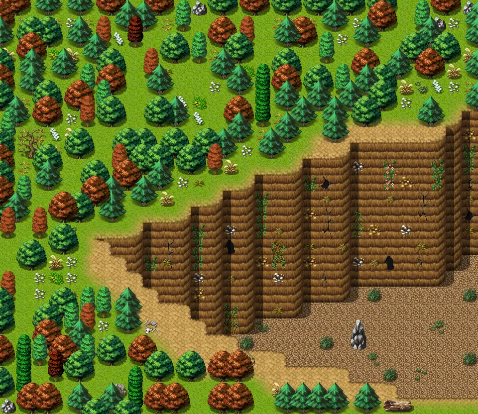

# Sullengard west ravine

30×26 tiles · outdoors · part of [World1](index.md)

<label class="lg"><input type="checkbox" data-t="spawn" checked><b>Red</b>&nbsp;Monsters / NPCs</label><label class="lg"><input type="checkbox" data-t="mapchange" checked><b>Blue</b>&nbsp;Exit to another map</label><label class="lg"><input type="checkbox" data-t="container" checked><b>Yellow</b>&nbsp;Container (click to see contents)</label><label class="lg"><input type="checkbox" data-t="sign" checked><b>Purple</b>&nbsp;Sign</label><label class="lg"><input type="checkbox" data-t="rest" checked><b>Green</b>&nbsp;Resting place</label><label class="lg"><input type="checkbox" data-t="key" checked><b>Orange dashed</b>&nbsp;Blocked until a quest step / item</label><label class="lg"><input type="checkbox" data-t="script"><b>Grey dotted</b>&nbsp;Scripted event</label><label class="lg"><input type="checkbox" data-t="replace"><b>White dotted</b>&nbsp;Changes during a quest</label>

## Exits

- [Sullengard woods1](sullengard_woods1.md)
- [Sullengard woods14](sullengard_woods14.md)
- [Sullengard woods2](sullengard_woods2.md)

## Monsters & NPCs here

| Name | HP |
|---|---|
| [Flying tree ant](../monsters/flying_tree_ant.md) | 119 |
| [Pixie Cort](../monsters/sull_forest_tree_fungus.md) | 160 |
| [Sullengard red forest snake](../monsters/sull_red_forest_snake.md) | 175 |
| [Huckleberreaper](../monsters/huckleber_reaper.md) | 265 |
| [Golden jackal](../monsters/golden_jackal.md) | 345 |

<small>Map ID: `sullengard_west_ravine` · Data from v0.8.18</small>
