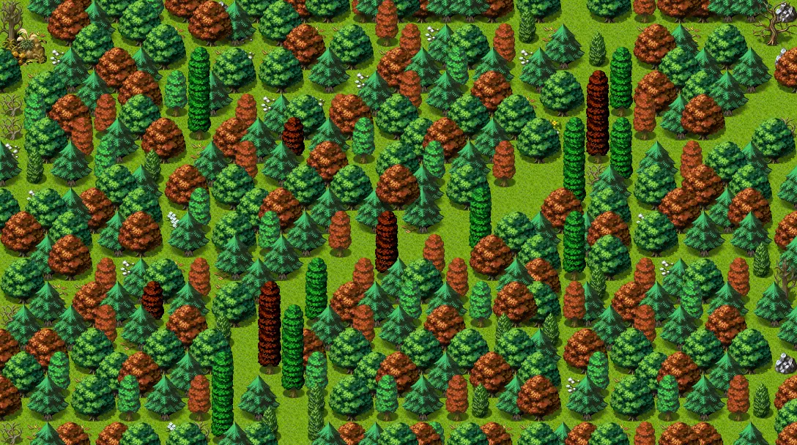

# Sullengard woods11

34×19 tiles · part of [World1](index.md)

<label class="lg"><input type="checkbox" data-t="spawn" checked><b>Red</b>&nbsp;Monsters / NPCs</label><label class="lg"><input type="checkbox" data-t="mapchange" checked><b>Blue</b>&nbsp;Exit to another map</label><label class="lg"><input type="checkbox" data-t="container" checked><b>Yellow</b>&nbsp;Container (click to see contents)</label><label class="lg"><input type="checkbox" data-t="sign" checked><b>Purple</b>&nbsp;Sign</label><label class="lg"><input type="checkbox" data-t="rest" checked><b>Green</b>&nbsp;Resting place</label><label class="lg"><input type="checkbox" data-t="key" checked><b>Orange dashed</b>&nbsp;Blocked until a quest step / item</label><label class="lg"><input type="checkbox" data-t="script"><b>Grey dotted</b>&nbsp;Scripted event</label><label class="lg"><input type="checkbox" data-t="replace"><b>White dotted</b>&nbsp;Changes during a quest</label>

## Exits

- [Sullengard woods10](sullengard_woods10.md)
- [Sullengard woods12](sullengard_woods12.md)
- [Sullengard woods4](sullengard_woods4.md)

## Monsters & NPCs here

| Name | HP |
|---|---|
| [Sullengard forest snake](../monsters/sullengard_venom_snake.md) | 148 |
| [Plague groundberry](../monsters/plague_groundberry.md) | 149 |
| [Broxwood](../monsters/broxwood.md) | 225 |

<small>Map ID: `sullengard_woods11` · Data from v0.8.18</small>
