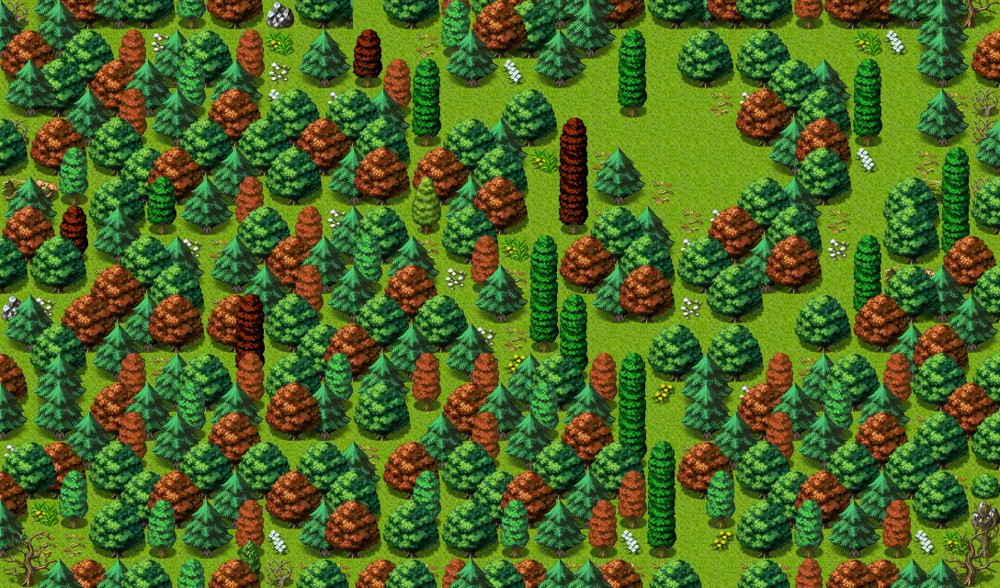

# Sullengard woods12

34×20 tiles · part of [World1](index.md)

<label class="lg lg-spawn"><input type="checkbox" data-t="spawn" checked> Monsters / NPCs</label><label class="lg lg-mapchange"><input type="checkbox" data-t="mapchange" checked> Exit to another map</label><label class="lg lg-container"><input type="checkbox" data-t="container" checked> Container</label><label class="lg lg-sign"><input type="checkbox" data-t="sign" checked> Sign</label><label class="lg lg-rest"><input type="checkbox" data-t="rest" checked> Resting place</label><label class="lg lg-key"><input type="checkbox" data-t="key" checked> Blocked / needs key or quest</label><label class="lg lg-script"><input type="checkbox" data-t="script"> Scripted event</label><label class="lg lg-replace"><input type="checkbox" data-t="replace"> Changes after a quest</label>

## Exits

- [Sullengard woods11](sullengard_woods11.md)
- [Sullengard woods13](sullengard_woods13.md)

## Monsters & NPCs here

| Name | HP |
|---|---|
| [Sullengard forest snake](../monsters/sullengard_venom_snake.md) | 148 |
| [Plague groundberry](../monsters/plague_groundberry.md) | 149 |
| [Broxwood](../monsters/broxwood.md) | 225 |
| [Golden jackal](../monsters/golden_jackal.md) | 345 |

<small>Map ID: `sullengard_woods12` · Data from v0.8.18</small>
