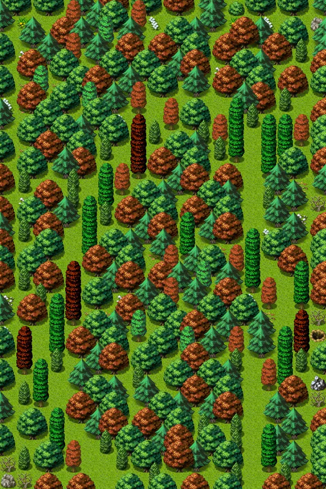

# Sullengard woods8

20×30 tiles · part of [World1](index.md)

<label class="lg lg-spawn"><input type="checkbox" data-t="spawn" checked> Monsters / NPCs</label><label class="lg lg-mapchange"><input type="checkbox" data-t="mapchange" checked> Exit to another map</label><label class="lg lg-container"><input type="checkbox" data-t="container" checked> Container</label><label class="lg lg-sign"><input type="checkbox" data-t="sign" checked> Sign</label><label class="lg lg-rest"><input type="checkbox" data-t="rest" checked> Resting place</label><label class="lg lg-key"><input type="checkbox" data-t="key" checked> Blocked / needs key or quest</label><label class="lg lg-script"><input type="checkbox" data-t="script"> Scripted event</label><label class="lg lg-replace"><input type="checkbox" data-t="replace"> Changes after a quest</label>

## Exits

- [Sullengard woods7](sullengard_woods7.md)
- [Way to sullengard east11](way_to_sullengard_east11.md)

## Monsters & NPCs here

| Name | HP |
|---|---|
| [Preabola fly](../monsters/preabola_fly.md) | 109 |
| [Sullengard forest snake](../monsters/sullengard_venom_snake.md) | 148 |

<small>Map ID: `sullengard_woods8` · Data from v0.8.18</small>
