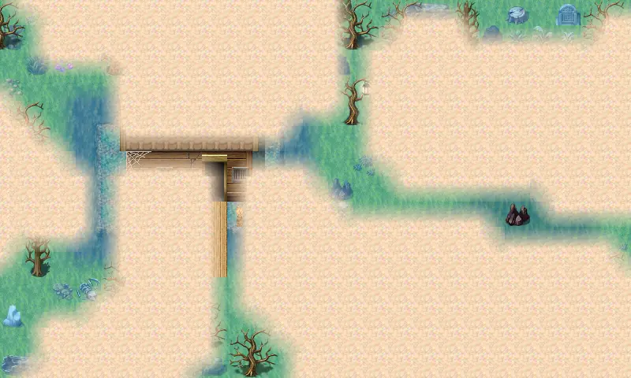

# Swamp3

| | |
|---|---|
| **Map ID** | `swamp3` |
| **Region** | Near Guynmart Castle (other) |
| **Type** | Outdoors |
| **Size** | 25×15 tiles |
| **World map** | [World1](index.md) |
| **Introduced** | [v0.8.12.1](../versions/0.8.12.1.md) |
| **NPCs** | 1 |
| **Enemy types** | 2 |
| **Quests** | 2 |
| **Containers** | 1 |

**Swamp3** is an outdoor map, near Guynmart Castle (other). It has 1 NPC and 2 kinds of enemy. Exits lead to Guynmart wood 13, Swamp2, Swamp4, Swamp6 and 1 more.

## Map

<label class="lg"><input type="checkbox" data-t="spawn" checked><b>Red</b>&nbsp;Monsters / NPCs</label><label class="lg"><input type="checkbox" data-t="mapchange" checked><b>Blue</b>&nbsp;Exit to another map</label><label class="lg"><input type="checkbox" data-t="container" checked><b>Yellow</b>&nbsp;Container (click to see contents)</label><label class="lg"><input type="checkbox" data-t="sign" checked><b>Purple</b>&nbsp;Sign</label><label class="lg"><input type="checkbox" data-t="rest" checked><b>Green</b>&nbsp;Resting place</label><label class="lg"><input type="checkbox" data-t="key" checked><b>Orange dashed</b>&nbsp;Blocked until a quest step / item</label><label class="lg"><input type="checkbox" data-t="script"><b>Grey dotted</b>&nbsp;Scripted event</label><label class="lg"><input type="checkbox" data-t="replace"><b>White dotted</b>&nbsp;Changes during a quest</label><label class="lg"><input type="checkbox" data-t="pin" checked><b>Numbers</b>&nbsp;Numbered key points (see the key below the map)</label>

<a class="pin pin-exit" href="#key-1" style="left:18.000%;top:3.333%" title="Exit (north): to [Guynmart wood 13](../guynmart_wood_13.md)">1</a><a class="pin pin-exit" href="#key-2" style="left:98.000%;top:53.333%" title="Exit (east): to [Swamp2](../swamp2.md)">2</a><a class="pin pin-exit" href="#key-3" style="left:50.000%;top:96.667%" title="Exit (south): to [Swamp4](../swamp4.md)">3</a><a class="pin pin-exit" href="#key-4" style="left:2.000%;top:53.333%" title="Exit (west): to [Swamp6](../swamp6.md)">4</a><a class="pin pin-exit" href="#key-5" style="left:34.000%;top:50.000%" title="Exit (door): to [Swamp hut](../swamp_hut.md)">5</a><a class="pin pin-exit" href="#key-5" style="left:38.000%;top:36.667%" title="Exit (door): to [Swamp hut](../swamp_hut.md)">5</a><a class="pin pin-npc" href="#key-6" style="left:34.000%;top:63.333%" title="[Shiny Foggerlump](../../monsters/feygard_fogmonster9.md): 1 quest">6</a><a class="pin pin-container" href="#key-7" style="left:22.000%;top:56.667%" title="Container 1: Gold coins">7</a><a class="pin pin-key" href="#key-8" style="left:30.000%;top:70.000%" title="Blocked passage: Unlocked during the quest: base_nondisplay (stage 2: “2=This stage is never set”)">8</a><a class="pin pin-replace" href="#key-9" style="left:8.000%;top:46.667%" title="Changes during a quest: This area changes during the quest: hidden story flag “feygard_fog” (stage 5: “5=Fog 5 has lifted”)">9</a><a class="pin pin-replace" href="#key-10" style="left:8.263%;top:41.667%" title="Changes during a quest: This area changes back during the quest: hidden story flag “feygard_fog” (stage 5: “5=Fog 5 has lifted”)">10</a><a class="pin pin-replace" href="#key-11" style="left:32.000%;top:56.667%" title="Changes during a quest: This area changes during the quest: hidden story flag “feygard_fog” (stage 4: “4=Fog 4 has lifted”)">11</a><a class="pin pin-replace" href="#key-11" style="left:22.263%;top:51.667%" title="Changes during a quest: This area changes during the quest: hidden story flag “feygard_fog” (stage 4: “4=Fog 4 has lifted”)">11</a><a class="pin pin-replace" href="#key-11" style="left:18.000%;top:86.667%" title="Changes during a quest: This area changes during the quest: hidden story flag “feygard_fog” (stage 4: “4=Fog 4 has lifted”)">11</a><a class="pin pin-replace" href="#key-12" style="left:28.480%;top:55.629%" title="Changes during a quest: This area changes back during the quest: hidden story flag “feygard_fog” (stage 4: “4=Fog 4 has lifted”)">12</a><a class="pin pin-replace" href="#key-12" style="left:24.018%;top:61.054%" title="Changes during a quest: This area changes back during the quest: hidden story flag “feygard_fog” (stage 4: “4=Fog 4 has lifted”)">12</a><a class="pin pin-replace" href="#key-12" style="left:18.263%;top:81.667%" title="Changes during a quest: This area changes back during the quest: hidden story flag “feygard_fog” (stage 4: “4=Fog 4 has lifted”)">12</a><a class="pin pin-replace" href="#key-13" style="left:46.000%;top:70.000%" title="Changes during a quest: This area changes during the quest: hidden story flag “feygard_fog” (stage 3: “3=Fog 3 has lifted”)">13</a><a class="pin pin-replace" href="#key-13" style="left:68.000%;top:76.667%" title="Changes during a quest: This area changes during the quest: hidden story flag “feygard_fog” (stage 3: “3=Fog 3 has lifted”)">13</a><a class="pin pin-replace" href="#key-13" style="left:90.000%;top:80.000%" title="Changes during a quest: This area changes during the quest: hidden story flag “feygard_fog” (stage 3: “3=Fog 3 has lifted”)">13</a><a class="pin pin-replace" href="#key-14" style="left:46.263%;top:65.001%" title="Changes during a quest: This area changes back during the quest: hidden story flag “feygard_fog” (stage 3: “3=Fog 3 has lifted”)">14</a><a class="pin pin-replace" href="#key-14" style="left:68.263%;top:71.667%" title="Changes during a quest: This area changes back during the quest: hidden story flag “feygard_fog” (stage 3: “3=Fog 3 has lifted”)">14</a><a class="pin pin-replace" href="#key-14" style="left:90.263%;top:75.001%" title="Changes during a quest: This area changes back during the quest: hidden story flag “feygard_fog” (stage 3: “3=Fog 3 has lifted”)">14</a><a class="pin pin-replace" href="#key-15" style="left:62.000%;top:26.667%" title="Changes during a quest: This area changes during the quest: hidden story flag “feygard_fog” (stage 2: “2=Fog 2 has lifted”)">15</a><a class="pin pin-replace" href="#key-15" style="left:74.000%;top:26.667%" title="Changes during a quest: This area changes during the quest: hidden story flag “feygard_fog” (stage 2: “2=Fog 2 has lifted”)">15</a><a class="pin pin-replace" href="#key-15" style="left:90.000%;top:29.583%" title="Changes during a quest: This area changes during the quest: hidden story flag “feygard_fog” (stage 2: “2=Fog 2 has lifted”)">15</a><a class="pin pin-replace" href="#key-16" style="left:62.263%;top:21.667%" title="Changes during a quest: This area changes back during the quest: hidden story flag “feygard_fog” (stage 2: “2=Fog 2 has lifted”)">16</a><a class="pin pin-replace" href="#key-16" style="left:74.263%;top:21.667%" title="Changes during a quest: This area changes back during the quest: hidden story flag “feygard_fog” (stage 2: “2=Fog 2 has lifted”)">16</a><a class="pin pin-replace" href="#key-16" style="left:90.263%;top:24.584%" title="Changes during a quest: This area changes back during the quest: hidden story flag “feygard_fog” (stage 2: “2=Fog 2 has lifted”)">16</a><a class="pin pin-replace" href="#key-17" style="left:36.000%;top:33.333%" title="Changes during a quest: This area changes during the quest: hidden story flag “feygard_fog” (stage 1: “1=Fog 1 has lifted”)">17</a><a class="pin pin-replace" href="#key-17" style="left:36.000%;top:23.333%" title="Changes during a quest: This area changes during the quest: hidden story flag “feygard_fog” (stage 1: “1=Fog 1 has lifted”)">17</a><a class="pin pin-replace" href="#key-17" style="left:28.000%;top:10.000%" title="Changes during a quest: This area changes during the quest: hidden story flag “feygard_fog” (stage 1: “1=Fog 1 has lifted”)">17</a><a class="pin pin-replace" href="#key-18" style="left:36.263%;top:28.334%" title="Changes during a quest: This area changes back during the quest: hidden story flag “feygard_fog” (stage 1: “1=Fog 1 has lifted”)">18</a><a class="pin pin-replace" href="#key-18" style="left:36.263%;top:18.334%" title="Changes during a quest: This area changes back during the quest: hidden story flag “feygard_fog” (stage 1: “1=Fog 1 has lifted”)">18</a><a class="pin pin-replace" href="#key-18" style="left:28.263%;top:5.001%" title="Changes during a quest: This area changes back during the quest: hidden story flag “feygard_fog” (stage 1: “1=Fog 1 has lifted”)">18</a>

??? abstract "Key to the numbers on the map"

    | # | What | Details |
    |---|---|---|
    | 1 | Exit (north) | to [Guynmart wood 13](../guynmart_wood_13.md) |
    | 2 | Exit (east) | to [Swamp2](../swamp2.md) |
    | 3 | Exit (south) | to [Swamp4](../swamp4.md) |
    | 4 | Exit (west) | to [Swamp6](../swamp6.md) |
    | 5 | Exit (door) | to [Swamp hut](../swamp_hut.md) |
    | 6 | [Shiny Foggerlump](../monsters/feygard_fogmonster9.md) | 1 quest |
    | 7 | Container 1 | Gold coins |
    | 8 | Blocked passage | Unlocked during the quest: base_nondisplay (stage 2: “2=This stage is never set”) |
    | 9 | Changes during a quest | This area changes during the quest: hidden story flag “feygard_fog” (stage 5: “5=Fog 5 has lifted”) |
    | 10 | Changes during a quest | This area changes back during the quest: hidden story flag “feygard_fog” (stage 5: “5=Fog 5 has lifted”) |
    | 11 | Changes during a quest | This area changes during the quest: hidden story flag “feygard_fog” (stage 4: “4=Fog 4 has lifted”) |
    | 12 | Changes during a quest | This area changes back during the quest: hidden story flag “feygard_fog” (stage 4: “4=Fog 4 has lifted”) |
    | 13 | Changes during a quest | This area changes during the quest: hidden story flag “feygard_fog” (stage 3: “3=Fog 3 has lifted”) |
    | 14 | Changes during a quest | This area changes back during the quest: hidden story flag “feygard_fog” (stage 3: “3=Fog 3 has lifted”) |
    | 15 | Changes during a quest | This area changes during the quest: hidden story flag “feygard_fog” (stage 2: “2=Fog 2 has lifted”) |
    | 16 | Changes during a quest | This area changes back during the quest: hidden story flag “feygard_fog” (stage 2: “2=Fog 2 has lifted”) |
    | 17 | Changes during a quest | This area changes during the quest: hidden story flag “feygard_fog” (stage 1: “1=Fog 1 has lifted”) |
    | 18 | Changes during a quest | This area changes back during the quest: hidden story flag “feygard_fog” (stage 1: “1=Fog 1 has lifted”) |

Verified against v0.8.18 map data.

## Connections

| Direction | Leads to | Region there | Map # |
|---|---|---|---|
| North | [Guynmart wood 13](guynmart_wood_13.md) | Guynmart Castle | 1 |
| East | [Swamp2](swamp2.md) | – | 2 |
| South | [Swamp4](swamp4.md) | – | 3 |
| West | [Swamp6](swamp6.md) | – | 4 |
| Door | [Swamp hut](swamp_hut.md) | – | 5 |

## NPCs

- [Shiny Foggerlump](../monsters/feygard_fogmonster9.md) — quests: [Fog in the woods](../quests/fogmonster.md) (#6)

## Enemies

| Enemy | HP | Damage | Up to | Notes |
|---|---|---|---|---|
| [Grasslands snake](../monsters/grass_snake.md) | 36 | 0–6 | 2 | shares spawn with Tough grasslands snake |
| [Tough grasslands snake](../monsters/grass_snake2.md) | 38 | 1–7 | 2 | shares spawn with Grasslands snake |

<small>“Up to” is the most that can be alive at once from the spawn areas on this map.</small>

## Items & containers

<b>Container 1</b><ul><li><a href="../../items/gold/">Gold coins</a> <small>100% · ×500 to 900</small></li></ul>

## Quests

- [base_nondisplay](../quests/base_nondisplay.md): blocked passage opens at stage 2
- [Fog in the woods](../quests/fogmonster.md): [Shiny Foggerlump](../monsters/feygard_fogmonster9.md) is involved
- [feygard fog (hidden flag)](../quests/feygard_fog.md): part of the map changes at stage 1; part of the map changes at stage 2; part of the map changes at stage 3; part of the map changes at stage 4; part of the map changes at stage 5

## Points of interest

- **Blocked passage** (#8): Unlocked during the quest: base_nondisplay (stage 2: “2=This stage is never set”)
- **Changes during a quest** (#9): This area changes during the quest: hidden story flag “feygard_fog” (stage 5: “5=Fog 5 has lifted”)
- **Changes during a quest** (#10): This area changes back during the quest: hidden story flag “feygard_fog” (stage 5: “5=Fog 5 has lifted”)
- **Changes during a quest** (#11): This area changes during the quest: hidden story flag “feygard_fog” (stage 4: “4=Fog 4 has lifted”)
- **Changes during a quest** (#12): This area changes back during the quest: hidden story flag “feygard_fog” (stage 4: “4=Fog 4 has lifted”)
- **Changes during a quest** (#13): This area changes during the quest: hidden story flag “feygard_fog” (stage 3: “3=Fog 3 has lifted”)
- **Changes during a quest** (#14): This area changes back during the quest: hidden story flag “feygard_fog” (stage 3: “3=Fog 3 has lifted”)
- **Changes during a quest** (#15): This area changes during the quest: hidden story flag “feygard_fog” (stage 2: “2=Fog 2 has lifted”)
- **Changes during a quest** (#16): This area changes back during the quest: hidden story flag “feygard_fog” (stage 2: “2=Fog 2 has lifted”)
- **Changes during a quest** (#17): This area changes during the quest: hidden story flag “feygard_fog” (stage 1: “1=Fog 1 has lifted”)
- **Changes during a quest** (#18): This area changes back during the quest: hidden story flag “feygard_fog” (stage 1: “1=Fog 1 has lifted”)

## Version history

| Version | Change |
|---|---|
| [v0.8.12.1](../versions/0.8.12.1.md) | Added |

Verified against v0.8.18 and every earlier release back to v0.7.0 (game data compared release by release).

## Community notes

<small>Written by players, not generated from game data. **Observations**: what players notice in-game · **Lore**: the in-world story · **Trivia**: real-world facts, references, development history · **Theory / speculation**: unconfirmed ideas; may just be unfinished content</small>

### Observations

*Nothing here yet. Know something? [Add it](https://github.com/asdfghjkl628/Andor-s-Trail-Wikiiii/new/main/notes/maps?filename=swamp3.md&value=%23%23%20Observations%0A%0A%3C%21--%20what%20players%20notice%20in-game%20--%3E%0A%0A%23%23%20Lore%0A%0A%3C%21--%20the%20in-world%20story%20--%3E%0A%0A%23%23%20Trivia%0A%0A%3C%21--%20real-world%20facts%2C%20references%2C%20development%20history%20--%3E%0A%0A%23%23%20Theory%20/%20speculation%0A%0A%3C%21--%20unconfirmed%20ideas%3B%20may%20just%20be%20unfinished%20content%20--%3E%0A).*

### Lore

*Nothing here yet. Know something? [Add it](https://github.com/asdfghjkl628/Andor-s-Trail-Wikiiii/new/main/notes/maps?filename=swamp3.md&value=%23%23%20Observations%0A%0A%3C%21--%20what%20players%20notice%20in-game%20--%3E%0A%0A%23%23%20Lore%0A%0A%3C%21--%20the%20in-world%20story%20--%3E%0A%0A%23%23%20Trivia%0A%0A%3C%21--%20real-world%20facts%2C%20references%2C%20development%20history%20--%3E%0A%0A%23%23%20Theory%20/%20speculation%0A%0A%3C%21--%20unconfirmed%20ideas%3B%20may%20just%20be%20unfinished%20content%20--%3E%0A).*

### Trivia

*Nothing here yet. Know something? [Add it](https://github.com/asdfghjkl628/Andor-s-Trail-Wikiiii/new/main/notes/maps?filename=swamp3.md&value=%23%23%20Observations%0A%0A%3C%21--%20what%20players%20notice%20in-game%20--%3E%0A%0A%23%23%20Lore%0A%0A%3C%21--%20the%20in-world%20story%20--%3E%0A%0A%23%23%20Trivia%0A%0A%3C%21--%20real-world%20facts%2C%20references%2C%20development%20history%20--%3E%0A%0A%23%23%20Theory%20/%20speculation%0A%0A%3C%21--%20unconfirmed%20ideas%3B%20may%20just%20be%20unfinished%20content%20--%3E%0A).*

### Theory / speculation

*Nothing here yet. Know something? [Add it](https://github.com/asdfghjkl628/Andor-s-Trail-Wikiiii/new/main/notes/maps?filename=swamp3.md&value=%23%23%20Observations%0A%0A%3C%21--%20what%20players%20notice%20in-game%20--%3E%0A%0A%23%23%20Lore%0A%0A%3C%21--%20the%20in-world%20story%20--%3E%0A%0A%23%23%20Trivia%0A%0A%3C%21--%20real-world%20facts%2C%20references%2C%20development%20history%20--%3E%0A%0A%23%23%20Theory%20/%20speculation%0A%0A%3C%21--%20unconfirmed%20ideas%3B%20may%20just%20be%20unfinished%20content%20--%3E%0A).*

??? info "Technical information"

    | | |
    |---|---|
    | Map ID | `swamp3` |
    | File | `res/xml/swamp3.tmx` |
    | Size | 25×15 tiles (800×480 px) |
    | outdoors property | 1 |
    | Layers drawn | base, ground, objects, above, top |
    | Tilesets | map_bed_1, map_border_1, map_bridge_1, map_bridge_2, map_broken_1, map_cavewall_1, map_cavewall_2, map_cavewall_3, map_cavewall_4, map_chair_table_1, map_chair_table_2, map_crate_1, map_cupboard_1, map_curtain_1, map_entrance_1, map_entrance_2, map_fence_1, map_fence_2, map_fence_3, map_fence_4, map_ground_1, map_ground_2, map_ground_3, map_ground_4, map_ground_5, map_ground_6, map_ground_7, map_ground_8, map_guynmart, map_house_1, map_house_2, map_indoor_1, map_indoor_2, map_kitchen_1, map_outdoor_1, map_pillar_1, map_pillar_2, map_plant_1, map_plant_2, map_rock_1, map_rock_2, map_roof_1, map_roof_2, map_roof_3, map_shop_1, map_sign_ladder_1, map_table_1, map_trail_1, map_transition_1, map_transition_2, map_transition_3, map_transition_4, map_transition_5, map_tree_1, map_tree_2, map_wall_1, map_wall_2, map_wall_3, map_wall_4, map_window_1, map_window_2 |
    | Map objects | replace: 26, mapchange: 6, spawn: 2, container: 1, key: 1 |
    | World map position | segment `world1`, x 70, y 253 |

<small>Data from v0.8.18</small>
