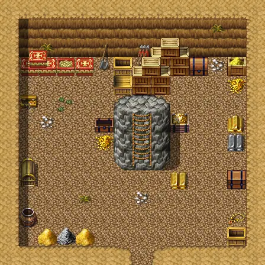
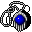

# Thieves vault

14×14 tiles

<label class="lg"><input type="checkbox" data-t="spawn" checked><b>Red</b>&nbsp;Monsters / NPCs</label><label class="lg"><input type="checkbox" data-t="mapchange" checked><b>Blue</b>&nbsp;Exit to another map</label><label class="lg"><input type="checkbox" data-t="container" checked><b>Yellow</b>&nbsp;Container (click to see contents)</label><label class="lg"><input type="checkbox" data-t="sign" checked><b>Purple</b>&nbsp;Sign</label><label class="lg"><input type="checkbox" data-t="rest" checked><b>Green</b>&nbsp;Resting place</label><label class="lg"><input type="checkbox" data-t="key" checked><b>Orange dashed</b>&nbsp;Blocked until a quest step / item</label><label class="lg"><input type="checkbox" data-t="script"><b>Grey dotted</b>&nbsp;Scripted event</label><label class="lg"><input type="checkbox" data-t="replace"><b>White dotted</b>&nbsp;Changes during a quest</label>

## Containers

<b>Container 1</b><ul><li><a href="../../items/feygard_necklace/">Necklace of Feygard&#x27;s Glory</a> <small>100%</small></li><li><a href="../../items/gold/">Gold coins</a> <small>100% · ×4400 to 5000</small></li></ul>

<b>Container 2</b><ul><li><a href="../../items/silver_coin/">Silver coin</a> <small>100% · ×30 to 35</small></li></ul>

<b>Container 3</b><ul><li><a href="../../items/gold/">Gold coins</a> <small>100% · ×375 to 1500</small></li></ul>

<b>Container 4</b><ul><li><a href="../../items/gold/">Gold coins</a> <small>100% · ×375 to 1500</small></li></ul>

<b>Container 5</b><ul><li><a href="../../items/gold/">Gold coins</a> <small>100% · ×375 to 1500</small></li></ul>

<b>Container 6</b><ul><li><a href="../../items/gold/">Gold coins</a> <small>100% · ×375 to 1500</small></li></ul>

<b>Container 7</b><ul><li><a href="../../items/silver_coin/">Silver coin</a> <small>100% · ×30 to 35</small></li></ul>

<b>Container 8</b><ul><li><a href="../../items/gold/">Gold coins</a> <small>100% · ×375 to 1500</small></li></ul>

<b>Container 9</b><ul><li><a href="../../items/bronze_coin/">Bronze coin</a> <small>100% · ×50 to 60</small></li></ul>

<b>Container 10</b><ul><li><a href="../../items/old_lady_ring/">Garnet whisper ring</a> <small>100%</small></li><li><a href="../../items/necklace_dexterity/">Necklace of dexterity</a> <small>100%</small></li><li><a href="../../items/necklace_shield2/">Shielding necklace</a> <small>100%</small></li></ul>

## Exits

- [Thieves vault tunnel](thieves_vault_tunnel.md)
- [Wild6](wild6.md)

<small>Map ID: `thieves_vault` · Data from v0.8.18</small>
