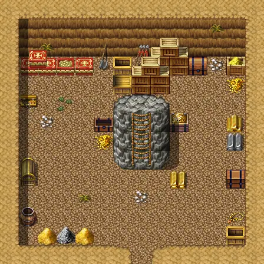
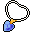

# Thieves vault

| | |
|---|---|
| **Map ID** | `thieves_vault` |
| **Region** | In Blackwater Mountain (other) |
| **Type** | Indoors / underground |
| **Size** | 14×14 tiles |
| **Introduced** | [v0.8.8](../versions/0.8.8.md) |
| **Quests** | 0 |
| **Containers** | 10 |

**Thieves vault** is an indoor map, in Blackwater Mountain (other). It has no NPCs, and no enemies. Exits lead to Thieves vault tunnel, Wild6.

## Map

<label class="lg"><input type="checkbox" data-t="spawn" checked><b>Red</b>&nbsp;Monsters / NPCs</label><label class="lg"><input type="checkbox" data-t="mapchange" checked><b>Blue</b>&nbsp;Exit to another map</label><label class="lg"><input type="checkbox" data-t="container" checked><b>Yellow</b>&nbsp;Container (click to see contents)</label><label class="lg"><input type="checkbox" data-t="sign" checked><b>Purple</b>&nbsp;Sign</label><label class="lg"><input type="checkbox" data-t="rest" checked><b>Green</b>&nbsp;Resting place</label><label class="lg"><input type="checkbox" data-t="key" checked><b>Orange dashed</b>&nbsp;Blocked until a quest step / item</label><label class="lg"><input type="checkbox" data-t="script"><b>Grey dotted</b>&nbsp;Scripted event</label><label class="lg"><input type="checkbox" data-t="replace"><b>White dotted</b>&nbsp;Changes during a quest</label><label class="lg"><input type="checkbox" data-t="pin" checked><b>Numbers</b>&nbsp;Numbered key points (see the key below the map)</label>

<a class="pin pin-exit" href="#key-1" style="left:53.571%;top:96.429%" title="Exit (south): to [Thieves vault tunnel](thieves_vault_tunnel.md)">1</a><a class="pin pin-exit" href="#key-2" style="left:53.571%;top:39.286%" title="Exit (exit outside): to [Wild6](wild6.md)">2</a><a class="pin pin-container" href="#key-3" style="left:46.429%;top:25.000%" title="Container 1: Necklace of Feygard&#x27;s Glory, Gold coins">3</a><a class="pin pin-container" href="#key-4" style="left:25.000%;top:89.286%" title="Container 2: Silver coin">4</a><a class="pin pin-container" href="#key-5" style="left:17.857%;top:89.286%" title="Container 3: Gold coins">5</a><a class="pin pin-container" href="#key-6" style="left:89.286%;top:32.143%" title="Container 4: Gold coins">6</a><a class="pin pin-container" href="#key-7" style="left:89.286%;top:25.000%" title="Container 5: Gold coins">7</a><a class="pin pin-container" href="#key-8" style="left:67.857%;top:46.429%" title="Container 6: Gold coins">8</a><a class="pin pin-container" href="#key-9" style="left:25.000%;top:25.000%" title="Container 7: Silver coin">9</a><a class="pin pin-container" href="#key-10" style="left:39.286%;top:53.571%" title="Container 8: Gold coins">10</a><a class="pin pin-container" href="#key-11" style="left:32.143%;top:89.286%" title="Container 9: Bronze coin">11</a><a class="pin pin-container" href="#key-12" style="left:10.714%;top:39.286%" title="Container 10: Garnet whisper ring, Necklace of dexterity, Shielding necklace">12</a>

??? abstract "Key to the numbers on the map"

    | # | What | Details |
    |---|---|---|
    | 1 | Exit (south) | to [Thieves vault tunnel](thieves_vault_tunnel.md) |
    | 2 | Exit (exit outside) | to [Wild6](wild6.md) |
    | 3 | Container 1 | Necklace of Feygard's Glory, Gold coins |
    | 4 | Container 2 | Silver coin |
    | 5 | Container 3 | Gold coins |
    | 6 | Container 4 | Gold coins |
    | 7 | Container 5 | Gold coins |
    | 8 | Container 6 | Gold coins |
    | 9 | Container 7 | Silver coin |
    | 10 | Container 8 | Gold coins |
    | 11 | Container 9 | Bronze coin |
    | 12 | Container 10 | Garnet whisper ring, Necklace of dexterity, Shielding necklace |

Verified against v0.8.18 map data.

## Connections

| Direction | Leads to | Region there | Map # |
|---|---|---|---|
| South | [Thieves vault tunnel](thieves_vault_tunnel.md) | Blackwater Mountain | 1 |
| Exit outside | [Wild6](wild6.md) | Blackwater Mountain | 2 |

## Items & containers

<b>Container 1</b><ul><li><a href="../../items/feygard_necklace/">Necklace of Feygard&#x27;s Glory</a> <small>100%</small></li><li><a href="../../items/gold/">Gold coins</a> <small>100% · ×4400 to 5000</small></li></ul>

<b>Container 2</b><ul><li><a href="../../items/silver_coin/">Silver coin</a> <small>100% · ×30 to 35</small></li></ul>

<b>Container 3</b><ul><li><a href="../../items/gold/">Gold coins</a> <small>100% · ×375 to 1500</small></li></ul>

<b>Container 4</b><ul><li><a href="../../items/gold/">Gold coins</a> <small>100% · ×375 to 1500</small></li></ul>

<b>Container 5</b><ul><li><a href="../../items/gold/">Gold coins</a> <small>100% · ×375 to 1500</small></li></ul>

<b>Container 6</b><ul><li><a href="../../items/gold/">Gold coins</a> <small>100% · ×375 to 1500</small></li></ul>

<b>Container 7</b><ul><li><a href="../../items/silver_coin/">Silver coin</a> <small>100% · ×30 to 35</small></li></ul>

<b>Container 8</b><ul><li><a href="../../items/gold/">Gold coins</a> <small>100% · ×375 to 1500</small></li></ul>

<b>Container 9</b><ul><li><a href="../../items/bronze_coin/">Bronze coin</a> <small>100% · ×50 to 60</small></li></ul>

<b>Container 10</b><ul><li><a href="../../items/old_lady_ring/">Garnet whisper ring</a> <small>100%</small></li><li><a href="../../items/necklace_dexterity/">Necklace of dexterity</a> <small>100%</small></li><li><a href="../../items/necklace_shield2/">Shielding necklace</a> <small>100%</small></li></ul>

## Version history

| Version | Change |
|---|---|
| [v0.8.8](../versions/0.8.8.md) | Added |
| [v0.8.12.1](../versions/0.8.12.1.md) | Map layout or objects changed |

Verified against v0.8.18 and every earlier release back to v0.7.0 (game data compared release by release).

## Community notes

<small>Written by players, not generated from game data. **Observations**: what players notice in-game · **Lore**: the in-world story · **Trivia**: real-world facts, references, development history · **Theory / speculation**: unconfirmed ideas; may just be unfinished content</small>

### Observations

*No notes yet. Contributions are welcome: [add a note](https://github.com/asdfghjkl628/Andor-s-Trail-Wikiiii/new/main/notes/maps?filename=thieves_vault.md&value=%23%23%20Observations%0A%0A%3C%21--%20what%20players%20notice%20in-game%20--%3E%0A%0A%23%23%20Lore%0A%0A%3C%21--%20the%20in-world%20story%20--%3E%0A%0A%23%23%20Trivia%0A%0A%3C%21--%20real-world%20facts%2C%20references%2C%20development%20history%20--%3E%0A%0A%23%23%20Theory%20/%20speculation%0A%0A%3C%21--%20unconfirmed%20ideas%3B%20may%20just%20be%20unfinished%20content%20--%3E%0A).*

### Lore

*No notes yet. Contributions are welcome: [add a note](https://github.com/asdfghjkl628/Andor-s-Trail-Wikiiii/new/main/notes/maps?filename=thieves_vault.md&value=%23%23%20Observations%0A%0A%3C%21--%20what%20players%20notice%20in-game%20--%3E%0A%0A%23%23%20Lore%0A%0A%3C%21--%20the%20in-world%20story%20--%3E%0A%0A%23%23%20Trivia%0A%0A%3C%21--%20real-world%20facts%2C%20references%2C%20development%20history%20--%3E%0A%0A%23%23%20Theory%20/%20speculation%0A%0A%3C%21--%20unconfirmed%20ideas%3B%20may%20just%20be%20unfinished%20content%20--%3E%0A).*

### Trivia

*No notes yet. Contributions are welcome: [add a note](https://github.com/asdfghjkl628/Andor-s-Trail-Wikiiii/new/main/notes/maps?filename=thieves_vault.md&value=%23%23%20Observations%0A%0A%3C%21--%20what%20players%20notice%20in-game%20--%3E%0A%0A%23%23%20Lore%0A%0A%3C%21--%20the%20in-world%20story%20--%3E%0A%0A%23%23%20Trivia%0A%0A%3C%21--%20real-world%20facts%2C%20references%2C%20development%20history%20--%3E%0A%0A%23%23%20Theory%20/%20speculation%0A%0A%3C%21--%20unconfirmed%20ideas%3B%20may%20just%20be%20unfinished%20content%20--%3E%0A).*

### Theory / speculation

*No notes yet. Contributions are welcome: [add a note](https://github.com/asdfghjkl628/Andor-s-Trail-Wikiiii/new/main/notes/maps?filename=thieves_vault.md&value=%23%23%20Observations%0A%0A%3C%21--%20what%20players%20notice%20in-game%20--%3E%0A%0A%23%23%20Lore%0A%0A%3C%21--%20the%20in-world%20story%20--%3E%0A%0A%23%23%20Trivia%0A%0A%3C%21--%20real-world%20facts%2C%20references%2C%20development%20history%20--%3E%0A%0A%23%23%20Theory%20/%20speculation%0A%0A%3C%21--%20unconfirmed%20ideas%3B%20may%20just%20be%20unfinished%20content%20--%3E%0A).*

??? info "Technical information"

    | | |
    |---|---|
    | Map ID | `thieves_vault` |
    | File | `res/xml/thieves_vault.tmx` |
    | Size | 14×14 tiles (448×448 px) |
    | outdoors property | – |
    | Layers drawn | ground, objects, above, top |
    | Tilesets | map_bed_1, map_border_1, map_bridge_1, map_bridge_2, map_broken_1, map_cavewall_1, map_cavewall_2, map_cavewall_3, map_cavewall_4, map_chair_table_1, map_chair_table_2, map_crate_1, map_cupboard_1, map_curtain_1, map_entrance_1, map_entrance_2, map_fence_1, map_fence_2, map_fence_3, map_fence_4, map_ground_1, map_ground_2, map_ground_3, map_ground_4, map_ground_5, map_ground_6, map_ground_7, map_ground_8, map_house_1, map_house_2, map_indoor_1, map_indoor_2, map_kitchen_1, map_outdoor_1, map_pillar_1, map_pillar_2, map_plant_1, map_plant_2, map_rock_1, map_rock_2, map_roof_1, map_roof_2, map_roof_3, map_shop_1, map_sign_ladder_1, map_table_1, map_trail_1, map_transition_1, map_transition_2, map_transition_3, map_transition_4, map_transition_5, map_tree_1, map_tree_2, map_wall_1, map_wall_2, map_wall_3, map_wall_4, map_window_1, map_window_2 |
    | Map objects | container: 10, mapchange: 2 |
    | World map position | – |

<small>Data from v0.8.18</small>
