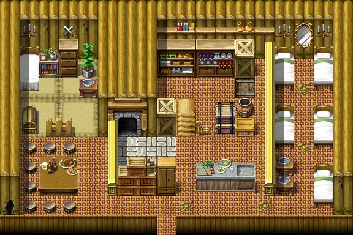

# Tradehouse0

| | |
|---|---|
| **Map ID** | `tradehouse0` |
| **Region** | In Prim (settlement) |
| **Type** | Indoors / underground |
| **Size** | 18×12 tiles |
| **Introduced** | v0.7.0 or earlier |
| **NPCs** | 4 |
| **Enemy types** | 1 |
| **Quests** | 3 |

**Tradehouse0** is an indoor map, in Prim (settlement). It has 4 NPCs and 1 kind of enemy. Exits lead to Waytominingtown2, Stoutford castle barrack2, Tradehouse0a.

## Map

<label class="lg"><input type="checkbox" data-t="spawn" checked><b>Red</b>&nbsp;Monsters / NPCs</label><label class="lg"><input type="checkbox" data-t="mapchange" checked><b>Blue</b>&nbsp;Exit to another map</label><label class="lg"><input type="checkbox" data-t="container" checked><b>Yellow</b>&nbsp;Container (click to see contents)</label><label class="lg"><input type="checkbox" data-t="sign" checked><b>Purple</b>&nbsp;Sign</label><label class="lg"><input type="checkbox" data-t="rest" checked><b>Green</b>&nbsp;Resting place</label><label class="lg"><input type="checkbox" data-t="key" checked><b>Orange dashed</b>&nbsp;Blocked until a quest step / item</label><label class="lg"><input type="checkbox" data-t="script"><b>Grey dotted</b>&nbsp;Scripted event</label><label class="lg"><input type="checkbox" data-t="replace"><b>White dotted</b>&nbsp;Changes during a quest</label><label class="lg"><input type="checkbox" data-t="pin" checked><b>Numbers</b>&nbsp;Numbered key points (see the key below the map)</label>

<a class="pin pin-exit" href="#key-1" style="left:47.222%;top:95.833%" title="Exit (south): to [Waytominingtown2](waytominingtown2.md)">1</a><a class="pin pin-exit" href="#key-2" style="left:8.333%;top:29.167%" title="Exit (west): to [Stoutford castle barrack2](stoutford_castle_barrack2.md)">2</a><a class="pin pin-exit" href="#key-3" style="left:69.444%;top:37.500%" title="Exit (stairs / passage): to [Tradehouse0a](tradehouse0a.md)">3</a><a id="pin-npc-drashad" class="pin pin-npc" href="#key-4" style="left:13.889%;top:87.500%" title="[Drashad](../../monsters/drashad.md): 1 quest">4</a><a id="pin-npc-kantya" class="pin pin-npc" href="#key-5" style="left:19.444%;top:45.833%" title="[Kantya](../../monsters/kantya.md): 2 quests">5</a><a id="pin-npc-khorailla" class="pin pin-npc" href="#key-6" style="left:69.444%;top:62.500%" title="[Khorailla](../../monsters/khorailla.md): shopkeeper, 1 quest">6</a><a id="pin-npc-maevalia" class="pin pin-npc" href="#key-7" style="left:41.667%;top:62.500%" title="[Maevalia](../../monsters/maevalia.md): 2 quests">7</a><a class="pin pin-rest" href="#key-8" style="left:80.556%;top:29.167%" title="Resting place: Rest here to heal and set your respawn point">8</a><a class="pin pin-rest" href="#key-8" style="left:91.667%;top:29.167%" title="Resting place: Rest here to heal and set your respawn point">8</a><a class="pin pin-rest" href="#key-8" style="left:80.556%;top:54.167%" title="Resting place: Rest here to heal and set your respawn point">8</a><a class="pin pin-rest" href="#key-8" style="left:91.667%;top:54.167%" title="Resting place: Rest here to heal and set your respawn point">8</a><a class="pin pin-rest" href="#key-8" style="left:91.667%;top:79.167%" title="Resting place: Rest here to heal and set your respawn point">8</a><a class="pin pin-key" href="#key-9" style="left:80.556%;top:87.500%" title="Blocked passage: Unlocked during the quest: Destined for great things (stage 115: “Maevalia thanked me for helping the people of Charwood.”)">9</a><a class="pin pin-key" href="#key-10" style="left:8.699%;top:22.917%" title="Blocked passage: Unlocked during the quest: base_nondisplay (stage 1: “1=Developers Debug Version active”)">10</a>

??? abstract "Key to the numbers on the map"

    | # | What | Details |
    |---|---|---|
    | 1 | Exit (south) | to [Waytominingtown2](waytominingtown2.md) |
    | 2 | Exit (west) | to [Stoutford castle barrack2](stoutford_castle_barrack2.md) |
    | 3 | Exit (stairs / passage) | to [Tradehouse0a](tradehouse0a.md) |
    | 4 | [Drashad](../monsters/drashad.md) | 1 quest |
    | 5 | [Kantya](../monsters/kantya.md) | 2 quests |
    | 6 | [Khorailla](../monsters/khorailla.md) | shopkeeper, 1 quest |
    | 7 | [Maevalia](../monsters/maevalia.md) | 2 quests |
    | 8 | Resting place | Rest here to heal and set your respawn point |
    | 9 | Blocked passage | Unlocked during the quest: Destined for great things (stage 115: “Maevalia thanked me for helping the people of Charwood.”) |
    | 10 | Blocked passage | Unlocked during the quest: base_nondisplay (stage 1: “1=Developers Debug Version active”) |

Verified against v0.8.18 map data.

## Connections

| Direction | Leads to | Region there | Map # |
|---|---|---|---|
| South | [Waytominingtown2](waytominingtown2.md) | Foaming Flask Tavern | 1 |
| West | [Stoutford castle barrack2](stoutford_castle_barrack2.md) | Prim | 2 |
| Stairs / passage | [Tradehouse0a](tradehouse0a.md) | – | 3 |

## NPCs

- [Drashad](../monsters/drashad.md) — quests: [Destined for great things](../quests/charwood1.md) (#4)
- [Kantya](../monsters/kantya.md) — quests: [Destined for great things](../quests/charwood1.md), [Trial by fire](../quests/charwood2.md) (#5)
- [Khorailla](../monsters/khorailla.md) — shopkeeper — quests: [Destined for great things](../quests/charwood1.md) (#6)
- [Maevalia](../monsters/maevalia.md) — quests: [Destined for great things](../quests/charwood1.md), [Trial by fire](../quests/charwood2.md) (#7)

## Enemies

| Enemy | HP | Damage | Up to | Notes |
|---|---|---|---|---|
| [Khorailla](../monsters/khorailla.md#v-khorailla_cheddar) | 0 | 0–0 | 1 | – |

<small>“Up to” is the most that can be alive at once from the spawn areas on this map.</small>

## Items & containers

**Shops:** [Khorailla](../monsters/khorailla.md)

## Quests

- [base_nondisplay](../quests/base_nondisplay.md): blocked passage opens at stage 1
- [Destined for great things](../quests/charwood1.md): [Drashad](../monsters/drashad.md) is involved; [Kantya](../monsters/kantya.md) is involved; [Khorailla](../monsters/khorailla.md) is involved; [Maevalia](../monsters/maevalia.md) is involved; blocked passage opens at stage 115
- [Trial by fire](../quests/charwood2.md): [Kantya](../monsters/kantya.md) is involved; [Maevalia](../monsters/maevalia.md) is involved

## Points of interest

- **Resting place** (#8): Rest here to heal and set your respawn point
- **Blocked passage** (#9): Unlocked during the quest: Destined for great things (stage 115: “Maevalia thanked me for helping the people of Charwood.”)
- **Blocked passage** (#10): Unlocked during the quest: base_nondisplay (stage 1: “1=Developers Debug Version active”)

## Version history

| Version | Change |
|---|---|
| [v0.7.0](../versions/0.7.0.md) | Present in v0.7.0 (earliest release tracked) |
| [v0.7.1](../versions/0.7.1.md) | Map layout or objects changed |
| [v0.7.2](../versions/0.7.2.md) | Map layout or objects changed |

Verified against v0.8.18 and every earlier release back to v0.7.0 (game data compared release by release).

## Community notes

<small>Written by players, not generated from game data. **Observations**: what players notice in-game · **Lore**: the in-world story · **Trivia**: real-world facts, references, development history · **Theory / speculation**: unconfirmed ideas; may just be unfinished content</small>

### Observations

*No notes yet. Contributions are welcome: [add a note](https://github.com/asdfghjkl628/Andor-s-Trail-Wikiiii/new/main/notes/maps?filename=tradehouse0.md&value=%23%23%20Observations%0A%0A%3C%21--%20what%20players%20notice%20in-game%20--%3E%0A%0A%23%23%20Lore%0A%0A%3C%21--%20the%20in-world%20story%20--%3E%0A%0A%23%23%20Trivia%0A%0A%3C%21--%20real-world%20facts%2C%20references%2C%20development%20history%20--%3E%0A%0A%23%23%20Theory%20/%20speculation%0A%0A%3C%21--%20unconfirmed%20ideas%3B%20may%20just%20be%20unfinished%20content%20--%3E%0A).*

### Lore

*No notes yet. Contributions are welcome: [add a note](https://github.com/asdfghjkl628/Andor-s-Trail-Wikiiii/new/main/notes/maps?filename=tradehouse0.md&value=%23%23%20Observations%0A%0A%3C%21--%20what%20players%20notice%20in-game%20--%3E%0A%0A%23%23%20Lore%0A%0A%3C%21--%20the%20in-world%20story%20--%3E%0A%0A%23%23%20Trivia%0A%0A%3C%21--%20real-world%20facts%2C%20references%2C%20development%20history%20--%3E%0A%0A%23%23%20Theory%20/%20speculation%0A%0A%3C%21--%20unconfirmed%20ideas%3B%20may%20just%20be%20unfinished%20content%20--%3E%0A).*

### Trivia

*No notes yet. Contributions are welcome: [add a note](https://github.com/asdfghjkl628/Andor-s-Trail-Wikiiii/new/main/notes/maps?filename=tradehouse0.md&value=%23%23%20Observations%0A%0A%3C%21--%20what%20players%20notice%20in-game%20--%3E%0A%0A%23%23%20Lore%0A%0A%3C%21--%20the%20in-world%20story%20--%3E%0A%0A%23%23%20Trivia%0A%0A%3C%21--%20real-world%20facts%2C%20references%2C%20development%20history%20--%3E%0A%0A%23%23%20Theory%20/%20speculation%0A%0A%3C%21--%20unconfirmed%20ideas%3B%20may%20just%20be%20unfinished%20content%20--%3E%0A).*

### Theory / speculation

*No notes yet. Contributions are welcome: [add a note](https://github.com/asdfghjkl628/Andor-s-Trail-Wikiiii/new/main/notes/maps?filename=tradehouse0.md&value=%23%23%20Observations%0A%0A%3C%21--%20what%20players%20notice%20in-game%20--%3E%0A%0A%23%23%20Lore%0A%0A%3C%21--%20the%20in-world%20story%20--%3E%0A%0A%23%23%20Trivia%0A%0A%3C%21--%20real-world%20facts%2C%20references%2C%20development%20history%20--%3E%0A%0A%23%23%20Theory%20/%20speculation%0A%0A%3C%21--%20unconfirmed%20ideas%3B%20may%20just%20be%20unfinished%20content%20--%3E%0A).*

??? info "Technical information"

    | | |
    |---|---|
    | Map ID | `tradehouse0` |
    | File | `res/xml/tradehouse0.tmx` |
    | Size | 18×12 tiles (576×384 px) |
    | outdoors property | – |
    | Layers drawn | ground, objects, above |
    | Tilesets | map_bed_1, map_border_1, map_bridge_1, map_bridge_2, map_broken_1, map_cavewall_1, map_cavewall_2, map_cavewall_3, map_cavewall_4, map_chair_table_1, map_chair_table_2, map_crate_1, map_cupboard_1, map_curtain_1, map_entrance_1, map_entrance_2, map_fence_1, map_fence_2, map_fence_3, map_fence_4, map_ground_1, map_ground_2, map_ground_3, map_ground_4, map_ground_5, map_ground_6, map_ground_7, map_ground_8, map_house_1, map_house_2, map_indoor_1, map_indoor_2, map_kitchen_1, map_outdoor_1, map_pillar_1, map_pillar_2, map_plant_1, map_plant_2, map_rock_1, map_rock_2, map_roof_1, map_roof_2, map_roof_3, map_shop_1, map_sign_ladder_1, map_table_1, map_trail_1, map_transition_1, map_transition_2, map_transition_3, map_transition_4, map_transition_5, map_tree_1, map_tree_2, map_wall_1, map_wall_2, map_wall_3, map_wall_4, map_window_1, map_window_2 |
    | Map objects | rest: 5, spawn: 5, mapchange: 3, key: 2, replace: 2 |
    | World map position | – |

<small>Data from v0.8.18</small>
