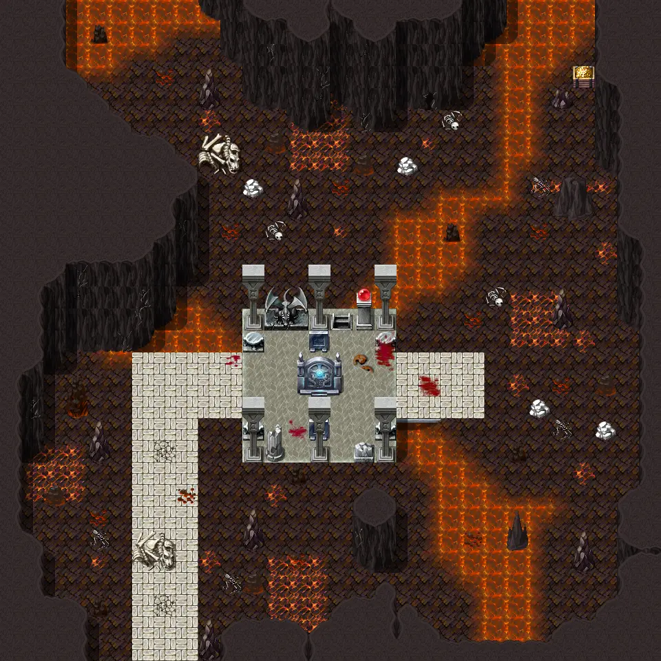

# Undertell 00

30×30 tiles · part of [Undertell floor1](index.md)

<label class="lg lg-spawn"><input type="checkbox" data-t="spawn" checked> Monsters / NPCs</label><label class="lg lg-mapchange"><input type="checkbox" data-t="mapchange" checked> Exit to another map</label><label class="lg lg-container"><input type="checkbox" data-t="container" checked> Container</label><label class="lg lg-sign"><input type="checkbox" data-t="sign" checked> Sign</label><label class="lg lg-rest"><input type="checkbox" data-t="rest" checked> Resting place</label><label class="lg lg-key"><input type="checkbox" data-t="key" checked> Blocked / needs key or quest</label><label class="lg lg-script"><input type="checkbox" data-t="script"> Scripted event</label><label class="lg lg-replace"><input type="checkbox" data-t="replace"> Changes after a quest</label>

## Exits

- [Undertell 10](undertell_10.md)
- [Undertell 3 lava 00](undertell_3_lava_00.md)

## Monsters & NPCs here

| Name | HP |
|---|---|
| [Morvath](../monsters/morvath.md) | 0 |
| [Drybone lich](../monsters/drybone_lich.md) | 212 |
| [Bone-Marshal lich](../monsters/bone_marshal_lich_help_liches.md) | 232 |
| [Molten pyreling](../monsters/molten_pyreling.md) | 236 |
| [Erupting pyreling](../monsters/erupting_pyreling.md) | 246 |

<small>Map ID: `undertell_00` · Data from v0.8.18</small>
