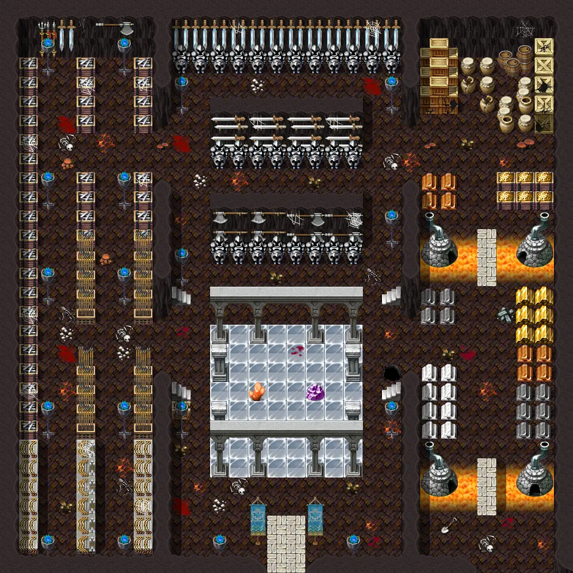
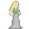

# Undertell 01

| | |
|---|---|
| **Map ID** | `undertell_01` |
| **Type** | Indoors / underground |
| **Size** | 30×30 tiles |
| **World map** | [Undertell floor 1](index.md) |
| **Introduced** | [v0.8.18](../versions/0.8.18.md) |
| **NPCs** | 1 |
| **Quests** | 0 |

**Undertell 01** is an indoor map. It has 1 NPC, and no enemies. Exits lead to Undertell 11, Undertell 1 1.

## Map

<label class="lg"><input type="checkbox" data-t="spawn" checked><b>Red</b>&nbsp;Monsters / NPCs</label><label class="lg"><input type="checkbox" data-t="mapchange" checked><b>Blue</b>&nbsp;Exit to another map</label><label class="lg"><input type="checkbox" data-t="container" checked><b>Yellow</b>&nbsp;Container (click to see contents)</label><label class="lg"><input type="checkbox" data-t="sign" checked><b>Purple</b>&nbsp;Sign</label><label class="lg"><input type="checkbox" data-t="rest" checked><b>Green</b>&nbsp;Resting place</label><label class="lg"><input type="checkbox" data-t="key" checked><b>Orange dashed</b>&nbsp;Blocked until a quest step / item</label><label class="lg"><input type="checkbox" data-t="script"><b>Grey dotted</b>&nbsp;Scripted event</label><label class="lg"><input type="checkbox" data-t="replace"><b>White dotted</b>&nbsp;Changes during a quest</label><label class="lg"><input type="checkbox" data-t="pin" checked><b>Numbers</b>&nbsp;Numbered key points (see the key below the map)</label>

<a class="pin pin-exit" href="#key-1" style="left:71.667%;top:98.333%" title="Exit (south): to [Undertell 11](undertell_11.md)">1</a><a class="pin pin-exit" href="#key-2" style="left:31.667%;top:51.667%" title="Exit (stairs / passage): to [Undertell 1 1](undertell_1_1.md)">2</a><a class="pin pin-exit" href="#key-2" style="left:31.667%;top:68.333%" title="Exit (stairs / passage): to [Undertell 1 1](undertell_1_1.md)">2</a><a class="pin pin-exit" href="#key-2" style="left:68.333%;top:51.667%" title="Exit (stairs / passage): to [Undertell 1 1](undertell_1_1.md)">2</a><a class="pin pin-exit" href="#key-2" style="left:68.333%;top:68.333%" title="Exit (stairs / passage): to [Undertell 1 1](undertell_1_1.md)">2</a><a id="pin-npc-shy_cora" class="pin pin-npc" href="#key-3" style="left:48.333%;top:58.333%" title="[Shy Cora](../../monsters/shy_cora.md): shopkeeper">3</a><a class="pin pin-script" href="#key-4" style="left:35.000%;top:50.000%" title="Quest trigger: Scripted event: advances the quest: hidden story flag “undertell_hidden” to stage 75 (“75 = PC has chased Cora down to the first floor.”)">4</a><a class="pin pin-script" href="#key-4" style="left:33.333%;top:65.000%" title="Quest trigger: Scripted event: advances the quest: hidden story flag “undertell_hidden” to stage 75 (“75 = PC has chased Cora down to the first floor.”)">4</a><a class="pin pin-script" href="#key-4" style="left:66.667%;top:48.333%" title="Quest trigger: Scripted event: advances the quest: hidden story flag “undertell_hidden” to stage 75 (“75 = PC has chased Cora down to the first floor.”)">4</a><a class="pin pin-script" href="#key-4" style="left:33.333%;top:55.000%" title="Quest trigger: Scripted event: advances the quest: hidden story flag “undertell_hidden” to stage 75 (“75 = PC has chased Cora down to the first floor.”)">4</a><a class="pin pin-script" href="#key-4" style="left:66.667%;top:55.000%" title="Quest trigger: Scripted event: advances the quest: hidden story flag “undertell_hidden” to stage 75 (“75 = PC has chased Cora down to the first floor.”)">4</a><a class="pin pin-script" href="#key-4" style="left:66.667%;top:71.667%" title="Quest trigger: Scripted event: advances the quest: hidden story flag “undertell_hidden” to stage 75 (“75 = PC has chased Cora down to the first floor.”)">4</a><a class="pin pin-script" href="#key-4" style="left:35.000%;top:70.000%" title="Quest trigger: Scripted event: advances the quest: hidden story flag “undertell_hidden” to stage 75 (“75 = PC has chased Cora down to the first floor.”)">4</a><a class="pin pin-script" href="#key-4" style="left:65.000%;top:66.667%" title="Quest trigger: Scripted event: advances the quest: hidden story flag “undertell_hidden” to stage 75 (“75 = PC has chased Cora down to the first floor.”)">4</a><a class="pin pin-script" href="#key-4" style="left:65.000%;top:51.667%" title="Quest trigger: Scripted event: advances the quest: hidden story flag “undertell_hidden” to stage 75 (“75 = PC has chased Cora down to the first floor.”)">4</a>

??? abstract "Key to the numbers on the map"

    | # | What | Details |
    |---|---|---|
    | 1 | Exit (south) | to [Undertell 11](undertell_11.md) |
    | 2 | Exit (stairs / passage) | to [Undertell 1 1](undertell_1_1.md) |
    | 3 | [Shy Cora](../monsters/shy_cora.md) | shopkeeper |
    | 4 | Quest trigger | Scripted event: advances the quest: hidden story flag “undertell_hidden” to stage 75 (“75 = PC has chased Cora down to the first floor.”) |

Verified against v0.8.18 map data.

## Connections

| Direction | Leads to | Region there | Map # |
|---|---|---|---|
| South | [Undertell 11](undertell_11.md) | – | 1 |
| Stairs / passage | [Undertell 1 1](undertell_1_1.md) | – | 2 |

## NPCs

- [Shy Cora](../monsters/shy_cora.md) — shopkeeper (#3)

## Items & containers

**Shops:** [Shy Cora](../monsters/shy_cora.md)

## Quests

- [Lava burning timer (hidden flag)](../quests/lava_burning.md): a scripted event can trigger here from stage 1; a scripted event can trigger here from stage 3; a scripted event can trigger here from stage 4; a scripted event can trigger here from stage 7
- [Undertell story flags (hidden flag)](../quests/undertell_hidden.md): something on this map advances it; stepping on a trigger here sets stage 75

## Points of interest

- **Quest trigger** (#4): Scripted event: advances the quest: hidden story flag “undertell_hidden” to stage 75 (“75 = PC has chased Cora down to the first floor.”)

## Version history

| Version | Change |
|---|---|
| [v0.8.18](../versions/0.8.18.md) | Added |

Verified against v0.8.18 and every earlier release back to v0.7.0 (game data compared release by release).

## Community notes

<small>Written by players, not generated from game data. **Observations**: what players notice in-game · **Lore**: the in-world story · **Trivia**: real-world facts, references, development history · **Theory / speculation**: unconfirmed ideas; may just be unfinished content</small>

### Observations

*No notes yet. Contributions are welcome: [add a note](https://github.com/asdfghjkl628/Andor-s-Trail-Wikiiii/new/main/notes/maps?filename=undertell_01.md&value=%23%23%20Observations%0A%0A%3C%21--%20what%20players%20notice%20in-game%20--%3E%0A%0A%23%23%20Lore%0A%0A%3C%21--%20the%20in-world%20story%20--%3E%0A%0A%23%23%20Trivia%0A%0A%3C%21--%20real-world%20facts%2C%20references%2C%20development%20history%20--%3E%0A%0A%23%23%20Theory%20/%20speculation%0A%0A%3C%21--%20unconfirmed%20ideas%3B%20may%20just%20be%20unfinished%20content%20--%3E%0A).*

### Lore

*No notes yet. Contributions are welcome: [add a note](https://github.com/asdfghjkl628/Andor-s-Trail-Wikiiii/new/main/notes/maps?filename=undertell_01.md&value=%23%23%20Observations%0A%0A%3C%21--%20what%20players%20notice%20in-game%20--%3E%0A%0A%23%23%20Lore%0A%0A%3C%21--%20the%20in-world%20story%20--%3E%0A%0A%23%23%20Trivia%0A%0A%3C%21--%20real-world%20facts%2C%20references%2C%20development%20history%20--%3E%0A%0A%23%23%20Theory%20/%20speculation%0A%0A%3C%21--%20unconfirmed%20ideas%3B%20may%20just%20be%20unfinished%20content%20--%3E%0A).*

### Trivia

*No notes yet. Contributions are welcome: [add a note](https://github.com/asdfghjkl628/Andor-s-Trail-Wikiiii/new/main/notes/maps?filename=undertell_01.md&value=%23%23%20Observations%0A%0A%3C%21--%20what%20players%20notice%20in-game%20--%3E%0A%0A%23%23%20Lore%0A%0A%3C%21--%20the%20in-world%20story%20--%3E%0A%0A%23%23%20Trivia%0A%0A%3C%21--%20real-world%20facts%2C%20references%2C%20development%20history%20--%3E%0A%0A%23%23%20Theory%20/%20speculation%0A%0A%3C%21--%20unconfirmed%20ideas%3B%20may%20just%20be%20unfinished%20content%20--%3E%0A).*

### Theory / speculation

*No notes yet. Contributions are welcome: [add a note](https://github.com/asdfghjkl628/Andor-s-Trail-Wikiiii/new/main/notes/maps?filename=undertell_01.md&value=%23%23%20Observations%0A%0A%3C%21--%20what%20players%20notice%20in-game%20--%3E%0A%0A%23%23%20Lore%0A%0A%3C%21--%20the%20in-world%20story%20--%3E%0A%0A%23%23%20Trivia%0A%0A%3C%21--%20real-world%20facts%2C%20references%2C%20development%20history%20--%3E%0A%0A%23%23%20Theory%20/%20speculation%0A%0A%3C%21--%20unconfirmed%20ideas%3B%20may%20just%20be%20unfinished%20content%20--%3E%0A).*

??? info "Technical information"

    | | |
    |---|---|
    | Map ID | `undertell_01` |
    | File | `res/xml/undertell_01.tmx` |
    | Size | 30×30 tiles (960×960 px) |
    | outdoors property | – |
    | Layers drawn | base, ground, objects, above, top |
    | Tilesets | map_bed_1, map_border_1, map_bridge_1, map_bridge_2, map_broken_1, map_cavewall_1, map_cavewall_2, map_cavewall_3, map_cavewall_4, map_chair_table_1, map_chair_table_2, map_crate_1, map_cupboard_1, map_curtain_1, map_entrance_1, map_entrance_2, map_fence_1, map_fence_2, map_fence_3, map_fence_4, map_ground_1, map_ground_2, map_ground_3, map_ground_4, map_ground_5, map_ground_6, map_ground_7, map_ground_8, map_house_1, map_house_2, map_indoor_1, map_indoor_2, map_kitchen_1, map_outdoor_1, map_pillar_1, map_pillar_2, map_plant_1, map_plant_2, map_rock_1, map_rock_2, map_roof_1, map_roof_2, map_roof_3, map_shop_1, map_sign_ladder_1, map_table_1, map_trail_1, map_transition_1, map_transition_2, map_transition_3, map_transition_4, map_transition_5, map_tree_1, map_tree_2, map_wall_1, map_wall_2, map_wall_3, map_wall_4, map_window_1, map_window_2 |
    | Map objects | script: 20, mapchange: 5, spawn: 1 |
    | World map position | segment `undertell_floor1`, x 199, y 2 |

<small>Data from v0.8.18</small>
