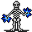

# Undertell 11

30×30 tiles · part of [Undertell floor1](index.md)

<label class="lg"><input type="checkbox" data-t="spawn" checked><b>Red</b>&nbsp;Monsters / NPCs</label><label class="lg"><input type="checkbox" data-t="mapchange" checked><b>Blue</b>&nbsp;Exit to another map</label><label class="lg"><input type="checkbox" data-t="container" checked><b>Yellow</b>&nbsp;Container (click to see contents)</label><label class="lg"><input type="checkbox" data-t="sign" checked><b>Purple</b>&nbsp;Sign</label><label class="lg"><input type="checkbox" data-t="rest" checked><b>Green</b>&nbsp;Resting place</label><label class="lg"><input type="checkbox" data-t="key" checked><b>Orange dashed</b>&nbsp;Blocked until a quest step / item</label><label class="lg"><input type="checkbox" data-t="script"><b>Grey dotted</b>&nbsp;Scripted event</label><label class="lg"><input type="checkbox" data-t="replace"><b>White dotted</b>&nbsp;Changes during a quest</label>

## Containers

<b>Container 1</b><ul><li><a href="../../items/gold/">Gold coins</a> <small>100% · ×2500</small></li></ul>

## Exits

- [Undertell 01](undertell_01.md)
- [Undertell 10](undertell_10.md)
- [Undertell 12](undertell_12.md)
- [Undertell 21](undertell_21.md)
- [Undertell 3 lava 11](undertell_3_lava_11.md)

## Monsters & NPCs here

| Name | HP |
|---|---|
| [Drybone lich](../monsters/drybone_lich.md) | 212 |
| [Bone-Marshal lich](../monsters/bone_marshal_lich_help_others.md) | 232 |
| [Bone-Marshal lich](../monsters/bone_marshal_lich_help_plague.md) | 232 |
| [Bone-Marshal lich](../monsters/bone_marshal_lich.md) | 232 |
| [Molten pyreling](../monsters/molten_pyreling.md) | 236 |
| [Plague-Lich](../monsters/plague_lich.md) | 263 |
| [Lava entity](../monsters/lava_entity.md) | 290 |

<small>Map ID: `undertell_11` · Data from v0.8.18</small>
