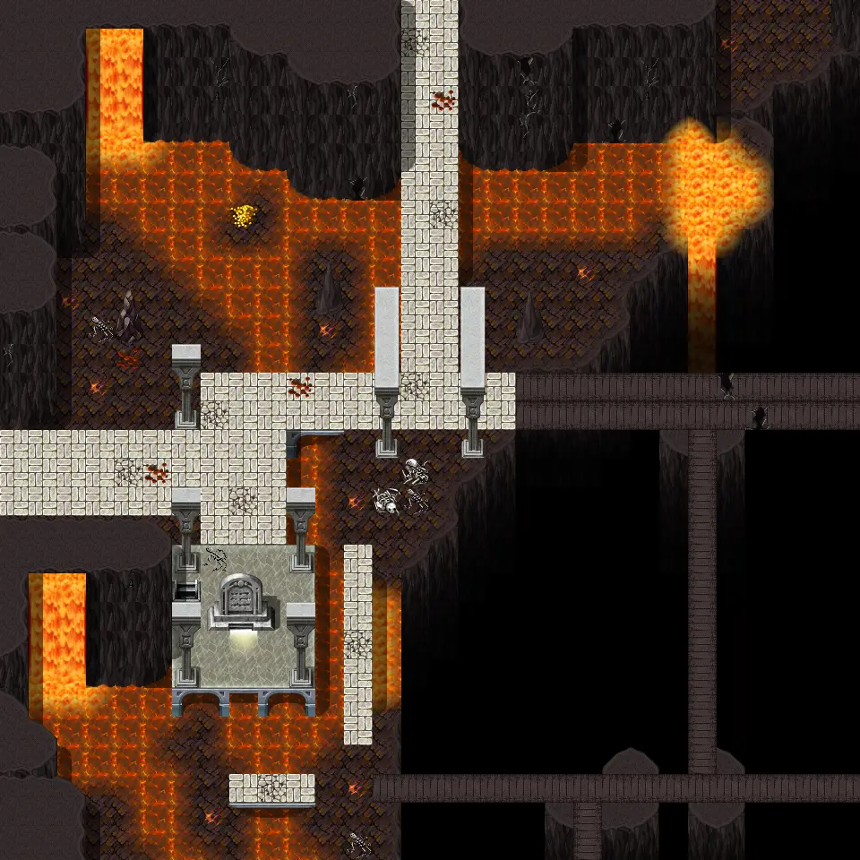

# Undertell 11

| | |
|---|---|
| **Map ID** | `undertell_11` |
| **Type** | Indoors / underground |
| **Size** | 30×30 tiles |
| **World map** | [Undertell floor1](index.md) |
| **Introduced** | [v0.8.18](../versions/0.8.18.md) |
| **Enemy types** | 7 |
| **Quests** | 0 |
| **Containers** | 1 |

**Undertell 11** is an indoor map. It has no NPCs and 7 kinds of enemy. Exits lead to Undertell 01, Undertell 12, Undertell 21, Undertell 10 and 1 more.

## Map

<label class="lg"><input type="checkbox" data-t="spawn" checked><b>Red</b>&nbsp;Monsters / NPCs</label><label class="lg"><input type="checkbox" data-t="mapchange" checked><b>Blue</b>&nbsp;Exit to another map</label><label class="lg"><input type="checkbox" data-t="container" checked><b>Yellow</b>&nbsp;Container (click to see contents)</label><label class="lg"><input type="checkbox" data-t="sign" checked><b>Purple</b>&nbsp;Sign</label><label class="lg"><input type="checkbox" data-t="rest" checked><b>Green</b>&nbsp;Resting place</label><label class="lg"><input type="checkbox" data-t="key" checked><b>Orange dashed</b>&nbsp;Blocked until a quest step / item</label><label class="lg"><input type="checkbox" data-t="script"><b>Grey dotted</b>&nbsp;Scripted event</label><label class="lg"><input type="checkbox" data-t="replace"><b>White dotted</b>&nbsp;Changes during a quest</label><label class="lg"><input type="checkbox" data-t="pin" checked><b>Numbers</b>&nbsp;Numbered key points (see the key below the map)</label>

<a class="pin pin-exit" href="#key-1" style="left:71.667%;top:1.667%" title="Exit (north): to [Undertell 01](../undertell_01.md)">1</a><a class="pin pin-exit" href="#key-2" style="left:98.333%;top:68.333%" title="Exit (east): to [Undertell 12](../undertell_12.md)">2</a><a class="pin pin-exit" href="#key-3" style="left:40.000%;top:98.333%" title="Exit (south): to [Undertell 21](../undertell_21.md)">3</a><a class="pin pin-exit" href="#key-4" style="left:1.667%;top:55.000%" title="Exit (west): to [Undertell 10](../undertell_10.md)">4</a><a class="pin pin-exit" href="#key-5" style="left:21.667%;top:68.333%" title="Exit (stairs / passage): to [Undertell 3 lava 11](../undertell_3_lava_11.md)">5</a><a class="pin pin-container" href="#key-6" style="left:28.333%;top:25.000%" title="Container 1: Gold coins">6</a>

??? abstract "Key to the numbers on the map"

    | # | What | Details |
    |---|---|---|
    | 1 | Exit (north) | to [Undertell 01](../undertell_01.md) |
    | 2 | Exit (east) | to [Undertell 12](../undertell_12.md) |
    | 3 | Exit (south) | to [Undertell 21](../undertell_21.md) |
    | 4 | Exit (west) | to [Undertell 10](../undertell_10.md) |
    | 5 | Exit (stairs / passage) | to [Undertell 3 lava 11](../undertell_3_lava_11.md) |
    | 6 | Container 1 | Gold coins |

Verified against v0.8.18 map data.

## Connections

| Direction | Leads to | Region there | Map # |
|---|---|---|---|
| North | [Undertell 01](undertell_01.md) | – | 1 |
| East | [Undertell 12](undertell_12.md) | – | 2 |
| South | [Undertell 21](undertell_21.md) | – | 3 |
| West | [Undertell 10](undertell_10.md) | – | 4 |
| Stairs / passage | [Undertell 3 lava 11](undertell_3_lava_11.md) | – | 5 |

## Enemies

| Enemy | HP | Damage | Up to | Notes |
|---|---|---|---|---|
| [Drybone lich](../monsters/drybone_lich.md) | 212 | 8–10 | 5 | – |
| [Bone-Marshal lich](../monsters/bone_marshal_lich_help_others.md) | 232 | 9–11 | 1 | – |
| [Bone-Marshal lich](../monsters/bone_marshal_lich_help_plague.md) | 232 | 9–11 | 1 | – |
| [Bone-Marshal lich](../monsters/bone_marshal_lich.md) | 232 | 9–11 | 1 | – |
| [Molten pyreling](../monsters/molten_pyreling.md) | 236 | 15–21 | 4 | – |
| [Plague-Lich](../monsters/plague_lich.md) | 263 | 9–11 | 1 | – |
| [Lava entity](../monsters/lava_entity.md) | 290 | 30–35 | 1 | – |

<small>“Up to” is the most that can be alive at once from the spawn areas on this map.</small>

## Items & containers

<b>Container 1</b><ul><li><a href="../../items/gold/">Gold coins</a> <small>100% · ×2500</small></li></ul>

## Quests

- [hidden_lava_burning_rounds (hidden flag)](../quests/lava_burning.md): a scripted event can trigger here from stage 1; a scripted event can trigger here from stage 3; a scripted event can trigger here from stage 4; a scripted event can trigger here from stage 7

## Version history

| Version | Change |
|---|---|
| [v0.8.18](../versions/0.8.18.md) | Added |

Verified against v0.8.18 and every earlier release back to v0.7.0 (game data compared release by release).

## Community notes

<small>Written by players, not generated from game data. **Observations**: what players notice in-game · **Lore**: the in-world story · **Trivia**: real-world facts, references, development history · **Theory / speculation**: unconfirmed ideas; may just be unfinished content</small>

### Observations

*Nothing here yet. Know something? [Add it](https://github.com/asdfghjkl628/Andor-s-Trail-Wikiiii/new/main/notes/maps?filename=undertell_11.md&value=%23%23%20Observations%0A%0A%3C%21--%20what%20players%20notice%20in-game%20--%3E%0A%0A%23%23%20Lore%0A%0A%3C%21--%20the%20in-world%20story%20--%3E%0A%0A%23%23%20Trivia%0A%0A%3C%21--%20real-world%20facts%2C%20references%2C%20development%20history%20--%3E%0A%0A%23%23%20Theory%20/%20speculation%0A%0A%3C%21--%20unconfirmed%20ideas%3B%20may%20just%20be%20unfinished%20content%20--%3E%0A).*

### Lore

*Nothing here yet. Know something? [Add it](https://github.com/asdfghjkl628/Andor-s-Trail-Wikiiii/new/main/notes/maps?filename=undertell_11.md&value=%23%23%20Observations%0A%0A%3C%21--%20what%20players%20notice%20in-game%20--%3E%0A%0A%23%23%20Lore%0A%0A%3C%21--%20the%20in-world%20story%20--%3E%0A%0A%23%23%20Trivia%0A%0A%3C%21--%20real-world%20facts%2C%20references%2C%20development%20history%20--%3E%0A%0A%23%23%20Theory%20/%20speculation%0A%0A%3C%21--%20unconfirmed%20ideas%3B%20may%20just%20be%20unfinished%20content%20--%3E%0A).*

### Trivia

*Nothing here yet. Know something? [Add it](https://github.com/asdfghjkl628/Andor-s-Trail-Wikiiii/new/main/notes/maps?filename=undertell_11.md&value=%23%23%20Observations%0A%0A%3C%21--%20what%20players%20notice%20in-game%20--%3E%0A%0A%23%23%20Lore%0A%0A%3C%21--%20the%20in-world%20story%20--%3E%0A%0A%23%23%20Trivia%0A%0A%3C%21--%20real-world%20facts%2C%20references%2C%20development%20history%20--%3E%0A%0A%23%23%20Theory%20/%20speculation%0A%0A%3C%21--%20unconfirmed%20ideas%3B%20may%20just%20be%20unfinished%20content%20--%3E%0A).*

### Theory / speculation

*Nothing here yet. Know something? [Add it](https://github.com/asdfghjkl628/Andor-s-Trail-Wikiiii/new/main/notes/maps?filename=undertell_11.md&value=%23%23%20Observations%0A%0A%3C%21--%20what%20players%20notice%20in-game%20--%3E%0A%0A%23%23%20Lore%0A%0A%3C%21--%20the%20in-world%20story%20--%3E%0A%0A%23%23%20Trivia%0A%0A%3C%21--%20real-world%20facts%2C%20references%2C%20development%20history%20--%3E%0A%0A%23%23%20Theory%20/%20speculation%0A%0A%3C%21--%20unconfirmed%20ideas%3B%20may%20just%20be%20unfinished%20content%20--%3E%0A).*

??? info "Technical information"

    | | |
    |---|---|
    | Map ID | `undertell_11` |
    | File | `res/xml/undertell_11.tmx` |
    | Size | 30×30 tiles (960×960 px) |
    | outdoors property | – |
    | Layers drawn | base, ground, objects, above, top |
    | Tilesets | map_bed_1, map_border_1, map_bridge_1, map_bridge_2, map_broken_1, map_cavewall_1, map_cavewall_2, map_cavewall_3, map_cavewall_4, map_chair_table_1, map_chair_table_2, map_crate_1, map_cupboard_1, map_curtain_1, map_entrance_1, map_entrance_2, map_fence_1, map_fence_2, map_fence_3, map_fence_4, map_ground_1, map_ground_2, map_ground_3, map_ground_4, map_ground_5, map_ground_6, map_ground_7, map_ground_8, map_house_1, map_house_2, map_indoor_1, map_indoor_2, map_kitchen_1, map_outdoor_1, map_pillar_1, map_pillar_2, map_plant_1, map_plant_2, map_rock_1, map_rock_2, map_roof_1, map_roof_2, map_roof_3, map_shop_1, map_sign_ladder_1, map_table_1, map_trail_1, map_transition_1, map_transition_2, map_transition_3, map_transition_4, map_transition_5, map_tree_1, map_tree_2, map_wall_1, map_wall_2, map_wall_3, map_wall_4, map_window_1, map_window_2 |
    | Map objects | script: 23, spawn: 12, mapchange: 5, container: 1 |
    | World map position | segment `undertell_floor1`, x 199, y 33 |

<small>Data from v0.8.18</small>
