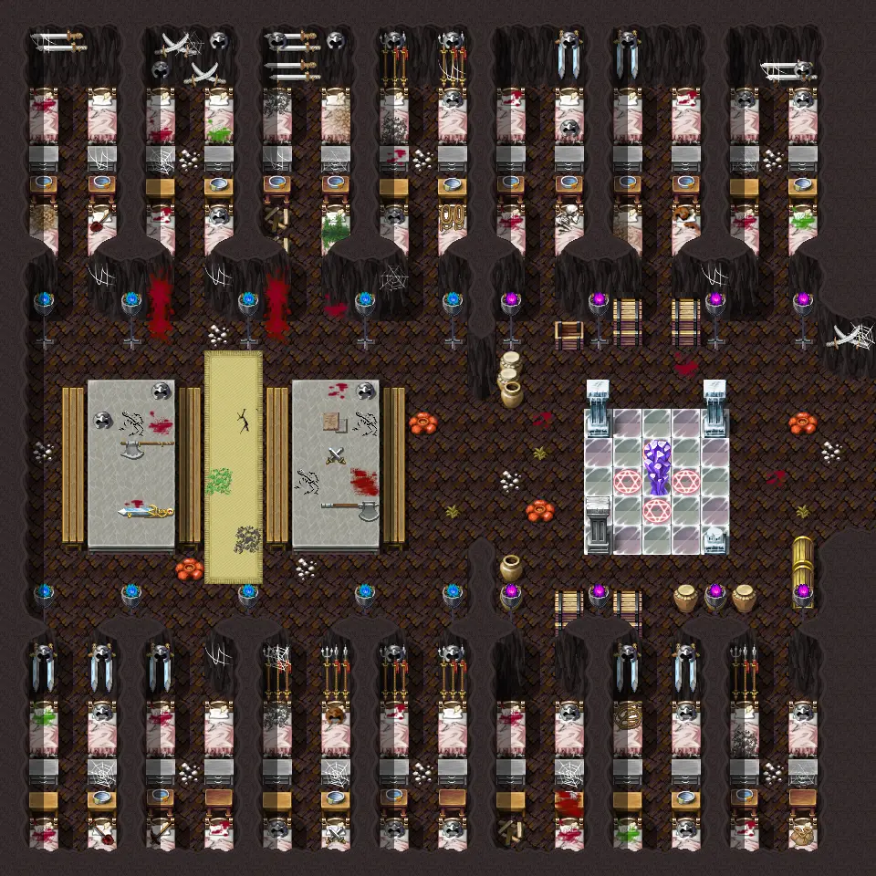
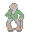
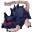

# Undertell 1 0

30×30 tiles · part of [Undertell floor2](index.md)

<label class="lg"><input type="checkbox" data-t="spawn" checked><b>Red</b>&nbsp;Monsters / NPCs</label><label class="lg"><input type="checkbox" data-t="mapchange" checked><b>Blue</b>&nbsp;Exit to another map</label><label class="lg"><input type="checkbox" data-t="container" checked><b>Yellow</b>&nbsp;Container (click to see contents)</label><label class="lg"><input type="checkbox" data-t="sign" checked><b>Purple</b>&nbsp;Sign</label><label class="lg"><input type="checkbox" data-t="rest" checked><b>Green</b>&nbsp;Resting place</label><label class="lg"><input type="checkbox" data-t="key" checked><b>Orange dashed</b>&nbsp;Blocked until a quest step / item</label><label class="lg"><input type="checkbox" data-t="script"><b>Grey dotted</b>&nbsp;Scripted event</label><label class="lg"><input type="checkbox" data-t="replace"><b>White dotted</b>&nbsp;Changes during a quest</label>

## Exits

- [Undertell 1 1](undertell_1_1.md)

## Monsters & NPCs here

| Name | HP |
|---|---|
| [Brenor](../monsters/brenor.md) | 0 |
| [Durnan the Hollow](../monsters/durnan.md) | 0 |
| [Ny'Ratees](../monsters/nyratees.md) | 207 |

<small>Map ID: `undertell_1_0` · Data from v0.8.18</small>
