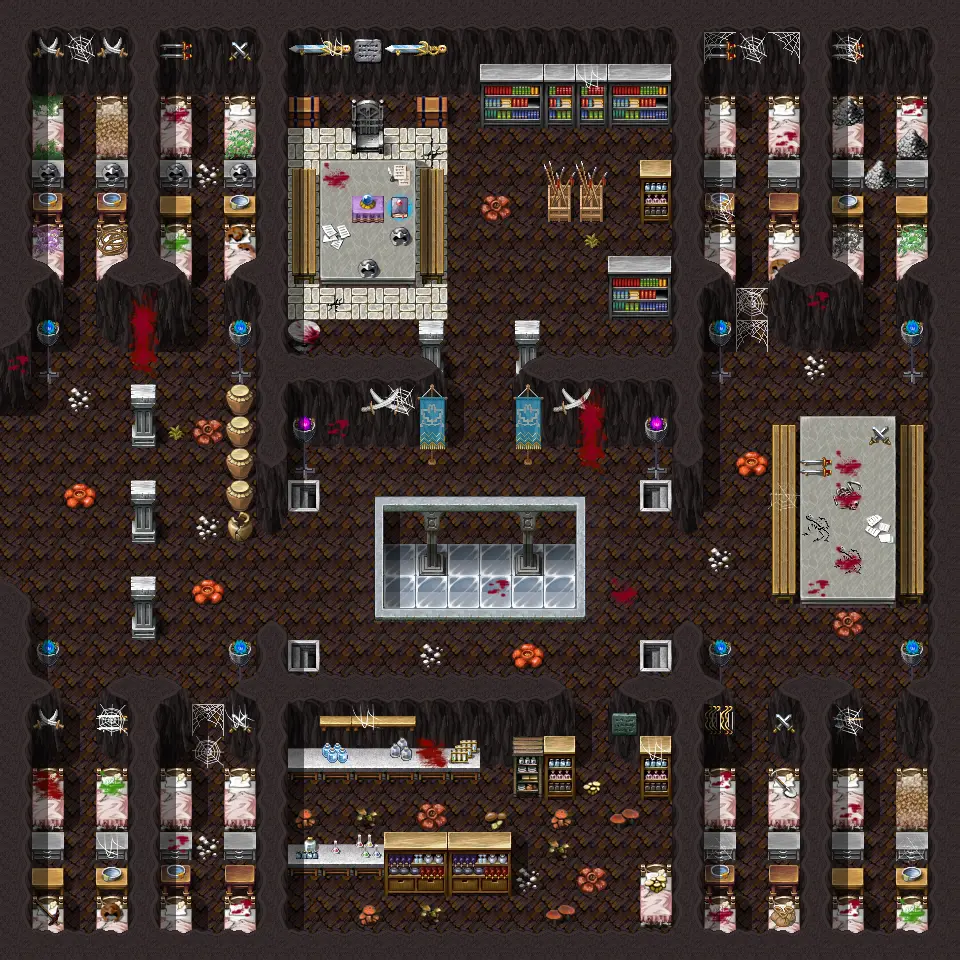

# Undertell 1 1

30×30 tiles · part of [Undertell floor2](index.md)

<label class="lg lg-spawn"><input type="checkbox" data-t="spawn" checked> Monsters / NPCs</label><label class="lg lg-mapchange"><input type="checkbox" data-t="mapchange" checked> Exit to another map</label><label class="lg lg-container"><input type="checkbox" data-t="container" checked> Container</label><label class="lg lg-sign"><input type="checkbox" data-t="sign" checked> Sign</label><label class="lg lg-rest"><input type="checkbox" data-t="rest" checked> Resting place</label><label class="lg lg-key"><input type="checkbox" data-t="key" checked> Blocked / needs key or quest</label><label class="lg lg-script"><input type="checkbox" data-t="script"> Scripted event</label><label class="lg lg-replace"><input type="checkbox" data-t="replace"> Changes after a quest</label>

## Exits

- [Undertell 01](undertell_01.md)
- [Undertell 1 0](undertell_1_0.md)

## Monsters & NPCs here

| Name | HP |
|---|---|
| [Ysrine](../monsters/ysrine.md) | 0 |
| [Elytharan cooker slave](../monsters/elytharan_cook_slave.md) | 0 |
| [Lethgar miner ghost](../monsters/lethgar_miner_ghost.md) | 0 |
| [Lethgar miner ghost](../monsters/lethgar_miner_ghost2.md) | 0 |
| [Shy Cora](../monsters/shy_cora.md) | 0 |
| [Lethgar slave ghost](../monsters/lethgar_female_ghost.md) | 0 |
| [Queen spider](../monsters/spider_queen.md) | 135 |
| [Ny'Ratees](../monsters/nyratees.md) | 207 |
| [Saki](../monsters/saki.md) | 498 |

<small>Map ID: `undertell_1_1` · Data from v0.8.18</small>
