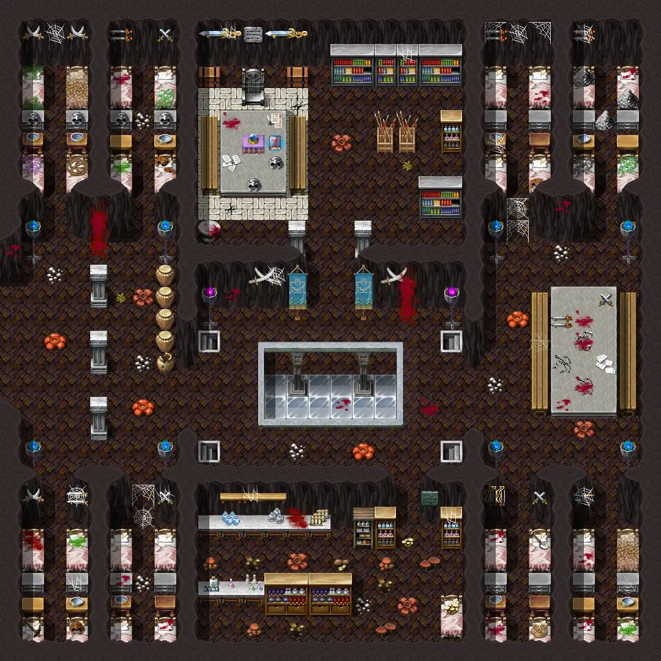
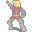

# Undertell 1 1

| | |
|---|---|
| **Map ID** | `undertell_1_1` |
| **Type** | Indoors / underground |
| **Size** | 30×30 tiles |
| **World map** | [Undertell floor 2](index.md) |
| **Introduced** | [v0.8.18](../versions/0.8.18.md) |
| **NPCs** | 7 |
| **Enemy types** | 2 |
| **Quests** | 3 |

**Undertell 1 1** is an indoor map. It has 7 NPCs and 2 kinds of enemy. Exits lead to Undertell 1 0, Undertell 01.

## Map

<label class="lg"><input type="checkbox" data-t="spawn" checked><b>Red</b>&nbsp;Monsters / NPCs</label><label class="lg"><input type="checkbox" data-t="mapchange" checked><b>Blue</b>&nbsp;Exit to another map</label><label class="lg"><input type="checkbox" data-t="container" checked><b>Yellow</b>&nbsp;Container (click to see contents)</label><label class="lg"><input type="checkbox" data-t="sign" checked><b>Purple</b>&nbsp;Sign</label><label class="lg"><input type="checkbox" data-t="rest" checked><b>Green</b>&nbsp;Resting place</label><label class="lg"><input type="checkbox" data-t="key" checked><b>Orange dashed</b>&nbsp;Blocked until a quest step / item</label><label class="lg"><input type="checkbox" data-t="script"><b>Grey dotted</b>&nbsp;Scripted event</label><label class="lg"><input type="checkbox" data-t="replace"><b>White dotted</b>&nbsp;Changes during a quest</label><label class="lg"><input type="checkbox" data-t="pin" checked><b>Numbers</b>&nbsp;Numbered key points (see the key below the map)</label>

<a class="pin pin-exit" href="#key-1" style="left:1.667%;top:51.667%" title="Exit (west): to [Undertell 1 0](undertell_1_0.md)">1</a><a class="pin pin-exit" href="#key-2" style="left:31.667%;top:51.667%" title="Exit (stairs / passage): to [Undertell 01](undertell_01.md)">2</a><a class="pin pin-exit" href="#key-2" style="left:68.333%;top:51.667%" title="Exit (stairs / passage): to [Undertell 01](undertell_01.md)">2</a><a class="pin pin-exit" href="#key-2" style="left:31.667%;top:68.333%" title="Exit (stairs / passage): to [Undertell 01](undertell_01.md)">2</a><a class="pin pin-exit" href="#key-2" style="left:68.333%;top:68.333%" title="Exit (stairs / passage): to [Undertell 01](undertell_01.md)">2</a><a id="pin-npc-elytharan_cook_slave" class="pin pin-npc" href="#key-3" style="left:31.667%;top:91.667%" title="[Elytharan cooker slave](../../monsters/elytharan_cook_slave.md): 1 quest">3</a><a id="pin-npc-lethgar_miner_ghost" class="pin pin-npc" href="#key-4" style="left:31.667%;top:18.333%" title="[Lethgar miner ghost](../../monsters/lethgar_miner_ghost.md): NPC">4</a><a id="pin-npc-lethgar_miner_ghost2" class="pin pin-npc" href="#key-5" style="left:61.667%;top:15.000%" title="[Lethgar miner ghost](../../monsters/lethgar_miner_ghost.md#v-lethgar_miner_ghost2): NPC">5</a><a id="pin-npc-lethgar_female_ghost" class="pin pin-npc" href="#key-6" style="left:61.667%;top:31.667%" title="[Lethgar slave ghost](../../monsters/lethgar_female_ghost.md): NPC">6</a><a id="pin-npc-saki" class="pin pin-npc" href="#key-7" style="left:45.000%;top:18.333%" title="[Saki](../../monsters/saki.md): 1 quest">7</a><a id="pin-npc-shy_cora" class="pin pin-npc" href="#key-8" style="left:51.667%;top:58.333%" title="[Shy Cora](../../monsters/shy_cora.md): shopkeeper">8</a><a id="pin-npc-ysrine" class="pin pin-npc" href="#key-9" style="left:38.333%;top:15.000%" title="[Ysrine](../../monsters/ysrine.md): 2 quests">9</a><a class="pin pin-key" href="#key-10" style="left:50.000%;top:60.000%" title="Blocked passage: Closed off once you reach this point in the quest: Search for Andor (stage 1: “My father Mikhail says that Andor has not been home since yesterday. I should go look for him in the village.”)">10</a><a class="pin pin-key" href="#key-10" style="left:11.667%;top:28.333%" title="Blocked passage: Closed off once you reach this point in the quest: Search for Andor (stage 1: “My father Mikhail says that Andor has not been home since yesterday. I should go look for him in the village.”)">10</a><a class="pin pin-key" href="#key-10" style="left:95.000%;top:28.333%" title="Blocked passage: Closed off once you reach this point in the quest: Search for Andor (stage 1: “My father Mikhail says that Andor has not been home since yesterday. I should go look for him in the village.”)">10</a><a class="pin pin-key" href="#key-10" style="left:25.000%;top:28.333%" title="Blocked passage: Closed off once you reach this point in the quest: Search for Andor (stage 1: “My father Mikhail says that Andor has not been home since yesterday. I should go look for him in the village.”)">10</a><a class="pin pin-key" href="#key-10" style="left:81.667%;top:85.000%" title="Blocked passage: Closed off once you reach this point in the quest: Search for Andor (stage 1: “My father Mikhail says that Andor has not been home since yesterday. I should go look for him in the village.”)">10</a><a class="pin pin-key" href="#key-10" style="left:68.333%;top:95.000%" title="Blocked passage: Closed off once you reach this point in the quest: Search for Andor (stage 1: “My father Mikhail says that Andor has not been home since yesterday. I should go look for him in the village.”)">10</a>

??? abstract "Key to the numbers on the map"

    | # | What | Details |
    |---|---|---|
    | 1 | Exit (west) | to [Undertell 1 0](undertell_1_0.md) |
    | 2 | Exit (stairs / passage) | to [Undertell 01](undertell_01.md) |
    | 3 | [Elytharan cooker slave](../monsters/elytharan_cook_slave.md) | 1 quest |
    | 4 | [Lethgar miner ghost](../monsters/lethgar_miner_ghost.md) | NPC |
    | 5 | [Lethgar miner ghost](../monsters/lethgar_miner_ghost.md#v-lethgar_miner_ghost2) | NPC |
    | 6 | [Lethgar slave ghost](../monsters/lethgar_female_ghost.md) | NPC |
    | 7 | [Saki](../monsters/saki.md) | 1 quest |
    | 8 | [Shy Cora](../monsters/shy_cora.md) | shopkeeper |
    | 9 | [Ysrine](../monsters/ysrine.md) | 2 quests |
    | 10 | Blocked passage | Closed off once you reach this point in the quest: Search for Andor (stage 1: “My father Mikhail says that Andor has not been home since yesterday. I should go look for him in the village.”) |

Verified against v0.8.18 map data.

## Connections

| Direction | Leads to | Region there | Map # |
|---|---|---|---|
| West | [Undertell 1 0](undertell_1_0.md) | – | 1 |
| Stairs / passage | [Undertell 01](undertell_01.md) | – | 2 |

## NPCs

- [Elytharan cooker slave](../monsters/elytharan_cook_slave.md) — quests: [Undertell: What was not written](../quests/undertell_book.md) (#3)
- [Lethgar miner ghost](../monsters/lethgar_miner_ghost.md) (#4)
- [Lethgar miner ghost](../monsters/lethgar_miner_ghost.md#v-lethgar_miner_ghost2) (#5)
- [Lethgar slave ghost](../monsters/lethgar_female_ghost.md) (#6)
- [Saki](../monsters/saki.md) — can be fought — quests: [Dominion](../quests/dominion.md) (#7)
- [Shy Cora](../monsters/shy_cora.md) — shopkeeper (#8)
- [Ysrine](../monsters/ysrine.md) — can be fought — quests: [Dominion](../quests/dominion.md), [Undertell: What was not written](../quests/undertell_book.md) (#9)

## Enemies

| Enemy | HP | Damage | Up to | Notes |
|---|---|---|---|---|
| [Queen spider](../monsters/spider_queen.md) | 135 | 8–19 | 2 | – |
| [Ny'Ratees](../monsters/nyratees.md) | 207 | 10–15 | 5 | – |

<small>“Up to” is the most that can be alive at once from the spawn areas on this map.</small>

## Items & containers

**Shops:** [Shy Cora](../monsters/shy_cora.md)

## Quests

- [Dominion](../quests/dominion.md): [Saki](../monsters/saki.md) is involved; [Ysrine](../monsters/ysrine.md) is involved
- [Search for Andor](../quests/andor.md): blocked passage closes at stage 1
- [Undertell: What was not written](../quests/undertell_book.md): [Elytharan cooker slave](../monsters/elytharan_cook_slave.md) is involved; [Ysrine](../monsters/ysrine.md) is involved; something on this map advances it
- [Undertell story flags (hidden flag)](../quests/undertell_hidden.md): [Lethgar miner ghost](../monsters/lethgar_miner_ghost.md#v-lethgar_miner_ghost2) is involved; [Lethgar slave ghost](../monsters/lethgar_female_ghost.md) is involved; something on this map advances it

## Points of interest

- **Blocked passage** (#10): Closed off once you reach this point in the quest: Search for Andor (stage 1: “My father Mikhail says that Andor has not been home since yesterday. I should go look for him in the village.”)

## Version history

| Version | Change |
|---|---|
| [v0.8.18](../versions/0.8.18.md) | Added |

Verified against v0.8.18 and every earlier release back to v0.7.0 (game data compared release by release).

## Community notes

<small>Written by players, not generated from game data. **Observations**: what players notice in-game · **Lore**: the in-world story · **Trivia**: real-world facts, references, development history · **Theory / speculation**: unconfirmed ideas; may just be unfinished content</small>

### Observations

*No notes yet. Contributions are welcome: [add a note](https://github.com/asdfghjkl628/Andor-s-Trail-Wikiiii/new/main/notes/maps?filename=undertell_1_1.md&value=%23%23%20Observations%0A%0A%3C%21--%20what%20players%20notice%20in-game%20--%3E%0A%0A%23%23%20Lore%0A%0A%3C%21--%20the%20in-world%20story%20--%3E%0A%0A%23%23%20Trivia%0A%0A%3C%21--%20real-world%20facts%2C%20references%2C%20development%20history%20--%3E%0A%0A%23%23%20Theory%20/%20speculation%0A%0A%3C%21--%20unconfirmed%20ideas%3B%20may%20just%20be%20unfinished%20content%20--%3E%0A).*

### Lore

*No notes yet. Contributions are welcome: [add a note](https://github.com/asdfghjkl628/Andor-s-Trail-Wikiiii/new/main/notes/maps?filename=undertell_1_1.md&value=%23%23%20Observations%0A%0A%3C%21--%20what%20players%20notice%20in-game%20--%3E%0A%0A%23%23%20Lore%0A%0A%3C%21--%20the%20in-world%20story%20--%3E%0A%0A%23%23%20Trivia%0A%0A%3C%21--%20real-world%20facts%2C%20references%2C%20development%20history%20--%3E%0A%0A%23%23%20Theory%20/%20speculation%0A%0A%3C%21--%20unconfirmed%20ideas%3B%20may%20just%20be%20unfinished%20content%20--%3E%0A).*

### Trivia

*No notes yet. Contributions are welcome: [add a note](https://github.com/asdfghjkl628/Andor-s-Trail-Wikiiii/new/main/notes/maps?filename=undertell_1_1.md&value=%23%23%20Observations%0A%0A%3C%21--%20what%20players%20notice%20in-game%20--%3E%0A%0A%23%23%20Lore%0A%0A%3C%21--%20the%20in-world%20story%20--%3E%0A%0A%23%23%20Trivia%0A%0A%3C%21--%20real-world%20facts%2C%20references%2C%20development%20history%20--%3E%0A%0A%23%23%20Theory%20/%20speculation%0A%0A%3C%21--%20unconfirmed%20ideas%3B%20may%20just%20be%20unfinished%20content%20--%3E%0A).*

### Theory / speculation

*No notes yet. Contributions are welcome: [add a note](https://github.com/asdfghjkl628/Andor-s-Trail-Wikiiii/new/main/notes/maps?filename=undertell_1_1.md&value=%23%23%20Observations%0A%0A%3C%21--%20what%20players%20notice%20in-game%20--%3E%0A%0A%23%23%20Lore%0A%0A%3C%21--%20the%20in-world%20story%20--%3E%0A%0A%23%23%20Trivia%0A%0A%3C%21--%20real-world%20facts%2C%20references%2C%20development%20history%20--%3E%0A%0A%23%23%20Theory%20/%20speculation%0A%0A%3C%21--%20unconfirmed%20ideas%3B%20may%20just%20be%20unfinished%20content%20--%3E%0A).*

??? info "Technical information"

    | | |
    |---|---|
    | Map ID | `undertell_1_1` |
    | File | `res/xml/undertell_1_1.tmx` |
    | Size | 30×30 tiles (960×960 px) |
    | outdoors property | – |
    | Layers drawn | base, ground, objects, above, top |
    | Tilesets | map_bed_1, map_border_1, map_bridge_1, map_bridge_2, map_broken_1, map_cavewall_1, map_cavewall_2, map_cavewall_3, map_cavewall_4, map_chair_table_1, map_chair_table_2, map_crate_1, map_cupboard_1, map_curtain_1, map_entrance_1, map_entrance_2, map_fence_1, map_fence_2, map_fence_3, map_fence_4, map_ground_1, map_ground_2, map_ground_3, map_ground_4, map_ground_5, map_ground_6, map_ground_7, map_ground_8, map_house_1, map_house_2, map_indoor_1, map_indoor_2, map_kitchen_1, map_outdoor_1, map_pillar_1, map_pillar_2, map_plant_1, map_plant_2, map_rock_1, map_rock_2, map_roof_1, map_roof_2, map_roof_3, map_shop_1, map_sign_ladder_1, map_table_1, map_trail_1, map_transition_1, map_transition_2, map_transition_3, map_transition_4, map_transition_5, map_tree_1, map_tree_2, map_wall_1, map_wall_2, map_wall_3, map_wall_4, map_window_1, map_window_2 |
    | Map objects | spawn: 14, key: 6, mapchange: 5 |
    | World map position | segment `undertell_floor2`, x 203, y -120 |

<small>Data from v0.8.18</small>
