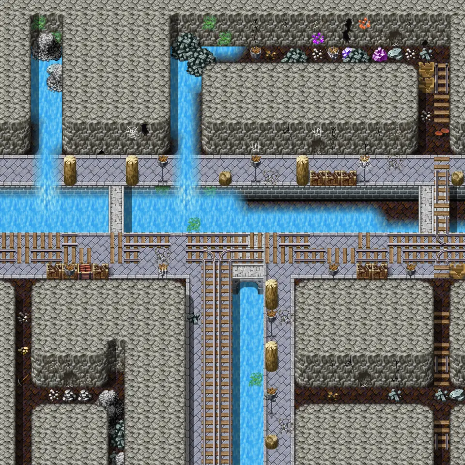

# Undertell 3 01

30×30 tiles · part of [Undertell level3](index.md)

<label class="lg lg-spawn"><input type="checkbox" data-t="spawn" checked> Monsters / NPCs</label><label class="lg lg-mapchange"><input type="checkbox" data-t="mapchange" checked> Exit to another map</label><label class="lg lg-container"><input type="checkbox" data-t="container" checked> Container</label><label class="lg lg-sign"><input type="checkbox" data-t="sign" checked> Sign</label><label class="lg lg-rest"><input type="checkbox" data-t="rest" checked> Resting place</label><label class="lg lg-key"><input type="checkbox" data-t="key" checked> Blocked / needs key or quest</label><label class="lg lg-script"><input type="checkbox" data-t="script"> Scripted event</label><label class="lg lg-replace"><input type="checkbox" data-t="replace"> Changes after a quest</label>

## Exits

- [Undertell 3 00](undertell_3_00.md)
- [Undertell 3 02](undertell_3_02.md)
- [Undertell 3 11](undertell_3_11.md)

## Monsters & NPCs here

| Name | HP |
|---|---|
| [Gravewing](../monsters/undertell_bat.md) | 138 |
| [Forgotten miner](../monsters/forgotten_miner.md) | 228 |
| [Young rock eater](../monsters/young_rock_eater.md) | 303 |

<small>Map ID: `undertell_3_01` · Data from v0.8.18</small>
