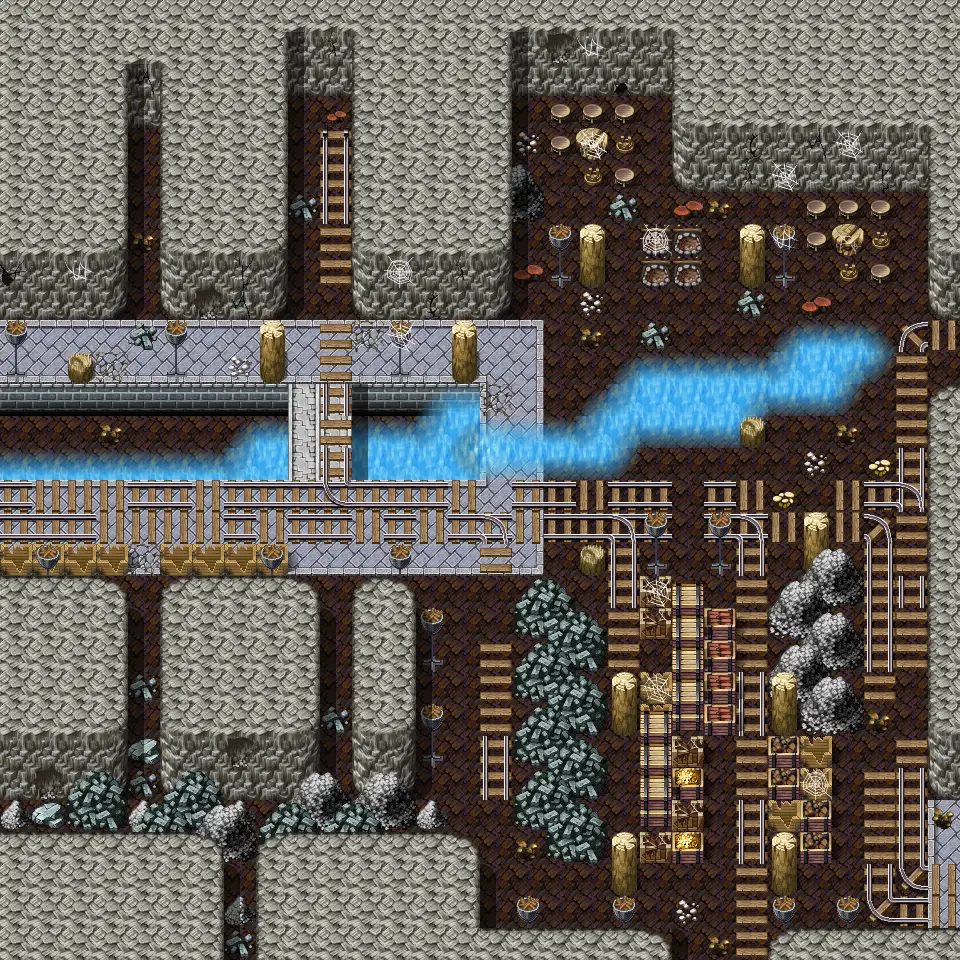
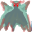
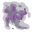
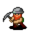

# Undertell 3 02

| | |
|---|---|
| **Map ID** | `undertell_3_02` |
| **Type** | Indoors / underground |
| **Size** | 30×30 tiles |
| **World map** | [Undertell level3](index.md) |
| **Introduced** | [v0.8.18](../versions/0.8.18.md) |
| **NPCs** | 3 |
| **Enemy types** | 2 |
| **Quests** | 2 |

**Undertell 3 02** is an indoor map. It has 3 NPCs and 2 kinds of enemy. Exits lead to Undertell 3 03, Undertell 3 12, Undertell 3 01.

## Map

<label class="lg"><input type="checkbox" data-t="spawn" checked><b>Red</b>&nbsp;Monsters / NPCs</label><label class="lg"><input type="checkbox" data-t="mapchange" checked><b>Blue</b>&nbsp;Exit to another map</label><label class="lg"><input type="checkbox" data-t="container" checked><b>Yellow</b>&nbsp;Container (click to see contents)</label><label class="lg"><input type="checkbox" data-t="sign" checked><b>Purple</b>&nbsp;Sign</label><label class="lg"><input type="checkbox" data-t="rest" checked><b>Green</b>&nbsp;Resting place</label><label class="lg"><input type="checkbox" data-t="key" checked><b>Orange dashed</b>&nbsp;Blocked until a quest step / item</label><label class="lg"><input type="checkbox" data-t="script"><b>Grey dotted</b>&nbsp;Scripted event</label><label class="lg"><input type="checkbox" data-t="replace"><b>White dotted</b>&nbsp;Changes during a quest</label><label class="lg"><input type="checkbox" data-t="pin" checked><b>Numbers</b>&nbsp;Numbered key points (see the key below the map)</label>

<a class="pin pin-exit" href="#key-1" style="left:98.333%;top:65.000%" title="Exit (east): to [Undertell 3 03](undertell_3_03.md)">1</a><a class="pin pin-exit" href="#key-2" style="left:75.000%;top:98.333%" title="Exit (south): to [Undertell 3 12](undertell_3_12.md)">2</a><a class="pin pin-exit" href="#key-3" style="left:1.667%;top:45.000%" title="Exit (west): to [Undertell 3 01](undertell_3_01.md)">3</a><a id="pin-npc-anoa" class="pin pin-npc" href="#key-4" style="left:61.667%;top:35.000%" title="[Anoa](../../monsters/anoa.md): 1 quest">4</a><a id="pin-npc-shade1" class="pin pin-npc" href="#key-5" style="left:15.000%;top:18.333%" title="[Forsaken shade](../../monsters/shade1.md): 1 quest">5</a><a id="pin-npc-shade2" class="pin pin-npc" href="#key-6" style="left:31.667%;top:11.667%" title="[Forsaken shade](../../monsters/shade1.md#v-shade2): 1 quest">6</a><a class="pin pin-script" href="#key-7" style="left:50.000%;top:53.333%" title="Quest trigger: Scripted event: advances the quest: Devotion to stage 480 (“I killed all the shades including Anoa. I did not get any reward.”) (+1 more quest(s))">7</a><a class="pin pin-script" href="#key-8" style="left:61.886%;top:32.500%" title="Quest trigger: Scripted event: advances the quest: hidden story flag “hidden_devotion” to stage 11 (“PC killed shade11”)">8</a><a class="pin pin-key" href="#key-9" style="left:71.667%;top:81.667%" title="Blocked passage: Closed off once you reach this point in the quest: Search for Andor (stage 1: “My father Mikhail says that Andor has not been home since yesterday. I should go look for him in the village.”)">9</a><a class="pin pin-replace" href="#key-10" style="left:71.886%;top:79.167%" title="Changes during a quest: This area changes during the quest: hidden story flag “undertell_hidden” (stage 84: “84 = Looted chest of rare coins.”)">10</a>

??? abstract "Key to the numbers on the map"

    | # | What | Details |
    |---|---|---|
    | 1 | Exit (east) | to [Undertell 3 03](undertell_3_03.md) |
    | 2 | Exit (south) | to [Undertell 3 12](undertell_3_12.md) |
    | 3 | Exit (west) | to [Undertell 3 01](undertell_3_01.md) |
    | 4 | [Anoa](../monsters/anoa.md) | 1 quest |
    | 5 | [Forsaken shade](../monsters/shade1.md) | 1 quest |
    | 6 | [Forsaken shade](../monsters/shade1.md#v-shade2) | 1 quest |
    | 7 | Quest trigger | Scripted event: advances the quest: Devotion to stage 480 (“I killed all the shades including Anoa. I did not get any reward.”) (+1 more quest(s)) |
    | 8 | Quest trigger | Scripted event: advances the quest: hidden story flag “hidden_devotion” to stage 11 (“PC killed shade11”) |
    | 9 | Blocked passage | Closed off once you reach this point in the quest: Search for Andor (stage 1: “My father Mikhail says that Andor has not been home since yesterday. I should go look for him in the village.”) |
    | 10 | Changes during a quest | This area changes during the quest: hidden story flag “undertell_hidden” (stage 84: “84 = Looted chest of rare coins.”) |

Verified against v0.8.18 map data.

## Connections

| Direction | Leads to | Region there | Map # |
|---|---|---|---|
| East | [Undertell 3 03](undertell_3_03.md) | – | 1 |
| South | [Undertell 3 12](undertell_3_12.md) | – | 2 |
| West | [Undertell 3 01](undertell_3_01.md) | – | 3 |

## NPCs

- [Anoa](../monsters/anoa.md) — can be fought — quests: [Devotion](../quests/devotion.md) (#4)
- [Forsaken shade](../monsters/shade1.md) — can be fought — quests: [Devotion](../quests/devotion.md) (#5)
- [Forsaken shade](../monsters/shade1.md#v-shade2) — can be fought — quests: [Devotion](../quests/devotion.md) (#6)

## Enemies

| Enemy | HP | Damage | Up to | Notes |
|---|---|---|---|---|
| [Forgotten miner](../monsters/forgotten_miner.md) | 228 | 8–14 | 7 | appears later, during a quest |
| [Evil shade](../monsters/evil_shade.md) | 431 | 5–7 | 66 | appears later, during a quest |

<small>“Up to” is the most that can be alive at once from the spawn areas on this map.</small>

## Quests

- [Devotion](../quests/devotion.md): [Anoa](../monsters/anoa.md) is involved; [Forsaken shade](../monsters/shade1.md) is involved; [Forsaken shade](../monsters/shade1.md#v-shade2) is involved; something on this map advances it; stepping on a trigger here sets stage 480
- [Search for Andor](../quests/andor.md): blocked passage closes at stage 1
- [hidden_devotion (hidden flag)](../quests/hidden_devotion.md): [Anoa](../monsters/anoa.md) is involved; [Forsaken shade](../monsters/shade1.md) is involved; [Forsaken shade](../monsters/shade1.md#v-shade2) is involved; something on this map advances it; stepping on a trigger here sets stage 1; stepping on a trigger here sets stage 10; stepping on a trigger here sets stage 11; stepping on a trigger here sets stage 2; stepping on a trigger here sets stage 3; stepping on a trigger here sets stage 4; stepping on a trigger here sets stage 450; stepping on a trigger here sets stage 5; stepping on a trigger here sets stage 6; stepping on a trigger here sets stage 7; stepping on a trigger here sets stage 8; stepping on a trigger here sets stage 9
- [hidden_undertell (hidden flag)](../quests/undertell_hidden.md): part of the map changes at stage 84; something on this map advances it

## Points of interest

- **Quest trigger** (#7): Scripted event: advances the quest: Devotion to stage 480 (“I killed all the shades including Anoa. I did not get any reward.”) (+1 more quest(s))
- **Quest trigger** (#8): Scripted event: advances the quest: hidden story flag “hidden_devotion” to stage 11 (“PC killed shade11”)
- **Blocked passage** (#9): Closed off once you reach this point in the quest: Search for Andor (stage 1: “My father Mikhail says that Andor has not been home since yesterday. I should go look for him in the village.”)
- **Changes during a quest** (#10): This area changes during the quest: hidden story flag “undertell_hidden” (stage 84: “84 = Looted chest of rare coins.”)

## Version history

| Version | Change |
|---|---|
| [v0.8.18](../versions/0.8.18.md) | Added |

Verified against v0.8.18 and every earlier release back to v0.7.0 (game data compared release by release).

## Community notes

<small>Written by players, not generated from game data. **Observations**: what players notice in-game · **Lore**: the in-world story · **Trivia**: real-world facts, references, development history · **Theory / speculation**: unconfirmed ideas; may just be unfinished content</small>

### Observations

*No notes yet. Contributions are welcome: [add a note](https://github.com/asdfghjkl628/Andor-s-Trail-Wikiiii/new/main/notes/maps?filename=undertell_3_02.md&value=%23%23%20Observations%0A%0A%3C%21--%20what%20players%20notice%20in-game%20--%3E%0A%0A%23%23%20Lore%0A%0A%3C%21--%20the%20in-world%20story%20--%3E%0A%0A%23%23%20Trivia%0A%0A%3C%21--%20real-world%20facts%2C%20references%2C%20development%20history%20--%3E%0A%0A%23%23%20Theory%20/%20speculation%0A%0A%3C%21--%20unconfirmed%20ideas%3B%20may%20just%20be%20unfinished%20content%20--%3E%0A).*

### Lore

*No notes yet. Contributions are welcome: [add a note](https://github.com/asdfghjkl628/Andor-s-Trail-Wikiiii/new/main/notes/maps?filename=undertell_3_02.md&value=%23%23%20Observations%0A%0A%3C%21--%20what%20players%20notice%20in-game%20--%3E%0A%0A%23%23%20Lore%0A%0A%3C%21--%20the%20in-world%20story%20--%3E%0A%0A%23%23%20Trivia%0A%0A%3C%21--%20real-world%20facts%2C%20references%2C%20development%20history%20--%3E%0A%0A%23%23%20Theory%20/%20speculation%0A%0A%3C%21--%20unconfirmed%20ideas%3B%20may%20just%20be%20unfinished%20content%20--%3E%0A).*

### Trivia

*No notes yet. Contributions are welcome: [add a note](https://github.com/asdfghjkl628/Andor-s-Trail-Wikiiii/new/main/notes/maps?filename=undertell_3_02.md&value=%23%23%20Observations%0A%0A%3C%21--%20what%20players%20notice%20in-game%20--%3E%0A%0A%23%23%20Lore%0A%0A%3C%21--%20the%20in-world%20story%20--%3E%0A%0A%23%23%20Trivia%0A%0A%3C%21--%20real-world%20facts%2C%20references%2C%20development%20history%20--%3E%0A%0A%23%23%20Theory%20/%20speculation%0A%0A%3C%21--%20unconfirmed%20ideas%3B%20may%20just%20be%20unfinished%20content%20--%3E%0A).*

### Theory / speculation

*No notes yet. Contributions are welcome: [add a note](https://github.com/asdfghjkl628/Andor-s-Trail-Wikiiii/new/main/notes/maps?filename=undertell_3_02.md&value=%23%23%20Observations%0A%0A%3C%21--%20what%20players%20notice%20in-game%20--%3E%0A%0A%23%23%20Lore%0A%0A%3C%21--%20the%20in-world%20story%20--%3E%0A%0A%23%23%20Trivia%0A%0A%3C%21--%20real-world%20facts%2C%20references%2C%20development%20history%20--%3E%0A%0A%23%23%20Theory%20/%20speculation%0A%0A%3C%21--%20unconfirmed%20ideas%3B%20may%20just%20be%20unfinished%20content%20--%3E%0A).*

??? info "Technical information"

    | | |
    |---|---|
    | Map ID | `undertell_3_02` |
    | File | `res/xml/undertell_3_02.tmx` |
    | Size | 30×30 tiles (960×960 px) |
    | outdoors property | – |
    | Layers drawn | base, ground, objects, above, top |
    | Tilesets | map_bed_1, map_border_1, map_bridge_1, map_bridge_2, map_broken_1, map_cavewall_1, map_cavewall_2, map_cavewall_3, map_cavewall_4, map_chair_table_1, map_chair_table_2, map_crate_1, map_cupboard_1, map_curtain_1, map_entrance_1, map_entrance_2, map_fence_1, map_fence_2, map_fence_3, map_fence_4, map_ground_1, map_ground_2, map_ground_3, map_ground_4, map_ground_5, map_ground_6, map_ground_7, map_ground_8, map_house_1, map_house_2, map_indoor_1, map_indoor_2, map_kitchen_1, map_outdoor_1, map_pillar_1, map_pillar_2, map_plant_1, map_plant_2, map_rock_1, map_rock_2, map_roof_1, map_roof_2, map_roof_3, map_shop_1, map_sign_ladder_1, map_table_1, map_trail_1, map_transition_1, map_transition_2, map_transition_3, map_transition_4, map_transition_5, map_tree_1, map_tree_2, map_wall_1, map_wall_2, map_wall_3, map_wall_4, map_window_1, map_window_2 |
    | Map objects | spawn: 20, mapchange: 3, script: 2, key: 1, replace: 1 |
    | World map position | segment `undertell_level3`, x 210, y -2 |

<small>Data from v0.8.18</small>
