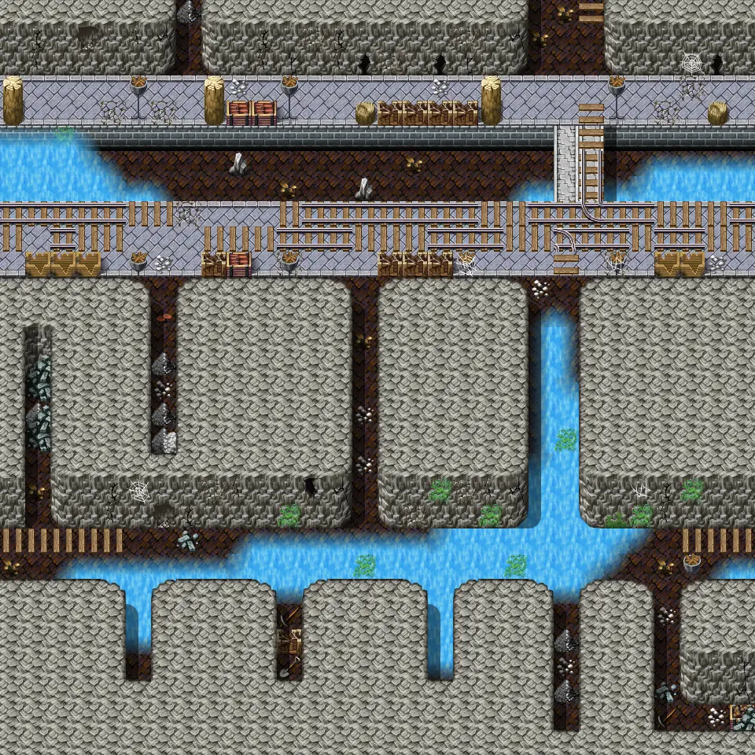

# Undertell 3 12

| | |
|---|---|
| **Map ID** | `undertell_3_12` |
| **Type** | Indoors / underground |
| **Size** | 30×30 tiles |
| **World map** | [Undertell level 3](index.md) |
| **Introduced** | [v0.8.18](../versions/0.8.18.md) |
| **NPCs** | 3 |
| **Enemy types** | 2 |
| **Quests** | 3 |

**Undertell 3 12** is an indoor map. It has 3 NPCs and 2 kinds of enemy. Exits lead to Undertell 3 02, Undertell 3 13, Undertell 3 11.

## Map

<label class="lg"><input type="checkbox" data-t="spawn" checked><b>Red</b>&nbsp;Monsters / NPCs</label><label class="lg"><input type="checkbox" data-t="mapchange" checked><b>Blue</b>&nbsp;Exit to another map</label><label class="lg"><input type="checkbox" data-t="container" checked><b>Yellow</b>&nbsp;Container (click to see contents)</label><label class="lg"><input type="checkbox" data-t="sign" checked><b>Purple</b>&nbsp;Sign</label><label class="lg"><input type="checkbox" data-t="rest" checked><b>Green</b>&nbsp;Resting place</label><label class="lg"><input type="checkbox" data-t="key" checked><b>Orange dashed</b>&nbsp;Blocked until a quest step / item</label><label class="lg"><input type="checkbox" data-t="script"><b>Grey dotted</b>&nbsp;Scripted event</label><label class="lg"><input type="checkbox" data-t="replace"><b>White dotted</b>&nbsp;Changes during a quest</label><label class="lg"><input type="checkbox" data-t="pin" checked><b>Numbers</b>&nbsp;Numbered key points (see the key below the map)</label>

<a class="pin pin-exit" href="#key-1" style="left:75.000%;top:1.667%" title="Exit (north): to [Undertell 3 02](undertell_3_02.md)">1</a><a class="pin pin-exit" href="#key-2" style="left:98.333%;top:43.333%" title="Exit (east): to [Undertell 3 13](undertell_3_13.md)">2</a><a class="pin pin-exit" href="#key-3" style="left:1.667%;top:43.333%" title="Exit (west): to [Undertell 3 11](undertell_3_11.md)">3</a><a id="pin-npc-shade4" class="pin pin-npc" href="#key-4" style="left:21.667%;top:41.667%" title="[Forsaken shade](../../monsters/shade1.md#v-shade4): 1 quest">4</a><a id="pin-npc-shade3" class="pin pin-npc" href="#key-5" style="left:5.000%;top:65.000%" title="[Forsaken shade](../../monsters/shade1.md#v-shade3): 1 quest">5</a><a id="pin-npc-about_a_girl1" class="pin pin-npc" href="#key-6" style="left:88.333%;top:85.000%" title="[Terrified teenager](../../monsters/about_a_girl1.md): NPC">6</a><a class="pin pin-script" href="#key-7" style="left:88.333%;top:78.333%" title="Quest trigger: Scripted event: advances the quest: hidden story flag “undertell_hidden” to stage 90 (“about_a_girl1 runs away from PC on map under_3_12”)">7</a><a class="pin pin-key" href="#key-8" style="left:88.333%;top:91.667%" title="Blocked passage: Closed off once you reach this point in the quest: Search for Andor (stage 1: “My father Mikhail says that Andor has not been home since yesterday. I should go look for him in the village.”)">8</a>

??? abstract "Key to the numbers on the map"

    | # | What | Details |
    |---|---|---|
    | 1 | Exit (north) | to [Undertell 3 02](undertell_3_02.md) |
    | 2 | Exit (east) | to [Undertell 3 13](undertell_3_13.md) |
    | 3 | Exit (west) | to [Undertell 3 11](undertell_3_11.md) |
    | 4 | [Forsaken shade](../monsters/shade1.md#v-shade4) | 1 quest |
    | 5 | [Forsaken shade](../monsters/shade1.md#v-shade3) | 1 quest |
    | 6 | [Terrified teenager](../monsters/about_a_girl1.md) | NPC |
    | 7 | Quest trigger | Scripted event: advances the quest: hidden story flag “undertell_hidden” to stage 90 (“about_a_girl1 runs away from PC on map under_3_12”) |
    | 8 | Blocked passage | Closed off once you reach this point in the quest: Search for Andor (stage 1: “My father Mikhail says that Andor has not been home since yesterday. I should go look for him in the village.”) |

Verified against v0.8.18 map data.

## Connections

| Direction | Leads to | Region there | Map # |
|---|---|---|---|
| North | [Undertell 3 02](undertell_3_02.md) | – | 1 |
| East | [Undertell 3 13](undertell_3_13.md) | – | 2 |
| West | [Undertell 3 11](undertell_3_11.md) | – | 3 |

## NPCs

- [Forsaken shade](../monsters/shade1.md#v-shade4) — can be fought — quests: [Devotion](../quests/devotion.md) (#4)
- [Forsaken shade](../monsters/shade1.md#v-shade3) — can be fought — quests: [Devotion](../quests/devotion.md) (#5)
- [Terrified teenager](../monsters/about_a_girl1.md) (#6)

## Enemies

| Enemy | HP | Damage | Up to | Notes |
|---|---|---|---|---|
| [Forgotten miner](../monsters/forgotten_miner.md) | 228 | 8–14 | 3 | appears later, during a quest |
| [Young rock eater](../monsters/young_rock_eater.md) | 303 | 8–10 | 4 | – |

<small>“Up to” is the most that can be alive at once from the spawn areas on this map.</small>

**Scenery:** [Terrified teenager](../monsters/about_a_girl1.md#v-about_a_girl_hidden), [Terrified teenager](../monsters/about_a_girl1.md#v-about_a_girl_flee)

## Quests

- [About a girl](../quests/about_a_girl.md): something on this map advances it
- [Devotion](../quests/devotion.md): [Forsaken shade](../monsters/shade1.md#v-shade3) is involved; [Forsaken shade](../monsters/shade1.md#v-shade4) is involved
- [Search for Andor](../quests/andor.md): blocked passage closes at stage 1
- [Devotion story flags (hidden flag)](../quests/hidden_devotion.md): [Forsaken shade](../monsters/shade1.md#v-shade3) is involved; [Forsaken shade](../monsters/shade1.md#v-shade4) is involved
- [Undertell story flags (hidden flag)](../quests/undertell_hidden.md): [Terrified teenager](../monsters/about_a_girl1.md) is involved; something on this map advances it; stepping on a trigger here sets stage 90

## Points of interest

- **Quest trigger** (#7): Scripted event: advances the quest: hidden story flag “undertell_hidden” to stage 90 (“about_a_girl1 runs away from PC on map under_3_12”)
- **Blocked passage** (#8): Closed off once you reach this point in the quest: Search for Andor (stage 1: “My father Mikhail says that Andor has not been home since yesterday. I should go look for him in the village.”)

## Version history

| Version | Change |
|---|---|
| [v0.8.18](../versions/0.8.18.md) | Added |

Verified against v0.8.18 and every earlier release back to v0.7.0 (game data compared release by release).

## Community notes

<small>Written by players, not generated from game data. **Observations**: what players notice in-game · **Lore**: the in-world story · **Trivia**: real-world facts, references, development history · **Theory / speculation**: unconfirmed ideas; may just be unfinished content</small>

### Observations

*No notes yet. Contributions are welcome: [add a note](https://github.com/asdfghjkl628/Andor-s-Trail-Wikiiii/new/main/notes/maps?filename=undertell_3_12.md&value=%23%23%20Observations%0A%0A%3C%21--%20what%20players%20notice%20in-game%20--%3E%0A%0A%23%23%20Lore%0A%0A%3C%21--%20the%20in-world%20story%20--%3E%0A%0A%23%23%20Trivia%0A%0A%3C%21--%20real-world%20facts%2C%20references%2C%20development%20history%20--%3E%0A%0A%23%23%20Theory%20/%20speculation%0A%0A%3C%21--%20unconfirmed%20ideas%3B%20may%20just%20be%20unfinished%20content%20--%3E%0A).*

### Lore

*No notes yet. Contributions are welcome: [add a note](https://github.com/asdfghjkl628/Andor-s-Trail-Wikiiii/new/main/notes/maps?filename=undertell_3_12.md&value=%23%23%20Observations%0A%0A%3C%21--%20what%20players%20notice%20in-game%20--%3E%0A%0A%23%23%20Lore%0A%0A%3C%21--%20the%20in-world%20story%20--%3E%0A%0A%23%23%20Trivia%0A%0A%3C%21--%20real-world%20facts%2C%20references%2C%20development%20history%20--%3E%0A%0A%23%23%20Theory%20/%20speculation%0A%0A%3C%21--%20unconfirmed%20ideas%3B%20may%20just%20be%20unfinished%20content%20--%3E%0A).*

### Trivia

*No notes yet. Contributions are welcome: [add a note](https://github.com/asdfghjkl628/Andor-s-Trail-Wikiiii/new/main/notes/maps?filename=undertell_3_12.md&value=%23%23%20Observations%0A%0A%3C%21--%20what%20players%20notice%20in-game%20--%3E%0A%0A%23%23%20Lore%0A%0A%3C%21--%20the%20in-world%20story%20--%3E%0A%0A%23%23%20Trivia%0A%0A%3C%21--%20real-world%20facts%2C%20references%2C%20development%20history%20--%3E%0A%0A%23%23%20Theory%20/%20speculation%0A%0A%3C%21--%20unconfirmed%20ideas%3B%20may%20just%20be%20unfinished%20content%20--%3E%0A).*

### Theory / speculation

*No notes yet. Contributions are welcome: [add a note](https://github.com/asdfghjkl628/Andor-s-Trail-Wikiiii/new/main/notes/maps?filename=undertell_3_12.md&value=%23%23%20Observations%0A%0A%3C%21--%20what%20players%20notice%20in-game%20--%3E%0A%0A%23%23%20Lore%0A%0A%3C%21--%20the%20in-world%20story%20--%3E%0A%0A%23%23%20Trivia%0A%0A%3C%21--%20real-world%20facts%2C%20references%2C%20development%20history%20--%3E%0A%0A%23%23%20Theory%20/%20speculation%0A%0A%3C%21--%20unconfirmed%20ideas%3B%20may%20just%20be%20unfinished%20content%20--%3E%0A).*

??? info "Technical information"

    | | |
    |---|---|
    | Map ID | `undertell_3_12` |
    | File | `res/xml/undertell_3_12.tmx` |
    | Size | 30×30 tiles (960×960 px) |
    | outdoors property | – |
    | Layers drawn | ground, objects, above, top |
    | Tilesets | map_bed_1, map_border_1, map_bridge_1, map_bridge_2, map_broken_1, map_cavewall_1, map_cavewall_2, map_cavewall_3, map_cavewall_4, map_chair_table_1, map_chair_table_2, map_crate_1, map_cupboard_1, map_curtain_1, map_entrance_1, map_entrance_2, map_fence_1, map_fence_2, map_fence_3, map_fence_4, map_ground_1, map_ground_2, map_ground_3, map_ground_4, map_ground_5, map_ground_6, map_ground_7, map_ground_8, map_house_1, map_house_2, map_indoor_1, map_indoor_2, map_kitchen_1, map_outdoor_1, map_pillar_1, map_pillar_2, map_plant_1, map_plant_2, map_rock_1, map_rock_2, map_roof_1, map_roof_2, map_roof_3, map_shop_1, map_sign_ladder_1, map_table_1, map_trail_1, map_transition_1, map_transition_2, map_transition_3, map_transition_4, map_transition_5, map_tree_1, map_tree_2, map_wall_1, map_wall_2, map_wall_3, map_wall_4, map_window_1, map_window_2 |
    | Map objects | spawn: 10, mapchange: 3, script: 1, key: 1 |
    | World map position | segment `undertell_level3`, x 210, y 29 |

<small>Data from v0.8.18</small>
