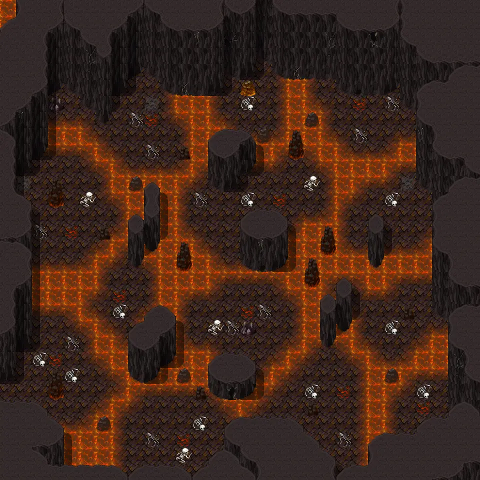
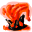
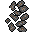

# Undertell 3 lava 01

30×30 tiles · part of [Undertell level3](index.md)

<label class="lg"><input type="checkbox" data-t="spawn" checked><b>Red</b>&nbsp;Monsters / NPCs</label><label class="lg"><input type="checkbox" data-t="mapchange" checked><b>Blue</b>&nbsp;Exit to another map</label><label class="lg"><input type="checkbox" data-t="container" checked><b>Yellow</b>&nbsp;Container (click to see contents)</label><label class="lg"><input type="checkbox" data-t="sign" checked><b>Purple</b>&nbsp;Sign</label><label class="lg"><input type="checkbox" data-t="rest" checked><b>Green</b>&nbsp;Resting place</label><label class="lg"><input type="checkbox" data-t="key" checked><b>Orange dashed</b>&nbsp;Blocked until a quest step / item</label><label class="lg"><input type="checkbox" data-t="script"><b>Grey dotted</b>&nbsp;Scripted event</label><label class="lg"><input type="checkbox" data-t="replace"><b>White dotted</b>&nbsp;Changes during a quest</label>

## Containers

<b>Container 1</b><ul><li><a href="../../items/ancient_dragon_scales/">Ash covered dragon scales</a> <small>100%</small></li></ul>

<b>Container 2</b><ul><li><a href="../../items/ancient_dragon_scales/">Ash covered dragon scales</a> <small>100%</small></li></ul>

<b>Container 3</b><ul><li><a href="../../items/ancient_dragon_scales/">Ash covered dragon scales</a> <small>100%</small></li></ul>

<b>Container 4</b><ul><li><a href="../../items/pot_bm_kazaul/">Kazaul bonemeal</a> <small>10% · ×1 to 2</small></li><li><a href="../../items/health_major2/">Major potion of health</a> <small>75% · ×2 to 4</small></li><li><a href="../../items/bonemeal_potion/">Bonemeal potion</a> <small>80% · ×3</small></li><li><a href="../../items/tonic_of_blood/">Tonic of blood</a> <small>100% · ×2 to 4</small></li></ul>

<b>Container 5</b><ul><li><a href="../../items/pot_bm_kazaul/">Kazaul bonemeal</a> <small>10% · ×1 to 2</small></li><li><a href="../../items/health_major2/">Major potion of health</a> <small>75% · ×2 to 4</small></li><li><a href="../../items/bonemeal_potion/">Bonemeal potion</a> <small>80% · ×3</small></li><li><a href="../../items/tonic_of_blood/">Tonic of blood</a> <small>100% · ×2 to 4</small></li></ul>

## Exits

- [Undertell 3 lava 00](undertell_3_lava_00.md)

## Monsters & NPCs here

| Name | HP |
|---|---|
| [Bone-Marshal lich](../monsters/bone_marshal_lich_pearl.md) | 232 |
| [Molten pyreling](../monsters/molten_pyreling.md) | 236 |
| [Erupting pyreling](../monsters/erupting_pyreling.md) | 246 |
| [Embergeist](../monsters/embergeist.md) | 266 |
| [Pyreling](../monsters/pyreling.md) | 266 |
| [Dreadstaff lich](../monsters/dreadstaff_help_plague.md) | 285 |

<small>Map ID: `undertell_3_lava_01` · Data from v0.8.18</small>
