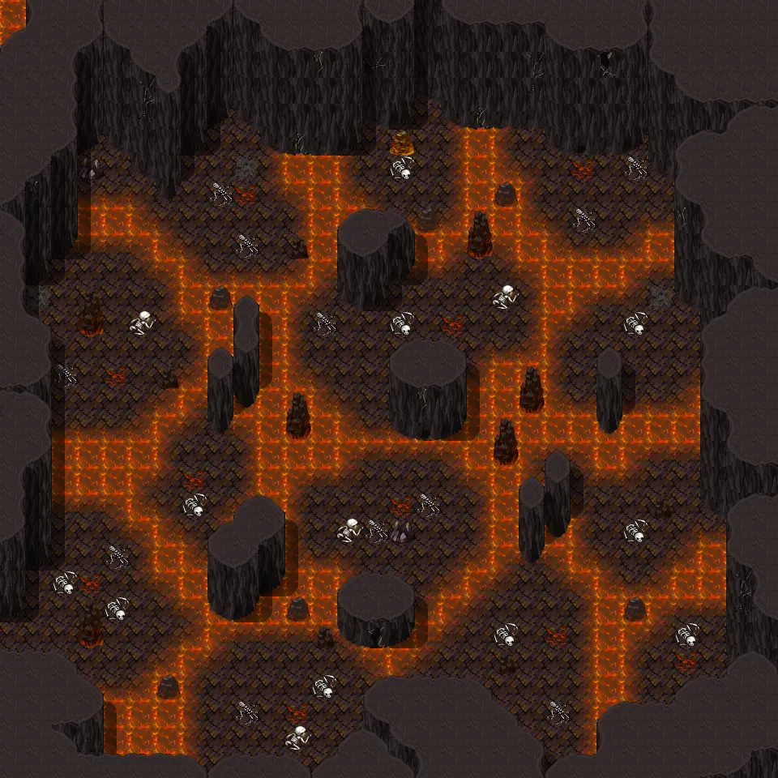
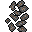

# Undertell 3 lava 01

| | |
|---|---|
| **Map ID** | `undertell_3_lava_01` |
| **Type** | Indoors / underground |
| **Size** | 30×30 tiles |
| **World map** | [Undertell level 3](index.md) |
| **Introduced** | [v0.8.18](../versions/0.8.18.md) |
| **Enemy types** | 6 |
| **Quests** | 2 |
| **Containers** | 5 |

**Undertell 3 lava 01** is an indoor map. It has no NPCs and 6 kinds of enemy. Exits lead to Undertell 3 lava 00.

## Map

<label class="lg"><input type="checkbox" data-t="spawn" checked><b>Red</b>&nbsp;Monsters / NPCs</label><label class="lg"><input type="checkbox" data-t="mapchange" checked><b>Blue</b>&nbsp;Exit to another map</label><label class="lg"><input type="checkbox" data-t="container" checked><b>Yellow</b>&nbsp;Container (click to see contents)</label><label class="lg"><input type="checkbox" data-t="sign" checked><b>Purple</b>&nbsp;Sign</label><label class="lg"><input type="checkbox" data-t="rest" checked><b>Green</b>&nbsp;Resting place</label><label class="lg"><input type="checkbox" data-t="key" checked><b>Orange dashed</b>&nbsp;Blocked until a quest step / item</label><label class="lg"><input type="checkbox" data-t="script"><b>Grey dotted</b>&nbsp;Scripted event</label><label class="lg"><input type="checkbox" data-t="replace"><b>White dotted</b>&nbsp;Changes during a quest</label><label class="lg"><input type="checkbox" data-t="pin" checked><b>Numbers</b>&nbsp;Numbered key points (see the key below the map)</label>

<a class="pin pin-exit" href="#key-1" style="left:1.667%;top:81.667%" title="Exit (west): to [Undertell 3 lava 00](undertell_3_lava_00.md)">1</a><a class="pin pin-container" href="#key-2" style="left:85.000%;top:38.333%" title="Container 1: Ash covered dragon scales">2</a><a class="pin pin-container" href="#key-3" style="left:31.667%;top:21.667%" title="Container 2: Ash covered dragon scales">3</a><a class="pin pin-container" href="#key-4" style="left:5.000%;top:38.333%" title="Container 3: Ash covered dragon scales">4</a><a class="pin pin-container" href="#key-5" style="left:75.000%;top:28.333%" title="Container 4: Kazaul bonemeal, Major potion of health, Bonemeal potion, Tonic of blood">5</a><a class="pin pin-container" href="#key-6" style="left:88.333%;top:81.667%" title="Container 5: Kazaul bonemeal, Major potion of health, Bonemeal potion, Tonic of blood">6</a><a class="pin pin-key" href="#key-7" style="left:51.667%;top:18.333%" title="Blocked passage: Closed off once you reach this point in the quest: Search for Andor (stage 1: “My father Mikhail says that Andor has not been home since yesterday. I should go look for him in the village.”)">7</a><a class="pin pin-replace" href="#key-8" style="left:51.886%;top:15.834%" title="Changes during a quest: This area changes during the quest: Lost treasures (stage 70: “I placed the Galmore ice on the heartstone. The block hissed and steamed as it melted away, cooling the heartstone until it was safe to touch. I picked it up at last.”)">8</a>

??? abstract "Key to the numbers on the map"

    | # | What | Details |
    |---|---|---|
    | 1 | Exit (west) | to [Undertell 3 lava 00](undertell_3_lava_00.md) |
    | 2 | Container 1 | Ash covered dragon scales |
    | 3 | Container 2 | Ash covered dragon scales |
    | 4 | Container 3 | Ash covered dragon scales |
    | 5 | Container 4 | Kazaul bonemeal, Major potion of health, Bonemeal potion, Tonic of blood |
    | 6 | Container 5 | Kazaul bonemeal, Major potion of health, Bonemeal potion, Tonic of blood |
    | 7 | Blocked passage | Closed off once you reach this point in the quest: Search for Andor (stage 1: “My father Mikhail says that Andor has not been home since yesterday. I should go look for him in the village.”) |
    | 8 | Changes during a quest | This area changes during the quest: Lost treasures (stage 70: “I placed the Galmore ice on the heartstone. The block hissed and steamed as it melted away, cooling the heartstone until it was safe to touch. I picked it up at last.”) |

Verified against v0.8.18 map data.

## Connections

| Direction | Leads to | Region there | Map # |
|---|---|---|---|
| West | [Undertell 3 lava 00](undertell_3_lava_00.md) | – | 1 |

## Enemies

| Enemy | HP | Damage | Up to | Notes |
|---|---|---|---|---|
| [Bone-Marshal lich](../monsters/bone_marshal_lich.md#v-bone_marshal_lich_pearl) | 232 | 9–11 | 1 | appears later, during a quest |
| [Molten pyreling](../monsters/molten_pyreling.md) | 236 | 15–21 | 4 | – |
| [Erupting pyreling](../monsters/erupting_pyreling.md) | 246 | 19–26 | 4 | – |
| [Embergeist](../monsters/embergeist.md) | 266 | 21–22 | 1 | – |
| [Pyreling](../monsters/pyreling.md) | 266 | 20–28 | 2 | – |
| [Dreadstaff lich](../monsters/dreadblade.md#v-dreadstaff_help_plague) | 285 | 10–13 | 2 | – |

<small>“Up to” is the most that can be alive at once from the spawn areas on this map.</small>

## Items & containers

<b>Container 1</b><ul><li><a href="../../items/ancient_dragon_scales/">Ash covered dragon scales</a> <small>100%</small></li></ul>

<b>Container 2</b><ul><li><a href="../../items/ancient_dragon_scales/">Ash covered dragon scales</a> <small>100%</small></li></ul>

<b>Container 3</b><ul><li><a href="../../items/ancient_dragon_scales/">Ash covered dragon scales</a> <small>100%</small></li></ul>

<b>Container 4</b><ul><li><a href="../../items/pot_bm_kazaul/">Kazaul bonemeal</a> <small>10% · ×1 to 2</small></li><li><a href="../../items/health_major2/">Major potion of health</a> <small>75% · ×2 to 4</small></li><li><a href="../../items/bonemeal_potion/">Bonemeal potion</a> <small>80% · ×3</small></li><li><a href="../../items/tonic_of_blood/">Tonic of blood</a> <small>100% · ×2 to 4</small></li></ul>

<b>Container 5</b><ul><li><a href="../../items/pot_bm_kazaul/">Kazaul bonemeal</a> <small>10% · ×1 to 2</small></li><li><a href="../../items/health_major2/">Major potion of health</a> <small>75% · ×2 to 4</small></li><li><a href="../../items/bonemeal_potion/">Bonemeal potion</a> <small>80% · ×3</small></li><li><a href="../../items/tonic_of_blood/">Tonic of blood</a> <small>100% · ×2 to 4</small></li></ul>

## Quests

- [Lost treasures](../quests/nocmar.md): part of the map changes at stage 70; something on this map advances it
- [Search for Andor](../quests/andor.md): blocked passage closes at stage 1
- [Lava burning timer (hidden flag)](../quests/lava_burning.md): a scripted event can trigger here from stage 1; a scripted event can trigger here from stage 3; a scripted event can trigger here from stage 4; a scripted event can trigger here from stage 7

## Points of interest

- **Blocked passage** (#7): Closed off once you reach this point in the quest: Search for Andor (stage 1: “My father Mikhail says that Andor has not been home since yesterday. I should go look for him in the village.”)
- **Changes during a quest** (#8): This area changes during the quest: Lost treasures (stage 70: “I placed the Galmore ice on the heartstone. The block hissed and steamed as it melted away, cooling the heartstone until it was safe to touch. I picked it up at last.”)

## Version history

| Version | Change |
|---|---|
| [v0.8.18](../versions/0.8.18.md) | Added |

Verified against v0.8.18 and every earlier release back to v0.7.0 (game data compared release by release).

## Community notes

<small>Written by players, not generated from game data. **Observations**: what players notice in-game · **Lore**: the in-world story · **Trivia**: real-world facts, references, development history · **Theory / speculation**: unconfirmed ideas; may just be unfinished content</small>

### Observations

*No notes yet. Contributions are welcome: [add a note](https://github.com/asdfghjkl628/Andor-s-Trail-Wikiiii/new/main/notes/maps?filename=undertell_3_lava_01.md&value=%23%23%20Observations%0A%0A%3C%21--%20what%20players%20notice%20in-game%20--%3E%0A%0A%23%23%20Lore%0A%0A%3C%21--%20the%20in-world%20story%20--%3E%0A%0A%23%23%20Trivia%0A%0A%3C%21--%20real-world%20facts%2C%20references%2C%20development%20history%20--%3E%0A%0A%23%23%20Theory%20/%20speculation%0A%0A%3C%21--%20unconfirmed%20ideas%3B%20may%20just%20be%20unfinished%20content%20--%3E%0A).*

### Lore

*No notes yet. Contributions are welcome: [add a note](https://github.com/asdfghjkl628/Andor-s-Trail-Wikiiii/new/main/notes/maps?filename=undertell_3_lava_01.md&value=%23%23%20Observations%0A%0A%3C%21--%20what%20players%20notice%20in-game%20--%3E%0A%0A%23%23%20Lore%0A%0A%3C%21--%20the%20in-world%20story%20--%3E%0A%0A%23%23%20Trivia%0A%0A%3C%21--%20real-world%20facts%2C%20references%2C%20development%20history%20--%3E%0A%0A%23%23%20Theory%20/%20speculation%0A%0A%3C%21--%20unconfirmed%20ideas%3B%20may%20just%20be%20unfinished%20content%20--%3E%0A).*

### Trivia

*No notes yet. Contributions are welcome: [add a note](https://github.com/asdfghjkl628/Andor-s-Trail-Wikiiii/new/main/notes/maps?filename=undertell_3_lava_01.md&value=%23%23%20Observations%0A%0A%3C%21--%20what%20players%20notice%20in-game%20--%3E%0A%0A%23%23%20Lore%0A%0A%3C%21--%20the%20in-world%20story%20--%3E%0A%0A%23%23%20Trivia%0A%0A%3C%21--%20real-world%20facts%2C%20references%2C%20development%20history%20--%3E%0A%0A%23%23%20Theory%20/%20speculation%0A%0A%3C%21--%20unconfirmed%20ideas%3B%20may%20just%20be%20unfinished%20content%20--%3E%0A).*

### Theory / speculation

*No notes yet. Contributions are welcome: [add a note](https://github.com/asdfghjkl628/Andor-s-Trail-Wikiiii/new/main/notes/maps?filename=undertell_3_lava_01.md&value=%23%23%20Observations%0A%0A%3C%21--%20what%20players%20notice%20in-game%20--%3E%0A%0A%23%23%20Lore%0A%0A%3C%21--%20the%20in-world%20story%20--%3E%0A%0A%23%23%20Trivia%0A%0A%3C%21--%20real-world%20facts%2C%20references%2C%20development%20history%20--%3E%0A%0A%23%23%20Theory%20/%20speculation%0A%0A%3C%21--%20unconfirmed%20ideas%3B%20may%20just%20be%20unfinished%20content%20--%3E%0A).*

??? info "Technical information"

    | | |
    |---|---|
    | Map ID | `undertell_3_lava_01` |
    | File | `res/xml/undertell_3_lava_01.tmx` |
    | Size | 30×30 tiles (960×960 px) |
    | outdoors property | – |
    | Layers drawn | base, ground, objects, above, top |
    | Tilesets | map_bed_1, map_border_1, map_bridge_1, map_bridge_2, map_broken_1, map_cavewall_1, map_cavewall_2, map_cavewall_3, map_cavewall_4, map_chair_table_1, map_chair_table_2, map_crate_1, map_cupboard_1, map_curtain_1, map_entrance_1, map_entrance_2, map_fence_1, map_fence_2, map_fence_3, map_fence_4, map_ground_1, map_ground_2, map_ground_3, map_ground_4, map_ground_5, map_ground_6, map_ground_7, map_ground_8, map_house_1, map_house_2, map_indoor_1, map_indoor_2, map_kitchen_1, map_outdoor_1, map_pillar_1, map_pillar_2, map_plant_1, map_plant_2, map_rock_1, map_rock_2, map_roof_1, map_roof_2, map_roof_3, map_shop_1, map_sign_ladder_1, map_table_1, map_trail_1, map_transition_1, map_transition_2, map_transition_3, map_transition_4, map_transition_5, map_tree_1, map_tree_2, map_wall_1, map_wall_2, map_wall_3, map_wall_4, map_window_1, map_window_2 |
    | Map objects | script: 50, spawn: 11, container: 5, mapchange: 1, key: 1, replace: 1 |
    | World map position | segment `undertell_level3`, x 113, y -2 |

<small>Data from v0.8.18</small>
