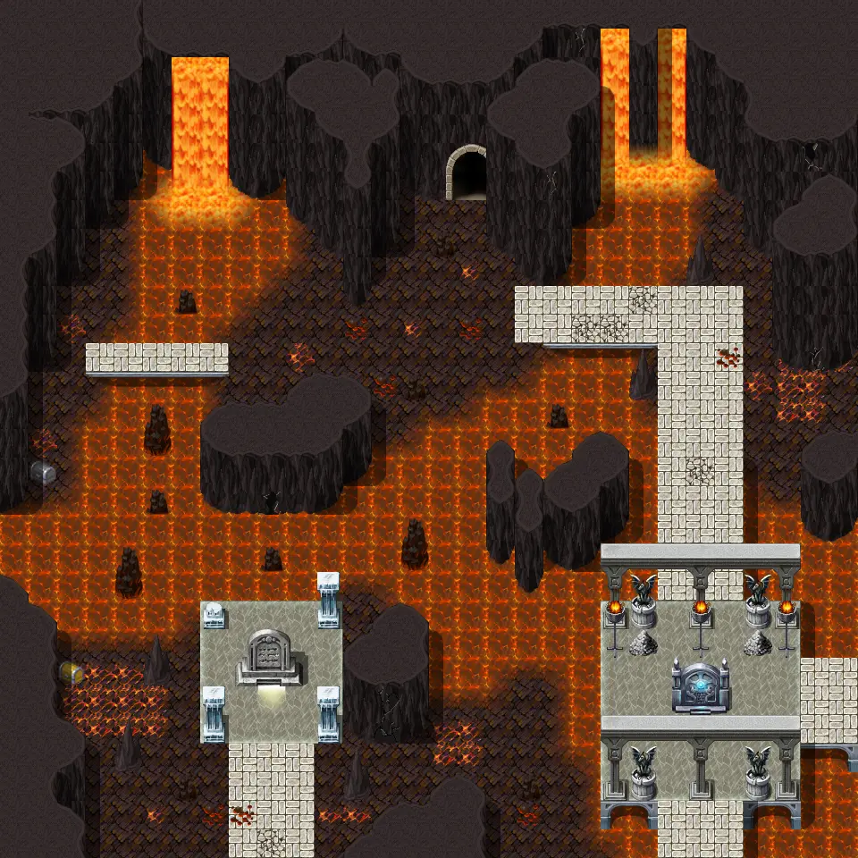
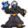
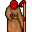

# Undertell 4 00

30×30 tiles · part of [Undertell level4](index.md)

<label class="lg"><input type="checkbox" data-t="spawn" checked><b>Red</b>&nbsp;Monsters / NPCs</label><label class="lg"><input type="checkbox" data-t="mapchange" checked><b>Blue</b>&nbsp;Exit to another map</label><label class="lg"><input type="checkbox" data-t="container" checked><b>Yellow</b>&nbsp;Container (click to see contents)</label><label class="lg"><input type="checkbox" data-t="sign" checked><b>Purple</b>&nbsp;Sign</label><label class="lg"><input type="checkbox" data-t="rest" checked><b>Green</b>&nbsp;Resting place</label><label class="lg"><input type="checkbox" data-t="key" checked><b>Orange dashed</b>&nbsp;Blocked until a quest step / item</label><label class="lg"><input type="checkbox" data-t="script"><b>Grey dotted</b>&nbsp;Scripted event</label><label class="lg"><input type="checkbox" data-t="replace"><b>White dotted</b>&nbsp;Changes during a quest</label>

## Containers

<b>Container 1</b><ul><li><a href="../../items/gold/">Gold coins</a> <small>100% · ×1700 to 1762</small></li></ul>

## Exits

- [Undertell 4 01](undertell_4_01.md)
- [Undertell 4 10](undertell_4_10.md)
- [Undertell archive1](undertell_archive1.md)

## Monsters & NPCs here

| Name | HP |
|---|---|
| [Zaroth](../monsters/zaroth.md) | 0 |
| [Tocsin](../monsters/tocsin.md) | 0 |
| [Kha'zaan Porter](../monsters/porter.md) | 0 |
| [Plague-Lich](../monsters/plague_lich.md) | 263 |
| [Embergeist](../monsters/embergeist.md) | 266 |
| [Kazaul seer lich](../monsters/kazaul_seer_lich_help_others.md) | 295 |
| [Kazaul seer lich](../monsters/kazaul_seer_lich_help_plague.md) | 295 |
| [Kazaul seer lich](../monsters/kazaul_seer_lich_help_liches.md) | 295 |
| [Kazaul crimson arbiter lich](../monsters/kazaul_crimson_arbiter_lich.md) | 305 |

<small>Map ID: `undertell_4_00` · Data from v0.8.18</small>
