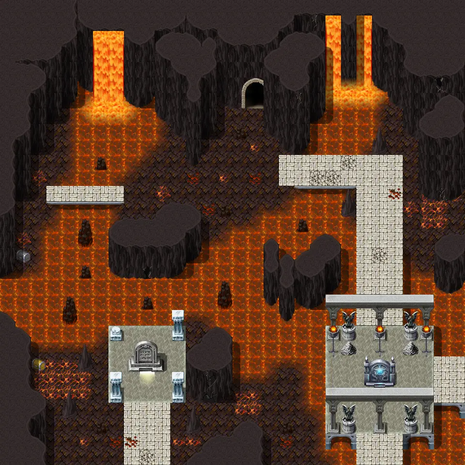
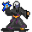
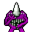

# Undertell 4 00

| | |
|---|---|
| **Map ID** | `undertell_4_00` |
| **Type** | Indoors / underground |
| **Size** | 30×30 tiles |
| **World map** | [Undertell level 4](index.md) |
| **Introduced** | [v0.8.18](../versions/0.8.18.md) |
| **NPCs** | 3 |
| **Enemy types** | 6 |
| **Quests** | 2 |
| **Containers** | 1 |

**Undertell 4 00** is an indoor map. It has 3 NPCs and 6 kinds of enemy. Exits lead to Undertell 4 01, Undertell 4 10, Undertell archive 1.

## Map

<label class="lg"><input type="checkbox" data-t="spawn" checked><b>Red</b>&nbsp;Monsters / NPCs</label><label class="lg"><input type="checkbox" data-t="mapchange" checked><b>Blue</b>&nbsp;Exit to another map</label><label class="lg"><input type="checkbox" data-t="container" checked><b>Yellow</b>&nbsp;Container (click to see contents)</label><label class="lg"><input type="checkbox" data-t="sign" checked><b>Purple</b>&nbsp;Sign</label><label class="lg"><input type="checkbox" data-t="rest" checked><b>Green</b>&nbsp;Resting place</label><label class="lg"><input type="checkbox" data-t="key" checked><b>Orange dashed</b>&nbsp;Blocked until a quest step / item</label><label class="lg"><input type="checkbox" data-t="script"><b>Grey dotted</b>&nbsp;Scripted event</label><label class="lg"><input type="checkbox" data-t="replace"><b>White dotted</b>&nbsp;Changes during a quest</label><label class="lg"><input type="checkbox" data-t="pin" checked><b>Numbers</b>&nbsp;Numbered key points (see the key below the map)</label>

<a class="pin pin-exit" href="#key-1" style="left:98.333%;top:65.000%" title="Exit (east): to [Undertell 4 01](undertell_4_01.md)">1</a><a class="pin pin-exit" href="#key-2" style="left:48.333%;top:98.333%" title="Exit (south): to [Undertell 4 10](undertell_4_10.md)">2</a><a class="pin pin-exit" href="#key-3" style="left:55.000%;top:21.667%" title="Exit (stairs / passage): to [Undertell archive 1](undertell_archive1.md)">3</a><a id="pin-npc-porter" class="pin pin-npc" href="#key-4" style="left:51.667%;top:25.000%" title="[Kha&#x27;zaan Porter](../../monsters/porter.md): NPC">4</a><a id="pin-npc-tocsin" class="pin pin-npc" href="#key-5" style="left:48.333%;top:25.000%" title="[Tocsin](../../monsters/tocsin.md): NPC">5</a><a id="pin-npc-zaroth" class="pin pin-npc" href="#key-6" style="left:85.000%;top:78.333%" title="[Zaroth](../../monsters/zaroth.md): 1 quest">6</a><a class="pin pin-container" href="#key-7" style="left:5.000%;top:55.000%" title="Container 1: Gold coins">7</a><a class="pin pin-key" href="#key-8" style="left:55.219%;top:19.167%" title="Blocked passage: Unlocked during the quest: About a girl (stage 50: “A Master acknowledged the talisman when I asked about it. He spoke of fear made solid, and said such fear was useful to those who taught the Shadow obedience rather than faith. It can be found in the &quot;lower records&quot;, whatever that means.”)">8</a><a class="pin pin-key" href="#key-9" style="left:55.000%;top:28.333%" title="Blocked passage: Passable only while not carrying: Crown of studied defiance">9</a><a class="pin pin-key" href="#key-10" style="left:55.219%;top:25.834%" title="Blocked passage: Passable only while not wearing: Crown of studied defiance">10</a>

??? abstract "Key to the numbers on the map"

    | # | What | Details |
    |---|---|---|
    | 1 | Exit (east) | to [Undertell 4 01](undertell_4_01.md) |
    | 2 | Exit (south) | to [Undertell 4 10](undertell_4_10.md) |
    | 3 | Exit (stairs / passage) | to [Undertell archive 1](undertell_archive1.md) |
    | 4 | [Kha'zaan Porter](../monsters/porter.md) | NPC |
    | 5 | [Tocsin](../monsters/tocsin.md) | NPC |
    | 6 | [Zaroth](../monsters/zaroth.md) | 1 quest |
    | 7 | Container 1 | Gold coins |
    | 8 | Blocked passage | Unlocked during the quest: About a girl (stage 50: “A Master acknowledged the talisman when I asked about it. He spoke of fear made solid, and said such fear was useful to those who taught the Shadow obedience rather than faith. It can be found in the "lower records", whatever that means.”) |
    | 9 | Blocked passage | Passable only while not carrying: Crown of studied defiance |
    | 10 | Blocked passage | Passable only while not wearing: Crown of studied defiance |

Verified against v0.8.18 map data.

## Connections

| Direction | Leads to | Region there | Map # |
|---|---|---|---|
| East | [Undertell 4 01](undertell_4_01.md) | – | 1 |
| South | [Undertell 4 10](undertell_4_10.md) | – | 2 |
| Stairs / passage | [Undertell archive 1](undertell_archive1.md) | – | 3 |

## NPCs

- [Kha'zaan Porter](../monsters/porter.md) (#4)
- [Tocsin](../monsters/tocsin.md) (#5)
- [Zaroth](../monsters/zaroth.md) — quests: [The fifth master](../quests/fifth_master.md) (#6)

## Enemies

| Enemy | HP | Damage | Up to | Notes |
|---|---|---|---|---|
| [Plague-Lich](../monsters/plague_lich.md) | 263 | 9–11 | 1 | – |
| [Embergeist](../monsters/embergeist.md) | 266 | 21–22 | 3 | – |
| [Kazaul seer lich](../monsters/kazaul_seer_lich.md#v-kazaul_seer_lich_help_liches) | 295 | 10–12 | 1 | – |
| [Kazaul seer lich](../monsters/kazaul_seer_lich.md#v-kazaul_seer_lich_help_others) | 295 | 10–12 | 1 | – |
| [Kazaul seer lich](../monsters/kazaul_seer_lich.md#v-kazaul_seer_lich_help_plague) | 295 | 10–12 | 1 | – |
| [Kazaul crimson arbiter lich](../monsters/kazaul_crimson_arbiter_lich.md) | 305 | 11–13 | 3 | – |

<small>“Up to” is the most that can be alive at once from the spawn areas on this map.</small>

## Items & containers

<b>Container 1</b><ul><li><a href="../../items/gold/">Gold coins</a> <small>100% · ×1700 to 1762</small></li></ul>

## Quests

- [About a girl](../quests/about_a_girl.md): blocked passage opens at stage 50
- [The fifth master](../quests/fifth_master.md): [Zaroth](../monsters/zaroth.md) is involved
- [Lava burning timer (hidden flag)](../quests/lava_burning.md): a scripted event can trigger here from stage 1; a scripted event can trigger here from stage 3; a scripted event can trigger here from stage 4; a scripted event can trigger here from stage 7
- [Undertell story flags (hidden flag)](../quests/undertell_hidden.md): [Tocsin](../monsters/tocsin.md) is involved; [Zaroth](../monsters/zaroth.md) is involved

## Points of interest

- **Blocked passage** (#8): Unlocked during the quest: About a girl (stage 50: “A Master acknowledged the talisman when I asked about it. He spoke of fear made solid, and said such fear was useful to those who taught the Shadow obedience rather than faith. It can be found in the "lower records", whatever that means.”)
- **Blocked passage** (#9): Passable only while not carrying: Crown of studied defiance
- **Blocked passage** (#10): Passable only while not wearing: Crown of studied defiance

## Version history

| Version | Change |
|---|---|
| [v0.8.18](../versions/0.8.18.md) | Added |

Verified against v0.8.18 and every earlier release back to v0.7.0 (game data compared release by release).

## Community notes

<small>Written by players, not generated from game data. **Observations**: what players notice in-game · **Lore**: the in-world story · **Trivia**: real-world facts, references, development history · **Theory / speculation**: unconfirmed ideas; may just be unfinished content</small>

### Observations

*No notes yet. Contributions are welcome: [add a note](https://github.com/asdfghjkl628/Andor-s-Trail-Wikiiii/new/main/notes/maps?filename=undertell_4_00.md&value=%23%23%20Observations%0A%0A%3C%21--%20what%20players%20notice%20in-game%20--%3E%0A%0A%23%23%20Lore%0A%0A%3C%21--%20the%20in-world%20story%20--%3E%0A%0A%23%23%20Trivia%0A%0A%3C%21--%20real-world%20facts%2C%20references%2C%20development%20history%20--%3E%0A%0A%23%23%20Theory%20/%20speculation%0A%0A%3C%21--%20unconfirmed%20ideas%3B%20may%20just%20be%20unfinished%20content%20--%3E%0A).*

### Lore

*No notes yet. Contributions are welcome: [add a note](https://github.com/asdfghjkl628/Andor-s-Trail-Wikiiii/new/main/notes/maps?filename=undertell_4_00.md&value=%23%23%20Observations%0A%0A%3C%21--%20what%20players%20notice%20in-game%20--%3E%0A%0A%23%23%20Lore%0A%0A%3C%21--%20the%20in-world%20story%20--%3E%0A%0A%23%23%20Trivia%0A%0A%3C%21--%20real-world%20facts%2C%20references%2C%20development%20history%20--%3E%0A%0A%23%23%20Theory%20/%20speculation%0A%0A%3C%21--%20unconfirmed%20ideas%3B%20may%20just%20be%20unfinished%20content%20--%3E%0A).*

### Trivia

*No notes yet. Contributions are welcome: [add a note](https://github.com/asdfghjkl628/Andor-s-Trail-Wikiiii/new/main/notes/maps?filename=undertell_4_00.md&value=%23%23%20Observations%0A%0A%3C%21--%20what%20players%20notice%20in-game%20--%3E%0A%0A%23%23%20Lore%0A%0A%3C%21--%20the%20in-world%20story%20--%3E%0A%0A%23%23%20Trivia%0A%0A%3C%21--%20real-world%20facts%2C%20references%2C%20development%20history%20--%3E%0A%0A%23%23%20Theory%20/%20speculation%0A%0A%3C%21--%20unconfirmed%20ideas%3B%20may%20just%20be%20unfinished%20content%20--%3E%0A).*

### Theory / speculation

*No notes yet. Contributions are welcome: [add a note](https://github.com/asdfghjkl628/Andor-s-Trail-Wikiiii/new/main/notes/maps?filename=undertell_4_00.md&value=%23%23%20Observations%0A%0A%3C%21--%20what%20players%20notice%20in-game%20--%3E%0A%0A%23%23%20Lore%0A%0A%3C%21--%20the%20in-world%20story%20--%3E%0A%0A%23%23%20Trivia%0A%0A%3C%21--%20real-world%20facts%2C%20references%2C%20development%20history%20--%3E%0A%0A%23%23%20Theory%20/%20speculation%0A%0A%3C%21--%20unconfirmed%20ideas%3B%20may%20just%20be%20unfinished%20content%20--%3E%0A).*

??? info "Technical information"

    | | |
    |---|---|
    | Map ID | `undertell_4_00` |
    | File | `res/xml/undertell_4_00.tmx` |
    | Size | 30×30 tiles (960×960 px) |
    | outdoors property | – |
    | Layers drawn | ground, objects, above, top |
    | Tilesets | map_bed_1, map_border_1, map_bridge_1, map_bridge_2, map_broken_1, map_cavewall_1, map_cavewall_2, map_cavewall_3, map_cavewall_4, map_chair_table_1, map_chair_table_2, map_crate_1, map_cupboard_1, map_curtain_1, map_entrance_1, map_entrance_2, map_fence_1, map_fence_2, map_fence_3, map_fence_4, map_ground_1, map_ground_2, map_ground_3, map_ground_4, map_ground_5, map_ground_6, map_ground_7, map_ground_8, map_house_1, map_house_2, map_indoor_1, map_indoor_2, map_items_japozero, map_kitchen_1, map_outdoor_1, map_pillar_1, map_pillar_2, map_plant_1, map_plant_2, map_rock_1, map_rock_2, map_roof_1, map_roof_2, map_roof_3, map_shop_1, map_sign_ladder_1, map_table_1, map_trail_1, map_transition_1, map_transition_2, map_transition_3, map_transition_4, map_transition_5, map_tree_1, map_tree_2, map_wall_1, map_wall_2, map_wall_3, map_wall_4, map_window_1, map_window_2 |
    | Map objects | script: 27, spawn: 12, mapchange: 3, key: 3, container: 1 |
    | World map position | segment `undertell_level4`, x 22, y 18 |

<small>Data from v0.8.18</small>
