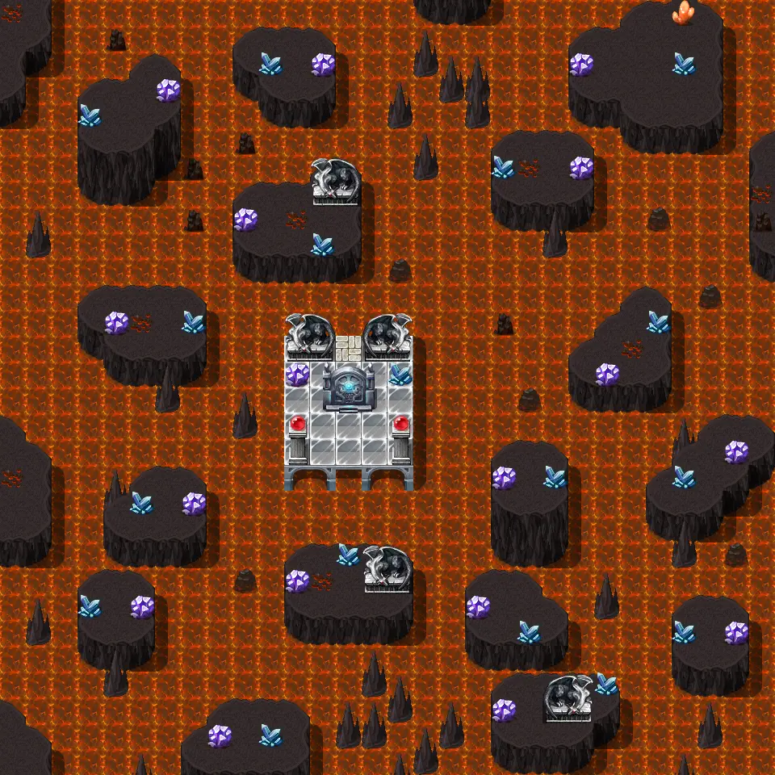

# Undertell 5

| | |
|---|---|
| **Map ID** | `undertell_5` |
| **Type** | Indoors / underground |
| **Size** | 30×30 tiles |
| **World map** | [Undertell level 5](index.md) |
| **Introduced** | [v0.8.18](../versions/0.8.18.md) |
| **NPCs** | 2 |
| **Enemy types** | 5 |
| **Quests** | 1 |

**Undertell 5** is an indoor map. It has 2 NPCs and 5 kinds of enemy. Exits lead to Undertell 5.

## Map

<label class="lg"><input type="checkbox" data-t="spawn" checked><b>Red</b>&nbsp;Monsters / NPCs</label><label class="lg"><input type="checkbox" data-t="mapchange" checked><b>Blue</b>&nbsp;Exit to another map</label><label class="lg"><input type="checkbox" data-t="container" checked><b>Yellow</b>&nbsp;Container (click to see contents)</label><label class="lg"><input type="checkbox" data-t="sign" checked><b>Purple</b>&nbsp;Sign</label><label class="lg"><input type="checkbox" data-t="rest" checked><b>Green</b>&nbsp;Resting place</label><label class="lg"><input type="checkbox" data-t="key" checked><b>Orange dashed</b>&nbsp;Blocked until a quest step / item</label><label class="lg"><input type="checkbox" data-t="script"><b>Grey dotted</b>&nbsp;Scripted event</label><label class="lg"><input type="checkbox" data-t="replace"><b>White dotted</b>&nbsp;Changes during a quest</label><label class="lg"><input type="checkbox" data-t="pin" checked><b>Numbers</b>&nbsp;Numbered key points (see the key below the map)</label>

<a class="pin pin-exit" href="#key-1" style="left:38.333%;top:95.000%" title="Exit (south): to [Undertell 5](undertell_5.md)">1</a><a class="pin pin-exit" href="#key-2" style="left:88.333%;top:85.000%" title="Exit (stairs / passage): to [Undertell 5](undertell_5.md)">2</a><a class="pin pin-exit" href="#key-2" style="left:71.667%;top:81.667%" title="Exit (stairs / passage): to [Undertell 5](undertell_5.md)">2</a><a class="pin pin-exit" href="#key-2" style="left:45.000%;top:75.000%" title="Exit (stairs / passage): to [Undertell 5](undertell_5.md)">2</a><a class="pin pin-exit" href="#key-2" style="left:11.667%;top:75.000%" title="Exit (stairs / passage): to [Undertell 5](undertell_5.md)">2</a><a class="pin pin-exit" href="#key-2" style="left:85.000%;top:61.667%" title="Exit (stairs / passage): to [Undertell 5](undertell_5.md)">2</a><a class="pin pin-exit" href="#key-2" style="left:71.667%;top:58.333%" title="Exit (stairs / passage): to [Undertell 5](undertell_5.md)">2</a><a class="pin pin-exit" href="#key-2" style="left:18.333%;top:61.667%" title="Exit (stairs / passage): to [Undertell 5](undertell_5.md)">2</a><a class="pin pin-exit" href="#key-2" style="left:85.000%;top:38.333%" title="Exit (stairs / passage): to [Undertell 5](undertell_5.md)">2</a><a class="pin pin-exit" href="#key-2" style="left:25.000%;top:45.000%" title="Exit (stairs / passage): to [Undertell 5](undertell_5.md)">2</a><a class="pin pin-exit" href="#key-2" style="left:65.000%;top:18.333%" title="Exit (stairs / passage): to [Undertell 5](undertell_5.md)">2</a><a class="pin pin-exit" href="#key-2" style="left:45.000%;top:31.667%" title="Exit (stairs / passage): to [Undertell 5](undertell_5.md)">2</a><a id="pin-npc-anavrin" class="pin pin-npc" href="#key-3" style="left:45.000%;top:55.000%" title="[Anavrin](../../monsters/anavrin.md): 1 quest">3</a><a id="pin-npc-kazaul_acolyte" class="pin pin-npc" href="#key-4" style="left:45.000%;top:45.000%" title="[Kazaul acolyte](../../monsters/kazaul_acolyte.md): 1 quest">4</a><a class="pin pin-key" href="#key-5" style="left:38.333%;top:48.333%" title="Blocked passage: Unlocked during the quest: hidden story flag “undertell_hidden” (stage 65: “65 = PC confirmed exit from the Lake of Fire.”)">5</a><a class="pin pin-key" href="#key-5" style="left:75.000%;top:8.333%" title="Blocked passage: Unlocked during the quest: hidden story flag “undertell_hidden” (stage 65: “65 = PC confirmed exit from the Lake of Fire.”)">5</a><a class="pin pin-key" href="#key-5" style="left:21.667%;top:11.667%" title="Blocked passage: Unlocked during the quest: hidden story flag “undertell_hidden” (stage 65: “65 = PC confirmed exit from the Lake of Fire.”)">5</a><a class="pin pin-key" href="#key-5" style="left:75.000%;top:21.667%" title="Blocked passage: Unlocked during the quest: hidden story flag “undertell_hidden” (stage 65: “65 = PC confirmed exit from the Lake of Fire.”)">5</a><a class="pin pin-key" href="#key-5" style="left:31.667%;top:28.333%" title="Blocked passage: Unlocked during the quest: hidden story flag “undertell_hidden” (stage 65: “65 = PC confirmed exit from the Lake of Fire.”)">5</a><a class="pin pin-key" href="#key-5" style="left:78.333%;top:48.333%" title="Blocked passage: Unlocked during the quest: hidden story flag “undertell_hidden” (stage 65: “65 = PC confirmed exit from the Lake of Fire.”)">5</a><a class="pin pin-key" href="#key-5" style="left:15.000%;top:41.667%" title="Blocked passage: Unlocked during the quest: hidden story flag “undertell_hidden” (stage 65: “65 = PC confirmed exit from the Lake of Fire.”)">5</a><a class="pin pin-key" href="#key-5" style="left:95.000%;top:58.333%" title="Blocked passage: Unlocked during the quest: hidden story flag “undertell_hidden” (stage 65: “65 = PC confirmed exit from the Lake of Fire.”)">5</a><a class="pin pin-key" href="#key-5" style="left:28.333%;top:95.000%" title="Blocked passage: Unlocked during the quest: hidden story flag “undertell_hidden” (stage 65: “65 = PC confirmed exit from the Lake of Fire.”)">5</a><a class="pin pin-key" href="#key-5" style="left:95.000%;top:81.667%" title="Blocked passage: Unlocked during the quest: hidden story flag “undertell_hidden” (stage 65: “65 = PC confirmed exit from the Lake of Fire.”)">5</a><a class="pin pin-key" href="#key-5" style="left:38.333%;top:75.000%" title="Blocked passage: Unlocked during the quest: hidden story flag “undertell_hidden” (stage 65: “65 = PC confirmed exit from the Lake of Fire.”)">5</a><a class="pin pin-key" href="#key-5" style="left:61.667%;top:78.333%" title="Blocked passage: Unlocked during the quest: hidden story flag “undertell_hidden” (stage 65: “65 = PC confirmed exit from the Lake of Fire.”)">5</a><a class="pin pin-key" href="#key-5" style="left:25.000%;top:65.000%" title="Blocked passage: Unlocked during the quest: hidden story flag “undertell_hidden” (stage 65: “65 = PC confirmed exit from the Lake of Fire.”)">5</a><a class="pin pin-key" href="#key-5" style="left:18.333%;top:78.333%" title="Blocked passage: Unlocked during the quest: hidden story flag “undertell_hidden” (stage 65: “65 = PC confirmed exit from the Lake of Fire.”)">5</a><a class="pin pin-key" href="#key-5" style="left:65.000%;top:91.667%" title="Blocked passage: Unlocked during the quest: hidden story flag “undertell_hidden” (stage 65: “65 = PC confirmed exit from the Lake of Fire.”)">5</a><a class="pin pin-key" href="#key-5" style="left:65.000%;top:61.667%" title="Blocked passage: Unlocked during the quest: hidden story flag “undertell_hidden” (stage 65: “65 = PC confirmed exit from the Lake of Fire.”)">5</a><a class="pin pin-key" href="#key-5" style="left:41.667%;top:8.333%" title="Blocked passage: Unlocked during the quest: hidden story flag “undertell_hidden” (stage 65: “65 = PC confirmed exit from the Lake of Fire.”)">5</a><a class="pin pin-replace" href="#key-6" style="left:45.219%;top:42.500%" title="Changes during a quest: This area changes during the quest: The fifth master (stage 85: “As the ritual completed, the Masters revealed their true intent. The rite was not to seal the Rift but to awaken the Fifth Master, whose power might reopen it. They told me the Shadow itself serves Kazaul. Their words left me doubtful, unsure whether I had been deceived or warned.”)">6</a>

??? abstract "Key to the numbers on the map"

    | # | What | Details |
    |---|---|---|
    | 1 | Exit (south) | to [Undertell 5](undertell_5.md) |
    | 2 | Exit (stairs / passage) | to [Undertell 5](undertell_5.md) |
    | 3 | [Anavrin](../monsters/anavrin.md) | 1 quest |
    | 4 | [Kazaul acolyte](../monsters/kazaul_acolyte.md) | 1 quest |
    | 5 | Blocked passage | Unlocked during the quest: hidden story flag “undertell_hidden” (stage 65: “65 = PC confirmed exit from the Lake of Fire.”) |
    | 6 | Changes during a quest | This area changes during the quest: The fifth master (stage 85: “As the ritual completed, the Masters revealed their true intent. The rite was not to seal the Rift but to awaken the Fifth Master, whose power might reopen it. They told me the Shadow itself serves Kazaul. Their words left me doubtful, unsure whether I had been deceived or warned.”) |

Verified against v0.8.18 map data.

## Connections

| Direction | Leads to | Region there | Map # |
|---|---|---|---|
| South | [Undertell 5](undertell_5.md) | – | 1 |
| Stairs / passage | [Undertell 5](undertell_5.md) | – | 2 |

## NPCs

- [Anavrin](../monsters/anavrin.md) — quests: [The fifth master](../quests/fifth_master.md) (#3)
- [Kazaul acolyte](../monsters/kazaul_acolyte.md) — quests: [The fifth master](../quests/fifth_master.md) (#4)

## Enemies

| Enemy | HP | Damage | Up to | Notes |
|---|---|---|---|---|
| [Bone-Marshal lich](../monsters/bone_marshal_lich.md#v-bone_marshal_lich_pearl) | 232 | 9–11 | 1 | appears later, during a quest |
| [Kazaul Hex-Binder lich](../monsters/hexbinder.md) | 263 | 8–10 | 4 | – |
| [Dreadstaff lich](../monsters/dreadblade.md) | 285 | 10–13 | 5 | – |
| [Kazaul seer lich](../monsters/kazaul_seer_lich.md) | 295 | 10–12 | 4 | – |
| [Kazaul crimson arbiter lich](../monsters/kazaul_crimson_arbiter_lich.md) | 305 | 11–13 | 4 | – |

<small>“Up to” is the most that can be alive at once from the spawn areas on this map.</small>

## Quests

- [The fifth master](../quests/fifth_master.md): [Anavrin](../monsters/anavrin.md) is involved; [Kazaul acolyte](../monsters/kazaul_acolyte.md) is involved; part of the map changes at stage 85
- [Undertell story flags (hidden flag)](../quests/undertell_hidden.md): blocked passage opens at stage 65; something on this map advances it

## Points of interest

- **Blocked passage** (#5): Unlocked during the quest: hidden story flag “undertell_hidden” (stage 65: “65 = PC confirmed exit from the Lake of Fire.”)
- **Changes during a quest** (#6): This area changes during the quest: The fifth master (stage 85: “As the ritual completed, the Masters revealed their true intent. The rite was not to seal the Rift but to awaken the Fifth Master, whose power might reopen it. They told me the Shadow itself serves Kazaul. Their words left me doubtful, unsure whether I had been deceived or warned.”)

## Version history

| Version | Change |
|---|---|
| [v0.8.18](../versions/0.8.18.md) | Added |

Verified against v0.8.18 and every earlier release back to v0.7.0 (game data compared release by release).

## Community notes

<small>Written by players, not generated from game data. **Observations**: what players notice in-game · **Lore**: the in-world story · **Trivia**: real-world facts, references, development history · **Theory / speculation**: unconfirmed ideas; may just be unfinished content</small>

### Observations

*No notes yet. Contributions are welcome: [add a note](https://github.com/asdfghjkl628/Andor-s-Trail-Wikiiii/new/main/notes/maps?filename=undertell_5.md&value=%23%23%20Observations%0A%0A%3C%21--%20what%20players%20notice%20in-game%20--%3E%0A%0A%23%23%20Lore%0A%0A%3C%21--%20the%20in-world%20story%20--%3E%0A%0A%23%23%20Trivia%0A%0A%3C%21--%20real-world%20facts%2C%20references%2C%20development%20history%20--%3E%0A%0A%23%23%20Theory%20/%20speculation%0A%0A%3C%21--%20unconfirmed%20ideas%3B%20may%20just%20be%20unfinished%20content%20--%3E%0A).*

### Lore

*No notes yet. Contributions are welcome: [add a note](https://github.com/asdfghjkl628/Andor-s-Trail-Wikiiii/new/main/notes/maps?filename=undertell_5.md&value=%23%23%20Observations%0A%0A%3C%21--%20what%20players%20notice%20in-game%20--%3E%0A%0A%23%23%20Lore%0A%0A%3C%21--%20the%20in-world%20story%20--%3E%0A%0A%23%23%20Trivia%0A%0A%3C%21--%20real-world%20facts%2C%20references%2C%20development%20history%20--%3E%0A%0A%23%23%20Theory%20/%20speculation%0A%0A%3C%21--%20unconfirmed%20ideas%3B%20may%20just%20be%20unfinished%20content%20--%3E%0A).*

### Trivia

*No notes yet. Contributions are welcome: [add a note](https://github.com/asdfghjkl628/Andor-s-Trail-Wikiiii/new/main/notes/maps?filename=undertell_5.md&value=%23%23%20Observations%0A%0A%3C%21--%20what%20players%20notice%20in-game%20--%3E%0A%0A%23%23%20Lore%0A%0A%3C%21--%20the%20in-world%20story%20--%3E%0A%0A%23%23%20Trivia%0A%0A%3C%21--%20real-world%20facts%2C%20references%2C%20development%20history%20--%3E%0A%0A%23%23%20Theory%20/%20speculation%0A%0A%3C%21--%20unconfirmed%20ideas%3B%20may%20just%20be%20unfinished%20content%20--%3E%0A).*

### Theory / speculation

*No notes yet. Contributions are welcome: [add a note](https://github.com/asdfghjkl628/Andor-s-Trail-Wikiiii/new/main/notes/maps?filename=undertell_5.md&value=%23%23%20Observations%0A%0A%3C%21--%20what%20players%20notice%20in-game%20--%3E%0A%0A%23%23%20Lore%0A%0A%3C%21--%20the%20in-world%20story%20--%3E%0A%0A%23%23%20Trivia%0A%0A%3C%21--%20real-world%20facts%2C%20references%2C%20development%20history%20--%3E%0A%0A%23%23%20Theory%20/%20speculation%0A%0A%3C%21--%20unconfirmed%20ideas%3B%20may%20just%20be%20unfinished%20content%20--%3E%0A).*

??? info "Technical information"

    | | |
    |---|---|
    | Map ID | `undertell_5` |
    | File | `res/xml/undertell_5.tmx` |
    | Size | 30×30 tiles (960×960 px) |
    | outdoors property | – |
    | Layers drawn | base, ground, objects, above |
    | Tilesets | map_bed_1, map_border_1, map_bridge_1, map_bridge_2, map_broken_1, map_cavewall_1, map_cavewall_2, map_cavewall_3, map_cavewall_4, map_chair_table_1, map_chair_table_2, map_crate_1, map_cupboard_1, map_curtain_1, map_entrance_1, map_entrance_2, map_fence_1, map_fence_2, map_fence_3, map_fence_4, map_ground_1, map_ground_2, map_ground_3, map_ground_4, map_ground_5, map_ground_6, map_ground_7, map_ground_8, map_house_1, map_house_2, map_indoor_1, map_indoor_2, map_kitchen_1, map_outdoor_1, map_pillar_1, map_pillar_2, map_plant_1, map_plant_2, map_rock_1, map_rock_2, map_roof_1, map_roof_2, map_roof_3, map_shop_1, map_sign_ladder_1, map_table_1, map_trail_1, map_transition_1, map_transition_2, map_transition_3, map_transition_4, map_transition_5, map_tree_1, map_tree_2, map_wall_1, map_wall_2, map_wall_3, map_wall_4, map_window_1, map_window_2 |
    | Map objects | script: 33, spawn: 19, mapchange: 17, key: 17, replace: 1 |
    | World map position | segment `undertell_level5`, x 74, y -56 |

<small>Data from v0.8.18</small>
