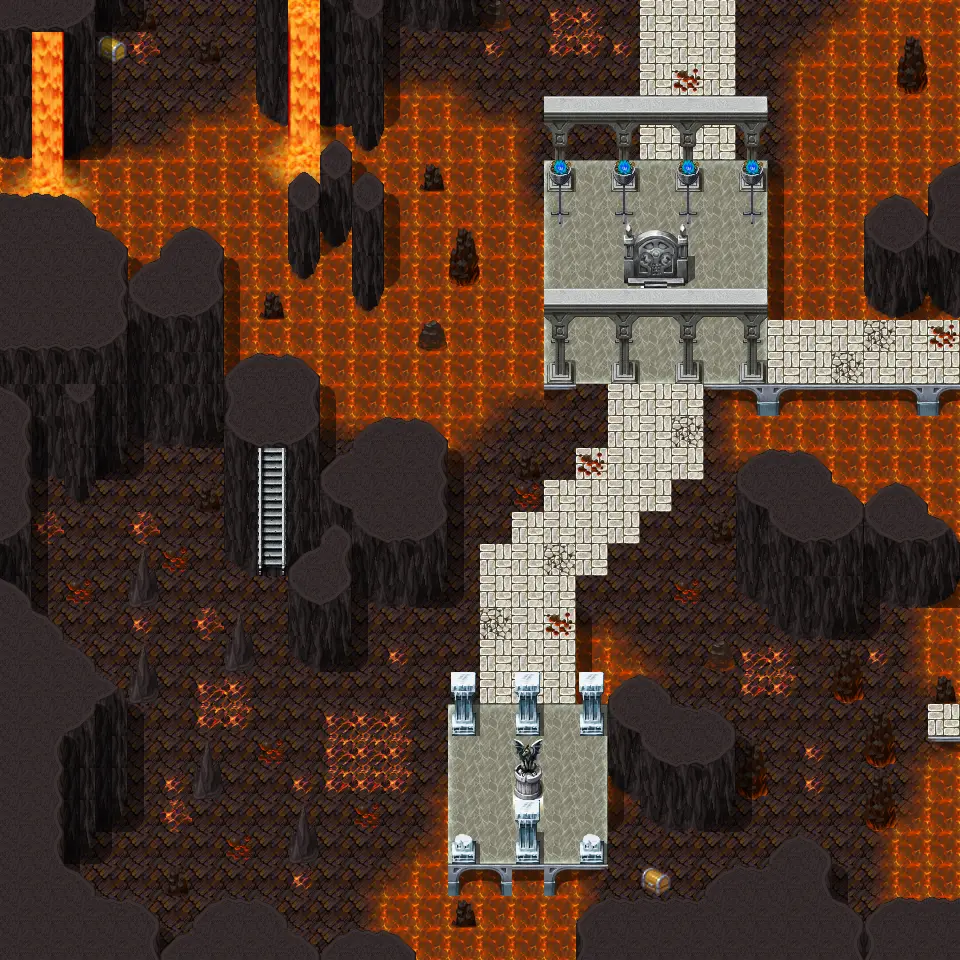

# Undertell 7 10

30×30 tiles · part of [Undertell level7](index.md)

<label class="lg lg-spawn"><input type="checkbox" data-t="spawn" checked> Monsters / NPCs</label><label class="lg lg-mapchange"><input type="checkbox" data-t="mapchange" checked> Exit to another map</label><label class="lg lg-container"><input type="checkbox" data-t="container" checked> Container</label><label class="lg lg-sign"><input type="checkbox" data-t="sign" checked> Sign</label><label class="lg lg-rest"><input type="checkbox" data-t="rest" checked> Resting place</label><label class="lg lg-key"><input type="checkbox" data-t="key" checked> Blocked / needs key or quest</label><label class="lg lg-script"><input type="checkbox" data-t="script"> Scripted event</label><label class="lg lg-replace"><input type="checkbox" data-t="replace"> Changes after a quest</label>

## Exits

- [Undertell 4 10](undertell_4_10.md)
- [Undertell 7 00](undertell_7_00.md)
- [Undertell 7 11](undertell_7_11.md)

## Monsters & NPCs here

| Name | HP |
|---|---|
| [Bone-Marshal lich](../monsters/bone_marshal_lich_pearl.md) | 232 |
| [Plague-Lich](../monsters/plague_lich.md) | 263 |
| [Embergeist](../monsters/embergeist.md) | 266 |
| [Kazaul seer lich](../monsters/kazaul_seer_lich_help_plague.md) | 295 |
| [Kazaul crimson arbiter lich](../monsters/kazaul_crimson_arbiter_lich.md) | 305 |

<small>Map ID: `undertell_7_10` · Data from v0.8.18</small>
