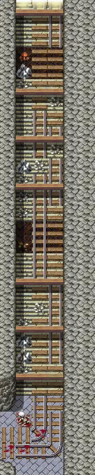

# Undertell exit

6×30 tiles · part of [Undertell floor1](index.md)

<label class="lg lg-spawn"><input type="checkbox" data-t="spawn" checked> Monsters / NPCs</label><label class="lg lg-mapchange"><input type="checkbox" data-t="mapchange" checked> Exit to another map</label><label class="lg lg-container"><input type="checkbox" data-t="container" checked> Container</label><label class="lg lg-sign"><input type="checkbox" data-t="sign" checked> Sign</label><label class="lg lg-rest"><input type="checkbox" data-t="rest" checked> Resting place</label><label class="lg lg-key"><input type="checkbox" data-t="key" checked> Blocked / needs key or quest</label><label class="lg lg-script"><input type="checkbox" data-t="script"> Scripted event</label><label class="lg lg-replace"><input type="checkbox" data-t="replace"> Changes after a quest</label>

## Exits

- [Galmore 58](galmore_58.md)
- [Undertell 15](undertell_15.md)
- [Undertell 3 03](undertell_3_03.md)

## Monsters & NPCs here

| Name | HP |
|---|---|
| [Voice of Shannal](../monsters/voice_shannal.md) | 0 |
| [Sow aroughcun](../monsters/aroughcun_sow.md) | 175 |
| [Saki](../monsters/saki.md) | 498 |
| [Rock eater](../monsters/rock_eater.md) | 500 |

<small>Map ID: `undertell_exit` · Data from v0.8.18</small>
