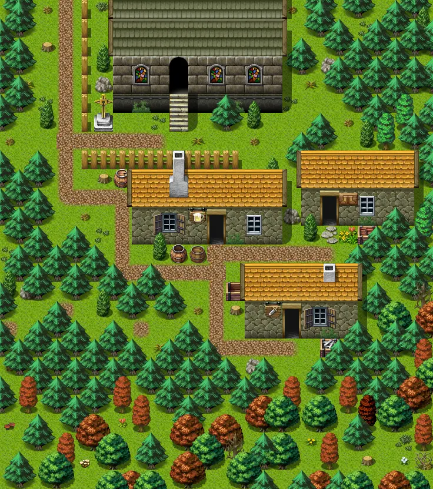

# Vilegard s

23×26 tiles · outdoors · part of [World1](index.md)

<label class="lg"><input type="checkbox" data-t="spawn" checked><b>Red</b>&nbsp;Monsters / NPCs</label><label class="lg"><input type="checkbox" data-t="mapchange" checked><b>Blue</b>&nbsp;Exit to another map</label><label class="lg"><input type="checkbox" data-t="container" checked><b>Yellow</b>&nbsp;Container (click to see contents)</label><label class="lg"><input type="checkbox" data-t="sign" checked><b>Purple</b>&nbsp;Sign</label><label class="lg"><input type="checkbox" data-t="rest" checked><b>Green</b>&nbsp;Resting place</label><label class="lg"><input type="checkbox" data-t="key" checked><b>Orange dashed</b>&nbsp;Blocked until a quest step / item</label><label class="lg"><input type="checkbox" data-t="script"><b>Grey dotted</b>&nbsp;Scripted event</label><label class="lg"><input type="checkbox" data-t="replace"><b>White dotted</b>&nbsp;Changes during a quest</label>

## Exits

- [Vilegard armorer](vilegard_armorer.md)
- [Vilegard chapel](vilegard_chapel.md)
- [Vilegard n](vilegard_n.md)
- [Vilegard smith](vilegard_smith.md)
- [Vilegard sw](vilegard_sw.md)
- [Vilegard tavern](vilegard_tavern.md)

## Monsters & NPCs here

| Name | HP |
|---|---|
| [Acolyte](../monsters/acolyte.md) | 0 |
| [Vilegard woman](../monsters/vilegard_woman.md) | 0 |
| [Sly Seraphina](../monsters/tt_seraphina.md) | 0 |
| [Vilegard resident](../monsters/vilegard_resident.md) | 0 |
| [Gabriel](../monsters/gabriel.md) | 0 |
| [Seraphina's bodyguard](../monsters/tt_guys.md) | 52 |

<small>Map ID: `vilegard_s` · Data from v0.8.18</small>
