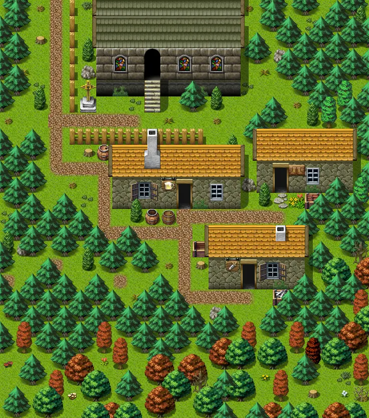

# Vilegard south

| | |
|---|---|
| **Map ID** | `vilegard_s` |
| **Region** | In Vilegard (settlement) |
| **Type** | Outdoors |
| **Size** | 23×26 tiles |
| **World map** | [World1](index.md) |
| **Introduced** | v0.7.0 or earlier |
| **NPCs** | 5 |
| **Enemy types** | 1 |
| **Quests** | 4 |

**Vilegard south** is an outdoor map, in Vilegard (settlement). It has 5 NPCs and 1 kind of enemy. Exits lead to Vilegard north, Vilegard south-west, Vilegard armorer, Vilegard chapel and 2 more.

## Map

<label class="lg"><input type="checkbox" data-t="spawn" checked><b>Red</b>&nbsp;Monsters / NPCs</label><label class="lg"><input type="checkbox" data-t="mapchange" checked><b>Blue</b>&nbsp;Exit to another map</label><label class="lg"><input type="checkbox" data-t="container" checked><b>Yellow</b>&nbsp;Container (click to see contents)</label><label class="lg"><input type="checkbox" data-t="sign" checked><b>Purple</b>&nbsp;Sign</label><label class="lg"><input type="checkbox" data-t="rest" checked><b>Green</b>&nbsp;Resting place</label><label class="lg"><input type="checkbox" data-t="key" checked><b>Orange dashed</b>&nbsp;Blocked until a quest step / item</label><label class="lg"><input type="checkbox" data-t="script"><b>Grey dotted</b>&nbsp;Scripted event</label><label class="lg"><input type="checkbox" data-t="replace"><b>White dotted</b>&nbsp;Changes during a quest</label><label class="lg"><input type="checkbox" data-t="pin" checked><b>Numbers</b>&nbsp;Numbered key points (see the key below the map)</label>

<a class="pin pin-exit" href="#key-1" style="left:13.043%;top:1.923%" title="Exit (north): to [Vilegard north](vilegard_n.md)">1</a><a class="pin pin-exit" href="#key-2" style="left:2.174%;top:67.308%" title="Exit (west): to [Vilegard south-west](vilegard_sw.md)">2</a><a class="pin pin-exit" href="#key-3" style="left:76.087%;top:44.231%" title="Exit (door): to [Vilegard armorer](vilegard_armorer.md)">3</a><a class="pin pin-exit" href="#key-4" style="left:41.304%;top:17.308%" title="Exit (door): to [Vilegard chapel](vilegard_chapel.md)">4</a><a class="pin pin-exit" href="#key-5" style="left:67.391%;top:67.308%" title="Exit (door): to [Vilegard smith](vilegard_smith.md)">5</a><a class="pin pin-exit" href="#key-6" style="left:50.000%;top:48.077%" title="Exit (door): to [Vilegard tavern](vilegard_tavern.md)">6</a><a id="pin-npc-acolyte" class="pin pin-npc" href="#key-7" style="left:32.609%;top:25.000%" title="[Acolyte](../../monsters/acolyte.md): NPC">7</a><a id="pin-npc-gabriel" class="pin pin-npc" href="#key-8" style="left:67.391%;top:25.000%" title="[Gabriel](../../monsters/gabriel.md): 1 quest">8</a><a id="pin-npc-tt_seraphina" class="pin pin-npc" href="#key-9" style="left:93.478%;top:90.385%" title="[Sly Seraphina](../../monsters/tt_seraphina.md): 2 quests">9</a><a id="pin-npc-vilegard_resident" class="pin pin-npc" href="#key-10" style="left:23.913%;top:36.538%" title="[Vilegard resident](../../monsters/vilegard_resident.md): NPC">10</a><a id="pin-npc-vilegard_woman" class="pin pin-npc" href="#key-11" style="left:63.043%;top:25.000%" title="[Vilegard woman](../../monsters/vilegard_woman.md): 1 quest">11</a><a class="pin pin-script" href="#key-12" style="left:50.000%;top:51.923%" title="Quest trigger: Scripted event: advances the quest: hidden story flag “quest_burhczyd_nd” to stage 54 (“54=show oven in Vilegard”)">12</a><a class="pin pin-key" href="#key-13" style="left:93.764%;top:87.500%" title="Blocked passage: Unlocked during the quest: Search for Andor (stage 1: “My father Mikhail says that Andor has not been home since yesterday. I should go look for him in the village.”)">13</a>

??? abstract "Key to the numbers on the map"

    | # | What | Details |
    |---|---|---|
    | 1 | Exit (north) | to [Vilegard north](vilegard_n.md) |
    | 2 | Exit (west) | to [Vilegard south-west](vilegard_sw.md) |
    | 3 | Exit (door) | to [Vilegard armorer](vilegard_armorer.md) |
    | 4 | Exit (door) | to [Vilegard chapel](vilegard_chapel.md) |
    | 5 | Exit (door) | to [Vilegard smith](vilegard_smith.md) |
    | 6 | Exit (door) | to [Vilegard tavern](vilegard_tavern.md) |
    | 7 | [Acolyte](../monsters/acolyte.md) | NPC |
    | 8 | [Gabriel](../monsters/gabriel.md) | 1 quest |
    | 9 | [Sly Seraphina](../monsters/tt_seraphina.md) | 2 quests |
    | 10 | [Vilegard resident](../monsters/vilegard_resident.md) | NPC |
    | 11 | [Vilegard woman](../monsters/vilegard_woman.md) | 1 quest |
    | 12 | Quest trigger | Scripted event: advances the quest: hidden story flag “quest_burhczyd_nd” to stage 54 (“54=show oven in Vilegard”) |
    | 13 | Blocked passage | Unlocked during the quest: Search for Andor (stage 1: “My father Mikhail says that Andor has not been home since yesterday. I should go look for him in the village.”) |

Verified against v0.8.18 map data.

## Connections

| Direction | Leads to | Region there | Map # |
|---|---|---|---|
| North | [Vilegard north](vilegard_n.md) | Vilegard | 1 |
| West | [Vilegard south-west](vilegard_sw.md) | Vilegard | 2 |
| Door | [Vilegard armorer](vilegard_armorer.md) | Vilegard | 3 |
| Door | [Vilegard chapel](vilegard_chapel.md) | Vilegard | 4 |
| Door | [Vilegard smith](vilegard_smith.md) | Vilegard | 5 |
| Door | [Vilegard tavern](vilegard_tavern.md) | Vilegard | 6 |

## NPCs

- [Acolyte](../monsters/acolyte.md) (#7)
- [Gabriel](../monsters/gabriel.md) — quests: [The Dead are Walking](../quests/dead_walking.md) (#8)
- [Sly Seraphina](../monsters/tt_seraphina.md) — quests: [Search for Andor](../quests/andor.md), [Troubling times](../quests/troubling_times.md) (#9)
- [Vilegard resident](../monsters/vilegard_resident.md) (#10)
- [Vilegard woman](../monsters/vilegard_woman.md) — quests: [Trusting an outsider](../quests/vilegard.md) (#11)

## Enemies

| Enemy | HP | Damage | Up to | Notes |
|---|---|---|---|---|
| [Seraphina's bodyguard](../monsters/tt_guys.md) | 52 | 8–15 | 5 | appears later, during a quest |

<small>“Up to” is the most that can be alive at once from the spawn areas on this map.</small>

## Quests

- [Search for Andor](../quests/andor.md): [Sly Seraphina](../monsters/tt_seraphina.md) is involved; blocked passage opens at stage 1
- [The Dead are Walking](../quests/dead_walking.md): [Gabriel](../monsters/gabriel.md) is involved
- [Troubling times](../quests/troubling_times.md): [Sly Seraphina](../monsters/tt_seraphina.md) is involved
- [Trusting an outsider](../quests/vilegard.md): [Vilegard woman](../monsters/vilegard_woman.md) is involved
- [Young merchant Non-displayed (hidden flag)](../quests/quest_burhczyd_nd.md): something on this map advances it; stepping on a trigger here sets stage 54

## Points of interest

- **Quest trigger** (#12): Scripted event: advances the quest: hidden story flag “quest_burhczyd_nd” to stage 54 (“54=show oven in Vilegard”)
- **Blocked passage** (#13): Unlocked during the quest: Search for Andor (stage 1: “My father Mikhail says that Andor has not been home since yesterday. I should go look for him in the village.”)

## Version history

| Version | Change |
|---|---|
| [v0.7.0](../versions/0.7.0.md) | Present in v0.7.0 (earliest release tracked) |
| [v0.7.1](../versions/0.7.1.md) | Map layout or objects changed |
| [v0.7.2](../versions/0.7.2.md) | Map layout or objects changed |
| [v0.7.11](../versions/0.7.11.md) | Map layout or objects changed |
| [v0.8.2](../versions/0.8.2.md) | Map layout or objects changed |
| [v0.8.3](../versions/0.8.3.md) | Map layout or objects changed |
| [v0.8.13](../versions/0.8.13.md) | Map layout or objects changed |
| [v0.8.14](../versions/0.8.14.md) | Map layout or objects changed |

Verified against v0.8.18 and every earlier release back to v0.7.0 (game data compared release by release).

## Community notes

<small>Written by players, not generated from game data. **Observations**: what players notice in-game · **Lore**: the in-world story · **Trivia**: real-world facts, references, development history · **Theory / speculation**: unconfirmed ideas; may just be unfinished content</small>

### Observations

*No notes yet. Contributions are welcome: [add a note](https://github.com/asdfghjkl628/Andor-s-Trail-Wikiiii/new/main/notes/maps?filename=vilegard_s.md&value=%23%23%20Observations%0A%0A%3C%21--%20what%20players%20notice%20in-game%20--%3E%0A%0A%23%23%20Lore%0A%0A%3C%21--%20the%20in-world%20story%20--%3E%0A%0A%23%23%20Trivia%0A%0A%3C%21--%20real-world%20facts%2C%20references%2C%20development%20history%20--%3E%0A%0A%23%23%20Theory%20/%20speculation%0A%0A%3C%21--%20unconfirmed%20ideas%3B%20may%20just%20be%20unfinished%20content%20--%3E%0A).*

### Lore

*No notes yet. Contributions are welcome: [add a note](https://github.com/asdfghjkl628/Andor-s-Trail-Wikiiii/new/main/notes/maps?filename=vilegard_s.md&value=%23%23%20Observations%0A%0A%3C%21--%20what%20players%20notice%20in-game%20--%3E%0A%0A%23%23%20Lore%0A%0A%3C%21--%20the%20in-world%20story%20--%3E%0A%0A%23%23%20Trivia%0A%0A%3C%21--%20real-world%20facts%2C%20references%2C%20development%20history%20--%3E%0A%0A%23%23%20Theory%20/%20speculation%0A%0A%3C%21--%20unconfirmed%20ideas%3B%20may%20just%20be%20unfinished%20content%20--%3E%0A).*

### Trivia

*No notes yet. Contributions are welcome: [add a note](https://github.com/asdfghjkl628/Andor-s-Trail-Wikiiii/new/main/notes/maps?filename=vilegard_s.md&value=%23%23%20Observations%0A%0A%3C%21--%20what%20players%20notice%20in-game%20--%3E%0A%0A%23%23%20Lore%0A%0A%3C%21--%20the%20in-world%20story%20--%3E%0A%0A%23%23%20Trivia%0A%0A%3C%21--%20real-world%20facts%2C%20references%2C%20development%20history%20--%3E%0A%0A%23%23%20Theory%20/%20speculation%0A%0A%3C%21--%20unconfirmed%20ideas%3B%20may%20just%20be%20unfinished%20content%20--%3E%0A).*

### Theory / speculation

*No notes yet. Contributions are welcome: [add a note](https://github.com/asdfghjkl628/Andor-s-Trail-Wikiiii/new/main/notes/maps?filename=vilegard_s.md&value=%23%23%20Observations%0A%0A%3C%21--%20what%20players%20notice%20in-game%20--%3E%0A%0A%23%23%20Lore%0A%0A%3C%21--%20the%20in-world%20story%20--%3E%0A%0A%23%23%20Trivia%0A%0A%3C%21--%20real-world%20facts%2C%20references%2C%20development%20history%20--%3E%0A%0A%23%23%20Theory%20/%20speculation%0A%0A%3C%21--%20unconfirmed%20ideas%3B%20may%20just%20be%20unfinished%20content%20--%3E%0A).*

??? info "Technical information"

    | | |
    |---|---|
    | Map ID | `vilegard_s` |
    | File | `res/xml/vilegard_s.tmx` |
    | Size | 23×26 tiles (736×832 px) |
    | outdoors property | 1 |
    | Layers drawn | ground, objects, above, top |
    | Tilesets | map_bed_1, map_border_1, map_bridge_1, map_bridge_2, map_broken_1, map_cavewall_1, map_cavewall_2, map_cavewall_3, map_cavewall_4, map_chair_table_1, map_chair_table_2, map_crate_1, map_cupboard_1, map_curtain_1, map_entrance_1, map_entrance_2, map_fence_1, map_fence_2, map_fence_3, map_fence_4, map_ground_1, map_ground_2, map_ground_3, map_ground_4, map_ground_5, map_ground_6, map_ground_7, map_ground_8, map_house_1, map_house_2, map_indoor_1, map_indoor_2, map_kitchen_1, map_outdoor_1, map_pillar_1, map_pillar_2, map_plant_1, map_plant_2, map_rock_1, map_rock_2, map_roof_1, map_roof_2, map_roof_3, map_shop_1, map_sign_ladder_1, map_table_1, map_trail_1, map_transition_1, map_transition_2, map_transition_3, map_transition_4, map_transition_5, map_tree_1, map_tree_2, map_wall_1, map_wall_2, map_wall_3, map_wall_4, map_window_1, map_window_2 |
    | Map objects | mapchange: 6, spawn: 6, script: 1, key: 1 |
    | World map position | segment `world1`, x 360, y 492 |

<small>Data from v0.8.18</small>
