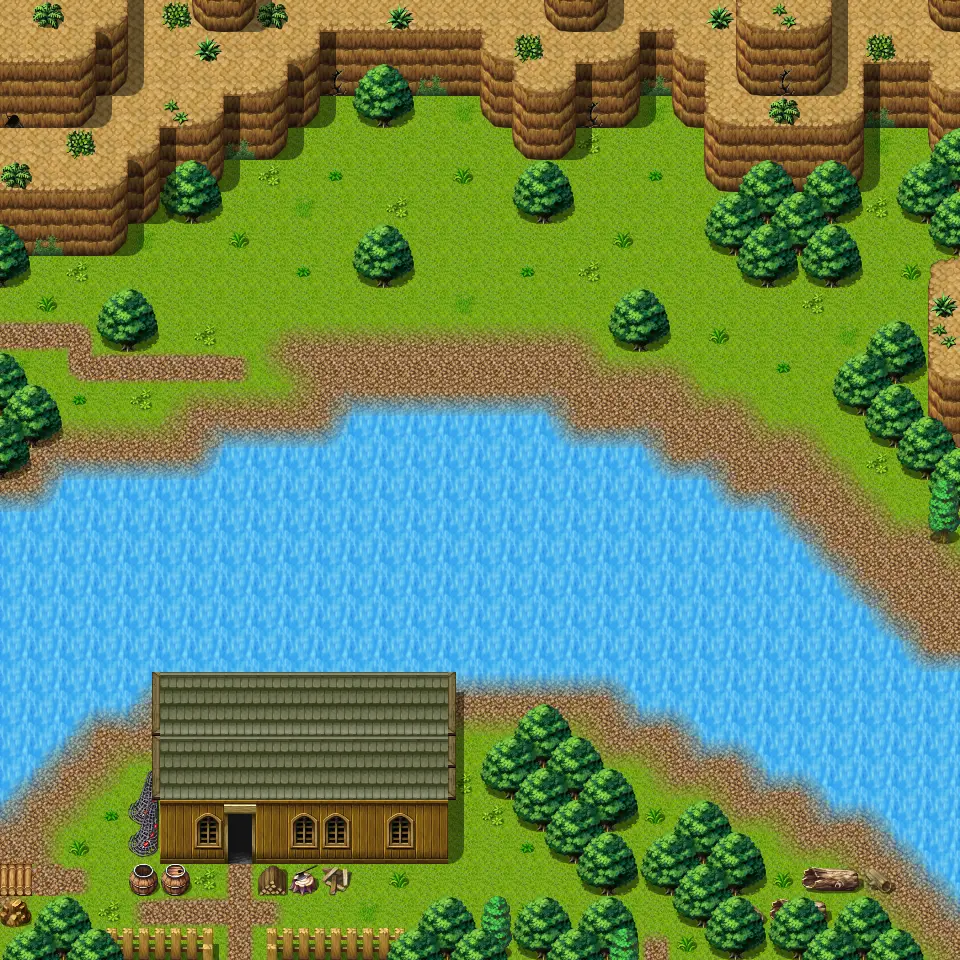

# Waterway2

30×30 tiles · outdoors · part of [World1](index.md)

<label class="lg"><input type="checkbox" data-t="spawn" checked><b>Red</b>&nbsp;Monsters / NPCs</label><label class="lg"><input type="checkbox" data-t="mapchange" checked><b>Blue</b>&nbsp;Exit to another map</label><label class="lg"><input type="checkbox" data-t="container" checked><b>Yellow</b>&nbsp;Container (click to see contents)</label><label class="lg"><input type="checkbox" data-t="sign" checked><b>Purple</b>&nbsp;Sign</label><label class="lg"><input type="checkbox" data-t="rest" checked><b>Green</b>&nbsp;Resting place</label><label class="lg"><input type="checkbox" data-t="key" checked><b>Orange dashed</b>&nbsp;Blocked until a quest step / item</label><label class="lg"><input type="checkbox" data-t="script"><b>Grey dotted</b>&nbsp;Scripted event</label><label class="lg"><input type="checkbox" data-t="replace"><b>White dotted</b>&nbsp;Changes during a quest</label>

## Exits

- [Graveyard0](graveyard0.md)
- [Waterway1](waterway1.md)
- [Waterway3](waterway3.md)
- [Waterway4](waterway4.md)
- [Waterwayextention](waterwayextention.md)
- [Waterwayhouse](waterwayhouse.md)

## Monsters & NPCs here

| Name | HP |
|---|---|
| [Tough river frog](../monsters/frog_2.md) | 17 |
| [Poisonous river frog](../monsters/frog_3.md) | 21 |
| [Strong izthiel](../monsters/izthiel_3.md) | 52 |
| [Iqhan worker thrall](../monsters/iqhan_1a.md) | 55 |
| [Iqhan thrall servant](../monsters/iqhan_1b.md) | 57 |

<small>Map ID: `waterway2` · Data from v0.8.18</small>
