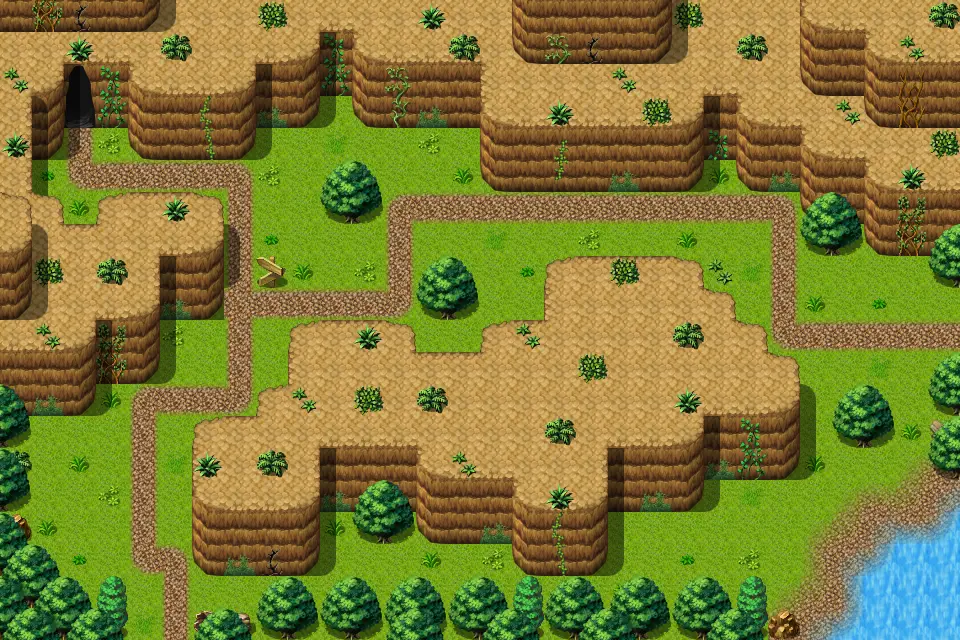

# Waterway3

30×20 tiles · outdoors · part of [World1](index.md)

<label class="lg lg-spawn"><input type="checkbox" data-t="spawn" checked> Monsters / NPCs</label><label class="lg lg-mapchange"><input type="checkbox" data-t="mapchange" checked> Exit to another map</label><label class="lg lg-container"><input type="checkbox" data-t="container" checked> Container</label><label class="lg lg-sign"><input type="checkbox" data-t="sign" checked> Sign</label><label class="lg lg-rest"><input type="checkbox" data-t="rest" checked> Resting place</label><label class="lg lg-key"><input type="checkbox" data-t="key" checked> Blocked / needs key or quest</label><label class="lg lg-script"><input type="checkbox" data-t="script"> Scripted event</label><label class="lg lg-replace"><input type="checkbox" data-t="replace"> Changes after a quest</label>

## Exits

- [Pwcave0](pwcave0.md)
- [Waterway1](waterway1.md)
- [Waterway2](waterway2.md)

## Monsters & NPCs here

| Name | HP |
|---|---|
| [Poisonous river frog](../monsters/frog_3.md) | 21 |
| [Strong izthiel](../monsters/izthiel_3.md) | 52 |
| [Iqhan worker thrall](../monsters/iqhan_1a.md) | 55 |
| [Iqhan thrall servant](../monsters/iqhan_1b.md) | 57 |

<small>Map ID: `waterway3` · Data from v0.8.18</small>
